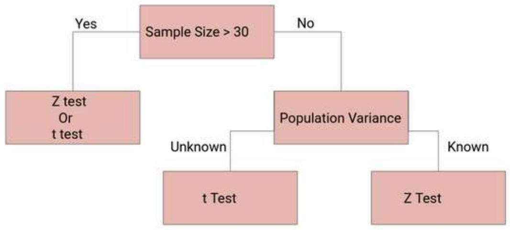
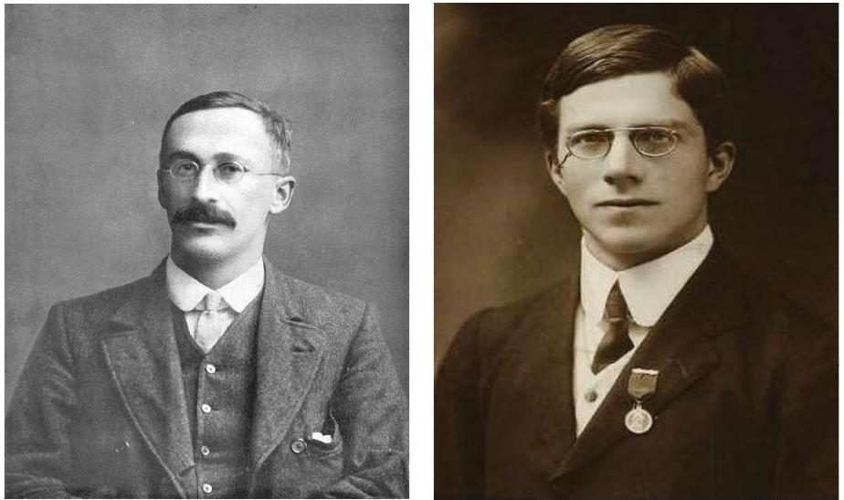
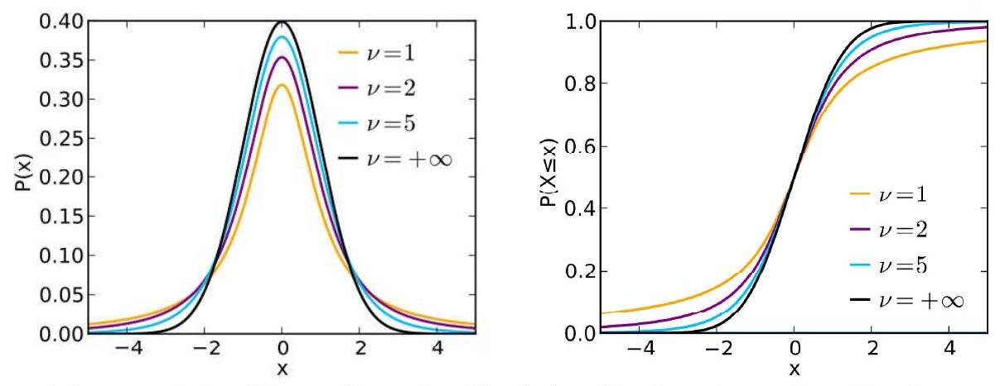

## Chapter 3

## Student's $t$-distribution

The entire large, sample theory was based on the application of 'Normal Test'. However, if the sample size $n$ is small, the distribution of the various statistics,

$$
Z=\frac{\bar{x}-\mu}{\frac{\sigma}{\sqrt{n}}} \quad \text { or } \quad Z=\frac{X-n P}{\sqrt{n P Q}}
$$

are far away from the normality and as such 'normal test' cannot be applied if $n$ is small. In such cases exact sample tests, pioneered by W.S. Gosset (1908), who wrote under the pen name of Student, and later on developed and extended by Prof. R.A. Fisher (1926), are used.

The exact sample tests can, however, be applied to large samples also though the converse is not true. In all the exact sample tests, the basic assumption is that the population(s) from which sampler(s) are drawn is (are) normal, i.e.,the parent population(s) is (are) normally distributed.

Figure 3.1: William Sealy Gosset, known as Student and Sir R. A. Fisher.

### 3.1 Student's $t$-distribution

Let $x_{i}(i=1,2, \cdots, n)$ be a random sample of size $n$ from a normal population with mean $\mu$ and variance $\sigma^{2}$. Then Student's $t$ is defined by the statistic

$$
t=\frac{\bar{x}-\mu}{\frac{S}{\sqrt{n}}},
$$

where $\bar{x}=\frac{1}{n} \sum_{i=1}^{n} x_{i}$, is the sample mean and $S^{2}=\frac{1}{n-1} \sum_{i=1}^{n}\left(x_{i}-\bar{x}\right)^{2}$, is an unbiased estimate of the population variance $\sigma^{2}$, and it follows Student's $t$ - distribution with $\nu=(n-1)$ degrees of freedom with probability density function

$$
\begin{equation*}
f(t)=\frac{1}{\sqrt{\nu} B\left(\frac{1}{2}, \frac{\nu}{2}\right)} \cdot \frac{1}{\left(1+\frac{t^{2}}{\nu}\right)^{\frac{\nu+1}{2}}} ;-\infty<t<\infty . \tag{3.1}
\end{equation*}
$$

Figure 3.2: The pdf and $c d f$ of the Student's $t$-distribution.

## Remarks:

(i) A statistic $t$ following Student's $t$-distribution with $n$ degrees of freedom will be abbreviated as $t \sim t_{n}$.
(ii) If we take $\nu=1$ in (3.1), we get as

$$
f(t)=\frac{1}{B\left(\frac{1}{2}, \frac{1}{2}\right)} \cdot \frac{1}{\left(1+t^{2}\right)}=\frac{1}{\pi} \cdot \frac{1}{1+t^{2}} ;-\infty<t<\infty
$$

which is the density function of the standard Cauchy distribution.

### 3.2 Derivation of Student's $t$-distribution

The expression of Student's $t$ - statistic can be written as

$$
\begin{aligned}
& t=\frac{\bar{x}-\mu}{\frac{S}{\sqrt{n}}} \\
& \Rightarrow t^{2}=\frac{n(\bar{x}-\mu)^{2}}{S^{2}}
\end{aligned}
$$

further expressed as

$$
\begin{aligned}
\frac{t^{2}}{n-1} & =\frac{n(\bar{x}-\mu)^{2}}{(n-1) S^{2}} \\
& =\frac{(\bar{x}-\mu)^{2}}{\frac{\sigma^{2}}{n}} \cdot \frac{1}{\frac{(n-1) S^{2}}{\sigma^{2}}} \\
& =\frac{\left(\frac{\bar{x}-\mu}{\sigma}\right)^{2}}{\frac{(n-1) S^{2}}{\sigma^{2}}}
\end{aligned}
$$

Since $x_{i}(i=1,2, \cdots, n)$ is a random sample from the normal distribution with mean $\mu$ and variance $\sigma^{2}$, then

$$
\begin{aligned}
& \bar{x} \sim N\left(\mu, \frac{\sigma^{2}}{n}\right) \\
& \Rightarrow \frac{\bar{x}-\mu}{\frac{\sigma}{\sqrt{n}}} \sim N(0,1)
\end{aligned}
$$

Hence $\left(\frac{\bar{x}-\mu}{\frac{\sigma}{\sqrt{n}}}\right)^{2}$, being the square of a standard normal variate is a $\chi^{2}$-variate with 1 d.f. Also $\frac{(n-1) S^{2}}{\sigma^{2}}$ is a $\chi^{2}-$ variate with $\nu=(n-1)$ d.f.

Further since $\bar{x}$ and $S^{2}$ are independently distributed, $\frac{t^{2}}{n-1}$ being the ratio of two independent $\chi^{2}$-variate with 1 and $\nu=(n-1)$ degrees of freedom respectively, is $\beta_{2}\left(\frac{1}{2}, \frac{\nu}{2}\right)$ variate and its distribution is given by

$$
\begin{aligned}
d F(t)= & \frac{1}{\beta_{2}\left(\frac{1}{2}, \frac{\nu}{2}\right)} \cdot \frac{\left(\frac{t^{2}}{\nu}\right)^{\frac{1}{2}-1}}{\left(1+\frac{t^{2}}{\nu}\right)^{\frac{\nu+1}{2}}} d\left(\frac{t^{2}}{\nu}\right), 0 \leq t^{2} \leq \infty \\
& \quad\left[f(x)=\frac{1}{B(\alpha, \beta)} \cdot \frac{x^{\alpha-1}}{(1+x)^{\alpha+\beta}}\right] \\
= & \frac{1}{\beta_{2}\left(\frac{1}{2}, \frac{\nu}{2}\right)} \cdot \frac{\frac{\sqrt{\nu}}{t}}{\left(1+\frac{t^{2}}{\nu}\right)^{\frac{\nu+1}{2}}} \frac{2 t}{\nu} d t, 0 \leq t \leq \infty \\
= & \frac{1}{\sqrt{\nu} B\left(\frac{1}{2}, \frac{\nu}{2}\right)} \cdot \frac{1}{\left(1+\frac{t^{2}}{\nu}\right)^{\frac{\nu+1}{2}}} d t ;-\infty<t<\infty
\end{aligned}
$$

the factor 2 disappearing since the integral from $-\infty$ to $\infty$ must be unity. This is the required probability density function of Student's $t$-distribution with $\nu= (n-1)$ degrees of freedom.

### 3.3 Fisher's $t$ Statistic

It is the ratio of a standard normal variate to the square root of an independent $\chi^{2}$-variate divided by its degrees of freedom. If $\xi$ is a $N(0,1)$ and $\chi^{2}$ is an independent $\chi^{2}$-variate with $n$ degrees of freedom, then Fisher's $t$ is given by

$$
t=\frac{\xi}{\sqrt{\frac{\chi^{2}}{n}}}
$$

and it follows Student's $t$-distribution with $n$ degrees of freedom.

### 3.4 Derivation of Fisher's $t$-distribution

Assignment: Derive the Fisher's t-distribution, which is the probability density function of Student's $t$-distribution with $n$ degrees of freedom.

### 3.5 Moments of $t$-distribution

Since $f(t)$ is symmetrical about the line $t=0$, all the moments of odd order about origin vanish, i.e.,

$$
\mu_{2 r+1}^{\prime}(\text { about origin })=0 ; r=0,1,2, \ldots
$$

In particular, $\mu_{1}^{\prime}$ (about origin) $=0=$ Mean. Hence central moments coincide with moments about origin.

$$
\mu_{2 r+1}(\text { about origin })=0 ; r=0,1,2, \cdots
$$

The moments of even order are given by:

$$
\begin{aligned}
\mu_{2 r} & =\mu_{2 r}^{\prime}(\text { about origin }) \\
& =\int_{-\infty}^{\infty} t^{2 r} f(t) d t \\
& =2 \int_{0}^{\infty} t^{2 r} f(t) d t \\
& =\frac{2}{\sqrt{n} B\left(\frac{1}{2}, \frac{n}{2}\right)} \int_{0}^{\infty} \frac{t^{2 r}}{\left(1+\frac{t^{2}}{n}\right)^{\frac{n+1}{2}}} d t
\end{aligned}
$$

This integral will be absolutely convergent if $2 r<n$.

Set, $\quad 1+\frac{t^{2}}{n}=\frac{1}{y} \quad \Rightarrow t^{2}=\frac{n(1-y)}{y} \quad \Rightarrow 2 t d t=-\frac{n}{y^{2}} d y$.

When $t=0, y=1$ and when $t=\infty, y=0$. Therefore

$$
\begin{aligned}
\mu_{2 r} & =\frac{2}{\sqrt{n} B\left(\frac{1}{2}, \frac{n}{2}\right)} \int_{1}^{0} \frac{t^{2 r}}{\left(\frac{1}{y}\right)^{\frac{n+1}{2}}}\left(-\frac{n}{2 t y^{2}}\right) d y \\
& =\frac{n}{\sqrt{n} B\left(\frac{1}{2}, \frac{n}{2}\right)} \int_{0}^{1}\left(t^{2}\right)^{r-\frac{1}{2}}(y)^{\frac{n+1}{2}-2} d y \\
& =\frac{\sqrt{n}}{B\left(\frac{1}{2}, \frac{n}{2}\right)} \int_{0}^{1}\left(\frac{n(1-y)}{y}\right)^{r-\frac{1}{2}}(y)^{\frac{n+1}{2}-2} d y \\
& =\frac{n^{r}}{B\left(\frac{1}{2}, \frac{n}{2}\right)} \int_{0}^{1} y^{\frac{n}{2}-r-1}(1-y)^{r-\frac{1}{2}} d y \\
& =\frac{n^{r}}{B\left(\frac{1}{2}, \frac{n}{2}\right)} \int_{0}^{1} y^{\frac{n}{2}-r-1}(1-y)^{r+\frac{1}{2}-1} d y \\
& =\frac{n^{r}}{B\left(\frac{1}{2}, \frac{n}{2}\right)} \cdot B\left(\frac{n}{2}-r, r+\frac{1}{2}\right), \quad n>2 r \\
& \left.=n^{r} \frac{\Gamma\left(\frac{n+1}{2}\right)}{\Gamma\left(\frac{1}{2}\right) \Gamma\left(\frac{n}{2}\right)} \cdot \frac{\Gamma\left(\frac{n}{2}-r\right) \Gamma\left(r+\frac{1}{2}\right)}{\Gamma\left(\frac{n+1}{2}\right)} x^{\alpha-1}(1-x)^{\beta-1}\right] \\
& =n^{r} \frac{\Gamma\left(\frac{n}{2}-r\right)}{\Gamma\left(\frac{1}{2}\right)} \cdot \frac{\Gamma\left(r+\frac{1}{2}\right)}{\Gamma\left(\frac{n}{2}\right)} \\
& =n^{r} \frac{\Gamma\left(\frac{n}{2}-r\right)}{\Gamma\left(\frac{1}{2}\right)} \cdot \frac{\left(r-\frac{1}{2}\right) \cdot\left(r-\frac{3}{2}\right) \cdots \frac{3}{2} \cdot \frac{1}{2} \Gamma\left(\frac{1}{2}\right)}{\left(\frac{n}{2}-1\right) \cdot\left(\frac{n}{2}-2\right) \cdots\left(\frac{n}{2}-r\right) \Gamma\left(\frac{n}{2}-r\right)} \\
& =n^{r} \cdot \frac{\left(r-\frac{1}{2}\right) \cdot\left(r-\frac{3}{2}\right) \cdots \frac{3}{2} \cdot \frac{1}{2}}{\left.\left(\frac{n}{2}-1\right) \cdot\left(\frac{n}{2}-2\right) \cdots\left(\frac{n}{2}-r\right)\right)} \\
& =n^{r} \cdot \frac{(2 r-1) \cdot(2 r-3) \cdots 3 \cdot 1}{(n-2) \cdot(n-4) \cdots(n-2 r)}, \quad n>2 r .
\end{aligned}
$$

In particular

$$
\begin{aligned}
\mu_{2} & =n \cdot \frac{1}{n-2} \\
& =\frac{n}{n-2}, \quad(n>2)
\end{aligned}
$$

and

$$
\begin{aligned}
\mu_{4} & =n^{2} \cdot \frac{3 \cdot 1}{(n-2)(n-4)} \\
& =\frac{3 n^{2}}{(n-2)(n-4)}, \quad(n>4)
\end{aligned}
$$

Hence

$$
\beta_{1}=\frac{\mu_{3}^{2}}{\mu_{2}^{3}}=0
$$

and

$$
\beta_{2}=\frac{\mu_{4}}{\mu_{2}^{2}}=3 \cdot\left(\frac{n-2}{n-4}\right), n>4
$$

Remarks: As $n \rightarrow \infty, \beta_{1}=0$ and $\beta_{2}=3$.

### 3.6 Mean Deviation of $t$-distribution

Mean deviation about mean is

$$
\begin{aligned}
\text { Mean Deviation } & =\int_{-\infty}^{\infty}|t| f(t) d t \quad\left[\mu_{1}^{\prime}=0\right] \\
& =\int_{-\infty}^{\infty}|t| \frac{1}{\sqrt{n} B\left(\frac{1}{2}, \frac{n}{2}\right)} \cdot \frac{1}{\left(1+\frac{t^{2}}{n}\right)^{\frac{n+1}{2}}} d t \\
& =\frac{2}{\sqrt{n} B\left(\frac{1}{2}, \frac{n}{2}\right)} \int_{0}^{\infty} \frac{t}{\left(1+\frac{t^{2}}{n}\right)^{\frac{n+1}{2}}} d t \\
& =\frac{\sqrt{n}}{B\left(\frac{1}{2}, \frac{n}{2}\right)} \int_{0}^{\infty} \frac{d y}{(1+y)^{\frac{n+1}{2}}}\left[\frac{t^{2}}{n}=y \Rightarrow 2 t d t=n d y\right] \\
& =\frac{\sqrt{n}}{B\left(\frac{1}{2}, \frac{n}{2}\right)} \int_{0}^{\infty} \frac{y^{1-1}}{(1+y)^{1+\frac{n-1}{2}}} d y \\
& =\frac{\sqrt{n}}{B\left(\frac{1}{2}, \frac{n}{2}\right)} \cdot B\left(1, \frac{n-1}{2}\right) \\
& =\frac{\sqrt{n}}{\Gamma\left(\frac{1}{2}\right) \cdot \Gamma\left(\frac{n}{2}\right)} \cdot \frac{\Gamma(1) \cdot \Gamma\left(\frac{n-1}{2}\right)}{\Gamma\left(\frac{n+1}{2}\right)} \\
& =\frac{\sqrt{n} \cdot \Gamma\left(\frac{n-1}{2}\right)}{\Gamma\left(\frac{1}{2}\right) \cdot \Gamma\left(\frac{n}{2}\right)} \\
& =\frac{\sqrt{n} \cdot \Gamma\left(\frac{n-1}{2}\right)}{\sqrt{\pi} \cdot \Gamma\left(\frac{n}{2}\right)} ; \quad\left[\Gamma\left(\frac{1}{2}\right)=\sqrt{\pi}\right] .
\end{aligned}
$$

**Question: Show that for $t$-distribution with $n$ degrees of freedom, mean deviation about mean is given by $\frac{\sqrt{n} \cdot \Gamma\left(\frac{n-1}{2}\right)}{\sqrt{\pi} \cdot \Gamma\left(\frac{n}{2}\right)}$.

### 3.7 Limiting Form of $t$-distribution

As $n \rightarrow \infty$, the probability density function of $t$-distribution with $n$ degrees of freedom viz.,

$$
f(t)=\frac{1}{\sqrt{n} B\left(\frac{1}{2}, \frac{n}{2}\right)} \cdot \frac{1}{\left(1+\frac{t^{2}}{n}\right)^{\frac{n+1}{2}}} \rightarrow \frac{1}{\sqrt{2 \pi}} \cdot e^{-\frac{1}{2} t^{2}}-\infty<t<\infty
$$

Proof: We can proceed as

$$
\begin{aligned}
\lim _{n \rightarrow \infty} \frac{1}{\sqrt{n} B\left(\frac{1}{2}, \frac{n}{2}\right)} & =\lim _{n \rightarrow \infty} \frac{1}{\sqrt{n}} \cdot \frac{\Gamma\left(\frac{n}{2}+\frac{1}{2}\right)}{\Gamma\left(\frac{1}{2}\right) \cdot \Gamma\left(\frac{n}{2}\right)} \\
& =\frac{1}{\sqrt{n}} \cdot \frac{1}{\Gamma\left(\frac{1}{2}\right)} \cdot \lim _{n \rightarrow \infty} \frac{\Gamma\left(\frac{n}{2}+\frac{1}{2}\right)}{\Gamma\left(\frac{n}{2}\right)} \\
& =\frac{1}{\sqrt{n}} \cdot \frac{1}{\sqrt{\pi}} \cdot\left(\frac{n}{2}\right)^{\frac{1}{2}}, \quad\left[\Gamma\left(\frac{1}{2}\right)=\sqrt{\pi}, \lim _{n \rightarrow \infty} \frac{\Gamma(n+k)}{\Gamma(n)}=n^{k}\right] . \\
& =\frac{1}{\sqrt{2 \pi}} .
\end{aligned}
$$

Therefore

$$
\begin{align*}
\lim _{n \rightarrow \infty} f(t) & =\lim _{n \rightarrow \infty} \frac{1}{\sqrt{n} B\left(\frac{1}{2}, \frac{n}{2}\right)} \cdot \lim _{n \rightarrow \infty}\left(1+\frac{t^{2}}{n}\right)^{-\frac{n}{2}} \cdot \lim _{n \rightarrow \infty}\left(1+\frac{t^{2}}{n}\right)^{-\frac{1}{2}} \\
& =\frac{1}{\sqrt{2 \pi}} \cdot \lim _{n \rightarrow \infty}\left(1+\frac{t^{2}}{n}\right)^{-\frac{n}{2}} \cdot \lim _{n \rightarrow \infty}\left(1+\frac{t^{2}}{n}\right)^{-\frac{1}{2}} \tag{3.2}
\end{align*}
$$

Let

$$
\begin{aligned}
& x=\left(1+\frac{t^{2}}{n}\right)^{-\frac{n}{2}} \\
& \Rightarrow \log x=-\frac{n}{2} \log \left(1+\frac{t^{2}}{n}\right) \\
& \Rightarrow \log x=-\frac{n}{2}\left(\frac{t^{2}}{n}-\frac{\left(\frac{t^{2}}{n}\right)^{2}}{2}+\frac{\left(\frac{t^{2}}{n}\right)^{3}}{3}-\cdots\right) \\
& \Rightarrow \lim _{n \rightarrow \infty} \log x=-\frac{t^{2}}{2} \\
& \therefore \lim _{n \rightarrow \infty} x=e^{-\frac{t^{2}}{2}}
\end{aligned}
$$

Hence

$$
\lim _{n \rightarrow \infty}\left(1+\frac{t^{2}}{n}\right)^{-\frac{n}{2}}=e^{-\frac{t^{2}}{2}}
$$

Also

$$
\begin{aligned}
& y=\left(1+\frac{t^{2}}{n}\right)^{-\frac{1}{2}} \\
& \Rightarrow \log y=-\frac{1}{2} \log \left(1+\frac{t^{2}}{n}\right) \\
& \Rightarrow \log y=-\frac{1}{2}\left(\frac{t^{2}}{n}-\frac{\left(\frac{t^{2}}{n}\right)^{2}}{2}+\frac{\left(\frac{t^{2}}{n}\right)^{3}}{3}-\cdots\right) \\
& \Rightarrow \lim _{n \rightarrow \infty} \log y=0 \\
& \therefore \lim _{n \rightarrow \infty} y=1
\end{aligned}
$$

Hence

$$
\lim _{n \rightarrow \infty}\left(1+\frac{t^{2}}{n}\right)^{-\frac{1}{2}}=1
$$

Therefore by using (3.2) we can obtain as

$$
\lim _{n \rightarrow \infty} f(t)=\frac{1}{\sqrt{2 \pi}} \cdot e^{-\frac{t^{2}}{2}} \cdot 1=\frac{1}{\sqrt{2 \pi}} \cdot e^{-\frac{1}{2} t^{2}},-\infty<t<\infty
$$

Hence we observed that for large degrees of freedom $t$-distribution tends to standard normal distribution.

## Theorem

If $X$ follows normal population i.e., $X \sim N\left(\mu, \sigma^{2}\right)$ and $X_{1}, X_{2}, \cdots, X_{n}$ be a random sample from the population $X$, then

$$
\frac{\bar{X}-\mu}{\frac{S}{\sqrt{n}}} \sim t_{(n-1)}
$$

Proof: Since each $X_{i} \sim N\left(\mu, \sigma^{2}\right)$ we have

$$
\bar{X} \sim N\left(\mu, \frac{\sigma^{2}}{n}\right)
$$

Thus

$$
\frac{\bar{X}-\mu}{\frac{\sigma}{\sqrt{n}}} \sim N(0,1)
$$

Further we know that

$$
\frac{(n-1) S^{2}}{\sigma^{2}} \sim \chi_{(n-1)}^{2}
$$

Hence

$$
\frac{\bar{X}-\mu}{\frac{S}{\sqrt{n}}}=\frac{\frac{\bar{X}-\mu}{\sigma}}{\sqrt{\frac{\sigma}{n}}}{ }_{\sqrt{\frac{(n-1) S^{2}}{\sigma^{2}}}}^{(n-1)}=t_{(n-1)}
$$

This completes the proof of the theorem.

## ***Example

Suppose that $X_{1}, X_{2}, \cdots, X_{n}$ is a random sample from a normal distribution with mean $\mu$ and variance $\sigma^{2}$. If $\bar{X}=\frac{1}{n} \sum_{i=1}^{n} X_{i}$ and $V^{2}=\frac{1}{n} \sum_{i=1}^{n}\left(X_{i}-\bar{X}\right)^{2}$, and $X_{n+1}$ is an additional observation, what is the value of $m$ so that the statistic $\frac{m\left(\bar{X}-X_{n+1}\right)}{V}$ has a $t$-distribution.

Solution: Since

$$
\begin{aligned}
& X_{i} \sim N\left(\mu, \sigma^{2}\right) \\
\Rightarrow \quad & \bar{X} \sim N\left(\mu, \frac{\sigma^{2}}{n}\right) \\
\Rightarrow \quad & \bar{X}-X_{n+1} \sim N\left(\mu-\mu, \frac{\sigma^{2}}{n}+\sigma^{2}\right)
\end{aligned}
$$

