## Increasing/Decreasing Functions

The derivative of a function may be used to determine whether the function is increasing or decreasing on any intervals in its domain. If f'(x) > 0 at each point in an interval I, then the function is said to be increasing on I. f'(x) < 0 at each point in an interval I, then the function is said to be *decreasing* on I. Because the derivative is zero or does not exist only at critical points of the function, it must be positive or negative at all other points where the function exists.

In determining intervals where a function is increasing or decreasing, you first find domain values where all critical points will occur; then, test all intervals in the domain of the function to the left and to the right of these values to determine if the derivative is positive or negative. If f'(x) > 0, then f is increasing on the interval, and if f'(x) < 0, then f is decreasing on the interval. This and other information may be used to show a reasonably accurate sketch of the graph of the function.

## ## Increasing, decreasing, and constant of functions

The terms *increasing*, *decreasing*, and *constant* are used to describe the behavior of a function over an interval as we travel left to right along its graph. For example, the function graphed in Figure 5.1.1 can be described as increasing on the interval  $(-\infty, 0]$ , decreasing on the interval [0, 2], increasing again on the interval [2, 4], and constant on the interval  $[4, +\infty)$ .

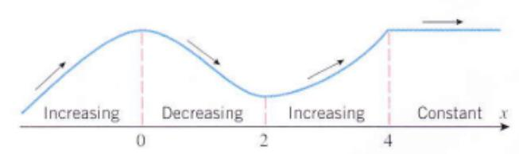

Figure 5.1.1

The following definition, which is illustrated in Figure 5.1.2, expresses these intuitive ideas precisely.

**5.1.1** DEFINITION. Let f be defined on an interval, and let  $x_1$  and  $x_2$  denote points in that interval.

- (a) f is *increasing* on the interval if  $f(x_1) < f(x_2)$  whenever  $x_1 < x_2$ .
- (b) f is *decreasing* on the interval if  $f(x_1) > f(x_2)$  whenever  $x_1 < x_2$ .
- (c) f is *constant* on the interval if  $f(x_1) = f(x_2)$  for all points  $x_1$  and  $x_2$ .

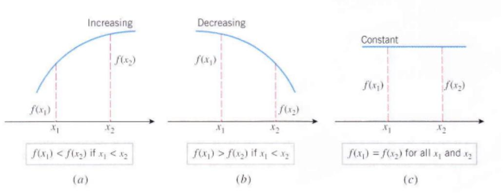

Figure 5.1.2

Figure 5.1.3 suggests that a differentiable function f is increasing on any interval where its graph has tangent lines with positive slope, is decreasing on any interval where its graph has tangent lines with negative slope, and is constant on any interval where its graph has tangent lines with zero slope. This intuitive observation suggests the following important theorem that will be proved in Section 6.5.

## ### Determinant of increasing, decreasing, and constant by derivative approach

5.1 Analysis of Functions I: Increase, Decrease, and Concavity 291

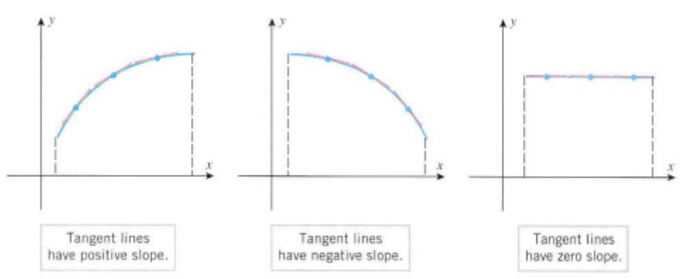

Figure 5.1.3

**5.1.2** THEOREM. Let f be a function that is continuous on a closed interval [a, b] and differentiable on the open interval (a, b).

- (a) If f'(x) > 0 for every value of x in (a, b), then f is increasing on [a, b].
- (b) If f'(x) < 0 for every value of x in (a, b), then f is decreasing on [a, b].
- (c) If f'(x) = 0 for every value of x in (a, b), then f is constant on [a, b].

**REMARK.** Observe that in Theorem 5.1.2 it is only necessary to examine the derivative of f on the open interval (a, b) to determine whether f is increasing, decreasing, or constant on the closed interval [a, b]. Moreover, although this theorem was stated for a closed interval [a, b], it is applicable to any interval I on which f is continuous and inside of which f is differentiable. For example, if f is continuous on  $(a, +\infty)$  and f'(x) > 0 for each x in the interval  $(a, +\infty)$ , then f is increasing on  $[a, +\infty)$ ; and if f'(x) < 0 on  $(-\infty, +\infty)$ , then f is decreasing on  $(-\infty, +\infty)$  [the continuity on  $(-\infty, +\infty)$  follows from the differentiability].

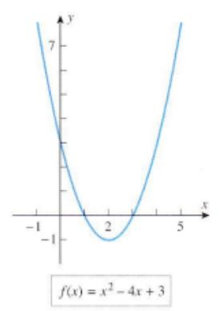

Figure 5.1.4

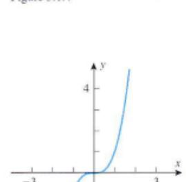

Figure 5.1.5

**REMARK.** Observe that in Theorem 5.1.2 it is only necessary to examine the derivative of f on the open interval (a,b) to determine whether f is increasing, decreasing, or constant on the closed interval [a,b]. Moreover, although this theorem was stated for a closed interval [a,b], it is applicable to any interval I on which f is continuous and inside of which f is differentiable. For example, if f is continuous on  $(a,+\infty)$  and f'(x)>0 for each x in the interval  $(a,+\infty)$ , then f is increasing on  $[a,+\infty)$ ; and if f'(x)<0 on  $(-\infty,+\infty)$ , then f is decreasing on  $(-\infty,+\infty)$  [the continuity on  $(-\infty,+\infty)$  follows from the differentiability].

#### Example 1

Find the intervals on which the following functions are increasing and the intervals on which they are decreasing.

(a) 
$$f(x) = x^2 - 4x + 3$$

**Solution** (a). The graph of f in Figure 5.1.4 suggests that f is decreasing for  $x \le 2$  and increasing for  $x \ge 2$ . To confirm this, we differentiate f to obtain

(b)  $f(x) = x^3$ 

$$f'(x) = 2x - 4 = 2(x - 2)$$

It follows that

$$f'(x) < 0$$
 if  $-\infty < x < 2$ 

$$f'(x) > 0$$
 if  $2 < x < +\infty$ 

Since f is continuous at x = 2, it follows from Theorem 5.1.2 and the subsequent remark that

f is decreasing on 
$$(-\infty, 2]$$

$$f$$
 is increasing on  $[2, +\infty)$ 

These conclusions are consistent with the graph of f in Figure 5.1.4.

**Solution** (b). The graph of f in Figure 5.1.5 suggests that f is increasing over the entire x-axis. To confirm this, we differentiate f to obtain  $f'(x) = 3x^2$ . Thus,

$$f'(x) > 0$$
 if  $-\infty < x < 0$ 

$$f'(x) > 0$$
 if  $0 < x < +\infty$ 

292 Analysis of Functions and Their Graphs

 $f(x) = x^3$ 

Since f is continuous at x = 0, f is increasing on  $(-\infty, 0]$ 

f is increasing on  $[0, +\infty)$ 

Hence f is increasing over the entire interval  $(-\infty, +\infty)$ , which is consistent with the graph in Figure 5.1.5 (see Exercise 51).

## Example 2

- (a) Use the graph of  $f(x) = 3x^4 + 4x^3 12x^2 + 2$  in Figure 5.1.6 to make a conjecture about the intervals on which f is increasing or decreasing.
- (b) Use Theorem 5.1.2 to determine whether your conjecture is correct.

**Solution** (a). The graph suggests that f is decreasing if  $x \le -2$ , increasing if  $-2 \le x \le 0$ , decreasing if  $0 \le x \le 1$ , and increasing if  $x \ge 1$ .

**Solution** (b). Differentiating f we obtain

$$f'(x) = 12x^3 + 12x^2 - 24x = 12x(x^2 + x - 2) = 12x(x + 2)(x - 1)$$

The sign analysis of f' in Table 5.1.1 can be obtained using the method of test points discussed in Appendix A. The conclusions in that table confirm the conjecture in part (a).

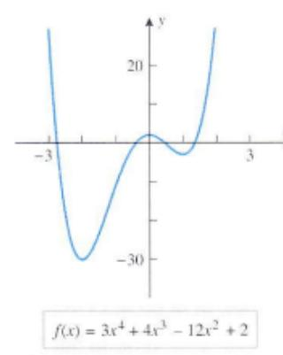

Figure 5.1.6

## Table 5.1.1

| INTERVAL   | 12x | x + 2 | x-1 | f' | CONCLUSION                           |
|------------|-----|-------|-----|----|--------------------------------------|
| x < -2     | _   | _     | -   | _  | $f$ is decreasing on $(-\infty, -2]$ |
| -2 < x < 0 | -   | +     | -   | +  | f is increasing on $[-2, 0]$         |
| 0 < x < 1  | +   | +     | _   | -  | f is decreasing on [0, 1]            |
| 1 < x      | +   | +     | +   | +  | $f$ is increasing on $[1, +\infty)$  |

# Increasing and Decreasing Functions

**Increasing and decreasing functions** are functions in calculus for which the value of f(x) increases and decreases respectively with the increase in the value of x. The derivative of the function f(x) is used to check the behavior of increasing and decreasing functions. The function is said to be increasing if the value of f(x) increases with an increase in the value of x and the function is said to be decreasing if the value of f(x) decreases with an increase in the value of x.

In this article, we will study the concept of increasing and decreasing functions, their properties, graphical representation, and theorems to test for increasing and decreasing functions along with examples for a better understanding.

**Example 1:** For  $f(x) = x^4 - 8x^2$  determine all intervals where f is increasing or decreasing.

The domain of f(x) is all real numbers, and its critical points occur at x = -2, 0, and 2. Testing all intervals to the left and right of these values for  $f'(x) = 4x^3 - 16x$ , you find that

```
f'(x) < 0 \text{ on } (-\infty, -2)

f'(x) > 0 \text{ on } (-2, 0)

f'(x) < 0 \text{ on } (0, 2)

f'(x) > 0 \text{ on } (2, +\infty)
```

hence, f is increasing on (-2,0) and  $(2,+\infty)$  and decreasing on  $(-\infty,-2)$  and (0,2).

# Increasing and Decreasing Functions

**Increasing and decreasing functions** are functions in calculus for which the value of f(x) increases and decreases respectively with the increase in the value of x. The derivative of the function f(x) is used to check the behavior of increasing and decreasing functions. The function is said to be increasing if the value of f(x) increases with an increase in the value of f(x) and the function is said to be decreasing if the value of f(x) decreases with an increase in the value of f(x).

In this article, we will study the concept of increasing and decreasing functions, their properties, graphical representation, and theorems to test for increasing and decreasing functions along with examples for a better understanding.

## Increasing and Decreasing Functions Definition

- Increasing Function A function f(x) is said to be increasing on an interval I if for any two numbers x and y in I such that x < y, we have f(x) ≤ f(y).
- Decreasing Function A function f(x) is said to be decreasing on an interval I if for any two numbers x and y in I such that x < y, we have f(x) ≥ f(y).
- Strictly Increasing Function A function f(x) is said to be strictly\nincreasing on an interval I if for any two numbers x and y in I such that
  x < y, we have f(x) < f(y).</li>
- Strictly Decreasing Function A function f(x) is said to be strictly
  decreasing on an interval I if for any two numbers x and y in I such that
  x < y, we have f(x) > f(y).

# Graphical Representation of Increasing and Decreasing Functions

Now, that we know the meaning and definition of increasing and decreasing functions, let us see the graphical representation of increasing and decreasing functions which will help us to understand the behavior of the functions.

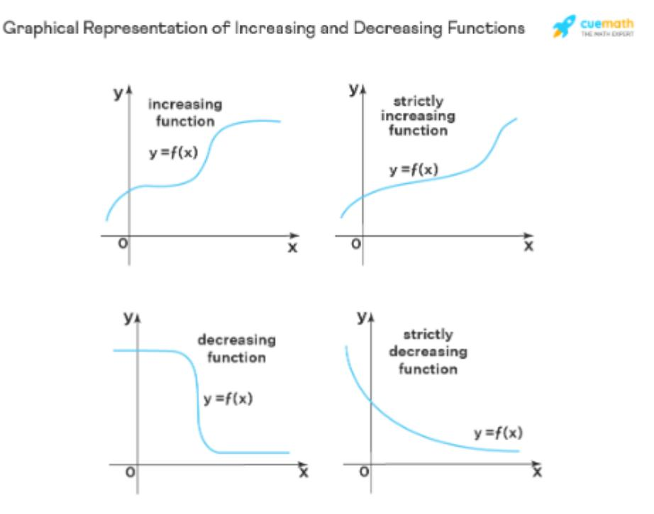

The above graphs show the graphical representation of strictly increasing, strictly decreasing, increasing and decreasing functions. As we can see above in the graphs, the increasing function contains both strictly increasing intervals and the intervals where the function is constant. Similarly, a decreasing function consists of intervals where the function is strictly decreasing and where the function is constant.

## Rules to Check Increasing and Decreasing Functions

We use the derivative of a function to check if it is an increasing or decreasing function. Suppose a function f(x) is differentiable on an open interval I, then we have

- If f'(x) ≥ 0 on I, the function is said to be an increasing function on I.
- If  $f'(x) \le 0$  on I, the function is said to be a decreasing function on I.

**Example:** Let us consider an example to understand the concept better. Consider  $f(x) = x^3$  defined for all real numbers. The derivative of  $f(x) = x^3$  is given by  $f'(x) = 3x^2$ . We know that square of a number is always greater than or equal to 0, therefore we have  $f'(x) = 3x^2 \ge 0$  for all x. Hence  $f(x) = x^3$  is an increasing function.

# Properties of Increasing and Decreasing Functions

Since we know how to check if a function is increasing or decreasing, let us go through the algebraic properties of increasing and decreasing functions:

- If the functions f and g are increasing functions on an open interval I,
   then the sum of the functions f + g is also increasing on this interval.
- If the functions f and g are decreasing functions on an open interval I,
   then the sum of the functions f + g is also decreasing on this interval.
- If the function f is an increasing function on an open interval I, then the opposite function -f is decreasing on this interval.
- If the function f is a decreasing function on an open interval I, then the opposite function -f is increasing on this interval.

- If the function f is an increasing function on an open interval I, then the inverse function 1/f is decreasing on this interval.
- If the function f is a decreasing function on an open interval I, then the inverse function 1/f is increasing on this interval.
- If the functions f and g are increasing functions on an open interval I
  and f, g ≥ 0 on I, then the product of the functions fg is also increasing
  on this interval.
- If the functions f and g are decreasing functions on an open interval I
  and f, g ≥ 0 on I, then the product of the functions fg is also decreasing
  on this interval.

## Important Notes on Increasing and Decreasing Functions

- The first derivative of a function is used to check for increasing and decreasing functions.
- Increasing and decreasing functions are also called non-decreasing and non-increasing functions.

## Question 3: Prove that a polynomial with positive coefficients is increasing.

Solution: Let's suppose polynomial is

$$a_1x^n + a_2x^{n-1} + a_3x^{n-2} + \ldots + a_nx^1 + a_{n+1}x^0$$
 So,

$$y = a_1x^n + a_2x^{n-1} + a_3x^{n-2} + \dots + a_nx^1 + a_{n+1}x^0$$

Derivate the above function with respect to x, and we have

$$\frac{dy}{dx} = a_1 n x^{n-1} + a_2 (n-1) x^{n-2} + a_3 (n-2) x^{n-3} + \dots + a_n + 0$$

As every coefficient is positive, and for a polynomial  $n \ge 0$ .

So,

$$\frac{dy}{dx} \ge 0$$

Therefore, we can say that a polynomial with positive coefficients is increasing.

# Solved Questions on Increasing and Decreasing Functions

Question 1: Prove that  $f(x) = x - \sin(x)$  is an increasing function.

Solution:  $f(x) = x - \sin(x)$ 

$$\frac{dy}{dx} = 1$$
- $\cos x$ 

 $(dy/dx) \ge 0$  as cos(x) having a value in the interval [-1, 1] and (dy/dx) = 0 for the discrete values of x and do not form an interval.

Hence, we can include this function as a monotonically increasing function.

Question 2: Prove that  $f(x) = \cos x$  is decreasing function in  $[0, \pi]$ .

Solution:  $f(x) = \cos x$ 

$$f'(x) = -\sin x$$

As  $\sin x$  is positive in the first and second quadrants, i.e.,  $\sin x \ge 0$  in  $[0, \pi]$ , so we can say that

$$(dy/dx) = -(positive) = negative \le 0$$

$$\frac{dy}{dx} \leq 0$$

So, function  $f(x) = \cos x$  is decreasing in  $[0, \pi]$ .

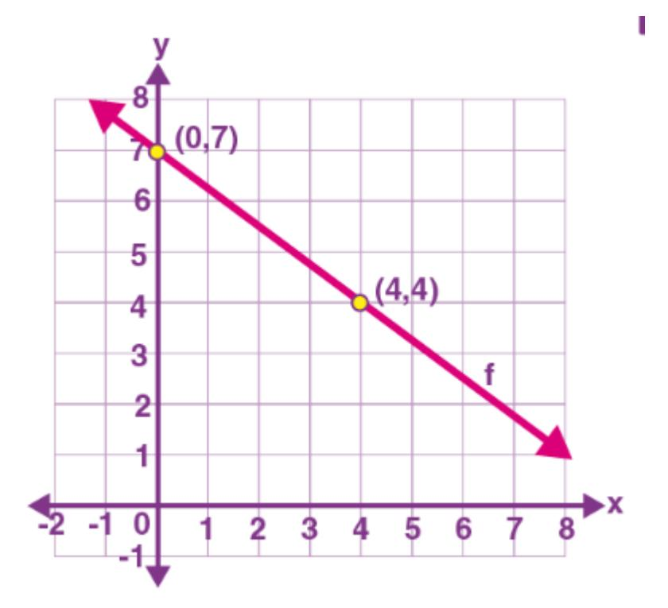

## **Decreasing Function in Calculus**

For a function, y = f(x) to be monotonically decreasing  $(dy/dx) \le 0$  for all such values of interval (a, b), and equality may hold for discrete values.

**Example:** Check whether the function y = -3x/4 + 7 is an increasing or decreasing function.

Differentiate the function with respect to x, and we get

$$\frac{dy}{dx} = -3/4 \leq 0$$

So, we can say it is a decreasing function.

## **Graphical Representation:**

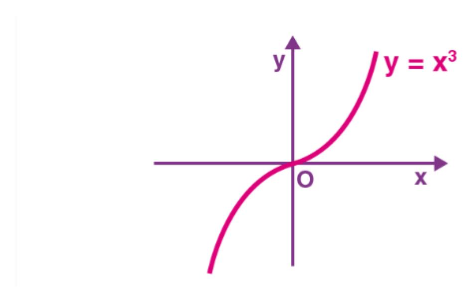

## Increasing Function in Calculus

For a function, y = f(x) to be increasing  $(dy/dx) \ge 0$  for all such values of interval (a, b), and equality may hold for discrete values.

**Example:** Check whether  $y = x^3$  is an increasing or decreasing function.

## Solution:

$$\frac{dy}{dx}=3x^2\geq 0$$

So, it is an increasing function.

## **Graphical Representation:**

Question 4: Discuss the increasing and decreasing nature of the function  $f(x) = x \ln(x)$ 

## Solution:

Here, 
$$f(x) = x \ln(x)$$

$$\Rightarrow$$
 f'(x) = 1 + In(x)

For a function to be increasing f'(x) > 0

$$\Rightarrow$$
 1 + In(x) > 0

$$\Rightarrow \ln(x) > -1$$

$$\Rightarrow \ln(x) > -\ln(e)$$

$$\Rightarrow$$
 In(x) > In (e<sup>-1</sup>)

We know that ln(x) is increasing function, so for  $ln(x) > ln(e^{-1})$  to be hold

$$\Rightarrow x > e^{-1}$$

$$\Rightarrow x > 1/e$$

Thus, function  $f(x) = x \ln(x)$  to be increasing  $x \in (1/e, \infty)$  and for function  $f(x) = x \ln(x)$  to be decreasing  $x \in (0, 1/e)$ .

## Example 4

Estimate the intervals where the function is increasing and decreasing.

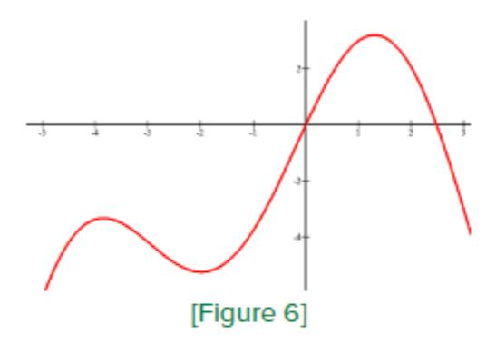

Increasing:  $x \in (-\infty, -4) \cup (-2, 1.5)$ 

Decreasing:  $x \in (-4, -2) \cup (1.5, \infty)$ 

Notice that open intervals are used because at x = -4, -2, 1.5 the slope of the transitions from being positive to negative. The reason why open parentheses are actually increasing or decreasing at those specific points.

## Example 2

Estimate where the following function is increasing and decreasing.

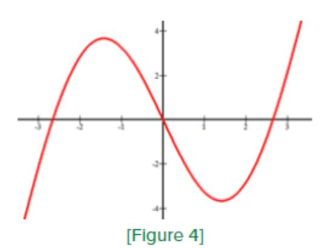

Increasing:  $x \in (-\infty, -1.5) \cup (1.5, \infty)$  .

Decreasing:  $x \in (-1.5, 1.5)$ 

**Example 1:** For  $f(x) = x^4 - 8x^2$  determine all intervals where f is increasing or decreasing.

The domain of f(x) is all real numbers, and its critical points occur at x = -2, 0, and 2. Testing all intervals to the left and right of these values for  $f'(x) = 4x^3 - 16x$ , you find that

$$f'(x) < 0 \text{ on } (-\infty, -2)$$
  
 $f'(x) > 0 \text{ on } (-2, 0)$   
 $f'(x) < 0 \text{ on } (0, 2)$   
 $f'(x) > 0 \text{ on } (2, +\infty)$ 

hence, f is increasing on (-2,0) and  $(2,+\infty)$  and decreasing on  $(-\infty,-2)$  and (0,2).

## Example 5

A continuous function has a global maximum at the point (3, 2), a global minimum at (5, -12) and has no relative extrema or other places with a slope of zero. What are the increasing and decreasing intervals for this function?

Increasing 
$$x \in (-\infty, 3) \cup (5, \infty)$$
.

Decreasing  $x \in (3,5)$ 


## Remember this!

- Functions are increasing on a given interval if it has a positive slope on that interval.
- Functions are decreasing on a given interval if it has a negative slope on that interval.
- A function is called monotonic if it only goes in one direction and never switches between increasing and decreasing.

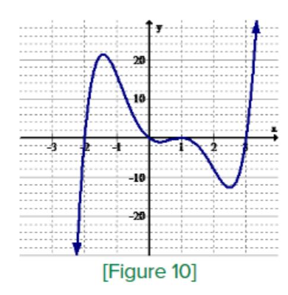

- 7. Identify the intervals (if any) where the function is increasing.
- 8. Identify the intervals (if any) where the function is decreasing.

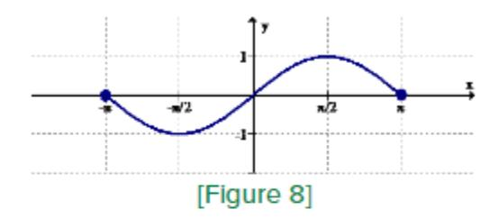

- 3. Identify the intervals (if any) where the function is increasing.
- 4. Identify the intervals (if any) where the function is decreasing.

Use the graph below for 5-6.

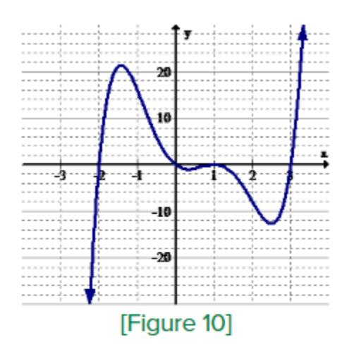

- 7. Identify the intervals (if any) where the function is increasing.
- 8. Identify the intervals (if any) where the function is decreasing.

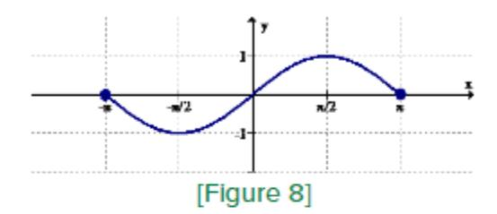

- 3. Identify the intervals (if any) where the function is increasing.
- 4. Identify the intervals (if any) where the function is decreasing.

Use the graph below for 5-6.

## Review

Use the graph below for 1-2.

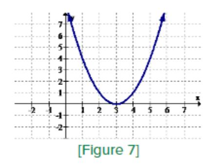

- 1. Identify the intervals (if any) where the function is increasing.
- 2. Identify the intervals (if any) where the function is decreasing.

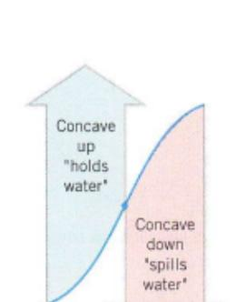

Figure 5.1.7

CONCAVITY

Although the sign of the derivative of f reveals where the graph of f is increasing or decreasing, it does not reveal the direction of curvature. For example, on both sides of the point in Figure 5.1.7 the graph is increasing, but on the left side it has an upward curvature ("holds water") and on the right side it has a downward curvature ("spills water"). On intervals where the graph of f has upward curvature we say that f is  $concave\ up$ , and on intervals where the graph has downward curvature we say that f is  $concave\ down$ .

For differentiable functions, the direction of curvature can be characterized in terms of the tangent lines in two ways: As suggested by Figure 5.1.8, the graph of a function f has upward curvature on intervals where the graph lies above its tangent lines, and it has downward curvature on intervals where it lies below its tangent lines. Alternatively, the graph has upward curvature on intervals where the tangent lines have increasing slopes and downward curvature on intervals where they have decreasing slopes. We will use this latter characterization as our formal definition.

5.1.3 DEFINITION. If f is differentiable on an open interval I, then f is said to be concave up on I if f' is increasing on I, and f is said to be concave down on I if f' is decreasing on I.

To apply this definition we need some way to determine the intervals on which f' is increasing or decreasing. One way to do this is to apply Theorem 5.1.2 (and the remark that follows it) to the function f'. It follows from that theorem and remark that f' will be

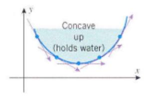

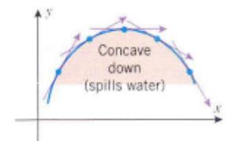

Figure 5.1.8

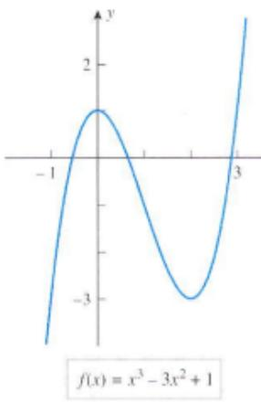

Figure 5.1.9

## INFLECTION POINTS

increasing where its derivative f'' is positive and will be decreasing where its derivative f''is negative. This is the idea behind the following theorem.

5.1.4 THEOREM. Let f be twice differentiable on an open interval I.

- (a) If f"(x) > 0 on I, then f is concave up on I.
- (b) If f"(x) < 0 on I, then f is concave down on I.</p>

## Example 3

Find open intervals on which the following functions are concave up and open intervals on which they are concave down.

(a) 
$$f(x) = x^2 - 4x + 3$$

(b) 
$$f(x) = x^3$$

(c) 
$$f(x) = x^3 - 3x^2 + 1$$

Solution (a). Calculating the first two derivatives we obtain

$$f'(x) = 2x - 4$$
 and  $f''(x) = 2$ 

Since f''(x) > 0 for all x, the function f is concave up on  $(-\infty, +\infty)$ . This is consistent with Figure 5.1.4.

Solution (b). Calculating the first two derivatives we obtain

$$f'(x) = 3x^2$$
 and  $f''(x) = 6x$ 

Since f''(x) < 0 if x < 0 and f''(x) > 0 if x > 0, the function f is concave down on  $(-\infty, 0)$  and concave up on  $(0, +\infty)$ . This is consistent with Figure 5.1.5.

Solution (c). Calculating the first two derivatives we obtain

$$f'(x) = 3x^2 - 6x$$
 and  $f''(x) = 6x - 6 = 6(x - 1)$ 

Since f''(x) > 0 if x > 1 and f''(x) < 0 if x < 1, we conclude that

f is concave up on  $(1, +\infty)$ 

f is concave down on  $(-\infty, 1)$ 

which is consistent with the graph in Figure 5.1.9.

Points where a graph changes from concave up to concave down, or vice versa, are of special interest, so there is some terminology associated with them.

**5.1.5** DEFINITION. If f is continuous on an open interval containing the point  $x_0$ , and if f changes the direction of its concavity at that point, then we say that f has an inflection point at  $x_0$ , and we call the point  $(x_0, f(x_0))$  on the graph of f an inflection point of f (Figure 5.1.10).

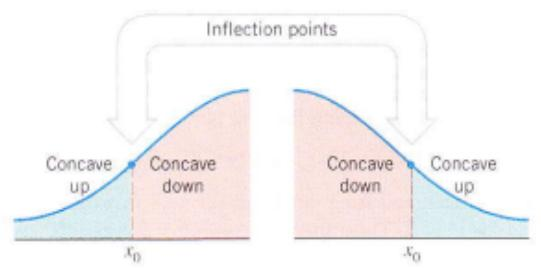

Figure 5.1.10

## 294 Analysis of Functions and Their Graphs

For example, the function  $f(x) = x^3$  has an inflection point at x = 0 (Figure 5.1.5), the function  $f(x) = x^3 - 3x^2 + 1$  has an inflection point at x = 1 (Figure 5.1.9), and the function  $f(x) = x^2 - 4x + 3$  has no inflection points (Figure 5.1.4).

## Example 4

Use the graph in Figure 5.1.6 to make rough estimates of the locations of the inflection points of  $f(x) = 3x^4 + 4x^3 - 12x^2 + 2$ , and check your estimates by finding the exact location of the inflection points.

Solution. The graph changes from concave up to concave down somewhere between -2and -1, say roughly at x = -1.25; and the graph changes from concave down to concave up somewhere between 0 and 1, say roughly at x = 0.5. To find the exact location of the inflection points, we start by calculating the second derivative of f:

$$f'(x) = 12x^3 + 12x^2 - 24x$$
  
$$f''(x) = 36x^2 + 24x - 24 = 12(3x^2 + 2x - 2)$$

We could analyze the sign of f'' by factoring this function and applying the method of test points (as in Table 5.1.1). However, here is another approach. The graph of f'' is a parabola that opens up, and the quadratic formula shows that the equation f'' = 0 has the roots

$$x = \frac{-1 - \sqrt{7}}{3} \approx -1.22 \quad \text{and} \quad x = \frac{-1 + \sqrt{7}}{3} \approx 0.55$$
 (1) (verify). Thus, from the rough graph of  $f''$  in Figure 5.1.11 we obtain the sign analysis of

f'' in Table 5.1.2; this implies that f has inflection points at the points in (1).

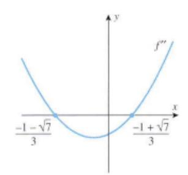

Figure 5.1.11

## Table 5.1.2

| INTERVAL                                                | SIGN OF $f''$ | CONCLUSION        |
|---------------------------------------------------------|---------------|-------------------|
| $x < \frac{-1 - \sqrt{7}}{3}$                           | +             | f is concave up   |
| $\frac{-1 - \sqrt{7}}{3} < x < \frac{-1 + \sqrt{7}}{3}$ | -             | f is concave down |
| $x > \frac{-1 + \sqrt{7}}{3}$                           | +             | f is concave up   |

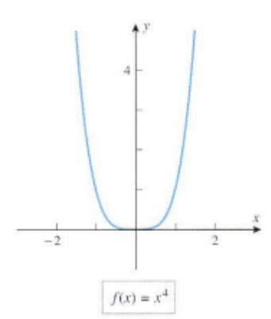

Figure 5.1.12

In the preceding example the inflection points of f occurred at points where f''(x) = 0. However, inflection points do not always occur at points where f''(x) = 0. For example, if the graph of f'' happens to touch the x-axis at a point without crossing over it, then fwill not change sign at that point, and hence no change in the concavity of f will occur at that point. Here is a specific example.

## Example 5

Find the inflection points of  $f(x) = x^4$ .

Solution. Calculating the first two derivatives of f we obtain

$$f'(x) = 4x^3$$
,  $f''(x) = 12x^2$ 

Here f''(x) > 0 for x < 0 and for x > 0, which implies that f is concave up for x < 0and for x > 0. Thus, there are no inflection points; and in particular, there is no inflection point at x = 0, even though f''(0) = 0 (Figure 5.1.12).

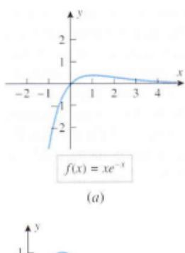

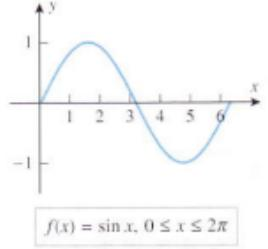

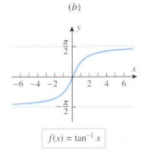

Figure 5.1.13

#### INFLECTION POINTS IN APPLICATIONS

## Example 6

Find the inflection points of the following functions, and confirm that your results are consistent with the graphs of the functions.

(a) 
$$f(x) = xe^{-x}$$

(b) 
$$f(x) = \sin x$$
,  $0 \le x \le 2\pi$ 

(c) 
$$f(x) = \tan^{-1} x$$

Solution (a). Calculating the first two derivatives of f we obtain

$$f'(x) = (1-x)e^{-x}, \quad f''(x) = (x-2)e^{-x}$$

(verify). Keeping in mind that  $e^{-x}$  is always positive, it follows that the sign of f'' is determined by the factor x - 2. Thus, f''(x) < 0 if x < 2, and f''(x) > 0 if x > 2, which implies that the graph is concave down for x < 2 and concave up for x > 2. Thus, there is an inflection point at x = 2 (Figure 5.1.13*a*).

Solution (b). Calculating the first two derivatives of f we obtain

$$f'(x) = \cos x$$
,  $f''(x) = -\sin x$ 

Thus, f''(x) < 0 if  $0 < x < \pi$ , and f''(x) > 0 if  $\pi < x < 2\pi$ , which implies that the graph is concave down for  $0 < x < \pi$  and concave up for  $\pi < x < 2\pi$ . Thus, there is an inflection point at  $x = \pi \approx 3.14$  (Figure 5.1.13b).

Solution (c). Calculating the first two derivatives of f we obtain

$$f'(x) = \frac{1}{1+x^2}, \quad f''(x) = -\frac{2x}{(1+x^2)^2}$$

(verify). Thus, f''(x) > 0 if x < 0, and f''(x) < 0 if x > 0, which implies that the graph is concave up for x < 0 and concave down for x > 0. Thus, there is an inflection point at x = 0 (Figure 5.1.13c).

FOR THE READER. If you have a CAS, devise a method for using it to find exact values for the inflection points of a function f, and use your method to find the inflection points of  $f(x) = x/(x^2 + 1)$ . Verify that your results are consistent with the graph of f.

Up to now we have viewed the inflection points of a curve y = f(x) as those points where the curve changes the direction of its concavity. However, inflection points also mark the points on the curve where the slopes of the tangent lines change from increasing to decreasing, or vice versa (Figure 5.1.14); stated another way:

Inflection points mark the places on the curve y = f(x) where the rate of change of y with respect to x changes from increasing to decreasing, or vice versa.

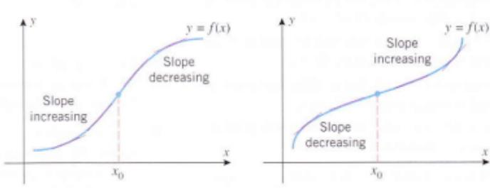

Figure 5.1.14

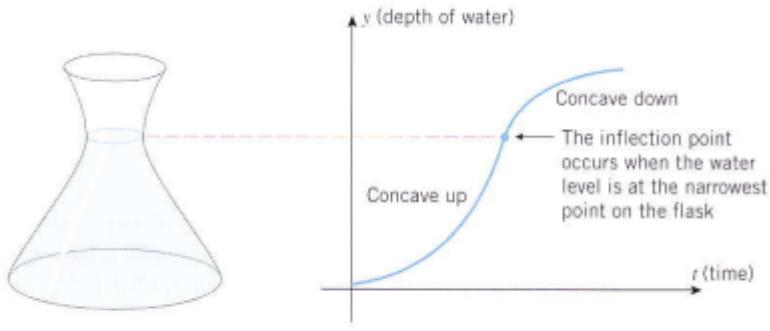

Figure 5.1.15

## 5.2 ANALYSIS OF FUNCTIONS II: RELATIVE EXTREMA; FIRST AND SECOND DERIVATIVE TESTS

In this section we will discuss methods for finding the high and low points on the graph of a function. The ideas we develop here will have important applications.

#### RELATIVE MAXIMA AND MINIMA

Highest mountain

Relative maximum

Relative minimum Deepest valley

Figure 5.2.1

If we imagine the graph of a function f to be a two-dimensional mountain range with hills and valleys, then the tops of the hills are called *relative maxima*, and the bottoms of the valleys are called *relative minima* (Figure 5.2.1).

The relative maxima are the high points in their immediate vicinity, and the relative minima are the low points. Note that a relative maximum need not be the highest point in the entire mountain range, and a relative minimum need not be the lowest point—they are just high and low points relative to the nearby terrain. These ideas are captured in the following definition.

**5.2.1 DEFINITION.** A function f is said to have a *relative maximum* at  $x_0$  if there is an open interval containing  $x_0$  on which  $f(x_0)$  is the largest value, that is,  $f(x_0) \ge f(x)$  for all x in the interval. Similarly, f is said to have a *relative minimum* at  $x_0$  if there is an open interval containing  $x_0$  on which  $f(x_0)$  is the smallest value, that is,  $f(x_0) \le f(x)$  for all x in the interval. If f has either a relative maximum or a relative minimum at  $x_0$ , then f is said to have a *relative extremum* at  $x_0$ .

## Example 1

Locate the relative extrema of the four functions graphed in Figure 5.2.2.

#### Solution.

- (a) The function  $f(x) = x^2$  has a relative minimum at x = 0 but no relative maxima.
- (b) The function  $f(x) = x^3$  has no relative extrema.
- (c) The function  $f(x) = x^3 3x + 3$  has a relative maximum at x = -1 and a relative minimum at x = 1.
- (d) The function f(x) = cos x has relative maxima at all even multiples of π and relative minima at all odd multiples of π.

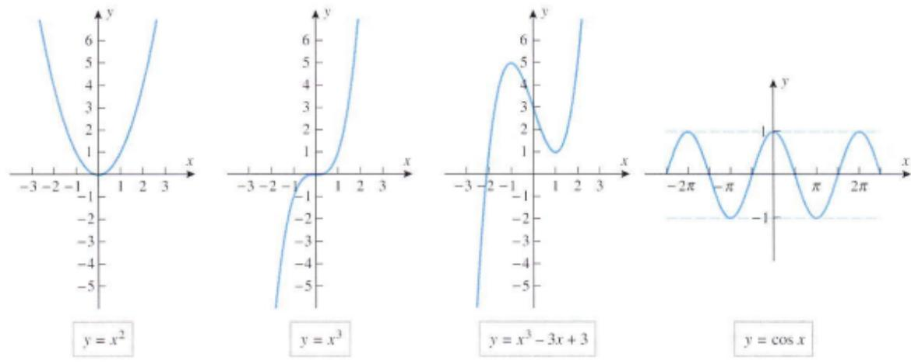

Figure 5.2.2

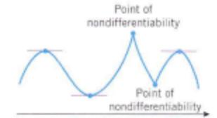

Figure 5.2.3

Relative extrema can be viewed as the transition points that separate the regions where a graph is increasing from those where it is decreasing. As suggested by Figure 5.2.3, the relative extrema of a continuous function f occur either at corners or at points where the graph of f has a horizontal tangent line. This is the content of the following theorem, whose proof is given in Appendix G.

**5.2.2** THEOREM. If a function f has any relative extrema, then they occur either at points where f'(x) = 0 or at points where f is not differentiable.

The points at which either f'(x) = 0 or f is not differentiable are called the *critical points* of f, so that Theorem 5.2.2 can be rephrased as follows:

The relative extrema of a function, if any, occur at critical points.

#### CRITICAL POINTS

Sometimes we will want to distinguish the critical points at which f'(x) = 0 from those points where f is not differentiable, in which case we will call the critical points at which f'(x) = 0 the stationary points of f.

It is important not to read too much into Theorem 5.2.2—the theorem asserts that the relative extrema must occur at critical points, but it does not say that a relative extremum occurs at *every* critical point; that is, there may be critical points at which a relative extremum does not occur. For example, for the eight critical points shown in Figure 5.2.4, relative extrema occur at all of the points in the top row, but not at any of the points in the bottom row.

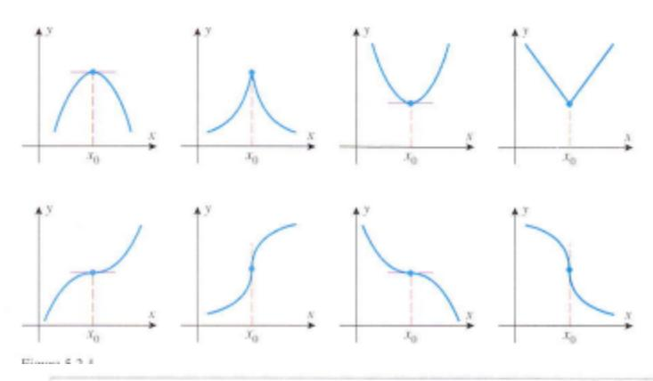

5.2.3 THEOREM (First Derivative Test). Suppose f is continuous at a critical point x<sub>0</sub>.

- If f'(x) > 0 on an open interval extending left from x<sub>0</sub> and f'(x) < 0 on an open interval extending right from x<sub>0</sub>, then f has a relative maximum at x<sub>0</sub>.
- (b) If f'(x) < 0 on an open interval extending left from x<sub>0</sub> and f'(x) > 0 on an open interval extending right from x<sub>0</sub>, then f has a relative minimum at x<sub>0</sub>.
- (c) If f'(x) has the same sign [either f'(x) > 0 or f'(x) < 0] on an open interval extending left from x<sub>0</sub> and on an open interval extending right from x<sub>0</sub>, then f does not have a relative extremum at x<sub>0</sub>.

## Example 2

- (a) Locate the relative maxima and minima of  $f(x) = 3x^{5/3} 15x^{2/3}$ .
- (b) Confirm that the results in part (a) agree with the graph of f.

**Solution** (a). The function f is defined and continuous for all real values of x, and its derivative is

$$f'(x) = 5x^{2/3} - 10x^{-1/3} = 5x^{-1/3}(x - 2) = \frac{5(x - 2)}{x^{1/3}}$$

Since f'(x) does not exist if x = 0, and since f'(x) = 0 if x = 2, there are critical points at x = 0 and x = 2. To apply the first derivative test, we examine the sign of f'(x) on intervals extending to the left and right of the critical points (Figure 5.2.5). Since the sign of the derivative changes from positive to negative at x = 0, there is a relative maximum there, and since it changes from negative to positive at x = 2, there is a relative minimum there.

Solution (b). The result in part (a) agrees with the graph of f shown in Figure 5.2.6.

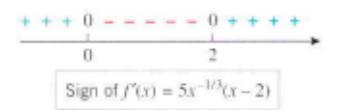

Figure 5.2.5

 $[-2, 10] \times [-15, 20]$ xScI = 2, yScI = 5

Figure 5.2.6

FOR THE READER. As discussed in the subsection of Section 1.3 entitled Errors of Omission, many graphing utilities omit portions of the graphs of functions with fractional exponents and must be "tricked" into producing complete graphs; and indeed, for the function in the last example the author's calculator and CAS both failed to produce the portion of the graph over the negative x-axis. To generate the graph in Figure 5.2.6, the author had to apply the techniques discussed in Exercise 29 of Section 1.3 to each term in the formula for f. Use a graphing utility to generate this graph.

## MORE ON THE SIGNIFICANCE OF INFLECTION POINTS

In Section 5.1 we observed that the inflection points of a curve y = f(x) mark the points where the slopes of the tangent lines change from increasing to decreasing, or vice versa. Thus, in the case where f is twice differentiable, the inflection points mark the places on the curve y = f(x) where f'(x) has a relative maximum or minimum (Figure 5.2.10); stated another way:

Inflection points mark the places on the curve y = f(x) at which the rate of change of y with respect to x has a relative maximum or minimum; that is, they are the places where y is increasing or decreasing most rapidly in the immediate vicinity.

As an illustration of this principle, consider the flask shown in Figure 5.1.15. We observed in Section 5.1 that if water is poured into the flask so that the volume increases at a constant rate, then the graph of y versus t has an inflection point when y is at the narrow point in the neck. However, this is also the place where the water level is rising most rapidly.

## 5.2 Analysis of Functions II: Relative Extrema; First and Second Derivative Tests 303

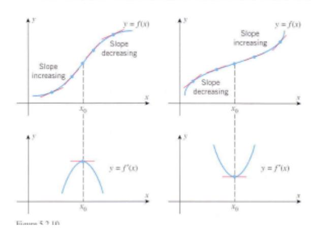

## Rolle's Theorem

In calculus, **Rolle's theorem** states that if a differentiable function (real-valued) attains equal values at two distinct points then it must have at least one fixed point somewhere between them where the first derivative is zero. Rolle's theorem is named after Michel Rolle, a French mathematician. Rolle's Theorem is a special case of the mean value theorem.

## Rolle's Theorem Statement:

Rolle's theorem states that "If a function f is defined in the closed interval [a, b] in such a way that it satisfies the following condition: i) f is continuous on [a, b], ii) f is differentiable on (a, b), and iii) f (a) = f(b), then there exists at least one value of x, let us assume this value to be c, which lies between a and b i.e. (a < c < b) in such a way that f'(c) = 0."

## Rolle's Theorem


lf

- 1) f(x) is continuous on [a,b],
- 2) f(x) is differentiable on (a,b), and
- 3) f(a) = f(b)

then there exists at least on c in (a,b) such that

Mathematically, Rolle's theorem can be stated as: Let  $f: [a, b] \to R$  be continuous on [a, b] and differentiable on (a, b), such that f(a) = f(b), where a and b are some real numbers. Then there exists some c in (a, b) such that f'(c) = 0.

## Rolle's Theorem Proof

When proving a theorem directly, you start by assuming all of the conditions are satisfied. So, our discussion below relates only to functions

- that is continuous over [a, b],
- that is differentiable (a, b),
- and have f(a) = f(b).

With that in mind, notice that when a function satisfies Rolle's Theorem, the place where f'(x)=0 occurs at a maximum or a minimum value (i.e., extrema).

How do we know that a function will even have one of these extrema? the Extreme Value Theorem theorem says that if a function is continuous, then it is guaranteed to have both a maximum and a minimum point in the interval.

Now, there are two basic possibilities for our function.

Case 1: the function is constant.

Case 2: the function is not constant.

Let us look into each of these cases in more detail.

## Case 1: the function is constant

For a constant function, the graph is a horizontal line segment.

Rolle's Theorem Proof (Case 1: The Function is Constant)


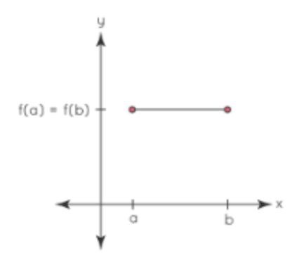

In this case, every point satisfies Rolle's Theorem since the derivative is zero everywhere. (Remember, Rolle's Theorem guarantees at least one point. It doesn't preclude multiple points!)

Case 2: the function is not constant.

Rolle's Theorem Proof (Case 2: The Function is not Constant)


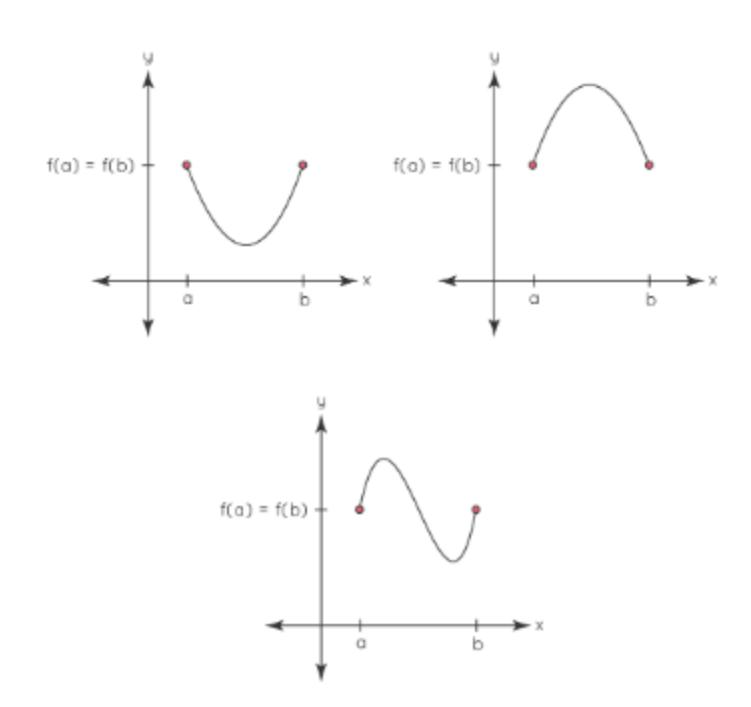

Since the function isn't constant, it must change directions in order to start and end at the same y-value. It means at some point within the interval the function will either have a minimum, a maximum or both. So, now we need to show that at this interior-point the derivative is equal to zero, the rest of the discussion will focus on the cases where the interior extrema is a maximum, but the discussion for a minimum is largely the same.

Possibility 1: Could the maximum occur at a point where f'>0?

No, because if f'>0 we know the function is increasing. But it can't increase since we are at its maximum point.

Possibility 2: Could the maximum occur at a point where f'<0?

No, because if f'<0 we know that function is decreasing, which means it was larger just a little to the left of where we are now. But we are at the function's maximum value, so it couldn't have been larger. Since f' exists, but isn't larger than zero, and isn't smaller than zero, the only possibility that remains is that f'=0. And that's it! We have shown that the function must have extrema and that at the extrema the derivative must equal zero!

## **Example on Rolle's Theorem**

Verify Rolle's theorem for the functions  $y = x^2 + 2$ , a = -2, and b = 2

The function  $y = x^2 + 2$  is continuous in [-2, 2] and differentiable in (-2, 2), according to Rolle's theorem formulation.

Given the circumstances.

$$f(x) = x^2 + 2$$

$$f(-2) = (-2)^2 + 2 = 4 + 2 = 6$$

$$f(2) = (2)^2 + 2 = 4 + 2 = 6$$

Thus, 
$$f(-2) = f(2) = 6$$

As a result, the function f(x) is continuous in the range [-2, 2].

Now. f'(x) = 2x

According to Rolle's theorem, there is a point c (-2, 2) where f'(c) = 0.

$$f'(c) = 2(0) = 0$$
 at  $c = 0$ , when  $c = 0$  (- 2, 2)

As a result, Rolle's theorem is proven.

## # Statement of Mean Value Theorem

The mean value theorem states that for a curve passing through two given points there is one point on the curve where the tangent is parallel to the secant passing through the two given points. Rolle's theorem has been derived from this mean value theorem.

## What is Mean Value Theorem?

The **mean value theorem** states that for any function f(x) whose graph passes through two given points (a, f(a)), (b, f(b)), there is at least one point (c, f(c)) on the curve where the tangent is parallel to the secant passing through the two given points. The mean value theorem is defined herein calculus for a function f(x):  $[a, b] \rightarrow R$ , such that it is continuous and differentiable across an interval.

- The function f(x) is continuous over the interval [a, b].
- The function f(x) is differentiable over the interval (a, b).
- There exists a point c in (a, b) such that f'(c) = [f(b) f(a)] / (b a)

**Statement:** The mean value theorem states that if a function f is continuous over the closed interval [a, b], and differentiable over the open interval (a, b), then there exists at least one point c in the interval (a, b) such that f '(c) is the average rate of change of the function over [a, b] and it is parallel to the secant line over [a, b].

**Proof:** Let g(x) be the secant line to f(x) passing through (a, f(a)) and (b, f(b)). We know that the equation of the secant line is  $y - y_1 = m(x - x_1)$ .

$$g(x) - f(a) = [f(b) - f(a)] / (b - a) (x-a)$$

$$g(x) = [f(b) - f(a)] / (b - a) (x-a) + f(a) ---->(1)$$

Let h(x) be f(x) - g(x)

$$h(x) = f(x) - [[f(b) - f(a)] / (b - a) (x-a) + f(a)] (From (1))$$

h(a) = h(b) = 0 and h(x) is continuous on [a, b] and differentiable on (a, b).

Thus applying the Rolles theorem, there is some x = c in (a, b) such that h'(c) = 0.

$$h'(x) = f'(x) - [f(b) - f(a)] / (b - a)$$

For some c in (a, b), h'(c) = 0. Thus

$$h'(c) = f'(c) - [f(b) - f(a)] / (b - a) = 0$$

$$f'(c) = [f(b) - f(a)] / (b - a)$$

Thus the mean value theorem is proved.

Note: The result may not hold if the function is not differentiable, even at a single point in the open interval.

# Graphical Representation of Mean Value Theorem

The graphical representation of the function f(x) helps in understanding the mean value theorem. Here we consider two distinct points (a, f(a)), (b, f(b)). The line connecting these points is the secant of the curve, which is parallel to the tangent cutting the curve at (c, f(c)). The slope of the secant of the curve joining these points is equal to the slope of the tangent at the point (c, f(c)). We know that the derivative of the tangent is the slope at that point.

Slope of the Tangent = Slope of the Secant

$$f'(c) = [f(b) - f(a)] / (b - a)$$

Graph of Mean Value Theorem


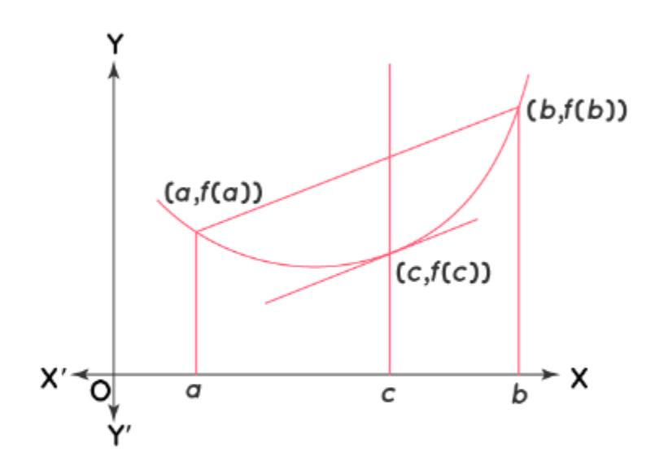

Here we observe that the point (c, f(c)), lies between the two points (a, f(a)), (b, f(b)).

# Difference Between Mean Value Theorem and Rolle's Theorem

Both the mean value theorem and Rolle's theorem define the function f(x) such that it is continuous across the interval [a, b], and it is differentiable across the interval (a, b). In the mean value theorem, the two referred points (a, f(a)), (b, f(b)) are distinct and  $f(a) \neq f(b)$ . In Rolle's theorem, the points are defined such that f(a) = f(b).

The value of c in the mean value theorem is defined such that the slope of the tangent at the point (c, f(c)) is equal to the slope of the secant joining the two points. The value of c in Rolle's theorem is defined such that the slope of the tangent at the point (c, f(c)) is equal to the slope of the x-axis. The slope in the mean value theorem is f'(c) = [f(b) - f(a)] / (b - a), and the slope in Rolle's theorem is equal to f'(c) = 0.

## Mean Value Theorem

## Rolle's Theorem

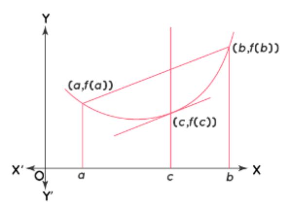

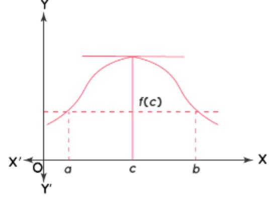

## Mean Value Theorem

Suppose f(x) is a function that satisfies both of the following.

- 1. f(x) is continuous on the closed interval [a,b].
- 2. f(x) is differentiable on the open interval (a,b).

Then there is a number c such that a < c < b and

$$f'\left(c\right)=\frac{f\left(b\right)-f\left(a\right)}{b-a}$$

Or,

$$f(b)-f(a)=f'(c)(b-a)$$

Note that the Mean Value Theorem doesn't tell us what c is. It only tells us that there is at least one number c that will satisfy the conclusion of the theorem.

Also note that if it weren't for the fact that we needed Rolle's Theorem to prove this we could think of Rolle's Theorem as a special case of the Mean Value Theorem. To see that just assume that f(a) = f(b) and then the result of the Mean Value Theorem gives the result of Rolle's Theorem.

Before we take a look at a couple of examples let's think about a geometric interpretation of the Mean Value Theorem. First define A=(a,f(a)) and B=(b,f(b)) and then we know from the Mean Value theorem that there is a c such that a < c < b and that

$$f'(c) = \frac{f(b) - f(a)}{b - a}$$

Now, if we draw in the secant line connecting A and B then we can know that the slope of the secant line is,

$$\frac{f\left(b\right)-f\left(a\right)}{b-a}$$

Likewise, if we draw in the tangent line to f(x) at x = c we know that its slope is f'(c).

What the Mean Value Theorem tells us is that these two slopes must be equal or in other words the secant line connecting A and B and the tangent line at x = c must be parallel. We can see this in the following sketch.

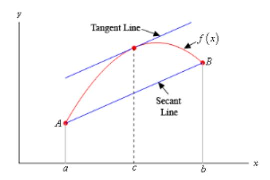

Let's now take a look at a couple of examples using the Mean Value Theorem.

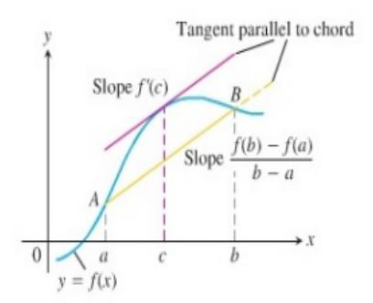

Geometrically the mean value theorem says that somewhere between A and B, the graph has a tangent parallel to the chord(secant) AB.

 $\it Example~2$  Determine all the numbers  $\it c$  which satisfy the conclusions of the Mean Value Theorem for the following function.

$$f(x) = x^3 + 2x^2 - x$$
 on  $[-1, 2]$ 

## Hide Solution ▼

There isn't really a whole lot to this problem other than to notice that since f(x) is a polynomial it is both continuous and differentiable (i.e. the derivative exists) on the interval given.

First let's find the derivative.

$$f'(x) = 3x^2 + 4x - 1$$

Now, to find the numbers that satisfy the conclusions of the Mean Value Theorem all we need to do is plug this into the formula given by the Mean Value Theorem.

$$f'\left(c\right) = \frac{f\left(2\right) - f\left(-1\right)}{2 - \left(-1\right)} \ 3c^2 + 4c - 1 = \frac{14 - 2}{3} = \frac{12}{3} = 4$$

Now, this is just a quadratic equation,

$$3c^2 + 4c - 1 = 4$$
$$3c^2 + 4c - 5 = 0$$

Using the quadratic formula on this we get,

$$c=\frac{-4\pm\sqrt{16-4\left(3\right)\left(-5\right)}}{6}=\frac{-4\pm\sqrt{76}}{6}$$

So, solving gives two values of c

$$c = \frac{-4 + \sqrt{76}}{6} = 0.7863$$
  $c = \frac{-4 - \sqrt{76}}{6} = -2.1196$ 

Notice that only one of these is actually in the interval given in the problem. That means that we will exclude the second one (since it isn't in the interval). The number that we're after in this problem is,

$$c = 0.7863$$

Be careful to not assume that only one of the numbers will work. It is possible for both of them to work.

## Examples of Mean Value Theorem

**Example 1:** Verify if the function  $f(x) = x^2 + 1$  satisfies mean value theorem in the interval [1, 4]. If so, find the value of 'c'.

## Solution:

The given function is  $f(x) = x^2 + 1$ . To verify the mean value theorem, the function  $f(x) = x^2 + 1$  must be continuous in [1, 4] and differentiable in (1, 4).

Since f(x) is a polynomial function, both of the above conditions hold true.

The derivative f'(x) = 2x (power rule) is defined in the interval (1, 4)

$$f(1) = 1^2 + 1 = 1 + 1 = 2$$

$$f(4) = 4^2 + 1 = 16 + 1 = 17$$

$$f'(c) = [f(4) - f(1)] / (4 - 1)$$

$$= (17 - 2) / (4 - 1) = 15/3 = 5$$

$$f'(c) = 5$$

$$2c = 5$$

c = 2.5 which lies in the interval (1, 4)

**Answer:** The given function satisfies the mean value theorem and c = 2.5.

**Example 2:** Find the value of c if the function  $f(x) = x^2 - 4x + 3$  satisfies mean value theorem in the interval [1, 4].

## Solution:

The given function  $f(x) = x^2 - 4x + 3$  satisfies the hypothesis of the mean values theorem as it is continuous in [1, 4] and is differentiable in (1, 4).

$$f'(x) = 2x - 4$$

$$f(1) = 1 - 4 + 3 = 0$$

$$f(4) = 4^2 - 4(4) + 3 = 16 - 16 + 3 = 3$$

$$f'(x) = [f(4) - f(0)] / (4 - 0)$$

$$= (3 - 0) / (4 - 1)$$

$$= 3/3 = 1$$

$$f'(c) = 1$$

$$2c - 4 = 1$$

$$2c = 5$$

$$c = 5/2 = 2.5$$

c = 2.5 belongs to the interval (1, 4)

Answer: c = 2.5

**Example 3:** For the function  $f(x) = x^2 + 2x$ , find all the values of c that satisfy the mean value theorem, over the interval [-4,4].

## Solution:

 $f(x) = x^2 + 2x$  is a polynomial and hence it is continuous and differentiable over the given interval [4,-4]

$$f'(x) = 2x + 2$$

$$f(4) = 4^2 + 2(4) = 24$$

$$f(-4) = (-4)^2 + 2(-4) = 8$$

$$f'(c) = [f(4) - f(-4)] / (4 - (-4)) = 2$$

Let us find c in (-4,4) such that f'(c) = 2

$$f'(x) = 2x + 2$$

$$f'(2) = 2(2) + 2 = 6$$

$$f'(x) = 2c + 2 = 2$$

 $\Rightarrow$  c = 0 and it is present in the given interval.

**Answer:** For the function  $f(x) = x^2 + 2x$ , the value of c = 0 that satisfy the mean value theorem, over the interval [-4,4].

## ### State and Prove Mean Value Theorem

## Mean Value Theorem

Let f be continuous over the closed interval [a,b] and differentiable over the open interval (a,b). Then, there exists at least one point  $c \in (a,b)$  such that

$$f'(c) = \frac{f(b) - f(a)}{b - a}$$

## Proof

The proof follows from Rolle's theorem by introducing an appropriate  $\underline{\text{function}}$  that satisfies the criteria of Rolle's theorem. Consider the line connecting (a, f(a)) and (b, f(b)). Since the  $\underline{\text{slope}}$  of that line is

$$\frac{f(b)-f(a)}{b-a}$$

and the line passes through the point (a,f(a)), the equation of that line can be written as

$$y=\frac{f(b)-f(a)}{b-a}(x-a)+f(a).$$

Let g(x) denote the vertical difference between the point (x,f(x)) and the point (x,y) on that line. Therefore,

$$g(x) = f(x) - \left[\frac{f(b) - f(a)}{b - a}(x - a) + f(a)\right].$$

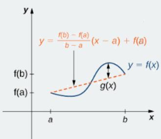

Figure 4.2.6: The value g(x) is the vertical difference between the point (x, f(x)) and the point (x, y) on the secant line connecting (a, f(a)) and (b, f(b)).

Since the graph of f intersects the secant line when x=a and x=b, we see that g(a)=0=g(b). Since f is a <u>differentiable function</u> over (a,b), g is also a <u>differentiable function</u> over (a,b). Furthermore, since f is continuous over [a,b], g is also continuous over [a,b]. Therefore, g satisfies the criteria of Rolle's theorem. Consequently, there exists a point  $c \in (a,b)$  such that g'(c)=0. Since

$$g'(x)=f'(x)-\frac{f(b)-f(a)}{b-a},$$

we see that

$$g'(c)=f'(c)-\frac{f(b)-f(a)}{b-a}.$$

Since g'(c)=0, we conclude that

$$f'(c) = \frac{f(b) - f(a)}{b - a}$$
. Activate Go to Sett

## Example 4.2.2: Verifying that the Mean Value Theorem Applies

For  $f(x) = \sqrt{x}$  over the interval [0,9], show that f satisfies the hypothesis of the Mean Value Theorem, and therefore there exists at least one value  $c \in (0,9)$  such that f'(c) is equal to the slope of the line connecting (0,f(0)) and (9,f(9)). Find these values c guaranteed by the Mean Value Theorem.

## Solution

We know that  $f(x) = \sqrt{x}$  is continuous over [0,9] and <u>differentiable</u> over (0,9). Therefore, f satisfies the hypotheses of the <u>Mean Value Theorem</u>, and there must exist at least one value  $c \in (0,9)$  such that f'(c) is equal to the <u>slope</u> of the line connecting (0,f(0)) and (9,f(9)) (Figure 4.2.7). To determine which value(s) of c are guaranteed, first calculate the <u>derivative</u> of f. The <u>derivative</u>  $f'(x) = \frac{1}{(2\sqrt{x})}$ . The <u>slope</u> of the line connecting (0,f(0)) and (9,f(9)) is given by

$$\frac{f(9) - f(0)}{9 - 0} = \frac{\sqrt{9} - \sqrt{0}}{9 - 0} = \frac{3}{9} = \frac{1}{3}$$

We want to find c such that  $f'(c)=\frac{1}{3}.$  That is, we want to find c such that

$$\frac{1}{2\sqrt{c}} = \frac{1}{3}$$

Solving this equation for  $c_r$  we obtain  $c=\frac{9}{4}$ . At this point, the <u>slope</u> of the <u>tangent</u> line equals the <u>slope</u> of the line joining the endpoints.

Solving this equation for  $c_r$  we obtain  $c=\frac{9}{4}$ . At this point, the <u>slope</u> of the <u>tangent</u> line equals the <u>slope</u> of the line joining the endpoints.

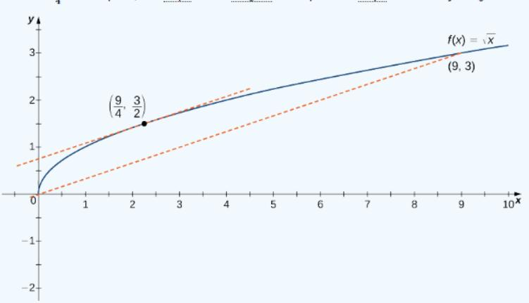

Figure 4.2.7: The slope of the tangent line at c=9/4 is the same as the slope of the line segment connecting (0,0) and (9,3).

One application that helps illustrate the Mean Value Theorem involves velocity. For example, suppose we drive a car for 1 h down a straight road with an average velocity of 45 mph. Let s(t) and v(t) denote the position and velocity of the car, respectively, for  $0 \le t \le 1$  h. Assuming that the position function s(t) is differentiable, we can apply the Mean Value Theorem to conclude that, at some time  $c \in (0,1)$ , the speed of the car was exactly

$$v(c) = s'(c) = \frac{s(1) - s(0)}{1 - 0} = 45\,\text{mph}$$

#### The Mean Value Theorem

Suppose  $f\left(x\right)$  is a function that satisfies both of the following.

- 1. f(x) is continuous on the closed interval [a, b].
- 2. f(x) is differentiable on the open interval (a,b).

Then there is a number c such that a < c < b and

$$f'\left(c\right)=\frac{f\left(b\right)-f\left(a\right)}{b-a}$$

Or,

$$f\left(b\right)-f\left(a\right)=f'\left(c\right)\left(b-a\right)$$

## Proof

For illustration purposes let's suppose that the graph of  $f\left( x\right)$  is,

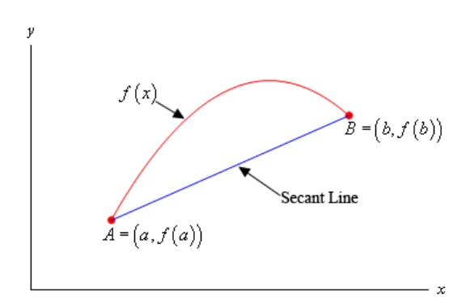

Note of course that it may not look like this, but we just need a quick sketch to make it easier to see what we're talking about here.

The first thing that we need is the equation of the secant line that goes through the two points A and B as shown above. This is,

$$y = f(a) + \frac{f(b) - f(a)}{b - a}(x - a)$$

Let's now define a new function, g(x), as to be the difference between f(x) and the equation of the secant line or,

$$g\left(x\right)=f\left(x\right)-\left(f\left(a\right)+\frac{f\left(b\right)-f\left(a\right)}{b-a}\left(x-a\right)\right)=f\left(x\right)-f\left(a\right)-\frac{f\left(b\right)-f\left(a\right)}{b-a}\left(x-a\right)$$

Next, let's notice that because g(x) is the sum of f(x), which is assumed to be continuous on [a, b], and a linear polynomial, which we know to be continuous everywhere, we know that g(x) must also be continuous on [a, b].

Also, we can see that g(x) must be differentiable on (a,b) because it is the sum of f(x), which is assumed to be differentiable on (a,b) and a linear polynomial, which we know to be differentiable.

We could also have just computed the derivative as follows,

$$g'\left(x\right)=f'\left(x\right)-\frac{f\left(b\right)-f\left(a\right)}{b-a}$$

at which point we can see that it exists on (a,b) because we assumed that f'(x) exists on (a,b) and the last term is just a constant.

Finally, we have,

$$g(a) = f(a) - f(a) - \frac{f(b) - f(a)}{b - a}(a - a) = f(a) - f(a) = 0$$

In other words, g(x) satisfies the three conditions of **Rolle's Theorem** and so we know that there must be a number c such that a < c < b and that,

$$0=g'\left(c\right)=f'\left(c\right)-\frac{f\left(b\right)-f\left(a\right)}{b-a}\qquad \Rightarrow \qquad f'\left(c\right)=\frac{f\left(b\right)-f\left(a\right)}{b-a}$$

In other words, g(x) satisfies the three conditions of **Rolle's Theorem** and so we know that there must be a number c such that a < c < b and that.

$$0 = g'(c) = f'(c) - \frac{f(b) - f(a)}{b - a} \quad \Rightarrow \quad f'(c) = \frac{f(b) - f(a)}{b - a}$$

## ##### Statement of Rolle's Theorem

## Rolle's Theorem Statement:

Rolle's theorem states that "If a function f is defined in the closed interval [a, b] in such a way that it satisfies the following condition: i) f is continuous on [a, b], ii) f is differentiable on (a, b), and iii) f (a) = f(b), then there exists at least one value of x, let us assume this value to be c, which lies between a and b i.e. (a < c < b) in such a way that f'(c) = 0."

## Rolle's Theorem


lf

- 1) f(x) is continuous on [a,b],
- 2) f(x) is differentiable on (a,b), and
- 3) f(a) = f(b)

then there exists at least on c in (a,b) such that

Mathematically, Rolle's theorem can be stated as: Let  $f: [a, b] \to R$  be continuous on [a, b] and differentiable on (a, b), such that f(a) = f(b), where a and b are some real numbers. Then there exists some c in (a, b) such that f'(c) = 0.

## The Mean Value Theorem and Its Meaning

Rolle's theorem is a special case of the Mean Value Theorem. In Rolle's theorem, we consider differentiable functions f that are zero at the endpoints. The Mean Value Theorem generalizes Rolle's theorem by considering functions that are not necessarily zero at the endpoints. Consequently, we can view the Mean Value Theorem as a slanted version of Rolle's theorem (Figure 4.2.5). The Mean Value Theorem states that if f is continuous over the closed interval [a,b] and differentiable over the open interval (a,b), then there exists a point  $c \in (a,b)$  such that the tangent line to the graph of f at c is parallel to the secant line connecting (a,f(a)) and (b,f(b)).

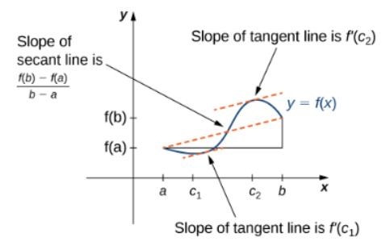

Figure 4.2.5: The Mean Value Theorem says that for a function that meets its conditions, at some point the tangent line has the same slope as the secant line between the ends. For this function, there are two values  $c_1$  and  $c_2$  such that the tangent line to f at  $c_1$  and  $c_2$  has the same slope as the secant line.

## # Polynomial function is continuous function

## Example 4.2.1: Using Rolle's Theorem

For each of the following functions, verify that the  $\underline{\text{function}}$  satisfies the criteria stated in Rolle's theorem and find all values c in the given interval where f'(c) = 0.

a. 
$$f(x)=x^2+2x$$
 over  $\left[-2,0\right]$ 

b. 
$$f(x)=x^3-4x$$
 over  $[-2,2]$ 

## Solution

a. Since f is a polynomial, it is continuous and  $\underline{\text{differentiable}}$  everywhere. In addition, f(-2)=0=f(0). Therefore, f satisfies the criteria of Rolle's theorem. We conclude that there exists at least one value  $c\in (-2,0)$  such that f'(c)=0. Since f'(x)=2x+2=2(x+1), we see that f'(c)=2(c+1)=0 implies c=-1 as shown in the following graph.

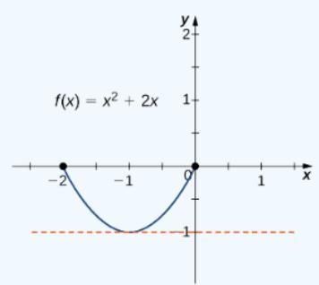

Figure 4.2.3: This  $\underline{\text{function}}$  is continuous and  $\underline{\text{differentiable}}$  over [-2,0], f'(c)=0 when c=-1.

Activate Win

## ### Example:

b. As in part a. f is a polynomial and therefore is continuous and <u>differentiable</u> everywhere. Also, f(-2)=0=f(2). That said, f satisfies the criteria of Rolle's theorem. Differentiating, we find that  $f'(x)=3x^2-4$ . Therefore, f'(c)=0 when  $x=\pm\frac{2}{\sqrt{3}}$ . Both points are in the interval [-2,2], and, therefore, both points satisfy the conclusion of Rolle's theorem as shown in the following graph.

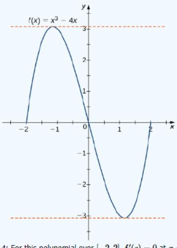

Figure 4.2.4: For this polynomial over [-2,2], f'(c)=0 at  $x=\pm 2/\sqrt{3}.$ 

Suppose we are asked to determine whether Rolle's theorem can be applied to  $f(x)=x^4-2x^2$  on the closed interval [-2,2]. And if so, find all values of c in the interval that satisfy the theorem's conclusion.

#### Step 1:

Okay, so first, we will check to see that f(x) is a continuous and differentiable function on the interval. Since  $f(x)=x^4-2x^2$  is a polynomial function, then f(x) is continuous and differentiable.

#### Step 2:

Now, we must verify that the y-values at the endpoints are the same.

$$f(-2) = (-2)^4 - 2(-2)^2 = 8$$
  
 $f(2) = (2)^4 - 2(2)^2 = 8$ 

## Step 3:

Because they both yield the same y-value of 8, we know that all requirements are satisfied, which means we can now find all values of c within the open interval (-2,2) where f'(x) = 0.

$$f'(x) = 4x^3 - 4x \ 4x^3 - 4x = 0 \ 4x\left(x^2 - 1\right) = 0$$

$$4x(x-1)(x+1) = 0$$
  
 $x = 0, 1, -1$ 

Therefore, by using this process, we have found three values where the slope of the tangent line is zero within the interval!

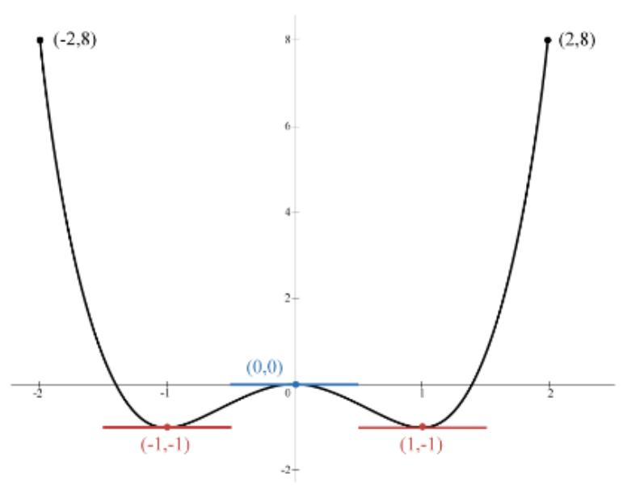

Calcworkshop.com

Rolles Theorem Closed Interval Max Min

## ###### Successive Differentiation and Leibnitz's Theorem

# SUCCESSIVE DIFFERENTIATION AND LEIBNITZ'S THEOREM

## 1.1 Introduction

Successive Differentiation is the process of differentiating a given function successively n times and the results of such differentiation are called successive derivatives. The higher order differential coefficients are of utmost importance in scientific and engineering applications.

Let f(x) be a differentiable function and let its successive derivatives be denoted by  $f'(x), f''(x), ..., f^{(n)}(x)$ .

Common notations of higher order Derivatives of y = f(x)

1<sup>st</sup> Derivative: 
$$f'(x)$$
 or  $y'$  or  $y_1$  or  $\frac{dy}{dx}$  or  $Dy$ 

2<sup>nd</sup> Derivative: 
$$f''(x)$$
 or  $y''$  or  $y_2$  or  $\frac{d^2y}{dx^2}$  or  $D^2y$ 

 $n^{th}$  Derivative:  $f^{(n)}(x)$  or  $y^{(n)}$  or  $y_n$  or  $\frac{d^ny}{dx^n}$  or  $D^ny$ 

## **Differences in Chains:**

Allow  $y = x^5$  to be the case.

 $f'(x) = 5x^4$  for the first differentiation

 $F''(x) = 54x^3 = 20x^3$  for the second differentiation

 $f'''(x) = 543x^2 = 60x^2$  for the third differentiation

fv(x) = 5432x = 120x for the fourth differentiation

fv(x) = 543221 = 120 is the fifth differentiation.

fvi(x) = 0 when it comes to sixth differentiation.

# What is Successive Differentiation, and how does it work?

Successive differentiation is a process of deriving higher-order derivatives from a function by sequentially differentiating it.

- 1. If y = f(x) is a function of x, then dy/dx or dy or f'(x) or y1 is the derivative of y with respect to x. The first-order derivatives of y are this.
- 2. If dy/dx is differentiated again, y = f(x) is derivable double with respect to x, then  $d2y/dx^2$  or d2y or f''(x) or  $y^2$  is the derivative of dy/dx with regard to x. The 2nd derivative of y is this.
- 3. If  $d^2y/dx^2$  is differentiated twice, y = f(x) is derivable three with respect to x, then  $d^3y/dx^3$  or  $d^3y$  or f'''(x) or  $y^3$  is the derivative of  $d^2y/dx^2$  with respect to x.

The 3rd derivative of y is what it's called.

Similarly, the successive derivatives may be found, and the nth derivative of y can be found by differentiating a given function n times with respect to x.

For the consecutive derivatives of y with respect to x, the following notations are commonly used.

Q.2. Find  $y_2$  for the following function  $y = \log x + a^x$ .

Ans: Given that, we have  $y = \log x + a^x$ 

Now, differentiate with respect to x, then we get:

$$y_1 = \frac{dy}{dx} = \frac{1}{x} + a^x \cdot \log(a)$$

$$\Rightarrow y_1 = \frac{1}{x} + a^x \log(a)$$

Again, differentiate with respect to x, then we get:

$$y_2 = \frac{d}{dx} \left( \frac{dy}{dx} \right) = \frac{d^2y}{dx^2} = -\frac{1}{x^2} + \log a \cdot \frac{d}{dx} (a^x)$$

$$\Rightarrow y_2 = -\frac{1}{x^2} + \log a \cdot a^x \cdot \log a$$

$$\Rightarrow y_2 = -\frac{1}{x^2} + a^x (\log a)^2$$

## Solved Examples – Successive Differentiation

Q.1. Find  $y_2$  for the following function  $y = e^{3x+2}$ .

*Ans:* Given that, we have  $y=e^{3x+2}\ldots (i)$ 

Now, differentiate with respect to x, then we get:

$$y_1 = \frac{dy}{dx} = e^{3x+2} \cdot \frac{d}{dx} (3x+2)$$

$$\Rightarrow y_1 = e^{3x+2}(3)$$

$$\Rightarrow y_1 = 3e^{3x+2}\dots(ii)$$

Again, differentiate with respect to x, then we get:

$$y_2 = \frac{d}{dx} \left( \frac{dy}{dx} \right) = \frac{d^2y}{dx^2} = 3 \left[ e^{3x+2} \right] \cdot \frac{d}{dx} (3x+2)$$

$$\Rightarrow y_2 = 3 \cdot \left(e^{3x+2}\right) \cdot (3)$$

$$\Rightarrow y_2 = 9e^{3x+2}$$

$$\therefore y_2 = 9y$$
 [using (i)]

## 1.2 Calculation of nth Derivatives

i.  $n^{th}$  Derivative of  $e^{ax}$ 

Let 
$$y = e^{ax}$$
  
 $y_1 = ae^{ax}$   
 $y_2 = a^2e^{ax}$   
 $\vdots$   
 $y_n = a^n e^{ax}$ 

ii.  $n^{th}$  Derivative of  $(ax + b)^m$ , m is a +ve integer greater than n

Let 
$$y = (ax + b)^m$$
  
 $y_1 = m a(ax + b)^{m-1}$   
 $y_2 = m(m-1)a^2(ax + b)^{m-2}$   
:  
:  
:  
:  
:  
:  
:  
:  
:  
:  
:  
:  
:  

$$=\frac{m!}{(m-n)!}a^n(ax+b)^{m-n}$$

iii.  $n^{th}$  Derivative of  $y = \log(ax + b)$ 

Let 
$$y = \log(ax + b)$$
  
 $y_1 = \frac{a}{(ax+b)}$   
 $y_2 = \frac{-a^2}{(ax+b)^2}$   
 $y_3 = \frac{2! a^3}{(ax+b)^3}$   
:  
:  
:  
:  
:  
:

iv.  $n^{th}$  Derivative of  $y = \sin(ax + b)$ 

Let 
$$y = \sin(ax + b)$$
  
 $y_1 = a\cos(ax + b) = a\sin\left(ax + b + \frac{\pi}{2}\right)$   
 $y_2 = a^2\cos\left(ax + b + \frac{\pi}{2}\right) = a^2\sin\left(ax + b + \frac{2\pi}{2}\right)$   
:  
:  
:  
:  
:  
:  
:  
:  
:  
:  
:  
:  
:  

v.  $n^{th}$  Derivative of  $y = e^{ax} \sin(ax + b)$ 

Let 
$$y = e^{ax} \sin(bx + c)$$
  
 $y_1 = a e^{ax} \sin(bx + c) + e^{ax} b \cos(bx + c)$   
 $= e^{ax} [a \sin(bx + c) + b \cos(bx + c)]$   
 $= e^{ax} [r \cos a \sin(bx + c) + r \sin a \cos(bx + c)]$   
Putting  $a = r \cos a$ ,  $b = r \sin a$   
 $= e^{ax} r \sin(bx + c + a)$   
Similarly  $y_2 = e^{ax} r^2 \sin(bx + c + 2a)$   
 $\vdots$   
 $y_n = e^{ax} r^n \sin(bx + c + na)$   
where  $r^2 = a^2 + b^2$  and  $\tan a = \frac{b}{a}$   
 $\therefore y_n = e^{ax} (a^2 + b^2)^{\frac{n}{2}} \sin(bx + c + n \tan^{-1} \frac{b}{a})$   
Similarly if  $y = e^{ax} \cos(ax + b)$   
 $y_n = e^{ax} r^n \cos(bx + c + na)$   
 $= e^{ax} (a^2 + b^2)^{\frac{n}{2}} \cos(bx + c + n \tan^{-1} \frac{b}{a})$ 

## Leibnitz Theorem Formula

Suppose there are two functions u(t) and v(t), which have the derivatives up to nth order. Let us consider now the derivative of the product of these two functions.

The first derivative could be written as;

$$(uv)' = u'v + uv'$$

Now if we differentiate the above expression again, we get the second derivative;

(uv)"

= [(uv)']'

= (u'v+uv')'

= (u'v)'+(uv')'

= u''v + u'v' + u'v' + uv''

= u''v + 2u'v' + uv''

Similarly, we can find the third derivative;

(uv)"

= [(uv)'']'

= (u''v + 2u'v' + uv'')'

= (u''v)' + (2u'v')' + (uv'')'

= u'''v + u''v' + 2u''v' + 2u'v'' + u'v'' + uv'''

= u"'v + 3u"v' + 3u'v" + uv"'

Now if we compare these expressions, it is found very similar to binomial expansion raised to the exponent. If we consider the terms with zero exponents,  $u^0$  and  $v^0$  which correspond to the functions u and v themselves, we can generate the formula for nth order of the derivative product of two functions, in a such a way that;

$$(uv)^n = \sum_{i=0}^n \binom{n}{i} u^{(n-i)} v^i$$

Where  $\binom{n}{i}$  represents the number of i-combinations on n elements.

## Leibnitz Theorem Proof

Assume that the functions u(t) and v(t) have derivatives of (n+1)th order. By recurrence relation, we can express the derivative of (n+1)th order in the following manner:

$$y^{(n+1)} = \left[y^{(n)}\right]' = \left[\left(uv\right)^{(n)}\right]' = \left[\sum_{i=0}^n \binom{n}{i} u^{(n-i)}v^{(i)}\right]'$$

Upon differentiating we get;

$$y^{(n+1)} = \sum_{i=0}^{n} \binom{n}{i} u^{(n-i+1)} v^{(i)} + \sum_{i=0}^{n} \binom{n}{i} u^{(n-i)} v^{(i+1)}$$

The summation on the right side can be combined together to form a single sum, as the limits for both the sum are the same. Now, let us take an intermediate index such that 1≤m≤n. So, when i = m, then the first term can be written as;

$$\left(\begin{array}{c} n\\m\end{array}\right)u^{(n-m+1)}v^{(m)}$$

The second term when i=m-1 will be:

$$\binom{n}{m-1}u^{(n-(m-1))}v^{((m-1)+1)}=\binom{n}{m-1}u^{(n-m+1)}v^{(m)}$$

On adding these two terms, we get;

$$\left( \begin{array}{c} n \\ m \end{array} \right) u^{(n-m+1)} v^{(m)} + \left( \begin{array}{c} n \\ m-1 \end{array} \right) u^{(n-m+1)} v^{(m)} = \left[ \left( \begin{array}{c} n \\ m \end{array} \right) + \left( \begin{array}{c} n \\ m-1 \end{array} \right) \right] \cdot u^{(n-m+1)} v^{(m)}.$$

We know from the concept of combinatorics that;

$$\left( \begin{array}{c} n \\ m \end{array} \right) + \left( \begin{array}{c} n \\ m-1 \end{array} \right) = \left( \begin{array}{c} n+1 \\ m \end{array} \right)$$

Based on the above concept, we can write the sum of these two terms, when i = m and when i = m-1, as;

$$\left[ \left( \begin{array}{c} n \\ m \end{array} \right) + \left( \begin{array}{c} n \\ m-1 \end{array} \right) \right] \cdot u^{(n-m+1)} v^{(m)} = \left( \begin{array}{c} n+1 \\ m \end{array} \right) u^{(n+1-m)} v^{(m)}.$$

## Solved Examples on Leibnitz Rule

Example 1: Let  $u(x)=3x^2+2x$  and  $v(x)=e^x$ . Using Leibniz's Rule, find the second derivative of the product  $u(x)\cdot v(x)$ .

Solution:

Let 
$$u(x) = 3x^2 + 2x$$
 and  $v(x) = e^x$   
 $u'(x) = 6x + 2$   
 $u''(x) = e^x$   
 $v''(x) = e^x$   
 $V''(x) = e^x$   
Applying Leibniz's Rule  
 $(uv)'' = 6e^x + 2(6x + 2)e^x + (3x^2 + 2x)e^x$   
On simplifying the expression we get,  
 $(uv)'' = 12e^x + (3x^2 + 14x + 2)e^x$ 

Example 2: Consider the functions  $f(x)=\sin(x)$  and  $g(x)=x^2$ . Determine the third derivative of the product  $f(x) \cdot g(x)$  using Leibniz's Rule.

## Solution:

```
Consider f(x) = \sin(x) and g(x) = x^2

f'(x) = \cos(x)

f'''(x) = -\sin(x)

f''''(x) = -\cos(x)

g'(x) = 2x

g'''(x) = 2

g'''(x) = 0

Applying Leibniz's Rule

(fg)''' = -\cos(x) \cdot x^2 + 3(-\sin(x) \cdot 2x) + 3(\cos(x) \cdot 2)

On simplifying the expression we get,

(fg)''' = -x^2\cos(x) - 6x\sin(x) + 6\cos(x)
```

From the above expression, we can see when the value of m changes from 1 to n, this generated combination will cover all the terms from i=1 to i=n, but not i=0 in the first term and i=1 in the second term which are equal to;

$$\left(\begin{array}{c} n \ 0 \end{array}\right) u^{(n-0+1)} v^{(0)} = u^{(n+1)} v^{(0)},$$

$$\binom{n}{n}u^{(n-n)}v^{(n+1)}=u^{(0)}v^{(n+1)}$$

Hence, the resulted derivative of (n+1)th order of the product of two functions is given by;

$$\begin{split} y^{(n+1)} &= u^{(n+1)} v^{(0)} + \sum_{m=1}^{n} \binom{n+1}{m} u^{(n+1-m)} v^{(m)} + u^{(0)} v^{(n+1)} \\ &= \sum_{m=0}^{n+1} \binom{n+1}{m} u^{(n+1-m)} v^{(m)}. \end{split}$$

Hence, we have derived here the Leibnitz formula.

## Prcatice Problems on Leibnitz Theorem

**Problem 1:** Find the  $n^{th}$  derivative of  $f(x)=x^3 \sin(x)$ .

Problem 2: For the function  $g(x)=e^x \cos(x)$ , find the coefficients of the nth derivative at x=0.

**Problem 3:** Apply Leibniz's Theorem to find the  $x^4$  term in the expansion of  $(1+x)^5$ .

**Problem 4:** Approximate the value of  $\sqrt{1.1}$  using Leibniz's Theorem with a third-degree Taylor polynomial centered at x=1. Estimate the error in your approximation.

## ##### McLaurin series & Problems Solving

The Maclaurin series is a power series that uses succ of these derivatives when the input is equal to zero. **The Maclaurin series** is another polynomial approximation of a function. In fact, it is a special case of a Taylor series where each of the successive derivatives is evaluated at x=0. Simply put, the Maclaurin series is the Taylor series of the function at x=0.

Examples of Maclaurin series 
$$e^x=\sum_{n=0}^\infty \frac{x^n}{n!} = 1+\frac{x}{1!}+\frac{x^2}{2!}+\frac{x^3}{3!}+\dots = (-1)^n\sum_{n=0}^\infty \frac{x^{2n+1}}{(2n)!} = x-\frac{x^3}{3!}+\frac{x^5}{5!}-\frac{x^7}{7!}+\dots = 1+x+x^2+x^3+\dots$$

These are just three examples of functions along with their Maclaurin series. The first equation shows the Maclaurin series of each of the functions in sigma notation while the second highlights the first three terms of each of the series.

## **Understanding the Maclaurin series formula**

As we have mentioned, the Maclaurin series is a special case of the Taylor series. Let's begin by recalling the general form of the function's Taylor series.

$$\begin{align} f(x) &= \sum_{n=0}^{\infty} \frac{f^{(n)}(c)}{n!} (x{-}c)^n \ &= f(c) + \frac{f'(c)}{1!} (x{-}c) + \frac{f''(c)}{2!} (x{-}c)^2 + \frac{f'''(c)}{3!} (x{-}c)^3 + \dots \end{array}$$

The Maclaurin series formula is simply the resulting expression when c=0. Hence, we have the Maclaurin series formula as shown below.

## **MACLAURIN SERIES FORMULA**

$$f(x) = \sum_{n=0}^{\infty} \frac{f^{(n)}(0)}{n!} x^n$$
  
=  $f(0) + \frac{f'(0)}{1!} x + \frac{f''(0)}{2!} x^2 + \frac{f'''(0)}{3!} x^3 + \dots$ 

This means that we can find the polynomial approximation for the function, f(x), using the Maclaurin series and the succeeding derivatives of f(x) evaluated at 0.

## How to find a Maclaurin series?

Now that we know the general form of the Maclaurin series, we can try writing the Maclaurin series of different functions. Before we do so, check out the following pointers that may help you:

- Take the three succeeding derivatives of f(x).
- · Feel free to find more terms by differentiating the succeeding expressions as well.
- Evaluate f(x), f'(x), f''(x), f'''(x), and more at x=0.
- Write down the functions' Maclaurin series by adding the resulting terms.

To check our current understanding, why don't we confirm that  $f(x)=e^x$  is equal to  $1+\frac{x}{1!}+\frac{x^2}{2!}+\frac{x^3}{3!}+\ldots$ ? We can also confirm that the Maclaurin series' sigma notation is  $\sum_{n=0}^{\infty}\frac{x^n}{n!}.$ 

Let's begin by differentiating  $e^x$  three times in a row using the derivative rule,  $\frac{d}{dx}e^x$ . Afterwards, evaluate f(0), f'(0), f''(0), and f'''(0).

| $f^{(n)}(x)$     | $f^{(n)}(0)$   |
|------------------|----------------|
| $f(x)=e^x$       | f(0)=1         |
| $f'(x)=e^x$      | f'(0)=1        |
| $f''(x)=e^x$     | f''(0)=1       |
| $f'''(x)=e^x$    | f'''(0)=1      |
|                  |                |
| $f^{(n)}(x)=e^x$ | $f^{(n)}(0)=1$ |

Substitute these expressions into the Maclaurin series formula to find the approximation for  $y=e^x$ .

$$e^{x} = f(0) + \frac{f'(0)}{1!}x + \frac{f''(0)}{2!}x^{2} + \frac{f'''(0)}{3!}x^{3} + \dots + \frac{f^{(n)}(0)}{n!} + \dots$$

$$= 1 + \frac{1}{1!}x + \frac{1}{2!}x^{2} + \frac{1}{3!}x^{3} + \dots + \frac{1}{n!}x^{n} + \dots$$

$$= 1 + x + \frac{x^{2}}{2} + \frac{x^{3}}{6} + \dots + \frac{x^{n}}{n!} + \dots$$

We can write this series in sigma notation using the nth term of the Maclaurin series. Hence, we have  $f(x) = e^x = \sum_{n=0}^{\infty} \frac{x^n}{n!}$ . Apply a similar process when writing the Maclaurin series of different functions. When you're ready, head over to the sample problems below to master this topic!

#### Example 1

Find the Maclaurin series of  $f(x)=\sin x$  up to its fourth-order then write the Maclaurin series in sigma notation.

## Solution

Differentiate  $f(x) = \sin x$  four times in a row to find the expressions for f'(x), f^{\prime\prime }(x), f^{\tau} \prime \prime \prime \( x), f^{\tau} \), and f'(x). Use the derivative rules for sine and cosine as shown below.

$$\frac{d}{dx}\sin x = \cos x$$
$$\frac{d}{dx}\cos x = -\sin x$$

Evaluate each resulting expressions at  $\boldsymbol{x}=0$ . The table below summarizes our calculation.

| $f^{(n)}(x)$          | $f^{(n)}(0)$     |
|-----------------------|------------------|
| $f(x) = \sin x$       | f(0)=0           |
| $f'(x) = \cos x$      | f'(0)=1          |
| $f''(x) = -\sin x$    | f''(0)=0         |
| $f'''(x) = -\cos x$   | f'''(0)=-1       |
| $f^{(4)}(x) = \sin x$ | $f^{(4)}(0) = 0$ |

The derivatives and their values when x=0 will repeat its cycle for each four consecutive terms. Let's show you the next four terms of the series to show you what we mean:

| $f^{(n)}(x)$           | $f^{(n)}(0)$      |
|------------------------|-------------------|
| $f^{(5)}(x)=\cos x$    | $f^{(5)}(0)=1$    |
| $f^{(6)}(x) = -\sin x$ | $f^{(6)}(0)=0$    |
| $f^{(7)}(x)=-\cos x$   | $f^{(7)}(0) = -1$ |
| $f^{(8)}(x) = \sin x$  | $f^{(8)}(0)=0$    |

Notice that when n is even,  $f^{(n)}(0)$  is zero? This means that when we use the Maclaurin series formula, we'll be skipping the even powers. Let's go ahead and confirm this by using the expressions shown in the two tables.

$$\begin{aligned} \sin x &= f(0) + \frac{f'(0)}{1!}x + \frac{f''(0)}{2!}x^2 + \frac{f'''(0)}{3!}x^3 + \frac{f^{(4)}(0)}{4!}x^4 \\ &+ \frac{f^{(5)}(0)}{5!}x^5 + \frac{f^{(6)}(0)}{6!}x^6 + \frac{f^{(7)}(0)}{7!}x^7 + \frac{f^{(8)}(0)}{8!}x^8 + \dots \\ &= 0 + \frac{1}{1!}x + \frac{0}{2!}x^2 + \frac{-1}{3!}x^3 + \frac{0}{4!}x^4 + \frac{1}{5!}x^5 + \frac{0}{6!}x^6 + \frac{-1}{7!}x^7 + \frac{0}{8!}x^8 + \dots \\ &= x - \frac{x^3}{3!} + \frac{x^5}{5!} - \frac{x^7}{7!} + \dots \end{aligned}$$

This means that we're only dealing with odd powers, so we're only concerned with powers that can be expressed as (2n+1). Since the operation alternates from negative to positive, the sigma notation will have a factor of  $(-1)^n$ .

$$\sin x = x - \frac{x^3}{3!} + \frac{x^5}{5!} - \frac{x^7}{7!} + \dots$$
$$= \sum_{n=0}^{\infty} (-1)^n \frac{x^{2n+1}}{(2n+1)!}$$

Hence, we've shown the Maclaurin series of  $\sin x$  as well as its sigma notation.

#### Example 2

Use the result from the previous example to find the Maclaurin series of  $g(x) = x \sin x$ . Finalize your answer by writing the Maclaurin series in sigma notation.

#### Solution

From the previous example, we have  $\sin x = x - \frac{x^3}{3!} + \frac{x^5}{5!} - \frac{x^5}{7!} + \dots$  To find the Maclaurin expansion of  $g(x) = x \sin x$ , simply multiply the expansion by x.

$$g(x) = x \sin x$$

$$= x \left( x - \frac{x^3}{3!} + \frac{x^5}{5!} - \frac{x^7}{7!} + \dots \right)$$

$$= x^2 - \frac{x^4}{3!} + \frac{x^6}{5!} - \frac{x^8}{7!} + \dots$$

Let's now work on g(x)'s sigma notation given that  $\sin x = \sum_{n=0}^{\infty} (-1)^n \frac{x^{2n+1}}{(2n+1)!}$ 

$$\begin{split} g(x) &= x \sin x \\ &= x \left( \sum_{n=0}^{\infty} (-1)^n \frac{x^{2n+1}}{(2n+1)!} \right) \\ &= \sum_{n=0}^{\infty} (-1)^n \frac{x \cdot x^{2n+1}}{(2n+1)!} \\ &= \sum_{n=0}^{\infty} (-1)^n \frac{x^{2(n+1)}}{(2n+1)!} \end{split}$$

This example highlights the fact that we can use common functions' Maclaurin series expansions to find the Maclaurin series of more complex functions.

## **Practice Questions**

- 1. Find the Maclaurin series of  $f(x)=e^{-x}$  up to its fourth-order. Write the Maclaurin series in sigma notation as well.
- 2. Find the Maclaurin series of  $f(x)=e^{2x}$  up to its fourth-order then write the Maclaurin series in sigma notation.
- 3. Find the Maclaurin series of  $f(x)=\cos x$  up to its fourth-order then write the Maclaurin series in sigma notation.
- 4. Use the result from the previous problem to find the Maclaurin series of  $g(x) = x \cos x$ . Finalize your answer by writing the Maclaurin series in sigma notation.
- 5. What is the seventh Maclaurin polynomial of  $f(x)=\sin(3x)$ ? Use the result to approximate  $\sin\left(\frac{\pi}{2}\right)$ .
- 6. Use the fifth Maclaurin polynomial for  $f(x) = \sin x$  to approximate  $\sin \left( \frac{\pi}{12} \right)$ .

## Worked example

a) Use the Maclaurin series formula to find the Maclaurin series for  $f(x) = \sqrt{1 + 2x}$  up to and including the term in  $x^4$ .

$$f(x) = \sqrt{1+2x} = (1+2x)^{\frac{1}{2}}$$
STEP 1:  $f(0) = 1$   $f'(0) = 1$   $f''(0) = -1$ 

$$f'''(0) = 3$$
  $f^{(4)}(0) = -15$ 

STEP 2:  $f(x) = 1 + x(1) + \frac{x^2}{2!}(-1) + \frac{x^3}{3!}(3) + \frac{x^4}{4!}(-15) + ...$ 

STEP 3: Up to the  $x^4$  term,
$$\sqrt{1+2x} = 1 + x - \frac{1}{2}x^2 + \frac{1}{2}x^3 - \frac{5}{8}x^4$$

b) Use your answer from part (a) to find an approximation for the value of √1.02, and compare the approximation found to the actual value of the square root.

Up to the x4 term,
$$\sqrt{1+2x} = 1+x-\frac{1}{2}x^2+\frac{1}{2}x^3-\frac{5}{8}x^4$$
from part (a)

Let x = 0.01. Then 
$$\sqrt{1+2x} = \sqrt{1+2(0.01)} = \sqrt{1.02}$$
.

$$\int_{1.02}^{1.02} \approx 1 + (0.01) - \frac{1}{2}(0.01)^2 + \frac{1}{2}(0.01)^3 - \frac{5}{8}(0.01)^4$$

The exact value of the square root is 
$$\sqrt{1.02} = 1.009950493836...$$

## Example

Write the Maclaurin series for the function  $f(x) = \ln(1+x)$ .

## Solution

Step 1: Start this by taking the derivatives of f(x):

$$f(x) = \ln(1+x)$$

$$f'(x) = \frac{1}{1+x}$$

$$f''(x) = -\frac{1}{(1+x)^2}$$

$$f'''(x) = \frac{2}{(1+x)^3}$$

$$f^{(4)}(x) = -\frac{6}{(1+x)^4}$$

Analyzing the derivatives, we can identify the following pattern for n > 0:

$$f^{(n)}(x) = (-1)^{n-1} \frac{(n-1)!}{(1+x)^n}$$

Step 2: Evaluate each derivative at x=0

$$f(0) = 0$$

$$f'(0) = 1$$

$$f''(0) = -1$$

$$f'''(0) = 2$$

$$f^{(4)}(0) = -6$$

$$f^{(n)}(0) = (-1)^{n-1}(n-1)!$$

Step 3: Apply these results to the Maclaurin series formula:

$$M_f(x) = 0 + 1 \cdot x + \frac{-1}{2!}x^2 + \frac{2!}{3!}x^3 + \frac{-3!}{4!}x^4 + \cdots$$

· Simplifying it:

$$M_f(x) = x - \frac{x^2}{2} + \frac{x^3}{3} - \frac{x^4}{4} + \cdots$$

· In sigma notation, we have

$$M_f(x) = \sum_{n=1}^{\infty} (-1)^{n-1} \frac{x^n}{n},$$

## #### Solve the following example.

Find a power series expansion for the function  $f(x) = x^2 e^x$  centered at x = 0.

Solution:

In order to solve this, let's start by writing the Maclaurin series expansion of  $g(x)=e^{x}$ , since this is centered at x=0:

**Step 1:** First, let's consider the derivatives of g(x), as this is the function  $e^x$  this is easy:

$$g^{(n)}(x) = e^x, \forall n \geq 0$$

Step 2: Evaluate the derivatives at x=0

$$g^{(n)}(0) = 1$$

Step 3: Apply the result in the Maclaurin series formula

$$M_g(x) = \sum_{n=0}^{\infty} \frac{1}{n!} x^n$$

Therefore we have:

$$g(x) = \sum_{n=0}^{\infty} \frac{x^n}{n!}$$

We can easily calculate the interval of convergence, which is  $(-\infty, +\infty)$ .

• Now consider that  $f(x) = x^2 \cdot g(x)$ :

$$f(x) = x^2 \cdot \sum_{n=0}^{\infty} \frac{x^n}{n!}$$

· Simplifying it we have

$$f(x) = \sum_{n=0}^{\infty} \frac{x^2 \cdot x^n}{n!}$$

$$f(x) = \sum_{n=0}^{\infty} \frac{x^{n+2}}{n!}$$

Hence the power series expansion for the function  $f(x)=x^2e^x$  centered at x=0 is

$$f(x) = \sum_{n=0}^{\infty} \frac{x^{n+2}}{n!}$$

## What Is Taylor Series Formula?

The Taylor series formula helps to expand a function around a value of the variable using the derivatives of the function. It can be represented as,

$$\begin{split} f(x) &= f(a) + f'(a) \; (x-a) + \left[ \; \frac{f^{''}(a)}{2!} \; (x-a)^2 \right] + \left[ \frac{f^{''}(a)}{3!} \; (x-a)^3 \right] + ..... + \left[ \; \frac{f^{(n)}(a)}{n!} \; (x-a)^n \right] \end{split}$$

OR

$$f(x) = \sum_{n=0}^{\infty} \frac{f^{(n)}a}{n!} \times (x-a)^n$$

Here,

- f(x) = Real or complex-valued function, that is infinitely differentiable at a real or complex number "a" is the power series
- n = Total number of terms in the series

## Taylor Series Formula

$$f(x) - f(a) + f'(a)(x-a) + \left[\frac{f''(a)}{2!}(x-a)^2\right] + \left[\frac{f'''(a)}{3!}(x-a)^3\right] + ... + \left[\frac{f^{(n)}(a)}{n!}(x-a)^n\right]$$

OR

$$f(x) = \sum_{n=0}^{\infty} \frac{f^{(n)}a}{n!} \times (x-a)^n$$

## **##### Derivation of Tailor's Series Expansion**

$$f(x) = c_0 + c_1(x - a) + c_2(x - a)^2 + c_3(x - a)^3 + c_4(x - a)^4 + \dots$$

$$f'(x) = c_1 + 2c_2(x - a) + 3c_3(x - a)^2 + 4c_4(x - a)^3 + \dots$$

$$f''(x) = 2c_2 + 3 \cdot 2c_3(x - a) + 4 \cdot 3c_4(x - a)^2 + \dots$$

$$f'''(x) = 3 \cdot 2c_3 + 4 \cdot 3 \cdot 2c_4(x - a) + \dots$$

$$f''''(x) = 4 \cdot 3 \cdot 2c_4 + 5 \cdot 4 \cdot 3c_5(x - a) + \dots$$

$$f'''(a) = c_0 \qquad f'''(a) = 2c_2 \qquad f^{(n)}(a) = 4 \cdot 3 \cdot 2c_4$$

$$f''(a) = c_1 \qquad f''''(a) = 3 \cdot 2c_3$$

$$The generally \qquad f^{(n)}(a) = n! \quad c_n \qquad n = 0,1,2,\dots$$

$$C_n = \frac{f^{(n)}(a)}{n!}$$

**Now, putting the value of the values of C, we get the desire expansion formula.**

$$f(x) = \sum_{n=0}^{\infty} \frac{f^{(n)}(a)}{n!} (x-a)^n$$

$$= f(a) + f'(a) (x-a) + \frac{f''(a)}{2!} (x-a)^2 + \frac{f'''(a)}{3!} (x-a)^3 + \cdots$$

**We can express above as a summation,**

$$f(x) = \sum_{n=0}^{\infty} \frac{f^{(n)}a}{n!} \times (x - a)^n$$

**Example 1:** Find the expansion for the function, f(x) = 2x

 $2x^2$  centered at a = -3 using the Taylor series formula.

## Solution:

To find: Taylor series for the given function

Given:

Function,  $f(x) = 2x - 2x^2$ 

Center at a = -3

$$P_n(x) = f(a) + f'(a)(x - a) + f''(a)/2! \times (x - a)^2 + f'''(a)/3! \times (x - a)^3 + f^{(4)}$$

$$(a)/4! \times (x - a)^4 + ... + f^{(n)}(a)/n! \times (x - a)^n$$

Function and its derivatives.

$$f(x) = 2x - 2x^2$$

$$f'(x) = 2 - 4x$$

$$f''(x) = -4$$

$$f'''(x) = 0$$

Since a = -3 and n = 3, the required expansion is:

$$f(x) = f(-3) + f'(-3)(x - (-3)) + f''(-3)/2! \times (x - (-3))^2 + f'''(-3)/3! \times (x - (-3))^3$$

$$f(x) = f(-3) + f'(-3)(x+3) + f''(-3)/2! \times (x+3)^2 + f'''(-3)/3! \times (x+3)^3$$

We evaluate the function and its derivatives at x = a = -3:

$$f(-3) = 2(-3) - 2(-3)^2 = -24$$

$$f'(-3) = 2 - 4(-3) = 14$$

$$f''(-3) = -4$$

f'''(-3) = 0 and all the derivatives from here onwards are zeros.

Taylor series expansion for the given function:

$$P_3(x) = -24 + 14(x + 3) - 4/2!(x + 3)^2 - 0/3!(x + 3)^3$$

$$P_3(x) = -24 + 14(x + 3) - 2(x + 3)^2$$

**Answer:** Taylor series expansion around a = -3 for the function f(x) =

$$2x - 2x^2$$
 is  $-24 + 14(x + 3) - 2(x + 3)^2$ .

**Example 2:** Find the Taylor series expansion for function,  $f(x) = \cos x$ , centred at x = 0.

## Solution:

To find: Taylor series expansion

Given:

Function, f(x) = Cos x

Using Taylor series formula,

$$f(x) = f(a) + f'(a)(x - a) + f''(a)/2! \times (x - a)^2 + f'''(a)/3! \times (x - a)^3 + f^{(4)}$$

$$(a)/4! \times (x - a)^4 + ... + f^{(n)}(a)/n! \times (x - a)^n$$

We evaluate the function and its derivatives:

$$f(x) = cos(x)$$

$$f'(x) = -\sin(x)$$

$$f''(x) = -\cos(x)$$

$$f'''(x) = \sin(x)$$

Thus,

$$cos(x) = cos(a) - sin(a)/1! (x - a) - cos(a)/2! (x - a)^2 + sin(a)/3! (x - a)^3 + ...$$

Now, put a = 0.

$$cos(x) = 1 - 0/1!(x - 0) - 1/2!(x - 0)^2 + 0/3!(x - 0)^3 + 1/4!(x - 0)^4 + ...$$

$$cos(x) = 1 - x^2/2! + x^4/4! - ...$$

**Answer:** Taylor series expansion for given function,  $cos(x) = 1 - x^2/2! + x^4/4! - ...$ 

## Example 3: Find the Taylor Series for $f(x) = x^3 - 10x^2 + 6$ at x=3.

Solution: First, let us find the derivatives of the given function.

$$f(x) = x^3 - 10x^2 + 6 \Rightarrow f(3) = -57$$

$$f'(x) = 3x^2 - 20x \Rightarrow f'(3) = 33$$

$$f''(x) = 6x - 20 \Rightarrow f''(3) = -2$$

$$f'''(x) = 6 \Rightarrow f'''(3) = 6$$

$$f''''(x) = 0$$

Thus, the required series is:

$$x^{3} - 10x^{2} + 6 = \sum_{n=0}^{\infty} \frac{f^{(n)}(3)}{n!} (x - 3)^{n}$$

$$= f(3) + f'(3)(x - 3) + \frac{f''(3)}{2!} (x - 3)^{2} + \frac{f'''(3)}{3!} (x - 3)$$

$$= -57 - 33(x - 3) - (x - 3)^{2} + (x - 3)^{3}$$

Answer: Taylor series expansion for given function is = -57 -

$$33(x-3) - (x-3)^2 + (x-3)^3$$

#### Example 1

Earlier, you were asked to determine the series coefficients  $a_n$  for  $f(x)=e^x=\sum_{n=1}^\infty a_nx^n$  by evaluating the series and four of its derivative at x=0. You were also asked about the relationship between the values of  $a_n$  and  $f^{(n)}(x=0)$ .

Were you able to figure this out? Just list the results:

$$f(0) = e^{0} = 1 = \sum_{n=0}^{\infty} a_{n}x^{n} = a_{0} \Rightarrow a_{0} = f(0) = 1,$$

$$f'(0) = e^{0} = 1 = \sum_{n=1}^{\infty} na_{n}x^{n-1} = a_{1} \Rightarrow a_{1} = \frac{f'(0)}{1} = 1,$$

$$f''(0) = e^{0} = 1 = \sum_{n=2}^{\infty} n(n-1)a_{n}x^{n-2} = 2a_{2} \Rightarrow a_{2} = \frac{f''(0)}{2} = \frac{1}{2},$$

$$f'''(0) = e^{0} = 1 = \sum_{n=3}^{\infty} n(n-1)(n-2)a_{n}x^{n-3} = 6a_{3} \Rightarrow a_{3} = \frac{f'''(0)}{6} = \frac{1}{3!},$$

$$f^{(4)}(0) = e^{0} = 1 = \sum_{n=4}^{\infty} n(n-1)(n-2)(n-3)a_{n}x^{n-4} = 24a_{4} \Rightarrow a_{4} = \frac{f^{(4)}(0)}{24} = \frac{1}{4!}.$$

Do you see the pattern? The function can be written as:

$$f(x)=e^x=\sum_{n=1}^\infty a_nx^n=1+x+\frac{1}{2!}x^2+\frac{1}{3!}x^3+\frac{1}{4}x^4+\cdots=\sum_{n=0}^\infty\frac{x^n}{n!}a_n \text{ . This is how Maclaurin series are generated}.$$

#### Example 2

Find the power series representation of  $f(x)=\dfrac{1}{1-x}$  centered on:

The power series representation of  $f(x)=\frac{1}{1-x}$  at x=0 is the Maclaurin series given by  $M(x)=\sum_{n=0}^{\infty}\frac{f^{(n)}(0)}{n!}x^n$  .

Some of the required series coefficients are:

| $f^{(n)}(x)$                      | $f^{(n)}(x=0)$ |
|-----------------------------------|----------------|
| $f(x)=\frac{1}{1-x}$              | 1              |
| $f'(x) = \frac{1}{(1-x)^2}$       | 1              |
| $f''(x) = \frac{2}{(1-x)^3}$      | 2              |
| $f'''(x)=\frac{6}{(1-x)^4}$       | 6              |
| $f^{(4)}(x) = \frac{24}{(1-x)^5}$ | 24             |
| $f^{(5)}(x) = -\sin x$            | 0              |

The Maclaurin series of  $f(x)=\frac{1}{1-x}$  is:

The Maclaurin series of  $f(x) = \frac{1}{1-x}$  is:

$$M(x) = 1 + x + 2\frac{x^2}{2!} + 6\frac{x^3}{3!} + 24\frac{x^4}{4!} + \dots = \sum_{n=0}^{\infty} x^n.$$

This is the same power series representation introduced in the previous concept. It is a geometric series.

The power series representation of  $f(x)=\frac{1}{1-x}$  at x=2 is the Taylor series given by  $T(x)=\sum_{n=0}^{\infty}\frac{f^{(n)}(x_0)}{n!}(x-x_0)^n$ .

Some of the required series coefficients are:

| $f^{(n)}(x)$                      | $f^{(n)}(x=2)$ |  |
|-----------------------------------|----------------|--|
| $f(x)=\frac{1}{1-x}$              | -1             |  |
| $f'(x) = \frac{1}{(1-x)^2}$       | 1              |  |
| $f''(x)=\frac{2}{(1-x)^3}$        | -2             |  |
| $f'''(x) = \frac{6}{(1-x)^4}$     | 6              |  |
| $f^{(4)}(x) = \frac{24}{(1-x)^5}$ | -24            |  |

The Taylor series of  $f(x)=\cos x$  centered at  $x=\frac{\pi}{3}$  is:

EX 1 Find the Maclaurin series for  $f(x)=\cos x$  and prove it represents

$$f(x) = \cos x \text{ for all } x.$$

$$f'(x) = -\sin x \qquad f'(0) = \cos D = 1$$

$$f''(x) = -\cos x \qquad f''(0) = 0$$

$$f'''(x) = -\cos x \qquad f'''(0) = 0$$

$$f'''(x) = \sin x \qquad f'''(0) = 0$$

$$f'''(x) = \cos x \qquad f'''(0) = 1$$

$$\Rightarrow f(x) = f(0) + f'(0)x + \frac{f''(0)}{2}x^2 + \frac{f''(0)}{3!}x^2 + \frac{f'''(0)}{4!}x^4 + \dots$$

$$= [1 + 0 + \frac{1}{2}x^2 + 0 + \frac{x^4}{4!}x^4 - \frac{1}{4!}x^4 + \frac{1}{5!}x^5 - \frac{1}{10!}x^5 + \dots$$

$$= [-\frac{1}{2}x^2 + \frac{1}{4!}x^4 - \frac{1}{4!}x^4 + \frac{1}{5!}x^5 - \frac{1}{10!}x^5 + \dots$$

$$\cos x = \sum_{n=0}^{\infty} \frac{(-1)^n}{(2n)!} \qquad (\text{Maclaurin sories for } \cos x)$$
We need to show  $\lim_{n\to\infty} \ln(x) = 0$ .

(then we know this power sories represents  $\cos x$ )
$$(\text{then we know this power sories represents } \cos x$$

$$(\text{then do at Cool of this lecture}) \qquad \forall x$$

EX 2 Find the Maclaurin series for 
$$f(x) = \sin x$$
.

$$f(x) = \sin x$$

$$f'(x) = \cos x$$

$$f''(x) = \cos x$$

$$f'''(x) = -\sin x$$

$$f'''(x) = -\cos x$$

$$f''''(x) = -\cos x$$

$$f''''(x) = \sin x$$

$$f''''(x) = \sin x$$

$$f''''(x) = \sin x$$

$$f''''(x) = -\cos x$$

$$f''''(x) = -\cos x$$

$$f''''(x) = -\cos x$$

$$f''''(x) = -\cos x$$

$$f''''(x) = -\cos x$$

$$f''''(x) = -\cos x$$

$$f''''(x) = -\cos x$$

$$f''''(x) = -\cos x$$

$$f''''(x) = -\cos x$$

$$f''''(x) = -\cos x$$

$$f''''(x) = -\cos x$$

$$f''''(x) = -\cos x$$

$$f''''(x) = -\cos x$$

$$f''''(x) = -\cos x$$

$$f''''(x) = -\cos x$$

$$f''''(x) = -\cos x$$

$$f''''(x) = -\cos x$$

$$f''''(x) = -\cos x$$

$$f''''(x) = -\cos x$$

$$f''''(x) = -\cos x$$

$$f''''(x) = -\cos x$$

$$f''''(x) = -\cos x$$

$$f''''(x) = -\cos x$$

$$f''''(x) = -\cos x$$

$$f''''(x) = -\cos x$$

$$f''''(x) = -\cos x$$

$$f''''(x) = -\cos x$$

$$f''''(x) = -\cos x$$

$$f''''(x) = -\cos x$$

$$f''''(x) = -\cos x$$

$$f''''(x) = -\cos x$$

$$f''''(x) = -\cos x$$

$$f''''(x) = -\cos x$$

$$f''''(x) = -\cos x$$

$$f''''(x) = -\cos x$$

$$f''''(x) = -\cos x$$

$$f''''(x) = -\cos x$$

$$f''''(x) = -\cos x$$

$$f''''(x) = -\cos x$$

$$f''''(x) = -\cos x$$

$$f''''(x) = -\cos x$$

$$f''''(x) = -\cos x$$

$$f''''(x) = -\cos x$$

$$f''''(x) = -\cos x$$

$$f''''(x) = -\cos x$$

$$f''''(x) = -\cos x$$

$$f''''(x) = -\cos x$$

$$f''''(x) = -\cos x$$

$$f''''(x) = -\cos x$$

$$f''''(x) = -\cos x$$

$$f''''(x) = -\cos x$$

$$f''''(x) = -\cos x$$

$$f''''(x) = -\cos x$$

$$f''''(x) = -\cos x$$

$$f''''(x) = -\cos x$$

$$f''''(x) = -\cos x$$

$$f''''(x) = -\cos x$$

$$f''''(x) = -\cos x$$

$$f''''(x) = -\cos x$$

$$f''''(x) = -\cos x$$

$$f''''(x) = -\cos x$$

$$f''''(x) = -\cos x$$

$$f''''(x) = -\cos x$$

$$f''''(x) = -\cos x$$

$$f''''(x) = -\cos x$$

$$f''''(x) = -\cos x$$

$$f''''(x) = -\cos x$$

$$f''''(x) = -\cos x$$

$$f''''(x) = -\cos x$$

$$f''''(x) = -\cos x$$

$$f''''(x) = -\cos x$$

$$f''''(x) = -\cos x$$

$$f''''(x) = -\cos x$$

$$f''''(x) = -\cos x$$

$$f'''''(x) = -\cos x$$

$$f'''''(x) = -\cos x$$

$$f'''''(x) = -\cos x$$

$$f'''''(x) = -\cos x$$

$$f'''''(x) = -\cos x$$

$$f'''''(x) = -\cos x$$

$$f'''''(x) = -\cos x$$

$$f'''''(x) = -\cos x$$

$$f'''''(x) = -\cos x$$

$$f'''''(x) = -\cos x$$

$$f''''''(x) = -\cos x$$

$$f''''''(x) = -\cos x$$

$$f'''''''(x) = -\cos x$$

$$f''''''''''''''''''''''''''''''''''''$$

EX 3 Write the Taylor series for 
$$f'(x) = \frac{1}{x}$$
 centered at  $a = 1$ .

$$f'(x) = \frac{1}{x}$$

$$f'(1) = 1$$

$$f''(x) = \frac{1}{x^{2}}$$

$$f'''(x) = \frac{1}{x^{2}}$$

$$f''''(x) = \frac{2}{x^{3}}$$

$$f''''(x) = \frac{2}{x^{3}}$$

$$f''''(x) = \frac{-6}{x^{4}}$$

$$f''''(x) = \frac{-6}{x^{4}}$$

$$f''''(x) = \frac{4!}{x^{2}}$$

$$f'''''(x) = \frac{4!}{x^{2}}$$

$$f'''''(x) = \frac{4!}{x^{2}}$$

$$f'''''(x) = \frac{4!}{x^{2}}$$

$$f'''''(x) = \frac{4!}{x^{2}}$$

$$f'''''(x) = \frac{4!}{x^{2}}$$

$$f'''''(x) = \frac{4!}{x^{2}}$$

$$f'''''(x) = \frac{4!}{x^{2}}$$

$$f'''''(x) = \frac{4!}{x^{2}}$$

$$f''''(x) = \frac{4!}{x^{2}}$$

$$f''''(x) = \frac{4!}{x^{2}}$$

$$f''''(x) = \frac{2}{x^{3}}$$

$$f''''(x) = \frac{2}{x^{3}}$$

$$f''''(x) = \frac{2}{x^{3}}$$

$$f''''(x) = \frac{2}{x^{3}}$$

$$f''''(x) = \frac{2}{x^{3}}$$

$$f''''(x) = \frac{2}{x^{3}}$$

$$f''''(x) = \frac{2}{x^{3}}$$

$$f''''(x) = \frac{2}{x^{3}}$$

$$f''''(x) = \frac{2}{x^{3}}$$

$$f''''(x) = \frac{2}{x^{3}}$$

$$f''''(x) = \frac{2}{x^{3}}$$

$$f''''(x) = \frac{2}{x^{3}}$$

$$f''''(x) = \frac{2}{x^{3}}$$

$$f''''(x) = \frac{2}{x^{3}}$$

$$f''''(x) = \frac{2}{x^{3}}$$

$$f''''(x) = \frac{2}{x^{3}}$$

$$f''''(x) = \frac{2}{x^{3}}$$

$$f''''(x) = \frac{2}{x^{3}}$$

$$f''''(x) = \frac{2}{x^{3}}$$

$$f''''(x) = \frac{2}{x^{3}}$$

$$f''''(x) = \frac{2}{x^{3}}$$

$$f''''(x) = \frac{2}{x^{3}}$$

$$f''''(x) = \frac{2}{x^{3}}$$

$$f''''(x) = \frac{2}{x^{3}}$$

$$f''''(x) = \frac{2}{x^{3}}$$

$$f''''(x) = \frac{2}{x^{3}}$$

$$f''''(x) = \frac{2}{x^{3}}$$

$$f''''(x) = \frac{2}{x^{3}}$$

$$f''''(x) = \frac{2}{x^{3}}$$

$$f''''(x) = \frac{2}{x^{3}}$$

$$f''''(x) = \frac{2}{x^{3}}$$

$$f''''(x) = \frac{2}{x^{3}}$$

$$f''''(x) = \frac{2}{x^{3}}$$

$$f''''(x) = \frac{2}{x^{3}}$$

$$f''''(x) = \frac{2}{x^{3}}$$

$$f''''(x) = \frac{2}{x^{3}}$$

$$f''''(x) = \frac{2}{x^{3}}$$

$$f''''(x) = \frac{2}{x^{3}}$$

$$f'''''(x) = \frac{2}{x^{3}}$$

$$f'''''(x) = \frac{2}{x^{3}}$$

$$f'''''(x) = \frac{2}{x^{3}}$$

$$f'''''(x) = \frac{2}{x^{3}}$$

$$f'''''(x) = \frac{2}{x^{3}}$$

$$f'''''(x) = \frac{2}{x^{3}}$$

$$f'''''(x) = \frac{2}{x^{3}}$$

$$f'''''(x) = \frac{2}{x^{3}}$$

$$f'''''(x) = \frac{2}{x^{3}}$$

$$f''''''(x) = \frac{2}{x^{3}}$$

$$f''''''(x) = \frac{2}{x^{3}}$$

$$f''''''''''''''''''''''''''''''''''''$$

## **###### Partial Derivative & Eler's Theorem**

## Partial Derivative Definition

Suppose, we have a function f(x, y), which depends on two variables x and y, where x and y are independent of each other. Then we say that the function f partially depends on x and y. Now, if we calculate the derivative of f, then that derivative is known as the partial derivative of f. If we differentiate the function f with respect to x, then take y as a constant and if we differentiate f with respect to g, then take g as a constant

## **Partial Derivative Symbol**

In mathematics, the partial derivative of any function having several variables is its derivative with respect to one of those variables where the others are held constant. The partial derivative of a function f with respect to the differently x is variously denoted by  $f'_{x_i}f_{x_i}$   $\partial_x f$  or  $\partial f/\partial x$ . Here  $\partial$  is the symbol of the partial derivative.

**Example**: Suppose f is a function in x and y then it will be expressed by f(x, y). So, the partial derivative of f with respect to x will be  $\partial f/\partial x$  keeping y as constant. It should be noted that it is  $\partial x$ , not dx.  $\partial f/\partial x$  is also known as  $f_x$ .

## Partial Derivative Formula

If f(x,y) is a function, where f partially depends on x and y and if we differentiate f with respect to x and y then the derivatives are called the partial derivative of f. The formula for partial derivative of f with respect to x taking y as a constant is given by;

$$f_x = \frac{\partial f}{\partial x} = \lim_{h \to 0} \frac{f(x+h,y) - f(x,y)}{h}$$

And partial derivative of function f with respect y keeping x as constant, we get;

$$f_y = \frac{\partial f}{\partial y} = lim_{h \to 0} \frac{f(x, y + h) - f(x, y)}{h}$$

Or,

## 3.1 Definitions of a partial derivatives

The increments or very small changes in x are denoted by  $\Delta x$ , h or  $\delta x$  where  $\Delta x = h = \delta x$  and increments of y are denoted by  $\Delta y$ , k or  $\delta y$  where  $\Delta y = k = \delta y$ .

z = f(x, y) then partial derivative of z with respect to x is defined as

$$\frac{\partial z}{\partial x} = \lim_{\Delta x \to 0} \frac{f(x + \Delta x, y) - f(x, y)}{\Delta x}$$
$$= \lim_{h \to 0} \frac{f(x + h, y) - f(x, y)}{h}$$

provided that the above limit exists. Partial derivative of z with respect to y is defined as

$$\frac{\partial z}{\partial y} = \lim_{\Delta y \to 0} \frac{f(x, y + \Delta y) - f(x, y)}{\Delta y}$$
$$= \lim_{k \to 0} \frac{f(x, y + k) - f(x, y)}{k}$$

[Note: when we calculate  $\frac{\partial z}{\partial x}$  we consider the other independent variable y as a constant and in the case of calculating  $\frac{\partial z}{\partial y}$  the other independent variable x is considered as a constant.]

## **Notations**

- 1. If we differentiate  $\frac{\partial u}{\partial x}$  again with respect to x, then we get  $\frac{\partial}{\partial x} \left( \frac{\partial u}{\partial x} \right) = \frac{\partial^2 u}{\partial x^2} = f_{xx}(x,y)$ . Which may simply be written as  $u_{xx}$  or  $f_{xx}$ .
- 2. Similarly, if we differentiate  $\frac{\partial u}{\partial y}$  again with respect to y, then we get  $\frac{\partial}{\partial y} \left( \frac{\partial u}{\partial y} \right) = \frac{\partial^2 u}{\partial y^2} = f_{yy}(x, y) \text{ or simply } u_{yy} \text{ or } f_{yy}.$
- 3. If we differentiate  $\frac{\partial u}{\partial x}$  again with respect to y, then we get  $\frac{\partial}{\partial y} \left( \frac{\partial u}{\partial x} \right) = \frac{\partial^2 u}{\partial y \partial x} = f_{yx}(x,y)$  which is written as  $u_{yx}$  or  $f_{yx}$  for brevity.

To get the partial derivative of the higher order like  $u_{yzx}$ , differentiate the function u(x,y,z) with respect to x first then w. r. to z and finally w. r. to y.

b) 
$$f(x,y)=\frac{x+y}{2y}$$

Using the quotient rule:

$$f_x = \frac{\big[\,(2y)(1) - (x+y)(0)\,\big]}{4y^2} = \frac{2y}{4y^2} = \frac{1}{2y}$$

$$f_y = \frac{ \left[\, (2y)(1) - (x+y)(2)\, \right]}{4y^2} = \frac{-2x}{4y^2} = -\frac{x}{2y}$$

## **Partial Derivative Rules**

Same as ordinary derivatives, partial derivatives follow some rule like product rule, quotient rule, chain rule etc.

## **Product Rule**

If u = f(x,y).g(x,y), then,

$$u_x = \frac{\partial u}{\partial x} = g(x, y) \frac{\partial f}{\partial x} + f(x, y) \frac{\partial g}{\partial x}$$

$$And, u_y = \frac{\partial u}{\partial y} = g(x, y) \frac{\partial f}{\partial y} + f(x, y) \frac{\partial g}{\partial y}$$

## **Quotient Rule**

If u = f(x,y)/g(x,y), where  $g(x,y) \neq 0$ , then;

$$u_x = \frac{g(x,y)\frac{\partial f}{\partial x} - f(x,y)\frac{\partial g}{\partial x}}{[g(x,y)]^2}$$
 And 
$$u_y = \frac{g(x,y)\frac{\partial f}{\partial y} - f(x,y)\frac{\partial g}{\partial y}}{[g(x,y)]^2}$$

**Quotient Rule:** Given  $f(x,y)=\frac{g(x,y)}{h(x,y)}$  where g and h are differentiable functions and  $h\neq 0$ :

$$\frac{\partial f}{\partial x} = \frac{\left[h(x,y)\frac{\partial g(x,y)}{\partial x} - g(x,y)\frac{\partial h(x,y)}{\partial x}\right]}{(h(x,y)^2)}$$
 (Consider y as a constant)

$$\frac{\partial f}{\partial y} = \frac{\left[h(x,y)\frac{\partial g(x,y)}{\partial y} - g(x,y)\frac{\partial h(x,y)}{\partial y}\right]}{(h(x,y)^2)}$$
 (Consider  $x$  as a constant)

## ### State Euler's Theorem and Prove the Theorem

## **Euler's Theorem on Homogeneous Function of Two Variables**

**Statement**: If u be a homogeneous function of degree n in two independent variables x, y, then

$$x\frac{\partial u}{\partial x}+y\frac{\partial u}{\partial y}=nu.$$

Proof: Let

$$u = A_1 x^{\alpha_1} y^{\beta_1} + A_2 x^{\alpha_2} y^{\beta_2} + A_3 x^{\alpha_3} y^{\beta_3} + \dots + A_n x^{\alpha_n} y^{\beta_n} \qquad \dots (1)$$

where 
$$\alpha_1 + \beta_1 = \alpha_2 + \beta_2 = \alpha_3 + \beta_3 = \dots = \alpha_n + \beta_n = n$$

Differentiating both sides of equation (1) partially w. r. t. x, we get

$$\frac{\partial u}{\partial x} = A_1 \left( \alpha_1 x^{\alpha_1 - 1} \right) y^{\beta_1} + A_2 \left( \alpha_2 x^{\alpha_2 - 1} \right) y^{\beta_2} + A_3 \left( \alpha_3 x^{\alpha_3 - 1} \right) y^{\beta_3} + \dots + A_n \left( \alpha_n x^{\alpha_n - 1} \right) y^{\beta_n}$$

This 
$$\Rightarrow x \frac{\partial u}{\partial x} = A_1 \alpha_1 x^{\alpha_1} y^{\beta_1} + A_2 \alpha_2 x^{\alpha_2} y^{\beta_2} + A_3 \alpha_3 x^{\alpha_3} y^{\beta_3} + \dots + A_n \alpha_n x^{\alpha_n} y^{\beta_n} \qquad \dots (2)$$

Now, differentiating both sides of equation (1) partially w. r. t. y, we get

$$\frac{\partial u}{\partial y} = A_1 x^{\alpha_1} \left( \beta_1 y^{\beta_1 - 1} \right) + A_2 x^{\alpha_2} \left( \beta_2 y^{\beta_2 - 1} \right) + A_3 x^{\alpha_3} \left( \beta_3 y^{\beta_3 - 1} \right) + \dots + A_n x^{\alpha_n} \left( \beta_n y^{\beta_n - 1} \right)$$

This 
$$\Rightarrow y \frac{\partial u}{\partial y} = A_1 \beta_1 x^{\alpha_1} y^{\beta_1} + A_2 \beta_2 x^{\alpha_2} y^{\beta_2} + A_3 \beta_3 x^{\alpha_3} y^{\beta_3} + \dots + A_n \beta_n x^{\alpha_n} y^{\beta_n}$$
 .....(3)

Adding equations (2) and (3), we get

$$x\frac{\partial u}{\partial x} + y\frac{\partial u}{\partial y} = (\alpha_{1} + \beta_{1})A_{1}x^{\alpha_{1}}y^{\beta_{1}} + (\alpha_{2} + \beta_{2})A_{2}x^{\alpha_{2}}y^{\beta_{2}} + (\alpha_{3} + \beta_{3})A_{3}x^{\alpha_{3}}y^{\beta_{3}} + \dots + (\alpha_{n} + \beta_{n})A_{n}x^{\alpha_{n}}y^{\beta_{n}}$$

$$= nA_{1}x^{\alpha_{1}}y^{\beta_{1}} + nA_{2}x^{\alpha_{2}}y^{\beta_{2}} + nA_{3}x^{\alpha_{3}}y^{\beta_{3}} + \dots + nA_{n}x^{\alpha_{n}}y^{\beta_{n}}$$

$$(\because \alpha_{1} + \beta_{1} = \alpha_{2} + \beta_{2} = \alpha_{3} + \beta_{3} = \dots + \alpha_{n} + \beta_{n} = n)$$

$$= n\left(A_{1}x^{\alpha_{1}}y^{\beta_{1}} + A_{2}x^{\alpha_{2}}y^{\beta_{2}} + A_{3}x^{\alpha_{3}}y^{\beta_{3}} + \dots + A_{n}x^{\alpha_{n}}y^{\beta_{n}}\right)$$

$$= nu \text{ (using equation (1))}$$

i.e., 
$$x \frac{\partial u}{\partial x} + y \frac{\partial u}{\partial y} = nu$$

Corollary: If u be a homogeneous function of degree n in two independent variables x, y, then

(i) 
$$x \frac{\partial^2 u}{\partial x^2} + y \frac{\partial^2 u}{\partial x \partial y} = (n-1) \frac{\partial u}{\partial x}$$

(ii) 
$$x \frac{\partial^2 u}{\partial x \partial y} + y \frac{\partial^2 u}{\partial y^2} = (n-1) \frac{\partial u}{\partial y}$$

(iii) 
$$x^2 \frac{\partial^2 u}{\partial x^2} + 2xy \frac{\partial^2 u}{\partial x \partial y} + y^2 \frac{\partial^2 u}{\partial y^2} = n(n-1)u$$
.

**Proof : (i)** Since u is a homogeneous function of degree n in two independent variables x, y, therefore, by Euler's Theorem

$$x\frac{\partial u}{\partial x} + y\frac{\partial u}{\partial y} = nu \qquad .....(1)$$

Differentiating both sides of equation (1) partially w. r. t. x, we get

$$x\frac{\partial^2 u}{\partial x^2} + \frac{\partial u}{\partial x}(1) + y\frac{\partial^2 u}{\partial x \partial y} = n\frac{\partial u}{\partial x}$$

This 
$$\Rightarrow x \frac{\partial^2 u}{\partial x^2} + y \frac{\partial^2 u}{\partial x \partial y} = (n-1) \frac{\partial u}{\partial x}$$
 .....(2)

Hence (i) is proved.

(ii) Differentiating both sides of equation (1) partially w. r. t. y, we get

$$x\frac{\partial^{2} u}{\partial y \partial x} + y\frac{\partial^{2} u}{\partial y^{2}} + \frac{\partial u}{\partial y}(1) = n\frac{\partial u}{\partial y}$$
This  $\Rightarrow x\frac{\partial^{2} u}{\partial x \partial y} + y\frac{\partial^{2} u}{\partial y^{2}} + \frac{\partial u}{\partial y} = n\frac{\partial u}{\partial y}$   $\left(\because \frac{\partial^{2} u}{\partial y \partial x} = \frac{\partial^{2} u}{\partial x \partial y}\right)$ 

$$\Rightarrow x\frac{\partial^{2} u}{\partial x \partial y} + y\frac{\partial^{2} u}{\partial y^{2}} = (n-1)\frac{\partial u}{\partial y} \qquad ......(3)$$

Hence (ii) is proved.

(iii) Multiplying equations (2) and (3) by x and y respectively and adding, we get

$$x^{2} \frac{\partial^{2} u}{\partial x^{2}} + 2xy \frac{\partial^{2} u}{\partial x \partial y} + y^{2} \frac{\partial^{2} u}{\partial y^{2}} = (n-1) \left( x \frac{\partial u}{\partial x} + y \frac{\partial u}{\partial y} \right)$$

$$= (n-1)(nu) \quad \text{(using equation (1))}$$
\ni.e., 
$$x^{2} \frac{\partial^{2} u}{\partial x^{2}} + 2xy \frac{\partial^{2} u}{\partial x \partial y} + y^{2} \frac{\partial^{2} u}{\partial y^{2}} = n(n-1)u.$$

This proves (iii).

## Euler's Theorem on Homogeneous Function of Three Variables

**Statement**: If u be a homogeneous function of degree n in three independent variables x, y, z,

$$x\frac{\partial u}{\partial x} + y\frac{\partial u}{\partial y} + z\frac{\partial u}{\partial z} = nu.$$

6/12

Proof: Let

$$u = A_1 x^{\alpha_1} y^{\beta_1} z^{\gamma_1} + A_2 x^{\alpha_2} y^{\beta_2} z^{\gamma_2} + A_3 x^{\alpha_3} y^{\beta_3} z^{\gamma_3} + \dots + A_n x^{\alpha_n} y^{\beta_n} z^{\gamma_n} \qquad \dots \dots \dots \dots \dots \dots \dots \dots \dots \dots \dots \dots \dots \dots \dots \dots \dots \dots$$

Differentiating both sides of equation (1) partially w. r. t. x, we get

$$\frac{\partial u}{\partial x} = A_1 \left( \alpha_1 x^{\alpha_1 - 1} \right) y^{\beta_1} z^{\gamma_1} + A_2 \left( \alpha_2 x^{\alpha_2 - 1} \right) y^{\beta_2} z^{\gamma_2} + A_3 \left( \alpha_3 x^{\alpha_3 - 1} \right) y^{\beta_3} z^{\gamma_3} + \dots + A_n \left( \alpha_n x^{\alpha_n - 1} \right) y^{\beta_n} z^{\gamma_n}$$

This 
$$\Rightarrow x \frac{\partial u}{\partial x} = A_1 \alpha_1 x^{\alpha_1} y^{\beta_1} z^{\gamma_1} + A_2 \alpha_2 x^{\alpha_2} y^{\beta_2} z^{\gamma_2} + A_3 \alpha_3 x^{\alpha_3} y^{\beta_3} z^{\gamma_3}$$

$$+ \dots + A_n \alpha_n x^{\alpha_n} y^{\beta_n} z^{\gamma_n}$$
Now, differentiating both sides of equation (1) partially w. r. t.  $y$ , we get

$$\frac{\partial u}{\partial y} = A_1 x^{\alpha_1} \left( \beta_1 y^{\beta_1 - 1} \right) z^{\gamma_1} + A_2 x^{\alpha_2} \left( \beta_2 y^{\beta_2 - 1} \right) z^{\gamma_2} + A_3 x^{\alpha_3} \left( \beta_3 y^{\beta_3 - 1} \right) z^{\gamma_3} + \dots + A_n x^{\alpha_n} \left( \beta_n y^{\beta_n - 1} \right) z^{\gamma_n}$$

This 
$$\Rightarrow y \frac{\partial u}{\partial y} = A_1 \beta_1 x^{\alpha_1} y^{\beta_1} z^{\gamma_1} + A_2 \beta_2 x^{\alpha_2} y^{\beta_2} z^{\gamma_2} + A_3 \beta_3 x^{\alpha_3} y^{\beta_3} z^{\gamma_3}$$

$$+ \dots + A_n \beta_n x^{\alpha_n} y^{\beta_n} z^{\gamma_n}$$
.....(3)

Similarly, differentiating both sides of equation (1) partially w. r. t. z, we get

$$\frac{\partial u}{\partial z} = A_1 x^{\alpha_1} y^{\beta_1} \left( \gamma_1 z^{\gamma_1 - 1} \right) + A_2 x^{\alpha_2} y^{\beta_2} \left( \gamma_2 z^{\gamma_2 - 1} \right) + A_3 x^{\alpha_3} y^{\beta_3} \left( \gamma_3 z^{\gamma_3 - 1} \right)$$

$$+ \dots + A_n x^{\alpha_n} y^{\beta_n} \left( \gamma_n z^{\gamma_n - 1} \right)$$
This  $\Rightarrow z \frac{\partial u}{\partial z} = A_1 \gamma_1 x^{\alpha_1} y^{\beta_1} z^{\gamma_1} + A_2 \gamma_2 x^{\alpha_2} y^{\beta_2} z^{\gamma_2} + A_3 \gamma_3 x^{\alpha_3} y^{\beta_3} z^{\gamma_3}$ 

$$+ \dots + A_n \gamma_n x^{\alpha_n} y^{\beta_n} z^{\gamma_n}$$
Adding equations (2), (3) and (4), we get

$$\begin{split} x\frac{\partial u}{\partial x} + y\frac{\partial u}{\partial y} + z\frac{\partial u}{\partial z} &= (\alpha_1 + \beta_1 + \gamma_1)A_1x^{\alpha_1}y^{\beta_1}z^{\gamma_1} + (\alpha_2 + \beta_2 + \gamma_2)A_2 \ x^{\alpha_2}y^{\beta_2}z^{\gamma_2} + \\ &\qquad \qquad (\alpha_3 + \beta_3 + \gamma_3)A_3 \ x^{\alpha_3}y^{\beta_3}z^{\gamma_3} + \dots + (\alpha_n + \beta_n + \gamma_n)A_n \ x^{\alpha_n}y^{\beta_n}z^{\gamma_n} \\ &= n \ A_1x^{\alpha_1}y^{\beta_1}z^{\gamma_1} + n \ A_2 \ x^{\alpha_2}y^{\beta_2}z^{\gamma_2} + n \ A_3 \ x^{\alpha_3}y^{\beta_3}z^{\gamma_3} + \dots + \\ &\qquad \qquad n \ A_n \ x^{\alpha_n}y^{\beta_n}z^{\gamma_n} \\ &\qquad \qquad (\because \alpha_1 + \beta_1 + \gamma_1 = \alpha_2 + \beta_2 + \gamma_2 = \dots = \alpha_n + \beta_n + \gamma_n = n) \\ &= n \ (A_1x^{\alpha_1}y^{\beta_1}z^{\gamma_1} + A_2x^{\alpha_2}y^{\beta_2}z^{\gamma_2} + A_3x^{\alpha_3}y^{\beta_3}z^{\gamma_3} + \dots + A_nx^{\alpha_n}y^{\beta_n}z^{\gamma_n}) \\ &= n \ u \ \text{ (using equation (1))} \end{split}$$

i.e., 
$$x \frac{\partial u}{\partial x} + y \frac{\partial u}{\partial y} + z \frac{\partial u}{\partial z} = nu$$

**Example 1:** Verify Euler's Theorem when  $u = \frac{x(x^3 - y^3)}{x^3 + y^3}$ .

**Solution**: According to Euler's Theorem, if u be a homogeneous function of degree n in two independent variables x, y, then

$$x\frac{\partial u}{\partial x} + y\frac{\partial u}{\partial y} = nu.$$

Given that

$$u = \frac{x(x^3 - y^3)}{x^3 + y^3} \qquad \dots (1)$$
\ni.e., 
$$u = \frac{x^4 \left[1 - \left(\frac{y}{x}\right)^3\right]}{x^3 \left[1 + \left(\frac{y}{x}\right)^3\right]} = x \frac{\left[1 - \left(\frac{y}{x}\right)^3\right]}{\left[1 + \left(\frac{y}{x}\right)^3\right]} = x \phi\left(\frac{y}{x}\right), \text{ where } \phi \text{ is a function of } \frac{y}{x}.$$

This  $\Rightarrow$ The given function u is a homogeneous function of degree 1 in two independent variables x, y. Therefore Euler's Theorem will be verified if we can prove that

$$x\frac{\partial u}{\partial x} + y\frac{\partial u}{\partial y} = u$$

 $x\frac{\partial\,u}{\partial\,x}+y\frac{\partial\,u}{\partial\,y}=u.$  Taking logarithm of both sides of equation (1), we get

$$\log u = \log x + \log (x^3 - y^3) - \log (x^3 + y^3)$$
 .....(2)

Now, differentiating both sides of equation (2) partially w. r. t. x, we get

$$\frac{1}{u}\frac{\partial u}{\partial x} = \frac{1}{x} + \frac{1}{x^3 - y^3}(3x^2) - \frac{1}{x^3 + y^3}(3x^2)$$
This  $\Rightarrow \frac{1}{u} \left( x \frac{\partial u}{\partial x} \right) = 1 + \frac{3x^3}{x^3 - y^3} - \frac{3x^3}{x^3 + y^3}$  ......(3)

Similarly, differentiating both sides of equation (2) partially w. r. t. y, we get

$$\frac{1}{u}\frac{\partial u}{\partial y} = 0 + \frac{1}{x^3 - y^3}(-3y^2) - \frac{1}{x^3 + y^3}(3y^2)$$
This  $\Rightarrow \frac{1}{u}\left(y\frac{\partial u}{\partial y}\right) = -\frac{3y^3}{x^3 - y^3} - \frac{3y^3}{x^3 + y^3}$  ......(4)

$$\frac{1}{u} \left( x \frac{\partial u}{\partial x} + y \frac{\partial u}{\partial y} \right) = 1 + \frac{3(x^3 - y^3)}{x^3 - y^3} - \frac{3(x^3 + y^3)}{x^3 + y^3}$$

$$= 1 + 3 - 3$$

$$= 1$$

This 
$$\Rightarrow x \frac{\partial u}{\partial x} + y \frac{\partial u}{\partial y} = u$$

⇒ Euler's Theorem is verified for the given function.

Prove that  $f(x, y) = x^3 - 2x^2y + 3xy^2 + y^3$  Satisfy Euler's

## Theorem

f is a homogeneous function of degree 3 By Euler's Theorem,

$$x \frac{\partial f}{\partial x} + y \frac{\partial f}{\partial y} = 3f$$

Verification:  

$$f(x, y) = x^3 - 2x^2y + 3xy^2 + y^3$$

$$\frac{\partial f}{\partial x} = 3x^2 - 4xy + 3y^2$$

$$x\frac{\partial f}{\partial x} = 3x^3 - 4x^2y + 3xy^2$$

$$\frac{\partial f}{\partial y} = -2x^2 + 6xy + 3y^2$$

$$y\frac{\partial f}{\partial y} = -2x^2y + 6xy^2 + 3y^2$$

$$x\frac{\partial f}{\partial x} + y\frac{\partial f}{\partial y} = 3x^3 - 4x^2y + 3xy^2 - 2x^2y + 6xy^2 + 3y^3$$

$$\partial x = 3x^3 - 6x^2y + 9xy^2 + 3y^3$$
$$= 3(x^3 - 2x^2y + 3xy^2 + y^3)$$

$$x \frac{\partial f}{\partial x} + y \frac{\partial f}{\partial y} = 3 f$$

We verified the Euler's Theorem.

3. Prove that  $g(x, y) = x \log(y/x)$  is homogeneous; what is the degree? Verify Euler's Theorem for g.

# Solution: $g(x, y) = x \log(\frac{y}{x})$ $g(tx, ty) = tx \log\left(\frac{ty}{tx}\right).$ g is a homogeneous function of degree 1. $\therefore \text{ By Euler's Theorem,}$ $x \frac{\partial g}{\partial x} + y \frac{\partial g}{\partial y} = g$ Verification: $g(x, y) = x \log(\frac{y}{x})$ $= x (\log y - \log x) = x \log y - x \log x$ $\frac{\partial g}{\partial x} = \log y - \log x - x \times \frac{1}{x}$ $= \log y - \log x - 1$ $x \frac{\partial g}{\partial x} = x \log y - x \log x - x$ $\frac{\partial g}{\partial y} = x \times \frac{1}{y}$ $y \frac{\partial g}{\partial y} = x$ $x \frac{\partial g}{\partial x} + y \frac{\partial g}{\partial y} = x \log y - x \log x - x + x$ $= x \log(\frac{y}{x})$ = g $x \frac{\partial g}{\partial y} + y \frac{\partial g}{\partial y} = g$ Hence verified.

## **Power Rule**

If  $u = [f(x,y)]^n$  then, the partial derivative of u with respect to x and y defined as;

$$u_x = n|f(x,y)|^{n-1}\partial f/\partial x$$

And 
$$u_v = n|f(x,y)|^{n-1}\partial f/\partial y$$

## Chain Rule

Here, the chain rule for one independent variable and two independent variables are given below:

## Chain Rule for One Independent variable:

Consider that, if x = g(t) and y = h(t) are the differentiable functions of t, and z = f(x, y) which is a differentiable function of x and y. Thus z can be written as z = f(g(t), h(t)), is a differentiable function of t, then the partial derivative of the function with respect to the variable "t" is given as:

$$\frac{\partial z}{\partial t} = \frac{\partial z}{\partial x} \cdot \frac{\partial x}{\partial t} + \frac{\partial z}{\partial y} \cdot \frac{\partial y}{\partial t}$$

Here, the ordinary derivatives are determined at "t", whereas the partial derivatives are evaluated at (x, y)

## Chain Rule for Two Independent variables:

Assume that x = g(u, v) and y = h(u, v) are the differentiable functions of the two variables u and v, and also z = f(x, y) is a differentiable function of x and y, then z can be defined as z = f(g(u, v), h(u, v)), which is a differentiable function of u and v. Thus, the partial derivative of the function with respect to the variables are given as:

$$\frac{\partial z}{\partial u} = \frac{\partial z}{\partial x} \frac{\partial x}{\partial u} + \frac{\partial z}{\partial y} \frac{\partial y}{\partial u}$$

$$\frac{\partial z}{\partial v} = \frac{\partial z}{\partial x} \frac{\partial x}{\partial v} + \frac{\partial z}{\partial y} \frac{\partial y}{\partial v}$$

## **Partial Derivative Examples**

Example 1: Determine the partial derivative of the function: f(x,y) = 3x + 4y.

#### Solution:

Given function: f(x,y) = 3x + 4y

To find  $\partial f/\partial x$ , keep y as constant and differentiate the function:

Therefore,  $\partial f/\partial x = 3$ 

Similarly, to find  $\partial f/\partial y$ , keep x as constant and differentiate the function:

Therefore,  $\partial f/\partial y = 4$ 

Example 2: Find the partial derivative of  $f(x,y) = x^2y + \sin x + \cos y$ .

## Solution:

Now, find out fx first keeping y as constant

$$f_x = \partial f/\partial x = (2x) y + \cos x + 0$$
  
=  $2xy + \cos x$ 

When we keep y as constant cos y becomes a constant so its derivative becomes zero.

Similarly, finding f<sub>y</sub>

$$f_y = \partial f/\partial y = x^2 + 0 + (-\sin y)$$
$$= x^2 - \sin y$$

Example 3: Find  $\partial f/\partial x$ ,  $\partial f/\partial y$ ,  $\partial f/\partial z$  for the given function,  $f(x, y, z) = x \cos z + x^2 y^3 e^z$ 

Example 3: Find  $\partial f/\partial x$ ,  $\partial f/\partial y$ ,  $\partial f/\partial z$  for the given function,  $f(x, y, z) = x \cos z + x^2 y^3 e^z$ 

#### Solution:

To find  $\partial f/\partial x$ ,  $\partial f/\partial y$ ,  $\partial f/\partial z$ 

Given Function:  $f(x, y, z) = x \cos z + x^2y^3e^z$ 

 $\partial f/\partial x = \cos z + 2xy^3e^z$ 

 $\partial f/\partial y = 3x^2y^2e^z$ 

 $\partial f/\partial z = -x \sin z + x^2 y^3 e^z$ 

To learn more problems on partial derivatives, and the problems related to differential equations, register with BYJU'S – The Learning App and download the app to learn all the important Maths-related concepts with ease.

## **OPERATIONS WITH REAL NUMBERS**

If a, b, c belong to the set R of real numbers, then:

1. a + b and ab belong to R Closure law

2. a+b=b+a Commutative law of addition

3. a + (b + c) = (a + b) + c Associative law of addition 4. ab = ba Commutative law of multiplication 5. a(bc) = (ab)c Associative law of multiplication

6. a(b+c) = ab + ac Distributive law

7. a + 0 = 0 + a = a,  $1 \cdot a = a \cdot 1 = a$ 

0 is called the *identity with respect to addition*, 1 is called the *identity with respect to multiplication*.

## OPERATIONS WITH REAL NUMBERS

If a, b, c belong to the set R of real numbers, then:

1. a + b and ab belong to R Closure law

2. a+b=b+a Commutative law of addition

3. a + (b + c) = (a + b) + c Associative law of addition

4. ab = ba Commutative law of multiple

5. a(bc) = (ab)c Associative law of multiplication

6. a(b+c) = ab + ac Distributive law

7. a + 0 = 0 + a = a,  $1 \cdot a = a \cdot 1 = a$ 

0 is called the *identity with respect to addition*, 1 is called the *identity plication*.

## 7.2 THE INDEFINITE INTEGRAL; INTEGRAL CURVES AND DIRECTION FIELDS

In the last section we saw that antidifferentiation plays an important role in finding exact areas. In this section we will develop some fundamental results about antidifferentiation that will ultimately lead us to systematic procedures for finding a function from its derivative.

**7.2.1** DEFINITION. A function F is called an *antiderivative* of a function f on a given interval I if F'(x) = f(x) for all x in the interval.

For example, the function  $F(x) = \frac{1}{3}x^3$  is an antiderivative of  $f(x) = x^2$  on the interval  $(-\infty, +\infty)$  because for each x in this interval

$$F'(x) = \frac{d}{dx} \left[ \frac{1}{3} x^3 \right] = x^2 = f(x)$$

However, this is not the only antiderivative of F on this interval. If we add any constant C to  $\frac{1}{3}x^3$ , then the function  $F(x) = \frac{1}{3}x^3 + C$  is also an antiderivative of f on  $(-\infty, +\infty)$ , since

$$F'(x) = \frac{d}{dx} \left[ \frac{1}{3}x^3 + C \right] = x^2 + 0 = f(x)$$

7.2 The Indefinite Integral; Integral Curves and Direction Fields

In general, once any single antiderivative of a function is known, other antiderivatives can be obtained by adding constants to the known antiderivative. Thus,

$$\frac{1}{3}x^3$$
,  $\frac{1}{3}x^3 + 2$ ,  $\frac{1}{3}x^3 - 5$ ,  $\frac{1}{3}x^3 + \sqrt{2}$ 

are all antiderivatives of  $f(x) = x^2$ .

WARNING. Do not confuse derivatives and antiderivatives—the *derivative* of the function  $f(x) = x^2$  is f'(x) = 2x, but the functions  $F(x) = \frac{1}{3}x^3 + C$  are *antiderivatives* of f.

It is reasonable to ask if there are antiderivatives of a function f that cannot be obtained by adding some constant to a known antiderivative F. The answer is no—once a single antiderivative of f on an interval I is known, all other antiderivatives on that interval are obtainable by adding constants to that antiderivative. This is so because Theorem 6.5.3 tells us that if two functions have the same derivative on an interval, then they differ by a constant on that interval. The following theorem summarizes these observations.

201

$$\frac{d}{dx}[F(x)] = f(x)$$

then integrating (or antidifferentiating) f(x) produces the antiderivatives F(x) + C. We denote this by writing

$$\int f(x) \, dx = F(x) + C \tag{1}$$
 For example, the antiderivatives of  $f(x) = x^2$  are the functions  $F(x) = \frac{1}{3}x^3 + C$ , so

$$\int x^2 dx = \frac{1}{3}x^3 + C$$

The "elongated s" that appears on the left side of (1) is called an integral sign" or an indefinite integral, the function f(x) is called the integrand, and the constant C is called the constant of integration. You should read Equation (1) as "the integral of f(x) with respect to x is equal to F(x) + C." The adjective "indefinite" emphasizes that the integration process does not produce a definite function, but rather a whole set of functions.

The dx symbols in the differentiation and antidifferentiation operations

$$\frac{d}{dx}[]$$
 and  $\int []dx$ 

serve to identify the independent variable. If an independent variable other than x is used, say t, then the notation must be adjusted appropriately. Thus,

$$\frac{d}{dt}[F(t)] = f(t) \quad \text{and} \quad \int f(t) \ dt = F(t) + C$$

are equivalent statements.

**Table 7.2.1** 

| 1401                                                                    | C / Imil                                                            |
|-------------------------------------------------------------------------|---------------------------------------------------------------------|
| DIFFERENTIATION FORMULA                                                 | INTEGRATION FORMULA                                                 |
| $1. \ \frac{d}{dx}[x] = 1$                                              | $\int dx = x + C$                                                   |
| 2. $\frac{d}{dx} \left[ \frac{x^{r+1}}{r+1} \right] = x^r  (r \neq -1)$ | $\int x^r dx = \left[ \frac{x^{r+1}}{r+1} \right] + C  (r \neq -1)$ |
| $3. \ \frac{d}{dx}[\sin x] = \cos x$                                    | $\int \cos x  dx = \sin x + C$                                      |
| $4. \ \frac{d}{dx} \left[ -\cos x \right] = \sin x$                     | $\int \sin x  dx = -\cos x + C$                                     |
| 5. $\frac{d}{dx} [\tan x] = \sec^2 x$                                   | $\int \sec^2 x  dx = \tan x + C$                                    |
| 6. $\frac{d}{dx}\left[-\cot x\right] = \csc^2 x$                        | $\int \csc^2 x  dx = -\cot x + C$                                   |
| 7. $\frac{d}{dx}[\sec x] = \sec x \tan x$                               | $\int \sec x \tan x  dx = \sec x + C$                               |
| 8. $\frac{d}{dx}[-\csc x] = \csc x \cot x$                              | $\int \csc x \cot x  dx = -\csc x + C$                              |
| $9. \ \frac{d}{dx}[e^x] = e^x$                                          | $\int e^x dx = e^x + C$                                             |
| $10. \ \frac{d}{dx} \left[ \frac{b^x}{\ln b} \right] = b^x$             | $\int b^x dx = \frac{b^x}{\ln b} + C$                               |
| 11. $\frac{d}{dx}\{\ln x \} = \frac{1}{x}$                              | $\int \frac{dx}{x} = \ln x  + C$                                    |
|                                                                         |                                                                     |

PROPERTIES OF THE INDEFINITE INTEGRAL

If we differentiate an antiderivative of f(x), we obtain f(x) back again. Thus,

$$\frac{d}{dx} \left[ \int f(x) \, dx \right] = f(x) \tag{2}$$

This result is helpful for proving the following basic properties of antiderivatives.

#### 7.2.3 THEOREM

(a) A constant factor can be moved through an integral sign; that is,

$$\int cf(x) \ dx = c \int f(x) \ dx$$

(b) An antiderivative of a sum is the sum of the antiderivatives; that is,

$$\int [f(x) + g(x)] dx = \int f(x) dx + \int g(x) dx$$

(c) An antiderivative of a difference is the difference of the antiderivatives; that is,

$$\int [f(x) - g(x)] dx = \int f(x) dx - \int g(x) dx$$

**Proof.** In each part we must show that the expression on the right side of the equation is an antiderivative of the integrand on the left side of the equation. This can be done using (2) as follows:

$$\frac{d}{dx}\left[c\int f(x)\,dx\right] = c\frac{d}{dx}\left[\int f(x)\,dx\right] = cf(x)$$

$$\frac{d}{dx}\left[\int f(x)\,dx + \int g(x)\,dx\right] = \frac{d}{dx}\left[\int f(x)\,dx\right] + \frac{d}{dx}\left[\int g(x)\,dx\right]$$

$$= f(x) + g(x)$$

$$\frac{d}{dx}\left[\int f(x)\,dx - \int g(x)\,dx\right] = \frac{d}{dx}\left[\int f(x)\,dx\right] - \frac{d}{dx}\left[\int g(x)\,dx\right]$$

$$= f(x) - g(x)$$

## 7.3 INTEGRATION BY SUBSTITUTION

In this section we will study a technique, called substitution, that can often be used to transform complicated integration problems into simpler ones.

u-SUBSTITUTION

The method of substitution can be motivated by examining the chain rule from the viewpoint of antidifferentiation. For this purpose, suppose that F is an antiderivative of f and that g is a differentiable function. The chain rule implies that the derivative of F(g(x)) can be expressed as

$$\frac{d}{dx}[F(g(x))] = F'(g(x))g'(x)$$

which we can write in integral form as

$$\int F'(g(x))g'(x) dx = F(g(x)) + C \tag{1}$$

or since F is an antiderivative of f.

$$\int f(g(x))g'(x) dx = F(g(x)) + C \tag{2}$$

For our purposes it will be useful to let u = g(x) and to write du/dx = g'(x) in the differential form du = g'(x) dx. With this notation (1) can be expressed as

$$\int f(u) du = F(u) + C \tag{3}$$

The process of evaluating an integral of form (2) by converting it into form (3) with the substitution

$$u = g(x)$$
 and  $du = g'(x) dx$ 

is called the *method of u-substitution*. The following example illustrates how the method works

## ## Integration by Method of Substitution Algorithm

Integration by Substitution

**Step 1.** Make a choice for u, say u = g(x).

Step 2. Compute du/dx = g'(x).

**Step 3.** Make the substitution u = g(x), du = g'(x) dx.

At this stage, the *entire* integral must be in terms of u; no x's should remain. If this is not the case, try a different choice of u.

Step 4. Evaluate the resulting integral, if possible.

**Step 5.** Replace u by g(x), so that the final answer is in terms of x.

## Example 2

The easiest substitutions occur when the integrand is the derivative of a known function, except for a constant added to or subtracted from the independent variable. For example,

$$\int \sin(x+9) \, dx = \int \sin u \, du = -\cos u + C = -\cos(x+9) + C$$

$$\int (x-8)^{23} dx = \int u^{23} du = \frac{u^{24}}{24} + C = \frac{(x-8)^{24}}{24} + C$$

$$u = x-8$$

$$du = 1 \cdot dx = dx$$

## Example 3

Evaluate 
$$\int \cos 5x \, dx$$
.

Solution.

$$\int \cos 5x \, dx = \int (\cos u) \cdot \frac{1}{5} du = \frac{1}{5} \int \cos u \, du = \frac{1}{5} \sin u + C = \frac{1}{5} \sin 5x + C$$

$$\int \cos 5x \, dx = \int (\cos u) \cdot \frac{1}{5} du = \frac{1}{5} \int \cos u \, du = \frac{1}{5} \sin u + C = \frac{1}{5} \sin 5x + C$$

$$\int \cos 5x \, dx = \int (\cos u) \cdot \frac{1}{5} du = \frac{1}{5} \int \cos u \, du = \frac{1}{5} \sin u + C = \frac{1}{5} \sin 5x + C$$

## Example 9

Evaluate 
$$\int x^2 \sqrt{x-1} \, dx$$
.

Solution. Let

$$u = x - 1$$
 so that  $du = dx$  (4)

From the first equality in (4)

$$x^2 = (u+1)^2 = u^2 + 2u + 1$$

so that

$$\int x^2 \sqrt{x - 1} \, dx = \int (u^2 + 2u + 1) \sqrt{u} \, du = \int (u^{5/2} + 2u^{3/2} + u^{1/2}) \, du$$

$$= \frac{2}{7} u^{7/2} + \frac{4}{5} u^{5/2} + \frac{2}{3} u^{3/2} + C$$

$$= \frac{2}{7} (x - 1)^{7/2} + \frac{4}{5} (x - 1)^{5/2} + \frac{2}{3} (x - 1)^{3/2} + C$$

PROPERTIES OF THE INDEFINITE INTEGRAL

If we differentiate an antiderivative of f(x), we obtain f(x) back again. Thus,

$$\frac{d}{dx} \left[ \int f(x) \, dx \right] = f(x) \tag{2}$$

This result is helpful for proving the following basic properties of antiderivatives.

#### 7.2.3 THEOREM

(a) A constant factor can be moved through an integral sign; that is,

$$\int cf(x) \ dx = c \int f(x) \ dx$$

(b) An antiderivative of a sum is the sum of the antiderivatives; that is,

$$\int [f(x) + g(x)] dx = \int f(x) dx + \int g(x) dx$$

(c) An antiderivative of a difference is the difference of the antiderivatives; that is,

$$\int [f(x) - g(x)] dx = \int f(x) dx - \int g(x) dx$$

## ## Properties of Definite Integral and Their Justifications

PROPERTIES OF THE INDEFINITE INTEGRAL

If we differentiate an antiderivative of f(x), we obtain f(x) back again. Thus,

$$\frac{d}{dx} \left[ \int f(x) \, dx \right] = f(x) \tag{2}$$

This result is helpful for proving the following basic properties of antiderivatives.

## **7.2.3** THEOREM.

(a) A constant factor can be moved through an integral sign; that is,

$$\int cf(x) \ dx = c \int f(x) \ dx$$

(b) An antiderivative of a sum is the sum of the antiderivatives; that is,

$$\int [f(x) + g(x)] dx = \int f(x) dx + \int g(x) dx$$

(c) An antiderivative of a difference is the difference of the antiderivatives; that is,

$$\int [f(x) - g(x)] dx = \int f(x) dx - \int g(x) dx$$

## ## Prove the Theorem of Substitution Rule

**THEOREM 6—The Substitution Rule** If u = g(x) is a differentiable function whose range is an interval I, and f is continuous on I, then

$$\int f(g(x))g'(x) dx = \int f(u) du.$$

**Proof** By the Chain Rule, F(g(x)) is an antiderivative of  $f(g(x)) \cdot g'(x)$  whenever F is an antiderivative of f:

$$\frac{d}{dx}F(g(x)) = F'(g(x)) \cdot g'(x) \qquad \text{Chain Rule}$$

$$= f(g(x)) \cdot g'(x). \qquad F' = f$$

If we make the substitution u = g(x), then

$$\int f(g(x))g'(x) dx = \int \frac{d}{dx} F(g(x)) dx$$

$$= F(g(x)) + C \qquad \text{Fundamental Theorem}$$

$$= F(u) + C \qquad u = g(x)$$

$$= \int F'(u) du \qquad \text{Fundamental Theorem}$$

$$= \int f(u) du \qquad F' = f$$

**THEOREM 6—The Substitution Rule** If u = g(x) is a differentiable function whose range is an interval I, and f is continuous on I, then

$$\int f(g(x))g'(x) dx = \int f(u) du.$$

**Proof** By the Chain Rule, F(g(x)) is an antiderivative of  $f(g(x)) \cdot g'(x)$  whenever F is an antiderivative of f:

$$\frac{d}{dx}F(g(x)) = F'(g(x)) \cdot g'(x) \qquad \text{Chain Rule}$$

$$= f(g(x)) \cdot g'(x). \qquad F' = f$$

If we make the substitution u = g(x), then

$$\int f(g(x))g'(x) dx = \int \frac{d}{dx} F(g(x)) dx$$

$$= F(g(x)) + C \qquad \text{Fundamental Theorem}$$

$$= F(u) + C \qquad u = g(x)$$

$$= \int F'(u) du \qquad \text{Fundamental Theorem}$$

$$= \int f(u) du \qquad F' = f$$

## ## Integration by Method of Substitution Algorithm

Integration by Substitution

**Step 1.** Make a choice for u, say u = g(x).

Step 2. Compute du/dx = g'(x).

**Step 3.** Make the substitution u = g(x), du = g'(x) dx.

At this stage, the *entire* integral must be in terms of u; no x's should remain. If this is not the case, try a different choice of u.

Step 4. Evaluate the resulting integral, if possible.

**Step 5.** Replace u by g(x), so that the final answer is in terms of x.

## Example 2

The easiest substitutions occur when the integrand is the derivative of a known function, except for a constant added to or subtracted from the independent variable. For example,

$$\int \sin(x+9) \, dx = \int \sin u \, du = -\cos u + C = -\cos(x+9) + C$$

$$u = x + 9$$

$$du = 1 \cdot dx = dx$$

$$\int (x-8)^{23} dx = \int u^{23} du = \frac{u^{24}}{24} + C = \frac{(x-8)^{24}}{24} + C$$

$$u = x - 8$$
$$du = 1 \cdot dx = dx$$

## Example 3

Evaluate 
$$\int \cos 5x \, dx$$
.

#### Solution.

$$\int \cos 5x \, dx = \int (\cos u) \cdot \frac{1}{5} du = \frac{1}{5} \int \cos u \, du = \frac{1}{5} \sin u + C = \frac{1}{5} \sin 5x + C$$

$$u = 5x$$

$$du = 5 dx \text{ or } dx = \frac{1}{3} du$$

## Integration by Substitution

One of the goals of Calculus I and II is to develop techniques for evaluating a wide range of indefinite integrals.

Of the 111 integrals on the back cover of the book we can do the first 16 this course. The rest will be done in Calculus II.

## Examples from the Table we already know:

$$\int u^n du = \frac{u^{n+1}}{n+1} + C, \quad n \neq -1$$

$$\int \frac{du}{u} = \ln|u| + C$$

$$\int \sec^2 u \, du = \tan u + C$$

$$\int \frac{du}{1+u^2} = \tan^{-1} u + C$$

Each rule for derivatives yields a corresponding rule for integrals.

## Chain Rule for derivatives:

$$\frac{\mathrm{d}}{\mathrm{d}x} F(g(x)) = F'(g(x)) \cdot g'(x)$$

## Corresponding integral rule:

$$\int F'(g(x)) \cdot g'(x) = F(g(x)) + C$$

## Example:

$$\frac{\mathrm{d}}{\mathrm{d}x}\sin(x^3) = \cos(x^3) \cdot 3x^2$$

$$\int \cos(x^3) \cdot 3x^2 \, dx = \sin(x^3) + C$$

We have determined the antiderivative of  $cos(x^3) \cdot 3x^2$ .

## Substitution Method

Integration by substitution, called u-substitution is a method of evaluating integrals of the type

$$\int \underbrace{f(g(x))}_{\text{Composite}} \cdot g'(x) \, dx$$
function

## Four steps:

- 1. Set u = g(x). Then  $\frac{du}{dx} = g'(x)$  or du = g'(x) dx.
- 2. Substitute these values of u and du to convert original integral into integral for the new variable u.
- 3. Compute integral in the new variable u.
- 4. Replace u by g(x), i.e., express result in the original variable.

**Example:** Find 
$$\int \cos(x^3) \cdot x^2 dx$$
.

## Solution:

1. Let 
$$u = x^3$$
. Then  $\frac{du}{dx} = 3x^2$  or  $du = 3x^2 dx$ .

Need:  $x^2 dx$ . We get  $x^2 dx = \frac{1}{3} du$ . Thus:

$$2. \qquad \int \cos(x^3) \cdot x^2 \, dx = \int \cos(u) \cdot \frac{1}{3} \, du$$

3. 
$$= \frac{1}{3} \int \cos u \, du$$
$$= \frac{1}{3} \sin u + C$$

$$= \frac{1}{3}\sin x^3 + C$$

**Example:** Find 
$$\int x\sqrt{1-x^2} dx$$
.

## Solution:

1. Let 
$$u = 1 - x^2$$
. Then  $\frac{du}{dx} = -2x$  or  $du = -2x dx$ .  
Need:  $x dx$ . We get  $x dx = -\frac{1}{2} du$ . Thus:

$$2. \qquad \int x\sqrt{1-x^2}\,dx = \int \sqrt{u}\cdot\left(-\frac{1}{2}\right)du$$

3. 
$$= -\frac{1}{2} \int u^{1/2} du$$
$$= -\frac{1}{2} \cdot \frac{2}{3} u^{3/2} + C$$

4. 
$$= -\frac{1}{3}(1-x^2)^{3/2} + C$$

You may check this by differentiation:

$$\left(-\frac{1}{3}(1-x^2)^{3/2}+C\right)'=-\frac{1}{3}\cdot\frac{3}{2}(1-x^2)^{1/2}\cdot 2x=x\sqrt{1-x^2}$$

**Example:** Find 
$$\int \frac{\sec^2(3x)}{\tan(3x)} dx$$
.

## Solution:

1. Let 
$$u = \tan(3x)$$
. Then  $\frac{du}{dx} = \sec^2(3x) \cdot 3$  or  $du = 3\sec^2(3x) dx$ .

Need:  $\sec^2(3x) dx$ . We get  $\sec^2(3x) dx = \frac{du}{3}$ . Thus:

$$2. \qquad \int \frac{\sec^2(3x)}{\tan(3x)} \, dx = \int \frac{1}{u} \cdot \frac{du}{3}$$

3. 
$$= \frac{1}{3} \frac{du}{u}$$
$$= \frac{1}{3} \cdot \ln|u| + C$$

4. 
$$=\frac{1}{3}\ln|\tan(3x)|+C$$

## **Definite Integral:** Two ways to evaluate using *u*-substitution

- 1. Find indefinite integral, and plug in original limits. (Old way)
- 2. Change limits to new variable u. (New way)

**Example:** Find  $\int_0^{\pi/2} \sqrt{\cos x} \sin x \, dx$  the new way.

## Solution:

Let  $u = \cos x$ . Then  $du = -\sin x \, dx$  or  $-du = \sin x \, dx$ . Integration bounds:

When x = 0 then  $u = \cos 0 = 1$ When  $x = \pi/2$  then  $u = \cos(\pi/2) = 0$ 

$$\int_0^{\pi/2} \sqrt{\cos x} \sin x \, dx = \int_1^0 \sqrt{u} (-1) \, du$$
$$= -\int_1^0 u^{1/2} \, du = -\frac{2}{3} u^{3/2} \Big|_1^0$$
$$= -0 - \left( -\frac{2}{3} \cdot 1^{3/2} \right) = \frac{2}{3}$$

## Some tricky u-substitutions

**Example:** Find  $\int x\sqrt{2x+1}\,dx$ .

## Solution:

Let u = 2x + 1. Then du = 2dx or  $\frac{du}{2} = dx$ .

Also  $u = 2x + 1 \Leftrightarrow u - 1 = 2x \Leftrightarrow x = \frac{u - 1}{2}$ 

$$\int x\sqrt{2x+1} \, dx = \int \frac{u-1}{2} \sqrt{u} \cdot \frac{du}{2}$$

$$= \frac{1}{4} \int (u-1)u^{1/2} \, du$$

$$= \frac{1}{4} \int \left(u^{3/2} - u^{1/2}\right) \, du$$

$$= \left[\frac{2}{5}u^{5/2} - \frac{2}{3}u^{3/2}\right] + C$$

$$= \frac{1}{10}(2x+1)^{5/2} - \frac{1}{6}(2x+1)^{3/2} + C$$

**Example:** Find 
$$\frac{dx}{x(\ln x)^2}$$
.

## Solution:

Let 
$$u = \ln x$$
. Then  $du = \frac{1}{x} dx$ 

$$\int \frac{dx}{x(\ln x)^2} = \int \frac{1}{u^2} du$$

$$= \int u^{-2} du$$

$$= \frac{u^{-1}}{-1} + C$$

$$= -\frac{1}{\ln x} + C$$

## Section 5.7 - Miscellaneous Integrals

From our table of derivatives we obtain the following integrals:

$$\int \frac{1}{x} dx = \ln|x| + C$$

$$\int b^{x} dx = \frac{1}{\ln b} \cdot b^{x} + C$$

$$\int \frac{dx}{1+x^{2}} = \arctan x + C = \tan^{-1} x + C$$

$$\int \frac{dx}{\sqrt{1-x^{2}}} = \arcsin x + C = \sin^{-1} x + C$$

$$\int \frac{dx}{|x|\sqrt{x^{2}-1}} = \arccos x + C = \sec^{-1} x + C$$

Memorize!

**Example:** Find 
$$\int \frac{dx}{\sqrt{9-x^2}}$$
.

## Solution:

One has 
$$9 - x^2 = 9(1 - \frac{1}{9}x^2) = 9(1 - (\frac{x}{3})^2)$$
.

Let 
$$u = \frac{x}{3}$$
. Then  $du = \frac{1}{3} dx$  or  $3 du = dx$ .

$$\int \frac{dx}{\sqrt{9 - x^2}} = \int \frac{dx}{\sqrt{9(1 - (\frac{x}{3})^2)}}$$

$$= \frac{1}{3} \int \frac{dx}{\sqrt{1 - (\frac{x}{3})^2}}$$

$$= \frac{1}{3} \int \frac{3 du}{\sqrt{1 - u^2}}$$

$$= \arcsin u + C$$

$$= \arcsin \left(\frac{x}{3}\right) + C$$

# **Example:** Evaluate $\int \frac{dx}{9+4x^2}$ .

## Solution:

We have 
$$9 + 4x^2$$
 but want  $1 + u^2$ .

$$9 + 4x^2 = 9(1 + \frac{4}{9}x^2) = 9(1 + (\frac{2}{3}x)^2).$$

Let 
$$u = \frac{2}{3}x$$
. Then  $du = \frac{2}{3} dx$  or  $\frac{3}{2} du = dx$ .

$$\int \frac{dx}{9+4x^2} = \int \frac{dx}{9(1+(\frac{2}{3}x)^2)}$$

$$= \frac{1}{9} \int \frac{dx}{1+(\frac{2}{3})^2}$$

$$= \frac{1}{9} \int \frac{\frac{3}{2} du}{1+u^2}$$

$$= \frac{3}{18} \arctan u + C$$

$$= \frac{1}{6} \arctan \left(\frac{2}{3}x\right) + C$$

## Example 9

Evaluate 
$$\int x^2 \sqrt{x-1} \, dx$$
.

## Solution. Let

$$u = x - 1$$
 so that  $du = dx$  (4)

From the first equality in (4)

$$x^2 = (u+1)^2 = u^2 + 2u + 1$$

so that

$$\int x^2 \sqrt{x - 1} \, dx = \int (u^2 + 2u + 1) \sqrt{u} \, du = \int (u^{5/2} + 2u^{3/2} + u^{1/2}) \, du$$
$$= \frac{2}{7} u^{7/2} + \frac{4}{5} u^{5/2} + \frac{2}{3} u^{3/2} + C$$
$$= \frac{2}{7} (x - 1)^{7/2} + \frac{4}{5} (x - 1)^{5/2} + \frac{2}{3} (x - 1)^{3/2} + C$$

$$= \frac{3}{2}(z^2 + 1)^{2/3} + C \qquad \text{Replace } u \text{ by } z^2 + 1.$$

Solution 2: Substitute  $u = \sqrt[3]{z^2 + 1}$  instead.

$$\int \frac{2z \, dz}{\sqrt[3]{z^2 + 1}} = \int \frac{3u^2 \, du}{u}$$

$$= 3 \int u \, du$$

$$= 3 \cdot \frac{u^2}{2} + C$$
Integrate.
$$= \frac{3}{2} (z^2 + 1)^{2/3} + C$$
Replace  $u$  by  $(z^2 + 1)^{1/3}$ .

## The Integrals of $\sin^2 x$ and $\cos^2 x$

Sometimes we can use trigonometric identities to transform integrals we do not know how to evaluate into ones we can evaluate using the substitution rule.

## **EXAMPLE 9**

(a) 
$$\int \sin^2 x \, dx = \int \frac{1 - \cos 2x}{2} \, dx$$
  $\sin^2 x = \frac{1 - \cos 2x}{2}$   
 $= \frac{1}{2} \int (1 - \cos 2x) \, dx$   
 $= \frac{1}{2} x - \frac{1}{2} \frac{\sin 2x}{2} + C = \frac{x}{2} - \frac{\sin 2x}{4} + C$  Ac

## Integration of Trigonometric Functions Formulas

Below are the list of few formulas for the integration of trigonometric functions:

- ∫sin x dx = -cos x + C
- $\int \cos x \, dx = \sin x + C$
- Stan x dx = Inlsec xl + C
- ∫sec x dx = In|tan x + sec x| + C
- [cosec x dx = In]cosec x cot x + C = In[tan(x/2)] + C
- ∫cot x dx = In|sin x| + C
- $\int \sec^2 x \, dx = \tan x + C$
- $\int \csc^2 x \, dx = -\cot x + C$
- Sec x tan x dx = sec x + C
- Scosec x cot x dx = -cosec x + C
- sin kx dx = -(cos kx/k) + C
- ∫cos kx dx = (sin kx/k) + C

## Question-Integrate 2cos<sup>2</sup>x with respect to x.

**Solution-** To integrate the given trigonometric functions we will use the trigonometric identity –

$$\cos^2 x = \left( \frac{1+\cos 2x}{2} \right)$$

Form this identity

$$2\cos^2 x = 1 + \cos 2x$$

Substituting the above value in the given integrand, we have

$$\int 2\cos^2 x dx = \int (1+\cos 2x).\,dx\dots(1)$$

According to the properties of integration, the integral of sum of two functions is equal to the sum of integrals of the given functions, i.e.,

$$\int [f(x) + g(x)]dx = \int f(x). dx + \int g(x). dx$$

Therefore equation 1 can be rewritten as:

$$\int (1+cos2x)dx = \int 1dx + \int cos2xdx$$

$$=x+\frac{\sin 2x}{2}+C$$

This gives us the required integration of the given function.

Question-Integrate sin<sup>2</sup> x. cos<sup>2</sup>x.

**Solution-** Before integration let us use few trigonometric relations in order to simplify the integrand.

We know,  $2\sin x \cos x = \sin 2x$ 

$$\sin x \cdot \cos x = \frac{\sin 2x}{2}$$

Substituting the value in the given integrand, we have

$$\int \sin^2 x. \cos^2 x \ dx = \int (\sin x. \cos x)^2 dx = \int \left( \frac{\sin 2x}{2} \right)^2 = \frac{1}{4} \int \sin^2 2x \dots (i$$

Also we know,  $\sin^2 x = \frac{1-\cos 2x}{2}$ 

Substituting the above value in equation (i), we have

$$\frac{1}{4} \int \sin^2 2x = \frac{1}{4} \int \frac{1 - \cos 4x}{2}$$

$$= \int \frac{1}{8} dx - \int \frac{\cos 4x}{8} dx$$

$$= \frac{1}{8} x + C_1 - \frac{\sin 4x}{32} + C_2$$

$$= \frac{1}{8} x - \frac{\sin 4x}{32} + C$$

Example: Simplify  $\int 3x^2 \sin(x^3) dx$ .

## Answer:

Let  $I = \int 3x^2 \sin(x^3) dx$ .

In order to evaluate the given integral lets substitute any variable by a new variable as:

Let  $x^3$  be t for the given integral.

Then,  $dt = 3x^2 dx$ 

Therefore,

$$I = \int 3x^2 \sin(x^3) dx = \int \sin(x^3) (3x^2 dx)$$

Now, substitute t for  $x^3$  and dt for  $3x^2$  dx in the above integral.

$$I = \int \sin(t) (dt)$$

As 
$$\int \sin x \, dx = -\cos x + C$$
, thus

$$I = -\cos t + C$$

Again, substitute back  $x^3$  for t in the expression as:

$$I = \int 3x^2 \sin(x^3) dx = -\cos x^3 + C$$

Which is the required integral.

## Determine the integral of the following function: $f(x) = \cos^3 x$ .

## Solution:

Let us consider the integral of the given function as,

$$I = \int \cos^3 x \, dx$$

It can be rewritten as:

$$I = \int (\cos x) (\cos^2 x) dx$$

Using trigonometry identity;  $\cos^2 x = 1 - \sin^2 x$ , we get

$$I = \int (\cos x) (1 - \sin^2 x) dx$$

$$\Rightarrow I = \int \cos x - \cos x \sin^2 x \, dx$$

$$\Rightarrow I = \int \cos x \, dx - \int \cos x \sin^2 x \, dx$$

$$As \int \cos x \, dx = \sin x + C,$$

Thus, 
$$I = \sin x - \int \sin^2 x \cos x \, dx$$
 ... (1)

Let, 
$$\sin x = t$$

$$\Rightarrow \cos x \, dx = dt$$
.

Substitute t for sin x and dt for cos x dx in second term of the above integral.

$$I = \sin x - \int t^2 dt$$

$$\Rightarrow I = \sin x - t^3/3 + C$$

Again, substitute back sin x for t in the expression.

Hence, 
$$\int \cos^3 x \, dx = \sin x - \sin^3 x / 3 + C$$
.

Example: Simplify  $\int 3x^2 \sin(x^3) dx$ .

## Answer:

Let 
$$I = \int 3x^2 \sin(x^3) dx$$
.

In order to evaluate the given integral lets substitute any variable by a new variable as:

Let  $x^3$  be t for the given integral.

Then, 
$$dt = 3x^2 dx$$

Therefore,

$$I = \int 3x^2 \sin(x^3) dx = \int \sin(x^3) (3x^2 dx)$$

Now, substitute t for  $x^3$  and dt for  $3x^2$  dx in the above integral.

$$I = \int sin(t)(dt)$$

As 
$$\int \sin x \, dx = -\cos x + C$$
, thus

$$I = -\cos t + C$$

Again, substitute back  $x^3$  for t in the expression as:

$$I = \int 3x^2 \sin(x^3) dx = -\cos x^3 + C$$

Which is the required integral.

## : Find the integration of $\int \frac{e^{tan^{-1}x}}{1+x^2} dx$ .

## Solution:

Let us consider the integral of the given function as,

$$I=\int \frac{e^{tan^{-1}x}}{1+x^2}dx$$

Let 
$$t = tan^{-1} x$$
 ... (1)

Now, differentiate both side with respect to x:

$$dt = 1/(1+x^2) dx$$

Therefore, the given integral becomes:

$$I = \int e^t dt$$

$$\Rightarrow I = e^t + C \qquad \dots (2)$$

Substitute the value of (1) in (2) as:

$$\Rightarrow \ I = e^{tan^{-1}x} + C$$

Which is the required integration for the given function.

Find the integral of the function f (x) defined as,

$$f(x) = 2x \cos(x^2 - 5) dx$$

#### Solution:

Let us consider the integral of the given function as,

$$I = \int 2x \cos(x^2 - 5) dx$$

Let 
$$(x^2 - 5) = t$$
 ... (1)

Now differentiate both side with respect to x as,

$$2x dx = dt$$

Substituting these values in the above integral,

$$I = \int \cos(t) dt$$

$$\Rightarrow I = \sin t + C$$

Substitute the value equation (1) in equation (2) as,

$$\Rightarrow I = \sin(x^2 - 5) + C$$

This is the required integration for the given function.

## Strategy for integrating

$$\int \sec^m x \tan^n x dx$$

If m is even and m > 0, use substitution with  $u = \tan x$ , and use one factor of  $\sec^2 x$  for  $du = \sec^2 dx$ . Use  $\sec^2 x = 1 + \tan^2 x$  to convert the remaining factors of  $\sec^2 x$  to a function of  $u = \tan x$ . This works even if n = 0 as long as m > 4.

Example  $\int \sec^4 x \tan x dx$ 

Strategy for integrating

$$\int \sec^m x \tan^n x dx$$

If m is even and m > 0, use substitution with  $u = \tan x$ , and use one factor of  $\sec^2 x$  for  $du = \sec^2 dx$ . Use  $\sec^2 x = 1 + \tan^2 x$  to convert the remaining factors of  $\sec^2 x$  to a function of  $u = \tan x$ . This works even if n = 0 as long as  $m \ge 4$ .

**Example**  $\int \sec^4 x \tan x dx$ 

- Let  $u = \tan x$ ,  $du = \sec^2 x \, dx$ ,  $\sec^2 x = 1 + \tan^2 x$ .

Strategy for integrating

$$\int \sec^m x \tan^n x dx$$

If m is even and m > 0, use substitution with  $u = \tan x$ , and use one factor of  $\sec^2 x$  for  $du = \sec^2 dx$ . Use  $\sec^2 x = 1 + \tan^2 x$  to convert the remaining factors of  $\sec^2 x$  to a function of  $u = \tan x$ . This works even if n = 0 as long as  $m \ge 4$ .

Example  $\int \sec^4 x \tan x dx$ 

- Let  $u = \tan x$ ,  $du = \sec^2 x \, dx$ ,  $\sec^2 x = 1 + \tan^2 x$ .
- $\int \sec^2 x \sec^2 x \tan x \ dx = \int [1 + \tan^2 x] \tan x \sec^2 x \ dx = \int [1 + u^2] u \ du$

Strategy for integrating

$$\int \sec^m x \tan^n x dx$$

If m is even and m > 0, use substitution with  $u = \tan x$ , and use one factor of  $\sec^2 x$  for  $du = \sec^2 dx$ . Use  $\sec^2 x = 1 + \tan^2 x$  to convert the remaining factors of  $\sec^2 x$  to a function of  $u = \tan x$ . This works even if n = 0 as long as  $m \ge 4$ .

**Example**  $\int \sec^4 x \tan x dx$ 

- Let  $u = \tan x$ ,  $du = \sec^2 x \, dx$ ,  $\sec^2 x = 1 + \tan^2 x$ .
- $= \int [u + u^3] \ du = \frac{u^2}{2} + \frac{u^4}{4} + C = \frac{\tan^2 x}{2} + \frac{\tan^4 x}{4} + C.$

Strategy for integrating

$$\int \sec^m x \tan^n x dx$$

If n is odd and  $m \ge 1$  use substitution with  $u = \sec x$ ,  $du = \sec x \tan x$ , and convert remaining powers of  $\tan x$  to a function of u using  $\tan^2 x = \sec^2 x - 1$ . This works as long as  $m \ge 1$ .

**Example**  $\int \sec^3 x \tan x dx$ .

- Let  $u = \sec x$ ,  $du = \sec x \tan x \, dx$ .

Strategy for integrating

$$\int \sec^m x \tan^n x dx$$

If n is odd and  $m \ge 1$  use substitution with  $u = \sec x$ ,  $du = \sec x \tan x$ , and convert remaining powers of  $\tan x$  to a function of u using  $\tan^2 x = \sec^2 x - 1$ . This works as long as  $m \ge 1$ .

**Example**  $\int \sec^3 x \tan x dx$ .

- Let  $u = \sec x$ ,  $du = \sec x \tan x dx$ .

Strategy for integrating

$$\int \sec^m x \tan^n x dx$$

If n is odd and  $m \ge 1$  use substitution with  $u = \sec x$ ,  $du = \sec x \tan x$ , and convert remaining powers of  $\tan x$  to a function of u using  $\tan^2 x = \sec^2 x - 1$ . This works as long as  $m \ge 1$ .

**Example**  $\int \sec^3 x \tan x dx$ .

- Let  $u = \sec x$ ,  $du = \sec x \tan x dx$ .
- $\triangleright = \frac{\sec^3 x}{3} + C.$
- ▶ See also  $\int \sec^3 x \tan^5 x \ dx$  in the extra examples.

## **Properties of Definite Integrals**

If f(x) and g(x) are integrable in [a, b], then

- 1.  $\int_{a}^{b} \{f(x) \pm g(x)\} dx = \int_{a}^{b} f(x) dx \pm \int_{a}^{b} g(x) dx$
- 2.  $\int_a^b Af(x)dx = A \int_a^b f(x)dx$  where A is any constant
- 3.  $\int_a^b f(x) dx = \int_a^c f(x) dx + \int_c^b f(x) dx \text{ provided } f(x) \text{ is integrable in } [a, c] \text{ and } [c, b]$
- 4.  $\int_a^b f(x)dx = -\int_b^a f(x)dx$
- $5. \qquad \int_a^a f(x) dx = 0$
- 6. If in  $a \le x \le b$ ,  $m \le f(x) \le M$  where m and M are constants, then  $m(b-a) \le \int_a^b f(x) dx \le M(b-a)$
- 7. If in  $a \le x \le b$ ,  $f(x) \le g(x)$ , then  $\int_a^b f(x)dx \le \int_a^b g(x) dx$
- 8.  $\left| \int_a^b f(x) dx \right| \le \int_a^b |f(x)| dx \text{ if } a < b$

## THE MEAN-VALUE THEOREM FOR INTEGRALS

To reach our goal of showing that continuous functions have antiderivatives, we will nee to develop a basic property of definite integrals, known as the *Mean-Value Theorem for Integrals*. In the next section we will use this theorem to extend the familiar idea of "ave age value" so that it applies to continuous functions, but here we will need it as a tool for developing other results.

Let f be a continuous nonnegative function on [a, b], and let m and M be the minimum and maximum values of f(x) on this interval. Consider the rectangle of heights m and l

## 422 Integration

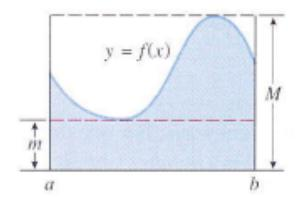

Figure 7.6.5

y = f(x)

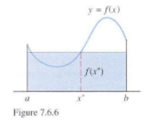

over the interval [a, b] (Figure 7.6.5). It is clear geometrically from this figure that the area

$$A = \int_{-b}^{b} f(x) \, dx$$

under y = f(x) is at least as large as the area of the rectangle of height m and no larger than the area of the rectangle of height M. It seems reasonable, therefore, that there is a rectangle over the interval [a, b] of some appropriate height  $f(x^*)$  between m and M whose area is precisely A; that is,

$$\int_a^b f(x) \, dx = f(x^*)(b - a)$$

(Figure 7.6.6). This is a special case of the following result.

(Figure 7.6.6). This is a special case of the following result.

**7.6.2** THEOREM (The Mean-Value Theorem for Integrals). If f is continuous on a closed interval [a, b], then there is at least one number  $x^*$  in [a, b] such that

$$\int_{a}^{b} f(x) dx = f(x^{*})(b - a) \tag{7}$$

**Proof.** By the Extreme-Value Theorem (6.1.3), f assumes a maximum value M and a minimum value m on [a,b]. Thus, for all x in [a,b],

$$m \leq f(x) \leq M$$

and from Theorem 7.5.6(b)

$$\int_{a}^{b} m \, dx \le \int_{a}^{b} f(x) \, dx \le \int_{a}^{b} M \, dx$$
or

 $m(b-a) \le \int_a^b f(x) dx \le M(b-a) \tag{8}$ 

or

$$m \leq \frac{1}{b-a} \int_a^b f(x) \, dx \leq M$$

This implies that

$$\frac{1}{b-a} \int_{a}^{b} f(x) dx \tag{9}$$

is a number between m and M, and since f(x) assumes the values m and M on [a,b], it follows from the Intermediate-Value Theorem (2.4.8) that f(x) must assume the value (9) at some point  $x^*$  in [a,b]; that is,

$$\frac{1}{b-a} \int_{a}^{b} f(x) \, dx = f(x^*) \quad \text{or} \quad \int_{a}^{b} f(x) \, dx = f(x^*)(b-a)$$

## 7.6 THE FUNDAMENTAL THEOREM OF CALCULUS

In this section we will establish two basic relationships between definite and indefinite integrals that together constitute a result called the Fundamental Theorem of Calculus. One part of this theorem will relate the rectangle and antiderivative methods for calculating areas, and the second part will provide a powerful method for evaluating definite integrals using antiderivatives.

To motivate the results we are looking for, let us begin by assuming that f is nonnegative and continuous on the interval [a, b], in which case the area A under the graph of f over the interval [a, b] is represented by the definite integral

$$A = \int_{a}^{b} f(x) dx \tag{1}$$

(Figure 7.6.1).

Recall from our discussion of the antiderivative method in Section 7.1 that if A(x) is the area under the graph of f from a to x (Figure 7.6.2), then:

## 7.6 The Fundamental Theorem of Calculus 417

- A'(x) = f(x)
- A(a) = 0 The area under the curve from a to a is the area above the single point a, and hence is zero.
- A(b) = A
   The area under the curve from a to b is A.

The formula A'(x) = f(x) states that A(x) is an antiderivative of f(x), which implies that every other antiderivative of f(x) can be obtained by adding a constant to A(x). Accordingly, let

$$F(x) = A(x) + C$$

be any antiderivative of f(x), and consider what happens when we subtract F(a) from F(b). We obtain

$$F(b) - F(a) = [A(b) + C] - [A(a) + C] = A(b) - A(a) = A - 0 = A$$

and hence (1) can be expressed as

$$\int_{a}^{b} f(x) dx = F(b) - F(a)$$

In words, this equation states that the definite integral can be evaluated by finding any antiderivative of the integrand and then subtracting the value of this antiderivative at the lower limit of integration from its value at the upper limit of integration. Although we derived this result subject to the assumption that f is nonnegative on [a, b], this assumption is not essential, as we will prove in the following theorem, which is the main tool used to evaluate definite integrals.

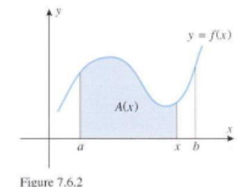

7.6.1 THEOREM (The Fundamental Theorem of Calculus, Part 1). If f is continuous on [a,b], and if F is any antiderivative of f on [a,b], then

$$\int_{a}^{b} f(x) \, dx = F(b) - F(a) \tag{2}$$

**Proof.** Let  $x_1, x_2, \ldots, x_{n-1}$  be any points in [a, b] such that

$$a < x_1 < x_2 < \cdots < x_{n-1} < b$$

These points divide [a, b] into n subintervals

$$[a, x_1], [x_1, x_2], \dots, [x_{n-1}, b]$$
 (3)

whose lengths, as usual, we denote by

$$\Delta x_1, \Delta x_2, \ldots, \Delta x_n$$

By hypothesis, F'(x) = f(x) for all x in [a, b], so F satisfies the hypotheses of the Mean-Value Theorem (6.5.2) on each subinterval in (3). Hence, we can find points  $x_1^*, x_2^*, \ldots, x_n^*$  in the respective subintervals in (3) such that

$$F(x_1) - F(a) = F'(x_1^*)(x_1 - a) = f(x_1^*)\Delta x_1$$

$$F(x_2) - F(x_1) = F'(x_2^*)(x_2 - x_1) = f(x_2^*)\Delta x_2$$

$$F(x_3) - F(x_2) = F'(x_3^*)(x_3 - x_2) = f(x_3^*)\Delta x_3$$

$$\vdots \qquad \vdots \qquad \vdots$$

$$F(b) - F(x_{n-1}) = F'(x_n^*)(b - x_{n-1}) = f(x_n^*)\Delta x_n$$

Adding the preceding equations yields

$$F(b) - F(a) = \sum_{k=1}^{n} f(x_k^*) \Delta x_k$$
 (4)

Let us now increase n in such a way that max  $\Delta x_k \to 0$ . Since f is assumed to be continuous,

the right side of (4) approaches  $\int_a^b f(x) dx$ , by Theorem 7.5.8(a) and Formula (7) of Section 7.5. However, the left side of (4) is a constant that is independent of n; thus,

$$F(b) - F(a) = \lim_{\max \Delta x_k \to 0} \sum_{k=1}^{n} f(x_k^*) \Delta x_k = \int_a^b f(x) dx$$

It is standard to denote the difference F(b) - F(a) as

$$F(x)$$
<sub>a</sub><sup>b</sup> =  $F(b) - F(a)$  or  $[F(x)]_a^b = F(b) - F(a)$ 

## ### Show that Definite Integral as a limit of a SUM

## Definite Integral as Limit of a Sum

Assuming that f is a continuous function and positive on the interval [a, b]. So, its graph is above the x-axis.

Definite integral  $\int_a^b f(x)dx$  is the area bounded by the curve y = f(x), the ordinates x = a and x = b and x-axis.

Now to evaluate this area, consider the region ABCD in the figure below,

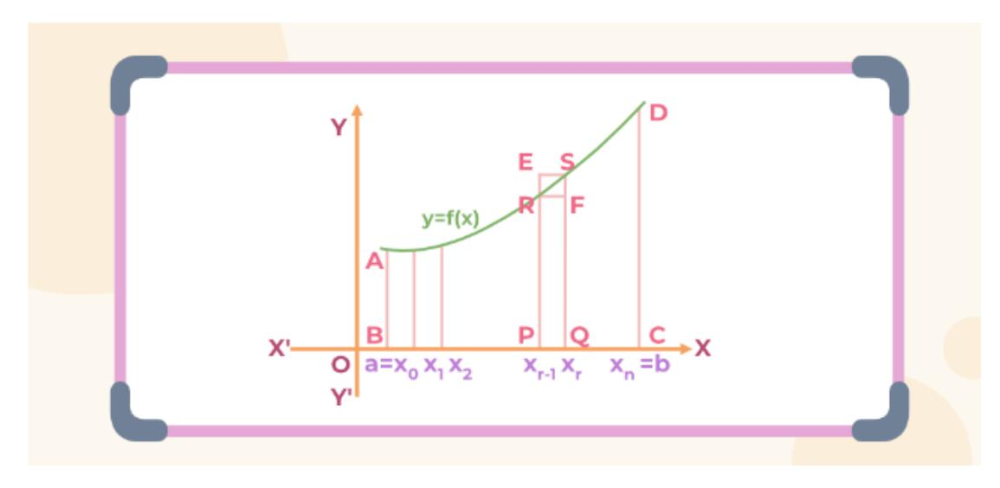

Let  $x_0 = a$  and  $x_n = b$ .

Now divide the interval [a, b] into n equal subintervals denoted by  $[x_0, x_1]$ ,  $[x_1, x_2]$ ,  $[x_2, x_3]$  .... $[x_{r-1}, x_r]$  ..... $[x_{n-1}, x_n]$ 

where  $x_0 = a$ ,  $x_1 = a + h$ ,  $x_2 = a + 2h$  .... and  $x_n = a + nh$  or  $n = \frac{b-a}{h}$ . As  $n \to \infty$ ,  $h \to 0$ .

The region ABCD under consideration is the sum of n subregions, where each subregion is defined on subintervals  $[x_{r-1}, x_r]$ , where, r = 1, 2, 3, ..., n.

It can be seen in the above figure that, now the area of the triangle POFR is calculated as,

$$A = PQ \times PR$$

$$= (x_r - x_{r-1}) \times f(x_{r-1})$$

As  $x_{r}$   $x_{r-1} \to 0$ , i.e.,  $h \to 0$ , the area above becomes a nearly perfect rectangle. Now the area under the curve can be broken into n different rectangles adding all these rectangles' areas we get the area under the curve.

$$\begin{array}{l} s_n = h[f(x_0) + .... + f(x_n)] \\ = h \sum_{r=0}^{n-1} f(x_r) \\ S_n = h[f(x_1) + .... + f(x_n)] \\ = h \sum_{r=1}^{n} f(x_r) \end{array}$$

 $s_n$  and  $S_n$  denote the sum of areas of all lower rectangles and upper rectangles raised over subintervals [ $x_{r-1}$ ,  $x_r$ ] for r = 1, 2, 3,... respectively.

As  $n \to \infty$  strips become narrower and narrower, so, the limiting values of (2) and (3) are the same in both cases and the common limiting value is the required area under the curve.

So.

```
\begin{array}{l} \lim_{n\to\infty} s_n \\ = \lim_{n\to\infty} S_n \\ = \text{area of the region PQRSTP} = \int_a^b f(x) \end{array}
```

Now, this equation can also be re-written as,

```
\int_{a}^{b} f(x) = \lim_{h \to 0} [f(x) + f(a+h) + f(a+2h) + f(a+3h) \dots f(a+(n-1)h)] where, h = \frac{b-a}{n} \to 0 as n \to \infty
```

This expression is knows as definition of definite integral as limit of sum.

## ######### Fundamental Theorem of Calculus

## # Explanation of Mean Value Theorem for Definite Integral

5.4

## The Fundamental Theorem of Calculus

HISTORICAL BIOGRAPHY

Sir Isaac Newton (1642–1727)

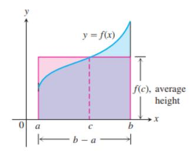

**FIGURE 5.16** The value f(c) in the Mean Value Theorem is, in a sense, the average (or *mean*) height of f on [a, b]. When  $f \ge 0$ , the area of the rectangle is the area under the graph of f from a

In this section we present the Fundamental Theorem of Calculus, which is the central theorem of integral calculus. It connects integration and differentiation, enabling us to compute integrals using an antiderivative of the integrand function rather than by taking limits of Riemann sums as we did in Section 5.3. Leibniz and Newton exploited this relationship and started mathematical developments that fueled the scientific revolution for the next 200 years.

Along the way, we present an integral version of the Mean Value Theorem, which is another important theorem of integral calculus and is used to prove the Fundamental Theorem.

## **Mean Value Theorem for Definite Integrals**

In the previous section we defined the average value of a continuous function over a closed interval [a,b] as the definite integral  $\int_a^b f(x) \, dx$  divided by the length or width b-a of the interval. The Mean Value Theorem for Definite Integrals asserts that this average value is *always* taken on at least once by the function f in the interval.

The graph in Figure 5.16 shows a *positive* continuous function y = f(x) defined over the interval [a, b]. Geometrically, the Mean Value Theorem says that there is a number c in [a, b] such that the rectangle with height equal to the average value f(c) of the function and base width b - a has exactly the same area as the region beneath the graph of f from a to b.

to b.

$$f(c)(b-a) = \int_a^b f(x) \, dx.$$

**THEOREM 3—The Mean Value Theorem for Definite Integrals** If f is continuous on [a, b], then at some point c in [a, b],

$$f(c) = \frac{1}{b-a} \int_a^b f(x) \, dx.$$

**Proof** If we divide both sides of the Max-Min Inequality (Table 5.4, Rule 6) by (b-a), we obtain

$$\min f \le \frac{1}{b-a} \int_a^b f(x) \, dx \le \max f.$$

## 326 Chapter 5: Integration

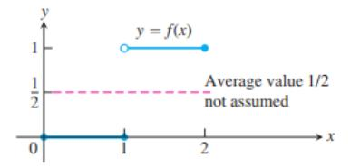

Since f is continuous, the Intermediate Value Theorem for Continuous Functions (Section 2.5) says that f must assume every value between min f and max f. It must therefore assume the value  $(1/(b-a))\int_a^b f(x) \, dx$  at some point c in [a,b].

The continuity of f is important here. It is possible that a discontinuous function never equals its average value (Figure 5.17).

**THEOREM 4—The Fundamental Theorem of Calculus, Part 1** If f is continuous on [a, b], then  $F(x) = \int_a^x f(t) dt$  is continuous on [a, b] and differentiable on (a, b) and its derivative is f(x):

$$F'(x) = \frac{d}{dx} \int_{a}^{x} f(t) dt = f(x).$$
 (2)

Before proving Theorem 4, we look at several examples to gain a better understanding of what it says. In each example, notice that the independent variable appears in a limit of integration, possibly in a formula.

**EXAMPLE 2** Use the Fundamental Theorem to find dy/dx if

(a) 
$$y = \int_{a}^{x} (t^3 + 1) dt$$
 (b)  $y = \int_{x}^{5} 3t \sin t dt$ 

(c) 
$$y = \int_{1}^{x^{2}} \cos t \, dt$$
 (d)  $y = \int_{1+3x^{2}}^{4} \frac{1}{2+e^{t}} \, dt$ 

Solution We calculate the derivatives with respect to the independent variable x.

(a) 
$$\frac{dy}{dx} = \frac{d}{dx} \int_{a}^{x} (t^3 + 1) dt = x^3 + 1$$
 Eq. (2) with  $f(t) = t^3 + 1$ 

**(b)** 
$$\frac{dy}{dx} = \frac{d}{dx} \int_{x}^{5} 3t \sin t \, dt = \frac{d}{dx} \left( -\int_{5}^{x} 3t \sin t \, dt \right)$$
 Table 5.4, Rule 1
$$= -\frac{d}{dx} \int_{5}^{x} 3t \sin t \, dt$$

$$= -3x \sin x$$
 Eq. (2) with  $f(t) = 3t \sin t$ 

**Proof of Theorem 4** We prove the Fundamental Theorem, Part 1, by applying the definition of the derivative directly to the function F(x), when x and x + h are in (a, b). This means writing out the difference quotient

$$\frac{F(x+h) - F(x)}{h} \tag{3}$$

and showing that its limit as  $h \to 0$  is the number f(x) for each x in (a, b). Thus,

$$F'(x) = \lim_{h \to 0} \frac{F(x+h) - F(x)}{h}$$

$$= \lim_{h \to 0} \frac{1}{h} \left[ \int_{a}^{x+h} f(t) dt - \int_{a}^{x} f(t) dt \right]$$

$$= \lim_{h \to 0} \frac{1}{h} \int_{x}^{x+h} f(t) dt$$
Table 5.4, Rule 5

According to the Mean Value Theorem for Definite Integrals, the value before taking the limit in the last expression is one of the values taken on by f in the interval between x and x + h. That is, for some number c in this interval,

$$\frac{1}{h} \int_{r}^{x+h} f(t) dt = f(c). \tag{4}$$

As  $h \to 0$ , x + h approaches x, forcing c to approach x also (because c is trapped between x and x + h). Since f is continuous at x, f(c) approaches f(x):

$$\lim_{h \to 0} f(c) = f(x). \tag{5}$$

In conclusion, we have

$$F'(x) = \lim_{h \to 0} \frac{1}{h} \int_{x}^{x+h} f(t) dt$$
$$= \lim_{h \to 0} f(c) \qquad \text{Eq. (4)}$$
$$= f(x). \qquad \text{Eq. (5)}$$

If x = a or b, then the limit of Equation (3) is interpreted as a one-sided limit with  $h \to 0^+$  or  $h \to 0^-$ , respectively. Then Theorem 1 in Section 3.2 shows that F is continuous for every point in [a, b]. This concludes the proof.

## ### Prove the following Theorem

**THEOREM 4 (Continued)**—The Fundamental Theorem of Calculus, Part 2 If f is continuous at every point in [a, b] and F is any antiderivative of f on [a, b], then

$$\int_{a}^{b} f(x) dx = F(b) - F(a).$$

**Proof** Part 1 of the Fundamental Theorem tells us that an antiderivative of f exists, namely

$$G(x) = \int_{a}^{x} f(t) dt.$$

Thus, if F is any antiderivative of f, then F(x) = G(x) + C for some constant C for a < x < b (by Corollary 2 of the Mean Value Theorem for Derivatives, Section 4.2).

5.4 The Fundamental Theorem of Calculus

Since both F and G are continuous on [a, b], we see that F(x) = G(x) + C also holds when x = a and x = b by taking one-sided limits (as  $x \to a^+$  and  $x \to b^-$ ).

Evaluating F(b) - F(a), we have

$$F(b) - F(a) = [G(b) + C] - [G(a) + C]$$
  
=  $G(b) - G(a)$ 

$$F(b) - F(a) = [G(b) + C] - [G(a) + C]$$

$$= G(b) - G(a)$$

$$= \int_{a}^{b} f(t) dt - \int_{a}^{a} f(t) dt$$

$$= \int_{a}^{b} f(t) dt - 0$$

$$= \int_{a}^{b} f(t) dt.$$

The Evaluation Theorem is important because it says that to calculate the definite integral of f over an interval [a, b] we need do only two things:

- Find an antiderivative F of f, and
- 2. Calculate the number F(b) F(a), which is equal to  $\int_a^b f(x) dx$ .

This process is much easier than using a Riemann sum computation. The power of the theorem follows from the realization that the definite integral, which is defined by a complicated process involving all of the values of the function f over [a, b], can be found by knowing the values of any antiderivative F at only the two endpoints a and b. The usual notation for the difference F(b) - F(a) is

$$F(x)$$
 $\Big]_a^b$  or  $\Big[F(x)\Big]_a^b$ ,

depending on whether F has one or more terms.

329

## ## Show that in interval [a,b], F'(x) = f(x)

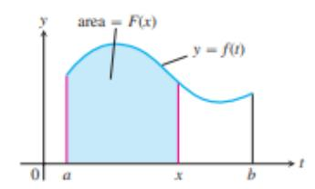

**FIGURE 5.18** The function F(x) defined by Equation (1) gives the area under the graph of f from a to x when f is nonnegative and x > a.

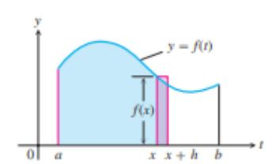

**FIGURE 5.19** In Equation (1), F(x) is the area to the left of x. Also, F(x + h) is the area to the left of x + h. The difference quotient [F(x + h) - F(x)]/h is then approximately equal to f(x), the height of the rectangle shown here.

#### Fundamental Theorem, Part 1

If f(t) is an integrable function over a finite interval I, then the integral from any fixed number  $a \in I$  to another number  $x \in I$  defines a new function F whose value at x is

$$F(x) = \int_{a}^{x} f(t) dt.$$
 (1)

For example, if f is nonnegative and x lies to the right of a, then F(x) is the area under the graph from a to x (Figure 5.18). The variable x is the upper limit of integration of an integral, but F is just like any other real-valued function of a real variable. For each value of the input x, there is a well-defined numerical output, in this case the definite integral of f from a to x.

Equation (1) gives a way to define new functions (as we will see in Section 7.2), but its importance now is the connection it makes between integrals and derivatives. If f is any continuous function, then the Fundamental Theorem asserts that F is a differentiable function of x whose derivative is f itself. At every value of x, it asserts that

$$\frac{d}{dx}F(x) = f(x).$$

To gain some insight into why this result holds, we look at the geometry behind it.

If  $f \ge 0$  on [a, b], then the computation of F'(x) from the definition of the derivative means taking the limit as  $h \to 0$  of the difference quotient

$$\frac{F(x+h) - F(x)}{h}.$$

For h > 0, the numerator is obtained by subtracting two areas, so it is the area under the graph of f from x to x + h (Figure 5.19). If h is small, this area is approximately equal to the area of the rectangle of height f(x) and width h, which can be seen from Figure 5.19. That is,

$$F(x + h) - F(x) \approx hf(x)$$
.

Dividing both sides of this approximation by h and letting  $h \rightarrow 0$ , it is reasonable to expect that

$$F'(x) = \lim_{h \to 0} \frac{F(x+h) - F(x)}{h} = f(x).$$

This result is true even if the function f is not positive, and it forms the first part of the Fundamental Theorem of Calculus.

**EXAMPLE 3** We calculate several definite integrals using the Evaluation Theorem, rather than by taking limits of Riemann sums.

(a) 
$$\int_0^{\pi} \cos x \, dx = \sin x \Big]_0^{\pi}$$
  $\frac{d}{dx} \sin x = \cos x$   
 $= \sin \pi - \sin 0 = 0 - 0 = 0$   
(b)  $\int_{-\pi/4}^0 \sec x \tan x \, dx = \sec x \Big]_{-\pi/4}^0$   $\frac{d}{dx} \sec x = \sec x \tan x$   
 $= \sec 0 - \sec \left(-\frac{\pi}{4}\right) = 1 - \sqrt{2}$   
(c)  $\int_1^4 \left(\frac{3}{2}\sqrt{x} - \frac{4}{x^2}\right) dx = \left[x^{3/2} + \frac{4}{x}\right]_1^4$   $\frac{d}{dx}\left(x^{3/2} + \frac{4}{x}\right) = \frac{3}{2}x^{1/2} - \frac{4}{x^2}$   
 $= \left[(4)^{3/2} + \frac{4}{4}\right] - \left[(1)^{3/2} + \frac{4}{1}\right]$   
 $= [8 + 1] - [5] = 4$   
(d)  $\int_0^1 \frac{dx}{x+1} = \ln|x+1| \Big]_0^1$   $\frac{d}{dx} \ln|x+1| = \frac{1}{x+1}$   
 $= \ln 2 - \ln 1 = \ln 2$   
(e)  $\int_0^1 \frac{dx}{x^2+1} = \tan^{-1} x \Big]_0^1$   $\frac{d}{dx} \tan^{-1} x = \frac{1}{x^2+1}$ 

## The Integral of a Rate

We can interpret Part 2 of the Fundamental Theorem in another way. If F is any antiderivative of f, then F' = f. The equation in the theorem can then be rewritten as

$$\int_a^b F'(x) dx = F(b) - F(a).$$

Now F'(x) represents the rate of change of the function F(x) with respect to x, so the integral of F' is just the *net change* in F as x changes from a to b. Formally, we have the following result.

**THEOREM 5—The Net Change Theorem** The net change in a function F(x) over an interval  $a \le x \le b$  is the integral of its rate of change:

$$F(b) - F(a) = \int_{a}^{b} F'(x) dx.$$
 (6)

## The Integral of a Rate

We can interpret Part 2 of the Fundamental Theorem in another way. If F is any antiderivative of f, then F' = f. The equation in the theorem can then be rewritten as

$$\int_a^b F'(x) dx = F(b) - F(a).$$

Now F'(x) represents the rate of change of the function F(x) with respect to x, so the integral of F' is just the *net change* in F as x changes from a to b. Formally, we have the following result.

**THEOREM 5—The Net Change Theorem** The net change in a function F(x) over an interval  $a \le x \le b$  is the integral of its rate of change:

$$F(b) - F(a) = \int_{a}^{b} F'(x) dx.$$
 (6)

**EXAMPLE 4** Here are several interpretations of the Net Change Theorem.

(a) If c(x) is the cost of producing x units of a certain commodity, then c'(x) is the marginal cost (Section 3.4). From Theorem 5,

$$\int_{x_1}^{x_2} c'(x) \ dx = c(x_2) - c(x_1),$$

which is the cost of increasing production from  $x_1$  units to  $x_2$  units.

**(b)** If an object with position function s(t) moves along a coordinate line, its velocity is v(t) = s'(t). Theorem 5 says that

$$\int_{t_1}^{t_2} v(t) dt = s(t_2) - s(t_1),$$

so the integral of velocity is the **displacement** over the time interval  $t_1 \le t \le t_2$ . On the other hand, the integral of the speed |v(t)| is the **total distance traveled** over the time interval. This is consistent with our discussion in Section 5.1.

If we rearrange Equation (6) as

$$F(b) = F(a) + \int_a^b F'(x) \, dx,$$

we see that the Net Change Theorem also says that the final value of a function F(x) over an interval [a, b] equals its initial value F(a) plus its net change over the interval. So if v(t) represents the velocity function of an object moving along a coordinate line, this means to state that the object's final position  $s(t_2)$  over a time interval  $t_1 \le t \le t_2$  is its initial position  $s(t_1)$  plus its net change in position along the line (see Example 4b)

## **EXAMPLE 4** Here are several interpretations of the Net Change Theorem.

(a) If c(x) is the cost of producing x units of a certain commodity, then c'(x) is the marginal cost (Section 3.4). From Theorem 5,

$$\int_{x_1}^{x_2} c'(x) \ dx = c(x_2) - c(x_1),$$

which is the cost of increasing production from  $x_1$  units to  $x_2$  units.

**(b)** If an object with position function s(t) moves along a coordinate line, its velocity is v(t) = s'(t). Theorem 5 says that

$$\int_{t_1}^{t_2} v(t) dt = s(t_2) - s(t_1),$$

so the integral of velocity is the **displacement** over the time interval  $t_1 \le t \le t_2$ . On the other hand, the integral of the speed |v(t)| is the **total distance traveled** over the time interval. This is consistent with our discussion in Section 5.1.

If we rearrange Equation (6) as

$$F(b) = F(a) + \int_a^b F'(x) \, dx,$$

we see that the Net Change Theorem also says that the final value of a function F(x) over an interval [a, b] equals its initial value F(a) plus its net change over the interval. So if v(t) tive represents the velocity function of an object moving along a coordinate line, this means to state the object's final position  $s(t_2)$  over a time interval  $t_1 \le t \le t_2$  is its initial position  $s(t_1)$  plus its net change in position along the line (see Example 4b)


The conclusions of the Fundamental Theorem tell us several things. Equation (2) can be rewritten as

$$\frac{d}{dx} \int_{a}^{x} f(t) dt = f(x),$$

which says that if you first integrate the function f and then differentiate the result, you get the function f back again. Likewise, replacing f by f and f by f in Equation (6) gives

$$\int_{a}^{x} F'(t) dt = F(x) - F(a),$$

so that if you first differentiate the function F and then integrate the result, you get the function F back (adjusted by an integration constant). In a sense, the processes of integration and differentiation are "inverses" of each other. The Fundamental Theorem also says that every continuous function f has an antiderivative F. It shows the importance of finding antiderivatives in order to evaluate definite integrals easily. Furthermore, it says that the differential equation dy/dx = f(x) has a solution (namely, any of the functions y = F(x) + C) for every continuous function f.


The Riemann sum contains terms such as  $f(c_k)$   $\Delta x_k$  that give the area of a rectangle when  $f(c_k)$  is positive. When  $f(c_k)$  is negative, then the product  $f(c_k)$   $\Delta x_k$  is the negative of the rectangle's area. When we add up such terms for a negative function we get the negative of the area between the curve and the x-axis. If we then take the absolute value, we obtain the correct positive area.

Go to Setting

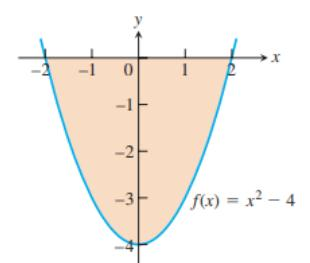

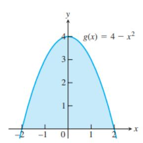

**FIGURE 5.20** These graphs enclose the same amount of area with the *x*-axis, but the definite integrals of

## **Properties of Definite Integrals**

If f(x) and g(x) are integrable in [a, b], then

2. 
$$\int_{a}^{b} Af(x)dx = A \int_{a}^{b} f(x)dx \text{ where } A \text{ is any constant}$$

3. 
$$\int_a^b f(x) dx = \int_a^c f(x) dx + \int_c^b f(x) dx \text{ provided } f(x) \text{ is integrable in } [a, c] \text{ and } [c, b]$$

4. 
$$\int_a^b f(x)dx = -\int_b^a f(x)dx$$

$$5. \qquad \int_a^a f(x) dx = 0$$

6. If in 
$$a \le x \le b$$
,  $m \le f(x) \le M$  where m and M are constants, then  $m(b-a) \le \int_a^b f(x) dx \le M(b-a)$ 

7. If in 
$$a \le x \le b$$
,  $f(x) \le g(x)$ , then  $\int_a^b f(x)dx \le \int_a^b g(x) dx$ 

8. 
$$\left| \int_a^b f(x) dx \right| \le \int_a^b |f(x)| dx \text{ if } a < b$$

## ### Example of Definite Integral

Calculate:  $\int_0^{\pi/4} \sin 2x \, dx$ 

## Solution:

Let 
$$I = \int_0^{\pi/4} \sin 2x \, dx$$

Now, 
$$\int \sin 2x \, dx = -(\frac{1}{2}) \cos 2x$$

$$I = \int_0^{\pi/4} \sin 2x \, dx$$

$$= [-(\frac{1}{2})\cos 2x]_0^{\pi/4}$$

$$= -(\frac{1}{2})\cos 2(\pi/4) - \{-(\frac{1}{2})\cos 2(0)\}$$

$$= -(\frac{1}{2})\cos \pi/2 + (\frac{1}{2})\cos 0$$

$$= -(\frac{1}{2})(0) + (\frac{1}{2})$$

Therefore,  $\int_0^{\pi/4} \sin 2x \, dx = 1/2$ 

(a) 
$$\int_{0}^{1} 4x - 6\sqrt[3]{x^2} dx$$

**(b)** 
$$\int_{0}^{\frac{\pi}{3}} 2\sin\theta - 5\cos\theta \, d\theta$$

(c) 
$$\int_{\pi/6}^{\pi/4} 5 - 2 \sec z \tan z \, dz$$

(d) 
$$\int_{-20}^{-1} \frac{3}{e^{-z}} - \frac{1}{3z} dz$$

(e) 
$$\int_{-2}^{3} 5t^6 - 10t + \frac{1}{t} dt$$

(a) 
$$\int_{0}^{1} 4x - 6\sqrt[3]{x^2} dx$$

This one is here mostly here to contrast with the next example.

$$\int_{0}^{1} 4x - 6\sqrt[3]{x^{2}} dx = \int_{0}^{1} 4x - 6x^{\frac{2}{3}} dx$$

$$= \left(2x^{2} - \frac{18}{5}x^{\frac{5}{3}}\right)\Big|_{0}^{1}$$

$$= 2 - \frac{18}{5} - (0)$$

$$= -\frac{8}{5}$$

(b) 
$$\int_{-2}^{3} f(x) dx$$

In this part x = 1 is between the limits of integration. This means that the integrand is no longer continuous in the interval of integration and that is a show stopper as far we're concerned. As noted above we simply can't integrate functions that aren't continuous in the interval of integration.

Also, even if the function was continuous at x = 1 we would still have the problem that the function is actually two different equations depending where we are in the interval of integration.

Let's first address the problem of the function not being continuous at x = 1. As we'll see, in this case, if we can find a way around this problem the second problem will also get taken care of at the same time.

In the previous examples where we had functions that weren't continuous we had division by zero and no matter how hard we try we can't get rid of that problem. Division by zero is a real problem and we can't really avoid it. In this case the discontinuity does not stem from problems with the function not existing at x = 1. Instead the function is not continuous because it takes on different values on either sides c = 1. We can "remove" this problem by recalling **Property 5** from the previous section. This property tells us that we can write the integral as follows

$$\int_{-2}^{3} f(x) dx = \int_{-2}^{1} f(x) dx + \int_{1}^{3} f(x) dx$$

On each of these intervals the function is continuous. In fact we can say more. In the first integral we will have x between -2 and 1 and this means that we can use the second equation for f(x) and likewise for the second integral x will be between 1 and 3 and so we can use the first function for f(x). The integral in this case is then,

$$\int_{-2}^{3} f(x) dx = \int_{1}^{1} f(x) dx + \int_{3}^{3} f(x) dx$$

$$= \int_{2}^{-2} 3x^{2} dx + \int_{1}^{3} 6 dx$$

$$= x^{3} |_{-2}^{1} + 6x|_{1}^{3}$$

$$= 1 - (-8) + (18 - 6)$$

$$= 21$$

(a) 
$$\int_{10}^{22} f(x) dx$$

For this integral notice that x = 1 is not in the interval of integration and so that is something that we'll not need to worry about in this part.

Also note the limits for the integral lie entirely in the range for the first function. What this means for us is that when we do the integral all we need to do is plug in the first function into the integral.

Here is the integral.

$$\int_{10}^{22} \mathbf{f}(\mathbf{x}) d\mathbf{x} = \int_{10}^{22} 6 d\mathbf{x}$$
$$= 6\mathbf{x}|_{10}^{22}$$
$$= 132 - 60$$
$$= 72$$

Let's first start with a graph of this function.

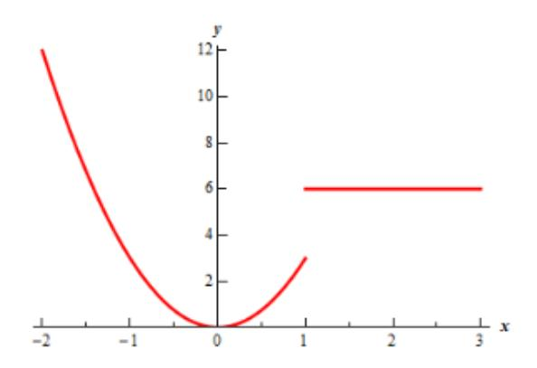

The graph reveals a problem. This function is not continuous at x = 1 and we're going to have to watch out for that.

$$f(x) = \begin{cases} 6 & \text{if } x > 1 \\ 3x^2 & \text{if } x \le 1 \end{cases}$$

valuate each of the following integrals.

(a) 
$$\int_{10}^{22} f(x) dx$$

(b) 
$$\int_{-2}^{3} f(x) dx$$

(d) 
$$\int_{-20}^{-1} \frac{3}{e^{-z}} - \frac{1}{3z} dz I$$

In order to do this one will need to rewrite both of the terms in the integral a little as follows,

$$\int_{-20}^{-1} \frac{3}{e^{-z}} - \frac{1}{3z} dz = \int_{-20}^{-1} 3e^{z} - \frac{1}{3} \frac{1}{z} dz$$

For the first term recall we used the following fact about exponents.

$$x^{-a} = \frac{1}{x^a} \qquad \frac{1}{x^{-a}} = x^a$$

In the second term, taking the 3 out of the denominator will just make integrating that term easier.

Now the integral.

$$\int_{-20}^{-1} \frac{3}{e^{-z}} - \frac{1}{3z} dz = (3e^z - \frac{1}{3}\ln|z|) \Big|_{-20}^{-1}$$

$$= 3e^{-1} - \frac{1}{3}\ln|-1| - (3e^{-20} - \frac{1}{3}\ln|-20|)$$

$$= 3e^{-1} - 3e^{-20} + \frac{1}{3}\ln|20|$$

Just leave the answer like this. It's messy, but it's also exact.

Note that the absolute value bars on the logarithm are required here. Without them we couldn't have done the evaluation.

(c) 
$$\int_{\pi/6}^{\pi/4} 5 - 2 \sec z \tan z \, dz$$

Not much to do other than do the integral.

$$\int_{\pi/6}^{\pi/4} 5 - 2 \sec z \tan z \, dz = (5z - 2 \sec z)|_{\pi/6}^{\pi/4}$$

$$= 5 \left(\frac{\pi}{4}\right) - 2 \sec\left(\frac{\pi}{4}\right) - \left(5 \left(\frac{\pi}{6}\right) - 2 \sec\left(\frac{\pi}{6}\right)\right)$$

$$= \frac{5\pi}{12} - 2\sqrt{2} + \frac{4}{\sqrt{3}}$$

For the evaluation, recall that

$$\sec z = \frac{1}{\cos z}$$

and so if we can evaluate cosine at these angles we can evaluate secant at these angles.

**(b)** 
$$\int_{0}^{\frac{\pi}{3}} 2 \sin \theta - 5 \cos \theta \, d\theta$$

Be careful with signs with this one. Recall from the indefinite integral sections that it's easy to mess up the signs when integrating sine and cosine.

$$\int_{0}^{\frac{\pi}{3}} 2\sin\theta - 5\cos\theta \, d\theta = (-2\cos\theta - 5\sin\theta)|_{0}^{\pi/3}$$

$$= -2\cos(\frac{\pi}{3}) - 5\sin(\frac{\pi}{3}) - (-2\cos\theta - 5\sin\theta)$$

$$= -1 - \frac{5\sqrt{3}}{2} + 2$$

$$= 1 - \frac{5\sqrt{3}}{2}$$

So, to integrate a piecewise function, all we need to do is break up the integral at the break point(s) that happen to occur in the interval of integration and then integrate each piece.

#### Even and Odd Functions

This is the last topic that we need to discuss in this section.

First, recall that an even function is any function which satisfies,

$$f(-x) = f(x)$$

Typical examples of even functions are,

$$f(x) = x^2$$
  $f(x) = cos(x)$ 

An odd function is any function which satisfies,

$$f(-x) = -f(x)$$

The typical examples of odd functions are,

$$f(x) = x^3$$
  $f(x) = \sin(x)$ 

There are a couple of nice facts about integrating even and odd functions over the interval [-a, a]. If f(x) is an even function then,

$$\int_{-a}^{a} f(x) dx = 2 \int_{0}^{a} f(x) dx$$

Likewise, if f(x) is an odd function then,

$$\int_{-a}^{a} f(x) dx = 0$$

Note that in order to use these facts the limit of integration must be the same number, but opposite signs!

. Integrate each of the following.

(a) 
$$\int_{-2}^{2} 4x^4 - x^2 + 1 dx$$

**(b)** 
$$\int_{-10}^{10} x^5 + \sin(x) \, dx$$

(a) 
$$\int_{-2}^{2} 4x^4 - x^2 + 1 \, dx$$

In this case the integrand is even and the interval is correct so.

$$\int_{-2}^{2} 4x^4 - x^2 + 1 \, dx = 2 \int_{0}^{2} 4x^4 - x^2 + 1 \, dx$$
$$= 2 \left( \frac{4}{5} x^5 - \frac{1}{3} x^3 + x \right) \Big|_{0}^{2}$$
$$= \frac{748}{15}$$

So, using the fact cut the evaluation in half (in essence since one of the new limits was zero).

(b) 
$$\int_{-10}^{10} x^5 + \sin(x) dx$$

The integrand in this case is odd and the interval is in the correct form and so we don't even need to integrate. Just use the fact.

$$\int_{-10}^{10} x^5 + \sin(x) \, dx = 0$$

Note that the limits of integration are important here. Take the last integral as an example. A small change to the limits will not give us zero.

$$\int_{-10}^{9} x^5 + \sin(x) dx = \cos(10) - \cos(9) - \frac{468559}{6} = -78093.09461$$

The moral here is to be careful and not misuse these facts

## Integration by reduction formulae

Article Talk

From Wikipedia, the free encyclopedia

In integral calculus, **integration by reduction formulae** is a method relying on recurrence relations. It is used when an expression containing an integer parameter, usually in the form of powers of elementary functions, or products of transcendental functions and polynomials of arbitrary degree, can't be integrated directly. But using other methods of integration a reduction formula can be set up to obtain the integral of the same or similar expression with a lower integer parameter, progressively simplifying the integral until it can be evaluated. [1] This method of integration is one of the earliest used.

## How to find the reduction formula [edit]

The reduction formula can be derived using any of the common methods of integration, like integration by substitution, integration by parts, integration by trigonometric substitution, integration by partial fractions, etc. The main idea is to express an integral involving an integer parameter (e.g. power) of a function, represented by  $I_n$ , in terms of an integral that involves a lower value of the parameter (lower power) of that function, for example  $I_{n-1}$  or  $I_{n-2}$ . This makes the reduction formula a type of recurrence relation. In other words, the reduction formula expresses the integral

$$I_n = \int f(x,n) \,\mathrm{d}x,$$

in terms of

$$I_k = \int f(x,k) \, \mathrm{d}x,$$

where

$$k < n$$
.

## How to compute the integral [edit]

To compute the integral, we set n to its value and use the reduction formula to express it in terms of the (n-1) or (n-2) integral. The lower index integral can be used to calculate the higher index ones; the process is continued repeatedly until we reach a point where the function to be integrated can be computed, usually when its index is 0 or 1. Then we back-substitute the previous results until we have computed  $I_n$ . [2]

## Examples [edit]

Below are examples of the procedure.

## Cosine integral [edit]

Typically, integrals like

$$\int \cos^n x \, \mathrm{d}x,$$

can be evaluated by a reduction formula.

Start by setting:

$$I_n = \int \cos^n x \, \mathrm{d}x.$$

Now re-write as:

$$I_n = \int \cos^{n-1} x \cos x \, \mathrm{d}x,$$

Integrating by this substitution:

$$\cos x \, \mathrm{d}x = \mathrm{d}(\sin x),$$
 
$$I_n = \int \cos^{n-1} x \, \mathrm{d}(\sin x).$$

Now integrating by parts:

$$\int \cos^{n} x \, dx = \cos^{n-1} x \sin x - \int \sin x \, d(\cos^{n-1} x)$$

$$= \cos^{n-1} x \sin x + (n-1) \int \sin x \cos^{n-2} x \sin x \, dx$$

$$= \cos^{n-1} x \sin x + (n-1) \int \cos^{n-2} x \sin^{2} x \, dx$$

$$= \cos^{n-1} x \sin x + (n-1) \int \cos^{n-2} x (1 - \cos^{2} x) \, dx$$

$$= \cos^{n-1} x \sin x + (n-1) \int \cos^{n-2} x \, dx - (n-1) \int \cos^{n} x \, dx$$

$$= \cos^{n-1} x \sin x + (n-1) I_{n-2} - (n-1) I_{n},$$

solving for  $I_n$ :

$$I_n + (n-1)I_n = \cos^{n-1} x \sin x + (n-1)I_{n-2},$$
  
 $nI_n = \cos^{n-1}(x)\sin x + (n-1)I_{n-2},$   
 $I_n = \frac{1}{n}\cos^{n-1} x \sin x + \frac{n-1}{n}I_{n-2},$ 

so the reduction formula is:

$$\int \cos^n x \,\mathrm{d}x \ = \frac{1}{n} \cos^{n-1} x \sin x + \frac{n-1}{n} \int \cos^{n-2} x \,\mathrm{d}x.$$

To supplement the example, the above can be used to evaluate the integral for (say) n = 5;

$$I_5=\int \cos^5 x\,\mathrm{d}x.$$

Calculating lower indices:

$$n=5, \quad I_5=\frac{1}{5}\cos^4x\sin x+\frac{4}{5}I_3, \ n=3, \quad I_3=\frac{1}{3}\cos^2x\sin x+\frac{2}{3}I_1,$$

back-substituting:

$$\begin{array}{l} \vdots I_1 &= \int \cos x \, \mathrm{d}x = \sin x + C_1, \ \vdots I_3 &= \frac{1}{3} \cos^2 x \sin x + \frac{2}{3} \sin x + C_2, \quad C_2 &= \frac{2}{3} C_1, \ I_5 &= \frac{1}{5} \cos^4 x \sin x + \frac{4}{5} \left[ \frac{1}{3} \cos^2 x \sin x + \frac{2}{3} \sin x \right] + C, \end{array}$$

where C is a constant.

## Exponential integral [edit]

Another typical example is:

$$\int x^n e^{ax} \, \mathrm{d}x.$$

Start by setting:

$$I_n = \int x^n e^{ax} \, \mathrm{d}x.$$

Integrating by substitution:

$$x^n\,\mathrm{d}x = \frac{\mathrm{d}(x^{n+1})}{n+1}, \nonumber \ I_n = \frac{1}{n+1}\int e^{ax}\,\mathrm{d}(x^{n+1}),$$

Now integrating by parts:

$$\int e^{ax} d(x^{n+1}) = x^{n+1}e^{ax} - \int x^{n+1} d(e^{ax})$$

$$= x^{n+1}e^{ax} - a \int x^{n+1}e^{ax} dx,$$
 $(n+1)I_n = x^{n+1}e^{ax} - aI_{n+1},$ 

shifting indices back by 1 (so  $n + 1 \rightarrow n$ ,  $n \rightarrow n - 1$ ):

$$nI_{n-1}=x^ne^{ax}-aI_n,$$

solving for  $I_n$ :

$$I_n=\frac{1}{a}\left(x^ne^{ax}-nI_{n-1}\right),$$

so the reduction formula is:

$$\int x^n e^{ax} dx = \frac{1}{a} \left( x^n e^{ax} - n \int x^{n-1} e^{ax} dx \right).$$

An alternative way in which the derivation could be done starts by substituting  $e^{ax}$ .

Integration by substitution:

$$e^{ax}\,\mathrm{d}x=\frac{\mathrm{d}(e^{ax})}{a},$$

$$I_n=\frac{1}{a}\int x^n\,\mathrm{d}(e^{ax}),$$

Now integrating by parts:

$$\begin{split} \int x^n \, \mathrm{d}(e^{ax}) &= x^n e^{ax} - \int e^{ax} \, \mathrm{d}(x^n) \ &= x^n e^{ax} - n \int e^{ax} x^{n-1} \, \mathrm{d}x, \end{split}$$

which gives the reduction formula when substituting back:

$$I_n=\frac{1}{a}\left(x^ne^{ax}-nI_{n-1}\right),$$

which is equivalent to:

$$\int x^n e^{ax} \,\mathrm{d}x = \frac{1}{a} \left( x^n e^{ax} - n \int x^{n-1} e^{ax} \,\mathrm{d}x \right).$$

Another alternative way in which the derivation could be done by integrating by parts:

$$I_n = \int x^n x e^{ax} dx,$$
 $u = x^n , dv = e^{ax},$ 
 $\frac{du}{dx} = nx^{n-1} , v = \frac{e^{ax}}{a}$ 
 $I_n = \frac{x^n e^{ax}}{a} - \int nx^{n-1} \frac{e^{ax}}{a} dx$ 
 $I_n = \frac{x^n e^{ax}}{a} - \frac{n}{a} \int x^{n-1} e^{ax} dx$ 

Remember:

$$I_{n-1} = \int x^{n-1} e^{ax} dx$$

$$\therefore I_n = \frac{x^n e^{ax}}{a} - \frac{n}{a} I_{n-1}$$

which gives the reduction formula when substituting back:

$$I_n=\frac{1}{a}\left(x^ne^{ax}-nI_{n-1}\right),$$

which is equivalent to:

$$\int x^n e^{ax} \,\mathrm{d}x = \frac{1}{a} \left( x^n e^{ax} - n \int x^{n-1} e^{ax} \,\mathrm{d}x \right).$$

## Reduction formulas

• A reduction formula expresses an integral  $I_n$  that depends on some integer n in terms of another integral  $I_m$  that involves a smaller integer m. If one repeatedly applies this formula, one may then express  $I_n$  in terms of a much simpler integral.

Example 6.10 We use integration by parts to establish the reduction formula

$$\int \sin^n x \, dx = -\frac{1}{n} \sin^{n-1} x \cdot \cos x + \frac{n-1}{n} \int \sin^{n-2} x \, dx. \tag{6.4}$$

If we take  $dv = \sin x \, dx$ , then we have  $v = -\cos x$  and we may integrate by parts with

$$u = \sin^{n-1} x$$
,  $du = (n-1)\sin^{n-2} x \cdot \cos x$ .

Using the fact that  $\sin^2 x + \cos^2 x = 1$ , one may thus conclude that

$$\int \sin^n x \, dx = -\sin^{n-1} x \cdot \cos x + (n-1) \int \sin^{n-2} x \cdot \cos^2 x \, dx$$

$$= -\sin^{n-1} x \cdot \cos x + (n-1) \int \sin^{n-2} x \cdot (1 - \sin^2 x) \, dx$$

$$= -\sin^{n-1} x \cdot \cos x + (n-1) \int \sin^{n-2} x \, dx + (1-n) \int \sin^n x \, dx.$$

Here, the rightmost integral coincides with the original integral on the left. Once we now rearrange terms, we end up with n copies of the integral and equation (6.4) follows.

Example 6.11 We use a reduction formula to compute the integral  $I_3$  in the case that

$$I_n = \int x^n e^{2x} \, dx.$$

If we take  $u = x^n$  and  $dv = e^{2x} dx$ , then  $du = nx^{n-1} dx$  and  $v = \frac{1}{2}e^{2x}$ , so one has

$$I_n = \frac{1}{2} x^n e^{2x} - \frac{n}{2} \int x^{n-1} e^{2x} dx = \frac{1}{2} x^n e^{2x} - \frac{n}{2} \cdot I_{n-1}.$$
 (6)

We now apply the last formula repeatedly to determine  $I_3$ . According to the formula,

$$I_{3} = \frac{1}{2} x^{3} e^{2x} - \frac{3}{2} \cdot I_{2} = \frac{1}{2} x^{3} e^{2x} - \frac{3}{2} \cdot \left[ \frac{1}{2} x^{2} e^{2x} - I_{1} \right]$$

$$= \frac{1}{2} x^{3} e^{2x} - \frac{3}{2} \cdot \left[ \frac{1}{2} x^{2} e^{2x} - \frac{1}{2} x e^{2x} + \frac{1}{2} \cdot I_{0} \right]$$

$$= \frac{1}{2} x^{3} e^{2x} - \frac{3}{4} x^{2} e^{2x} + \frac{3}{4} x e^{2x} - \frac{3}{4} \int e^{2x} dx$$

$$= \frac{1}{2} x^{3} e^{2x} - \frac{3}{4} x^{2} e^{2x} + \frac{3}{4} x e^{2x} - \frac{3}{8} e^{2x} + C.$$

Example 6.12 We use integration by parts to establish the reduction formula

$$\int \sec^n x \, dx = \frac{1}{n-1} \sec^{n-2} x \cdot \tan x + \frac{n-2}{n-1} \int \sec^{n-2} x \, dx.$$

In this case, we note that  $(\tan x)' = \sec^2 x$  and we write the given integral as

$$\int \sec^n x \, dx = \int \sec^{n-2} x \cdot \sec^2 x \, dx.$$

If we take  $dv = \sec^2 x \, dx$ , then we have  $v = \tan x$  and we may integrate by parts with

$$u = \sec^{n-2} x$$
,  $du = (n-2)\sec^{n-3} x \cdot \sec x \tan x = (n-2)\sec^{n-2} x \cdot \tan x$ .

Using the fact that  $1 + \tan^2 x = \sec^2 x$ , one may thus establish the identity

$$\int \sec^{n} x \, dx = \sec^{n-2} x \cdot \tan x - (n-2) \int \sec^{n-2} x \cdot \tan^{2} x \, dx$$

$$= \sec^{n-2} x \cdot \tan x - (n-2) \int \sec^{n-2} x \cdot (\sec^{2} x - 1) \, dx$$

$$= \sec^{n-2} x \cdot \tan x - (n-2) \int \sec^{n} x \, dx + (n-2) \int \sec^{n-2} x \, dx.$$

Since the integral on the left hand side also appears on the right hand side, this gives

$$(n-1) \int \sec^n x \, dx = \sec^{n-2} x \cdot \tan x + (n-2) \int \sec^{n-2} x \, dx.$$

In particular, the reduction formula (6.6) follows by dividing both sides with n-1.

**Example 6.13** Let  $a \neq 0$  be some given constant and consider the integral

$$I_n = \int \frac{dx}{(x^2 + a)^n} = \int (x^2 + a)^{-n} dx.$$

If we take  $u = (x^2 + a)^{-n}$  and dv = dx, then we may integrate by parts to find that

$$I_n = x(x^2 + a)^{-n} + n \int x(x^2 + a)^{-n-1} \cdot 2x \, dx.$$

Let us now rearrange terms and express the last equation in the form

$$I_n = x(x^2 + a)^{-n} + 2n \int \frac{x^2 + a - a}{(x^2 + a)^{n+1}} dx$$
$$= x(x^2 + a)^{-n} + 2n \int \frac{dx}{(x^2 + a)^n} - 2na \int \frac{dx}{(x^2 + a)^{n+1}}.$$

The integrals on the right hand side have the same form as the original integral, so

$$I_n = x(x^2 + a)^{-n} + 2n \cdot I_n - 2na \cdot I_{n+1}.$$

Rearranging terms once again, one may thus establish the reduction formula

$$2na \cdot I_{n+1} = (2n-1) \cdot I_n + x(x^2+a)^{-n}.$$

## ## Problem of Trigonometric Function

## 6.4 Trigonometric integrals

## Theorem 6.14 - Powers of sine and cosine

Consider the integral  $\int \sin^m x \cdot \cos^n x \, dx$  for any non-negative integers m, n.

- (a) When n is odd, one may compute this integral using the substitution  $u = \sin x$ .
- (b) When m is odd, one may compute this integral using the substitution  $u = \cos x$ .
- (c) When m, n are even, one may use the half-angle formulas to simplify the integral.

## Theorem 6.15 - Powers of secant and tangent

Consider the integral  $\int \sec^m x \cdot \tan^n x \, dx$  for any non-negative integers m, n.

- (a) When n is odd, one may compute this integral using the substitution  $u = \sec x$ .
- (b) When m is even, one may compute this integral using the substitution  $u = \tan x$ .
- (c) When m is odd and n is even, one may reduce the integrand to powers of sec x.
- The three cases that arise in Theorem 6.14 are closely related to the identities

$$(\sin x)' = \cos x$$
,  $(\cos x)' = -\sin x$ ,  $\sin^2 x + \cos^2 x = 1$ .

If one uses the substitution  $u = \sin x$ , then one may express any even power of cosine in terms of  $u^2$ , but also needs a copy of cosine for  $du = \cos x \, dx$ . This yields an odd number of cosines, so the substitution  $u = \sin x$  will only help when n is odd.

The last case that arises in Theorem 6.14 requires the half-angle formulas

$$\sin^2 \theta = \frac{1 - \cos(2\theta)}{2}, \qquad \cos^2 \theta = \frac{1 + \cos(2\theta)}{2}.$$
 (6.7)

These formulas are helpful for reducing the even powers of sine and cosine.

• The three cases that arise in Theorem 6.15 are closely related to the identities

$$(\sec x)' = \sec x \tan x$$
,  $(\tan x)' = \sec^2 x$ ,  $1 + \tan^2 x = \sec^2 x$ .

These imply that an odd number of tangents is needed to substitute  $u = \sec x$ , while an even number of secants is needed to substitute  $u = \tan x$ .

$$\int \sin^4 x \cdot \cos^5 x \, dx.$$

## Techniques of integration

Trigonometric integrals

In this case, we have  $du = \cos x \, dx$  and also  $\sin^2 x + \cos^2 x = 1$ , so

$$\int \sin^4 x \cdot \cos^5 x \, dx = \int \sin^4 x \cdot (1 - \sin^2 x)^2 \cdot \cos x \, dx = \int u^4 (1 - u^2)^2 \, du$$

$$= \int u^4 (1 - 2u^2 + u^4) \, du = \int (u^4 - 2u^6 + u^8) \, du$$

$$= \frac{u^5}{5} - \frac{2u^7}{7} + \frac{u^9}{9} + C = \frac{\sin^5 x}{5} - \frac{2\sin^7 x}{7} + \frac{\sin^9 x}{9} + C.$$

Example 6.17 We use the half-angle formulas to simplify and compute the integral

$$\int \sin^2 x \cdot \cos^2 x \, dx.$$

Since the exponents are both even, one needs to express the integrand in the form

$$\sin^2 x \cdot \cos^2 x = \frac{1 - \cos(2x)}{2} \cdot \frac{1 + \cos(2x)}{2} = \frac{1}{4} \cdot \left[ 1 - \cos^2(2x) \right]$$
$$= \frac{1}{4} \cdot \left[ 1 - \frac{1 + \cos(4x)}{2} \right] = \frac{1}{8} \cdot \left[ 1 - \cos(4x) \right].$$

Once we now integrate both sides of this equation, we may easily conclude that

$$\int \sin^2 x \cdot \cos^2 x \, dx = \frac{1}{8} \left[ x - \frac{\sin(4x)}{4} \right] + C = \frac{x}{8} - \frac{\sin(4x)}{32} + C.$$

Example 6.19 We use an appropriate substitution to compute the integral

$$\int \frac{\sin^3 x}{\cos^8 x} \, dx.$$

Since the cosine appears in the denominator, it is better to first simplify and write

$$\int \frac{\sin^3 x}{\cos^8 x} dx = \int \frac{\sin^3 x}{\cos^3 x} \cdot \frac{1}{\cos^5 x} dx = \int \tan^3 x \cdot \sec^5 x dx.$$

Let us take  $u = \sec x$ . Since  $du = \sec x \tan x \, dx$  and also  $u^2 = \sec^2 x = \tan^2 x + 1$ , we get

$$\int \frac{\sin^3 x}{\cos^8 x} dx = \int \tan^2 x \cdot \sec^4 x \cdot \sec x \tan x dx = \int (u^2 - 1) \cdot u^4 du$$
$$= \int (u^6 - u^4) du = \frac{u^7}{7} - \frac{u^5}{5} + C = \frac{\sec^7 x}{7} - \frac{\sec^5 x}{5} + C.$$

70

## 6.5 Trigonometric substitutions

- Trigonometric substitutions are sometimes needed to simplify integrals that contain expressions of the form  $\sqrt{a^2-x^2}$ ,  $\sqrt{x^2-a^2}$  and  $\sqrt{x^2+a^2}$  for some a>0. In each of these cases, one naturally seeks a substitution to simplify the square root.
- The three most common trigonometric substitutions are listed in the table below.

• In the first case, one has  $a^2 - x^2 = a^2 - a^2 \sin^2 \theta = a^2 \cos^2 \theta$  and  $\sqrt{a^2 - x^2} = a \cos \theta$ . This is because  $\theta = \sin^{-1}(x/a)$  lies between  $-\pi/2$  and  $\pi/2$ , so  $\cos \theta$  is non-negative.

Example 6.20 We use a trigonometric substitution to compute the integral

$$\int \frac{dx}{\sqrt{a^2 - x^2}}, \quad a > 0.$$

If we let  $x = a \sin \theta$ , then  $a^2 - x^2 = a^2 - a^2 \sin^2 \theta = a^2 \cos^2 \theta$  and also  $dx = a \cos \theta d\theta$ , so

$$\int \frac{dx}{\sqrt{a^2 - x^2}} = \int \frac{a\cos\theta \, d\theta}{a\cos\theta} = \int d\theta = \theta + C = \sin^{-1}\frac{x}{a} + C.$$

Example 6.21 We use a trigonometric substitution to compute the integral

$$\int \frac{dx}{x^2 + a^2}, \quad a > 0.$$

If we let  $x = a \tan \theta$ , then  $x^2 + a^2 = a^2 \tan^2 \theta + a^2 = a^2 \sec^2 \theta$  and also  $dx = a \sec^2 \theta d\theta$ , so

$$\int \frac{dx}{x^2 + a^2} = \int \frac{a \sec^2 \theta \, d\theta}{a^2 \sec^2 \theta} = \frac{1}{a} \int d\theta = \frac{1}{a} \theta + C = \frac{1}{a} \tan^{-1} \frac{x}{a} + C.$$

Example 6.22 We use a trigonometric substitution to compute the integral

$$\int \frac{x^2 dx}{\sqrt{4 - x^2}}.$$

If we let  $x = 2\sin\theta$ , then  $4 - x^2 = 4 - 4\sin^2\theta = 4\cos^2\theta$  and also  $dx = 2\cos\theta d\theta$ , so

$$\int \frac{x^2 dx}{\sqrt{4 - x^2}} = \int \frac{4\sin^2 \theta \cdot 2\cos \theta d\theta}{2\cos \theta} = \int 4\sin^2 \theta d\theta = 2\int [1 - \cos(2\theta)] d\theta$$
$$= 2\theta - \sin(2\theta) + C = 2\theta - 2\sin \theta \cdot \cos \theta + C.$$

It remains to express this equation in terms of  $x = 2\sin\theta$ . Since  $\theta = \sin^{-1}\frac{x}{2}$ , we get

$$\int \frac{x^2 dx}{\sqrt{4 - x^2}} = 2\sin^{-1}\frac{x}{2} - 2\cdot\frac{x}{2}\cdot\sqrt{1 - \frac{x^2}{4}} + C = 2\sin^{-1}\frac{x}{2} - \frac{x}{2}\sqrt{4 - x^2} + C.$$