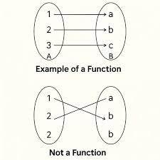
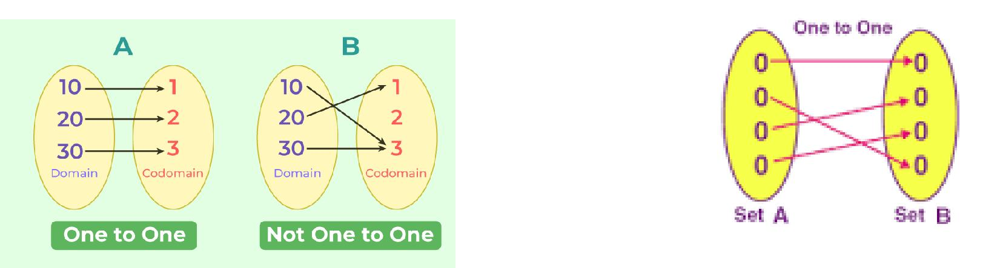
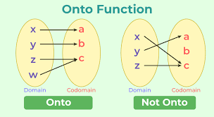
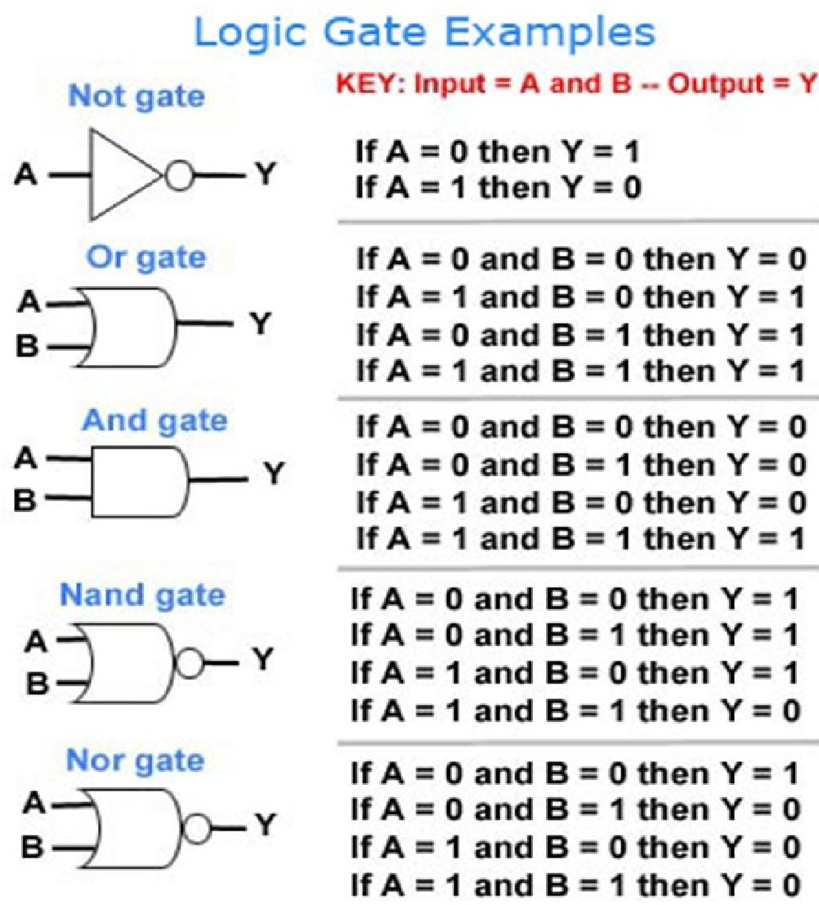
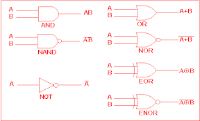
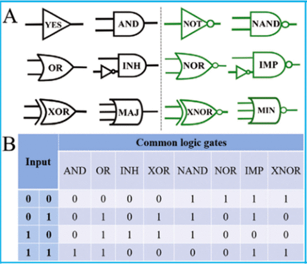
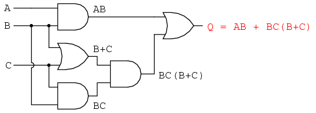
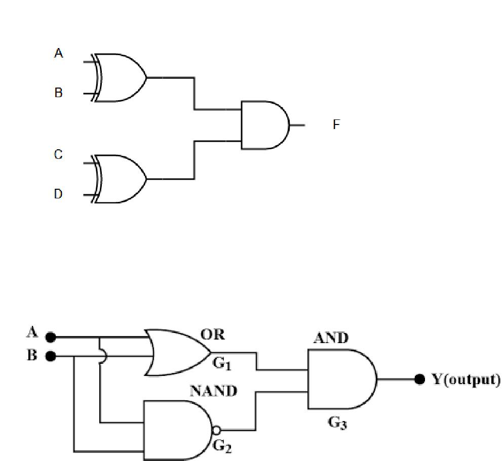

# Srijonshil Answers — Discrete Mathematics

> All answers are directly extracted from the lecture PDFs (Lec_1.pdf, Lec_2.pdf, Sir Notes.pdf). Diagrams from the original slides (function/onto diagrams, logic-gate symbols, circuit diagrams, etc.) are embedded inline below and also included as separate files in `images/diagrams/`. An **Appendix** at the end of this document captures everything else found in the three PDFs that wasn't covered by the original 8 questions (illustrative examples, in-class exercises, one extra gate-comparison chart, and a homework note).

---

## Question 1: Discrete Mathematics & Propositions

### (a) What is discrete mathematics?

Discrete mathematics is a branch of mathematics that deals with mathematical structures and objects that are fundamentally discrete or separate in nature. Discrete mathematics is the part of mathematics devoted to the study of discrete objects. Discrete mathematics is the branch of mathematics dealing with objects that can assume only distinct, separated values. The term "discrete mathematics" is therefore used in contrast with "continuous mathematics," which is the branch of mathematics dealing with objects that can vary smoothly (which includes calculus). Whereas discrete objects can often be characterized by integers, continuous objects require real numbers.

Discrete mathematics or finite mathematics is the branch of mathematics in which the mathematical organizations are fundamentally isolated, that is, the notion of continuity does not apply to them.

_(Source: Lec_1.pdf, pp. 1–2)_

### (b) What is a proposition? What are atomic and compound propositions?

An assertion is a statement. A proposition is an assertion which is either true or false (but not both).

Atomic Proposition: A simple proposition that cannot be broken down further. Example: "It is raining."

Compound Proposition: Formed by combining simple propositions using logical connectives (¬, ∧, ∨, →, ↔). Example: "It is raining and it is cold."

_(Source: Lec_1.pdf, pp. 8–9)_

### (c) What is negation? What is conjunction? What is disjunction? Construct truth tables.

**Negation:** The negation of statement p is "not p." The negation of p is symbolized by "~p or ¬p." The truth value of ~p is the opposite of the truth value of p.

|p|~p|
|---|---|
|T|F|
|F|T|

**Conjunction:** A conjunction is a compound statement formed by joining two statements with the connector AND. The conjunction "p and q" is symbolized by p˄q. A conjunction is true when both of its combined parts are true; otherwise it is false.

|p|q|p˄q|
|---|---|---|
|T|T|T|
|T|F|F|
|F|T|F|
|F|F|F|

**Disjunction:** A disjunction is a compound statement formed by joining two statements with the connector OR. The disjunction "p or q" is symbolized by p˅q. A disjunction is false if and only if both statements are false; otherwise it is true.

|p|q|p˅q|
|---|---|---|
|T|T|T|
|T|F|T|
|F|T|T|
|F|F|F|

_(Source: Lec_1.pdf, pp. 10–14)_

### (d) What is exclusive or? What is a conditional statement? What is a bi-conditional statement? Construct truth tables.

**Exclusive Or:** Let p and q be propositions. The exclusive or of p and q, denoted by p⊕q, is the proposition that is true when exactly one of p and q is true and is false otherwise.

|p|q|p⊕q|
|---|---|---|
|T|T|F|
|T|F|T|
|F|T|T|
|F|F|F|

**Conditional Statement:** Let p and q be propositions. The conditional statement p→q is the proposition "if p, then q." The conditional statement p→q is false when p is true and q is false, and true otherwise. In the conditional statement p→q, p is called the hypothesis and q is called the conclusion. A conditional statement is also called an implication.

|p|q|p→q|
|---|---|---|
|T|T|T|
|T|F|F|
|F|T|T|
|F|F|T|

**Bi-conditional Statement:** Let p and q be propositions. The bi-conditional statement p↔q is the proposition "p if and only if q." The bi-conditional statement p↔q is true when p and q have the same truth values, and is false otherwise. Bi-conditional statements are also called bi-implications.

|p|q|p↔q|
|---|---|---|
|T|T|T|
|T|F|F|
|F|T|F|
|F|F|T|

_(Source: Lec_1.pdf, pp. 15–16)_

---

## Question 2: Tautology, Contradiction, Cryptography & Applications

### (a) What is a tautology? What is a contradiction?

A compound statement, that is always true regardless of the truth value of the individual statements, is defined to be a tautology.

A proposition that is false under all circumstances is called Contradiction.

|p|~p|p˄~p|
|---|---|---|
|T|F|F|
|F|T|F|

_(Source: Lec_1.pdf, pp. 17, 19)_

### (b) What is cryptography? What is encryption? What is decryption?

Cryptography is the science of protecting information by transforming it into a secure format so that only authorized parties can read or understand it.

In computer science, cryptography refers to secure information and communication techniques derived from mathematical concepts and a set of rule-based calculations called algorithms, to transform messages in ways that are hard to decipher.

It involves two main processes: Encryption: Converting plain text into unreadable code (cipher text). Decryption: Converting cipher text back into the original plain text.

_(Source: Lec_1.pdf, pp. 5–6)_

### (c) What is the role of number theory and modular arithmetic in RSA?

Number Theory: Prime numbers and modular arithmetic are used in RSA, Diffie-Hellman, and similar systems. Logic: Boolean operations are used in encryption algorithms. Combinatorics: Used to calculate the number of possible keys and determine password complexity. Graph Theory: Applied in network security and data routing. Probability and Statistics: Required for random number generation and security analysis.

_(Source: Lec_1.pdf, p. 6)_

### (d) How does discrete mathematics contribute to cryptography?

Discrete mathematics is central to cryptography, the science of secure communication. Concepts such as modular arithmetic, number theory, and Boolean algebra are essential in designing and analyzing cryptographic algorithms. Discrete mathematics also helps in understanding and developing protocols for secure data transmission, authentication, and encryption.

Discrete mathematics has wide-ranging applications in computer science, cryptography, information theory, operations research, optimization, and many other fields. It provides the foundation for solving real-world problems using rigorous mathematical techniques and logical reasoning.

_(Source: Lec_1.pdf, pp. 2, 4)_

---

## Question 3: Functions, Predicates & Quantifiers

### (a) What is a function?

A function is a special kind of relation between two sets, say A (domain) and B (codomain), such that: Every element of A is related to exactly one element of B. Formally: f : A → B means that for each a ∈ A, there exists a unique b ∈ B such that f(a) = b.

_(Source: Lec_2.pdf, p. 1)_

### (b) What is a one-to-one function?

A one-to-one function, also known as an injective function, is a function where distinct inputs always produce distinct outputs. This means no two different inputs map to the same output, ensuring each element in the function's codomain is the image of at most one element from its domain. You can test if a function is one-to-one graphically by using the horizontal line test, which requires that any horizontal line drawn through the graph intersects it at no more than one point.

_(Source: Lec_2.pdf, p. 1)_

### (c) What is an onto function?

An onto function, also known as a surjective function, is a function where every element in its codomain (the set of all possible outputs) is mapped to by at least one element in its domain (the set of all inputs). In simpler terms, the function "covers" its entire codomain.

_(Source: Lec_2.pdf, p. 2)_

### (d) What is a predicate? What are universal and existential quantifiers?

Predicate: A statement involving variables that becomes true or false when specific values are substituted.

Quantifiers: Symbols that specify how many elements in a domain satisfy a predicate.

Universal Quantifier (∀): "For all."

Existential Quantifier (∃): "There exists."

_(Source: Lec_2.pdf, p. 2)_

---

## Question 4: Theorem, Proof Methods, Logic & Fallacies

### (a) What is a theorem? What is an axiom? What is a proof? What is logic?

A theorem is a mathematical statement that has been proven to be true using logical reasoning based on axioms, definitions, and previously established theorems.

Axioms (or postulates) are basic assumptions or self-evident truths accepted without proof, which serve as the foundation for developing a logical system or theory.

A proof is a logical argument that demonstrates the truth of a theorem or mathematical statement using deductive reasoning, starting from axioms and known results.

Logic is the systematic study of valid reasoning. It involves rules and principles used to distinguish correct reasoning from incorrect reasoning.

_(Source: Lec_2.pdf, pp. 4–5, 9)_

### (b) What is a direct proof? What is a proof by contradiction?

Direct proof: Where you directly show that the conclusion follows from the premise.

Proof by contradiction: Which assumes the negation of the statement and derives a false outcome.

_(Source: Lec_2.pdf, p. 3)_

### (c) What is a proof by contrapositive? What is a proof by mathematical induction?

Proof by contrapositive: Which is a direct proof of the contrapositive statement; and proof by mathematical induction, used for proving statements about all natural numbers.

_(Source: Lec_2.pdf, p. 3)_

### (d) What is a fallacy? What is a division by zero fallacy?

A fallacy is a flawed argument or error in reasoning that may appear logical but is invalid or misleading.

Fallacies are various types of incorrect arguments or errors in reasoning that lead to invalid conclusions, often categorized as formal (logical structure errors) or informal (content or contextual errors).

**Worked example — the "1 = 2" proof and where it breaks:**

Let a = b. Then:

1. Multiply both sides by a: a² = ab
2. Subtract b² from both sides: a² − b² = ab − b²
3. Factor both sides: (a − b)(a + b) = b(a − b)
4. Divide both sides by (a − b): a + b = b
5. Since a = b, substitute b for a: b + b = b ⇒ 2b = b
6. Divide both sides by b: 2 = 1

The error happens in step 4. Since a = b, we know a − b = 0. So step 4 is secretly dividing both sides by zero — the equation at that point is really 0·(a+b) = 0·b, and dividing by zero is undefined in mathematics. This is the division by zero fallacy: an argument that looks valid step-by-step but silently performs an illegal operation (division by 0) to reach a false conclusion.

_(Source: Lec_2.pdf, pp. 5–7)_

---

## Question 5: Lemma, Corollary, Conjecture & Recurrence Basics

### (a) What is a lemma? What is a corollary? What is a conjecture?

A lemma is a helping theorem — a proven statement used as a stepping stone to prove another, more significant theorem.

A corollary is a statement that follows readily from a theorem that has already been proven. It often appears as a direct consequence.

A conjecture is an unproven statement believed to be true based on observations or partial evidence but not yet proven.

_(Source: Lec_2.pdf, pp. 7–9)_

### (b) What is a recurrence relation? Derive the recurrence relation for the bank interest problem and find the amount after 30 years.

A recurrence relation for the sequence {aₙ} is an equation that expresses aₙ in terms of one or more of the previous terms of the sequence, namely a₀, a₁, a₂, …, aₙ₋₁ for all integer n with n ≥ n₀, where n₀ is a non-negative integer.

Example: aₙ = aₙ₋₁ − aₙ₋₂. The order of this equation is n − (n − 2) = 2.

Let Pₙ be the amount in account after n years. We can derive the following recurrence relation: Pₙ = Pₙ₋₁ + 0.05(Pₙ₋₁) ⇒ Pₙ = Pₙ₋₁(1 + 0.05) ⇒ Pₙ = (1.05)Pₙ₋₁

Now, initial deposit P₀ = 10,000 Tk.

P₁ = (1.05)P₀ = (1.05) × 10,000 P₂ = (1.05)P₁ = (1.05)² × 10,000 ... ∴ P₃₀ = (1.05)³⁰ × 10,000 Tk

_(Source: Sir Notes.pdf, pp. 1, 4–5)_

### (c) What is the characteristic equation? What are characteristic roots?

When solving recurrence relations, we try to find solutions of the form aₙ = rⁿ, where r is a constant.

If aₙ = rⁿ is a solution of aₙ = c₁aₙ₋₁ + c₂aₙ₋₂ + … + cₖaₙ₋ₖ if and only if: rⁿ = c₁rⁿ⁻¹ + c₂rⁿ⁻² + … + cₖrⁿ⁻ᵏ

Divide by rⁿ⁻ᵏ and subtract: rᵏ − c₁rᵏ⁻¹ − c₂rᵏ⁻² − … − cₖ₋₁r − cₖ = 0

This is called the characteristic equation of the recurrence relation. The solutions of this equation are called the characteristic roots of the recurrence relation.

_(Source: Sir Notes.pdf, pp. 2–3)_

### (d) Solve: aₙ = aₙ₋₁ + 2aₙ₋₂, with a₀ = 2, a₁ = 7.

aₙ = aₙ₋₁ + 2aₙ₋₂, with a₀ = 2, a₁ = 7.

Let aₙ = rⁿ be a solution.

rⁿ = rⁿ⁻¹ + 2rⁿ⁻²

Dividing both sides by rⁿ⁻²: r² = r + 2 ⇒ r² − r − 2 = 0 ⇒ r² − 2r + r − 2 = 0 ⇒ r(r − 2) + (r − 2) = 0 ⇒ (r + 1)(r − 2) = 0 ∴ r = 2, −1

Roots are real and distinct.

The general solution is: aₙ = α₁(2)ⁿ + α₂(−1)ⁿ

When n = 0: a₀ = α₁ + α₂ = 2 ⇒ α₁ + α₂ = 2 … (3)

When n = 1: a₁ = 2α₁ − α₂ = 7 … (4)

Solving (3) and (4): α₁ = 3, α₂ = −1

∴ aₙ = 3·2ⁿ − (−1)ⁿ

which is the solution of the given recurrence relation.

_(Source: Sir Notes.pdf, pp. 5–7)_

---

## Question 6: Advanced Recurrence Relations & Fibonacci

### (a) Solve: aₙ = −6aₙ₋₁ − 9aₙ₋₂, with a₀ = −6, a₁ = 3.

aₙ = −6aₙ₋₁ − 9aₙ₋₂, with a₀ = −6, a₁ = 3.

Let aₙ = rⁿ be a solution.

rⁿ = −6rⁿ⁻¹ − 9rⁿ⁻²

Dividing both sides by rⁿ⁻²: r² = −6r − 9 ⇒ r² + 6r + 9 = 0 ⇒ (r + 3)² = 0 ⇒ (r + 3)(r + 3) = 0 ∴ r = −3, −3

The roots are real and equal.

The general solution is: aₙ = α₁r₁ⁿ + nα₂r₂ⁿ

When n = 0: a₀ = α₁ + 0 = −6 ⇒ α₁ = −6

When n = 1: a₁ = α₁r₁ + α₂r₂ ⇒ 3 = (−6)(−3) + α₂(−3) ⇒ 3 = 18 − 3α₂ ⇒ 3α₂ = 15 ∴ α₂ = 5

Putting the values: aₙ = −6(−3)ⁿ + 5n(−3)ⁿ

which is the solution of the given recurrence relation.

_(Source: Sir Notes.pdf, pp. 6–8)_

### (b) Solve: aₙ = 6aₙ₋₁ − 11aₙ₋₂ + 6aₙ₋₃, with a₀ = 2, a₁ = 5, a₂ = 15.

aₙ = 6aₙ₋₁ − 11aₙ₋₂ + 6aₙ₋₃, with a₀ = 2, a₁ = 5, a₂ = 15.

Let aₙ = rⁿ be a solution.

rⁿ = 6rⁿ⁻¹ − 11rⁿ⁻² + 6rⁿ⁻³

Dividing both sides by rⁿ⁻³: r³ = 6r² − 11r + 6 ⇒ r³ − 6r² + 11r − 6 = 0 ⇒ r³ − r² − 5r² + 5r + 6r − 6 = 0 ⇒ r²(r − 1) − 5r(r − 1) + 6(r − 1) = 0 ⇒ (r − 1)(r² − 5r + 6) = 0 ⇒ (r − 1)(r² − 3r − 2r + 6) = 0 ⇒ (r − 1)[r(r − 3) − 2(r − 3)] = 0 ⇒ (r − 1)(r − 2)(r − 3) = 0

∴ r = 1, 2, 3

Here, the roots are real and distinct.

The general solution is: aₙ = α₁r₁ⁿ + α₂r₂ⁿ + α₃r₃ⁿ

When n = 0: a₀ = α₁ + α₂ + α₃ = 2 ⇒ α₁ + α₂ + α₃ − 2 = 0 … (3)

When n = 1: a₁ = α₁r₁ + α₂r₂ + α₃r₃ = 5 ⇒ α₁ + 2α₂ + 3α₃ − 5 = 0 … (4)

When n = 2: a₂ = α₁r₁² + α₂r₂² + α₃r₃² = 15 ⇒ α₁ + 4α₂ + 9α₃ − 15 = 0 … (5)

Solving: α₁ = 1, α₂ = −1, α₃ = 2

∴ aₙ = 1·(1)ⁿ + (−1)(2)ⁿ + (2)(3)ⁿ = 1 − 2ⁿ + 2·3ⁿ

which is the required solution of the given recurrence relation.

_(Source: Sir Notes.pdf, pp. 8–10)_

### (c) Derive the explicit formula for the Fibonacci sequence.

fₙ = fₙ₋₁ + fₙ₋₂, f₀ = 0, f₁ = 1.

Let fₙ = rⁿ be a solution.

Now, rⁿ = rⁿ⁻¹ + rⁿ⁻²

Dividing both sides by rⁿ⁻²: r² = r + 1 ⇒ r² − r − 1 = 0

r = (1 ± √5)/2

∴ r₁ = (1 + √5)/2, r₂ = (1 − √5)/2

The roots are real and distinct.

The general solution is: fₙ = α₁r₁ⁿ + α₂r₂ⁿ

When n = 0: f₀ = α₁ + α₂ = 0 ⇒ α₁ + α₂ = 0 … (3)

When n = 1: f₁ = α₁r₁ + α₂r₂ = 1 … (4)

Solving (3) and (4): α₁ = 1/√5, α₂ = −1/√5

∴ fₙ = (1/√5)[(1 + √5)/2]ⁿ − (1/√5)[(1 − √5)/2]ⁿ

which is the required formula.

_(Source: Sir Notes.pdf, pp. 11–12)_

### (d) What is the general solution for real and distinct roots? What is the general solution for real and equal roots?

**Distinct Roots:** Let c₁ and c₂ be real numbers. Suppose that r² − c₁r − c₂ = 0 has two distinct roots r₁ and r₂. Then the sequence {aₙ} is a solution of the recurrence relation aₙ = c₁aₙ₋₁ + c₂aₙ₋₂ if and only if: aₙ = α₁r₁ⁿ + α₂r₂ⁿ for n = 0, 1, 2, … where α₁ and α₂ are constants.

**Equal Roots:** The general solution is: aₙ = α₁r₁ⁿ + nα₂r₂ⁿ

_(Source: Sir Notes.pdf, pp. 2, 7)_

---

## Question 7: Logic Gates & Boolean Circuits

> _Added — present in Lec_1.pdf (pp. 19–22) but not in the original Srijonshil set._

### (a) What is a logic gate? Explain the AND, OR, and NOT gates with truth tables.

A logic gate is a basic building block of digital circuits that performs a Boolean (logical) operation on one or more binary inputs and produces a single binary output.

**NOT gate (negation):** Output is the opposite of the input.

|A|Y|
|---|---|
|0|1|
|1|0|

**AND gate (conjunction):** Output is 1 only when both inputs are 1.

|A|B|Y|
|---|---|---|
|0|0|0|
|0|1|0|
|1|0|0|
|1|1|1|

**OR gate (disjunction):** Output is 1 if at least one input is 1.

|A|B|Y|
|---|---|---|
|0|0|0|
|0|1|1|
|1|0|1|
|1|1|1|

_(Source: Lec_1.pdf, p. 19)_

### (b) What are NAND, NOR, XOR, and XNOR gates? Construct their truth tables.

**NAND gate:** The complement of AND — output is 0 only when both inputs are 1.

|A|B|Y|
|---|---|---|
|0|0|1|
|0|1|1|
|1|0|1|
|1|1|0|

**NOR gate:** The complement of OR — output is 1 only when both inputs are 0.

|A|B|Y|
|---|---|---|
|0|0|1|
|0|1|0|
|1|0|0|
|1|1|0|

**XOR gate (exclusive or):** Output is 1 when the inputs differ.

|A|B|Y|
|---|---|---|
|0|0|0|
|0|1|1|
|1|0|1|
|1|1|0|

**XNOR gate (exclusive nor):** Output is 1 when the inputs are the same.

|A|B|Y|
|---|---|---|
|0|0|1|
|0|1|0|
|1|0|0|
|1|1|1|

The slide also gives a broader comparison chart of named 2-input gate types — including two not covered above, **INH** (inhibition) and **IMP** (implication) — alongside AND, OR, XOR, NAND, NOR, and XNOR, plus the single-input **YES** (buffer) gate and the 3-input **MAJ** (majority) / **MIN** (minority) symbols shown for reference:

|Input A|Input B|AND|OR|INH|XOR|NAND|NOR|IMP|XNOR|
|---|---|---|---|---|---|---|---|---|---|
|0|0|0|0|0|0|1|1|1|1|
|0|1|0|1|0|1|1|0|1|0|
|1|0|0|1|1|1|1|0|0|0|
|1|1|1|1|0|0|0|0|1|1|

_(Source: Lec_1.pdf, pp. 19–20)_

### (c) Derive the boolean expression for the circuit producing output Q.

Given: AND gate → AB; OR gate → B+C; AND gate → BC; another AND gate combines BC with (B+C) → BC(B+C); final OR gate combines AB with BC(B+C).

Solution: Q = AB + BC(B + C)

This is the final simplified output of the circuit — the AND of B+C and BC is OR'd together with AB.

_(Source: Lec_1.pdf, pp. 21–22)_

### (d) Derive the boolean expressions for F and Y. What identity does Y demonstrate?

**For F:** Two XOR gates take inputs (A,B) and (C,D); their outputs feed a final AND gate.

F = (A⊕B)·(C⊕D)

**For Y:** Inputs A and B feed an OR gate (G1: A+B) and a NAND gate (G2: $\overline{AB}$); G1 and G2 feed a final AND gate (G3).

Y = (A + B)·$\overline{AB}$

This expression is logically equivalent to A⊕B (XOR). In other words, this circuit demonstrates how the XOR gate can be built from OR, NAND, and AND gates alone.

_(Source: Lec_1.pdf, p. 22)_

---

## Question 8: Cryptography History, Tautology Practice & Recurrence Verification

> _Added — present in Lec_1.pdf (p. 7), Lec_1.pdf (pp. 17–18), and Sir_Notes.pdf (p. 3) but not in the original Srijonshil set._

### (a) Give a brief timeline of the history of cryptography.

1. Cryptography refers to the practice of exchanging secret messages.
2. Ancient Egypt used secret hieroglyphic writing.
3. The Greeks used a device called the Scytale to conceal messages.
4. Julius Caesar used the "Caesar cipher," in which letters were shifted by a fixed amount.
5. In the 9th century, Al-Kindi invented the frequency analysis method for breaking ciphers.
6. In the 16th century, the more complex Vigenère cipher was created.
7. In World War II, Germany's Enigma machine was broken by Alan Turing.
8. In 1976, public key cryptography was discovered.
9. In the modern era, RSA, AES, and ECC are very popular encryption methods.
10. Today, cryptography plays a vital role in internet security, banking, and cybersecurity.

The slide also illustrates this with a live tool example (cryptii.com), encoding the plaintext "I love you" with a simulated Enigma M3 machine to produce the ciphertext "zjrqp ceb":

_(Source: Lec_1.pdf, p. 7)_

### (b) Is x→(x∨y) a tautology? Is [(p→q)∧p]→p a tautology?

**Is x→(x∨y) a tautology?**

|x|y|x∨y|x→(x∨y)|
|---|---|---|---|
|T|T|T|T|
|T|F|T|T|
|F|T|T|T|
|F|F|F|T|

Solution: Yes — the truth values of x→(x∨y) are {T, T, T, T}, so it is a tautology.

**Is [(p→q)∧p]→p a tautology?**

|p|q|p→q|(p→q)∧p|[(p→q)∧p]→p|
|---|---|---|---|---|
|T|T|T|T|T|
|T|F|F|F|T|
|F|T|T|F|T|
|F|F|T|F|T|

Solution: Yes — the truth values of [(p→q)∧p]→p are {T, T, T, T}, so it is a tautology.

_(Source: Lec_1.pdf, p. 18)_

### (c) Is (p∨q)→(p∧q) a tautology? Is (r→s)↔(s→r) a tautology?

**Is (p∨q)→(p∧q) a tautology?**

|p|q|p∨q|p∧q|(p∨q)→(p∧q)|
|---|---|---|---|---|
|T|T|T|T|T|
|T|F|T|F|F|
|F|T|T|F|F|
|F|F|F|F|T|

Solution: No — the truth values of (p∨q)→(p∧q) are {T, F, F, T}, so it is not a tautology.

**Is (r→s)↔(s→r) a tautology?**

|r|s|r→s|s→r|(r→s)↔(s→r)|
|---|---|---|---|---|
|T|T|T|T|T|
|T|F|F|T|F|
|F|T|T|F|F|
|F|F|T|T|T|

Solution: No — the truth values of (r→s)↔(s→r) are {T, F, F, T}, so it is not a tautology.

_(Source: Lec_1.pdf, p. 18)_

### (d) What does it mean for a sequence to be a "solution" of a recurrence relation? Verify that aₙ = 3n is a solution of aₙ = 2aₙ₋₁ − aₙ₋₂.

A sequence is called a solution of a recurrence relation if it satisfies the recurrence relation — that is, if substituting the sequence's formula into both sides of the relation makes the two sides equal.

**Verification:** Given recurrence relation: aₙ = 2aₙ₋₁ − aₙ₋₂ (1)

We are told aₙ = 3n, so: aₙ₋₁ = 3(n − 1), aₙ₋₂ = 3(n − 2)

Right-hand side of equation (1): R.H.S. = 2aₙ₋₁ − aₙ₋₂ = 2·3(n − 1) − 3(n − 2) = 6n − 6 − 3n + 6 = 3n = aₙ = L.H.S.

∴ aₙ = 3n is a solution of the recurrence relation aₙ = 2aₙ₋₁ − aₙ₋₂.

_(Source: Sir Notes.pdf, p. 3)_

---

## Appendix: Supplementary Content From the Slides (Not Covered by the Original 8 Questions)

> A page-by-page audit of all three PDFs turned up some material that doesn't fall under any of the eight questions above — mostly illustrative examples, in-class exercises, and one extra topic (an expanded logic-gate comparison chart). It's collected here, by source page, so nothing from the lecture slides is left out.

### A.1 — "Why we study Discrete Mathematics" (supplements Q1a / Q2d)

We study Discrete Mathematics because it builds the foundation for computer science, cryptography, and algorithms, enabling problem-solving with finite, countable structures. It develops logical thinking and precision, essential for programming and data analysis. Many modern technologies from internet security to AI all rely directly on its concepts.

**Foundation for Computer Science:** Discrete mathematics forms the backbone of computer science. It provides the fundamental mathematical tools and concepts used in algorithm design, data structures, logic, cryptography, and other areas of computer science. Understanding discrete mathematics is crucial for developing efficient algorithms, analyzing their complexity, and solving computational problems.

**Problem Solving and Logical Reasoning:** Discrete mathematics enhances problem-solving skills and logical reasoning abilities. It emphasizes rigorous thinking, proof techniques, and logical deductions. Studying discrete mathematics trains individuals to think critically, analyze problems, and construct logical arguments — an essential skill set for a wide range of disciplines.

(The slide also lists "Data Analysis and Network Theory" and "Decision-Making and Operations Research" as further application areas — shown only as headings, with no body text under them in the source.)

**Overall:** studying discrete mathematics helps in developing analytical thinking, problem-solving skills, and mathematical maturity. Its applications extend to computer science, cryptography, data analysis, network theory, optimization, and other disciplines, making it an essential subject for students pursuing careers in STEM (Science, Technology, Engineering and Mathematics) fields and related areas.

Also note (from p.2): "Most or all of the objects studied in Discrete mathematics are computational sets, such as integers, finite graphs, and statistical languages."

_(Source: Lec_1.pdf, pp. 2–5)_

### A.2 — Illustrative examples of propositions / non-propositions (supplements Q1b)

Examples of propositions given on the slide:

- "4 is a prime number."
- "3 + 3 = 6."
- "The moon is made of cheese."
- "The sky is blue." (True)
- "2 + 2 = 5." (False)
- "Dhaka is the capital of Bangladesh." (True)
- "Water boils at 50°C." (False)

Examples of statements that are **not** propositions:

- "x + y > 4" — not a proposition, because its truth depends on the values of x and y.
- "x = 3" — no truth value can be assigned; it simply assigns a value to x.
- "Are you leaving?" — a question, not an assertion.
- "Buy 4 Books" — an order, not an assertion.

_(Source: Lec_1.pdf, pp. 8–9)_

### A.3 — Illustrative examples for negation, disjunction, conjunction, exclusive or (supplements Q1c / Q1d)

**Negation — unresolved class exercise:** Given a: "A triangle is not a polygon," b: "A square is a rectangle," the slide poses: "Which of the following is the negation of 'A triangle is not a polygon'?" — no worked answer is recorded on the slide itself.

**Disjunction examples:**

- p: "এই জামাটি লাল রঙের।" (True), q: "এই জামাটি নীল রঙের।" (False) → p∨q: "এই জামাটি লাল অথবা নীল।" — true, because as long as the shirt is red, the rest being false doesn't matter.
- p: "7 is greater than 5." (True), q: "10 is less than 3." (False) → p∨q is True since p alone is True.

Extra worked disjunction truth-table exercises (a, b propositions):

|a|b|a ∨ b|
|---|---|---|
|T|T|T|
|T|F|T|
|F|T|T|
|F|F|F|

|a|b|~b|a ∨ ~b|
|---|---|---|---|
|T|T|F|T|
|T|F|T|T|
|F|T|F|F|
|F|F|T|T|

|a|b|~a|~a ∨ b|
|---|---|---|---|
|T|T|F|T|
|T|F|F|F|
|F|T|T|T|
|F|F|T|T|

**Conjunction examples:**

- p: "আজ রবিবার।" (True), q: "আমি আজ ক্লাসে যাব।" (True) → p∧q is True, since both parts are true.
- p: "It is sunny." (True), q: "I am wearing sunglasses." (True) → conjunction is True.

Extra worked conjunction truth-table exercises (x, y propositions):

|x|y|x ∧ y|
|---|---|---|
|T|T|T|
|T|F|F|
|F|T|F|
|F|F|F|

|x|y|~x|~x ∧ y|
|---|---|---|---|
|T|T|F|F|
|T|F|F|F|
|F|T|T|T|
|F|F|T|F|

|x|y|~y|~y ∧ x|
|---|---|---|---|
|T|T|F|F|
|T|F|T|T|
|F|T|F|F|
|F|F|T|F|

**Exclusive or examples:**

- p: "আমি চা খাই।", q: "আমি কফি খাই।" → p⊕q: "আমি চা বা কফি খাই, কিন্তু উভয় একসাথে নয়।" (True only when exactly one of tea/coffee is had.)
- p: "2 + 3 = 5" (True), q: "4 × 2 = 9" (False) → p⊕q is True, since exactly one of p, q is true.

_(Source: Lec_1.pdf, pp. 10–15)_

### A.4 — Tautology "Example 2" (supplements Q2a / Q8b)

**Is (p∧q)→p a tautology?**

|p|q|p∧q|(p∧q)→p|
|---|---|---|---|
|T|T|T|T|
|T|F|F|T|
|F|T|F|T|
|F|F|F|T|

Solution: Yes — the truth values of (p∧q)→p are {T, T, T, T}, so it is a tautology.

_(Source: Lec_1.pdf, p. 17)_

### A.5 — Extended common-logic-gates comparison chart (new topic — not asked about, supplements Q7)

Beyond AND, OR, NOT, NAND, NOR, XOR, and XNOR (already covered in Q7a–b), the slide also shows a broader chart of named 2-input/related gate symbols — **YES** (buffer), **INH** (inhibition), and **IMP** (implication) — plus 3-input **MAJ** (majority) and **MIN** (minority) symbols, alongside the standard gates, with this combined truth table:

|Input A|Input B|AND|OR|INH|XOR|NAND|NOR|IMP|XNOR|
|---|---|---|---|---|---|---|---|---|---|
|0|0|0|0|0|0|1|1|1|1|
|0|1|0|1|0|1|1|0|1|0|
|1|0|0|1|1|1|1|0|0|0|
|1|1|1|1|0|0|0|0|1|1|

Note: the slide does not give text definitions for INH/IMP/MAJ/MIN beyond their symbols and this table, so none are invented here beyond what the table itself shows.

_(Source: Lec_1.pdf, p. 20)_

### A.6 — Predicate and quantifier worked examples (supplements Q3d)

Predicate example: P(x): x² > 9. For x = 4, P(4) is true; for x = 2, P(2) is false.

Quantifier examples:

- Universal Quantifier (∀): "For all." Example: ∀x∈ℝ, x² ≥ 0.
- Existential Quantifier (∃): "There exists." Example: ∃x∈ℝ, x² = 4.

_(Source: Lec_2.pdf, pp. 2–3)_

### A.7 — Methods of proof, introductory line (supplements Q4b / Q4c)

"Methods of proof are techniques used in logic and mathematics to establish the truth of a statement through systematic, step-by-step logical arguments."

_(Source: Lec_2.pdf, p. 3)_

### A.8 — Worked examples for lemma, corollary, conjecture (supplements Q5a)

**Lemma example:** Let a and b be even integers. Then a + b is also even.

**Corollary example:** The sum of two even integers is even.

**Conjecture example — Goldbach's Conjecture:** Every even number greater than 2 is the sum of two prime numbers.

- 4 = 2 + 2
- 6 = 3 + 3
- 8 = 3 + 5

_(Source: Lec_2.pdf, pp. 8–9)_

### A.9 — Homework note

The final slide of Lec_2.pdf lists this homework instruction: "Describe different method of proof."

_(Source: Lec_2.pdf, p. 10)_

---

## Appendix B: Decorative Images Not Embedded Above

Lec_1.pdf also contains four purely decorative stock images (a cartoon computer, a security-lock graphic, a hacker silhouette, and a cipher-wheel illustration) on pp. 3–5. They carry no extractable factual content beyond what's already in the text, so they aren't embedded inline above — but they're included in the images zip (`decorative/` folder) for completeness.