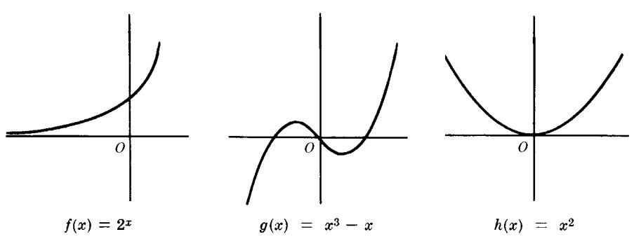
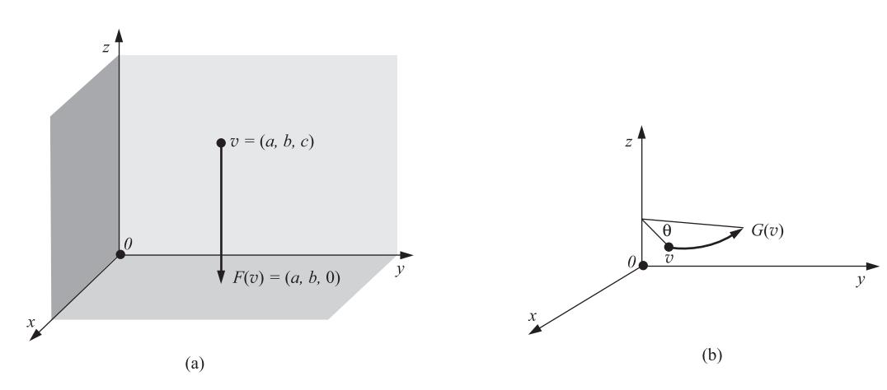
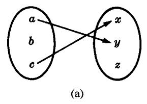
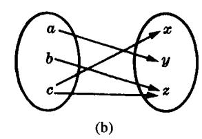
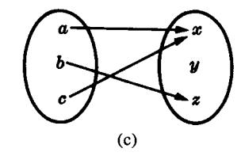
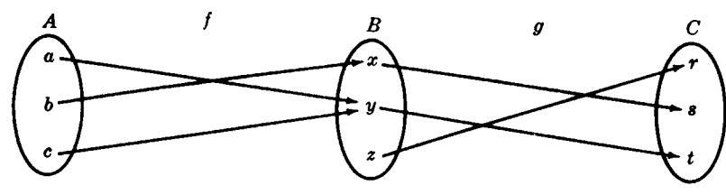
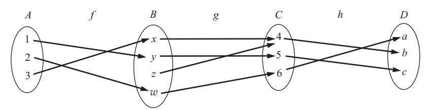
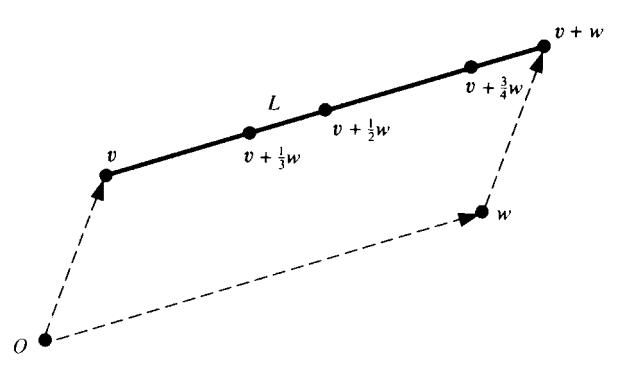

**4.82.** Let V be the vector space (Problem 4.75) of infinite sequences  $(a_1, a_2, \ldots)$  in a field K. Show that W is a subspace of V if W consists of all sequences with (a) 0 as the first element, (b) only a finite number of nonzero elements.

# **Linear Combinations, Linear Spans**

- **4.83.** Consider the vectors u = (1, 2, 3) and v = (2, 3, 1) in  $\mathbb{R}^3$ .
  - (a) Write w = (1,3,8) as a linear combination of u and v.
  - (b) Write w = (2, 4, 5) as a linear combination of u and v.
  - (c) Find k so that w = (1, k, 4) is a linear combination of u and v.
  - (d) Find conditions on a, b, c so that w = (a, b, c) is a linear combination of u and v.
- **4.84.** Write the polynomial  $f(t) = at^2 + bt + c$  as a linear combination of the polynomials  $p_1 = (t-1)^2$ ,  $p_2 = t - 1$ ,  $p_3 = 1$ . [Thus,  $p_1$ ,  $p_2$ ,  $p_3$  span the space  $\mathbf{P}_2(t)$  of polynomials of degree  $\leq 2$ .]
- **4.85.** Find one vector in  $\mathbb{R}^3$  that spans the intersection of U and W where U is the xy-plane—that is,  $U = \{(a, b, 0)\}$ —and W is the space spanned by the vectors (1, 1, 1) and (1, 2, 3).
- Prove that span(S) is the intersection of all subspaces of V containing S. 4.86.
- Show that  $span(S) = span(S \cup \{0\})$ . That is, by joining or deleting the zero vector from a set, we do not change the space spanned by the set.
- 4.88. Show that (a) If  $S \subseteq T$ , then  $\operatorname{span}(S) \subseteq \operatorname{span}(T)$ . (b)  $\operatorname{span}[\operatorname{span}(S)] = \operatorname{span}(S)$ .

#### **Linear Dependence and Linear Independence**

- **4.89.** Determine whether the following vectors in  $\mathbb{R}^4$  are linearly dependent or independent:

  - (a) (1,2,-3,1), (3,7,1,-2), (1,3,7,-4); (b) (1,3,1,-2), (2,5,-1,3), (1,3,7,-2).
- **4.90.** Determine whether the following polynomials u, v, w in  $\mathbf{P}(t)$  are linearly dependent or independent:
  - (a)  $u = t^3 4t^2 + 3t + 3$ ,  $v = t^3 + 2t^2 + 4t 1$ ,  $w = 2t^3 t^2 3t + 5$ ;
  - (b)  $u = t^3 5t^2 2t + 3$ ,  $v = t^3 4t^2 3t + 4$ ,  $w = 2t^3 17t^2 7t + 9$ .
- **4.91.** Show that the following functions f, g, h are linearly independent:
  - (a)  $f(t) = e^t$ ,  $g(t) = \sin t$ ,  $h(t) = t^2$ ; (b)  $f(t) = e^t$ ,  $g(t) = e^{2t}$ , h(t) = t.
- **4.92.** Show that u = (a, b) and v = (c, d) in  $K^2$  are linearly dependent if and only if ad bc = 0.
- **4.93.** Suppose u, v, w are linearly independent vectors. Prove that S is linearly independent where

  - (a)  $S = \{u + v 2w, u v w, u + w\};$  (b)  $S = \{u + v 3w, u + 3v w, v + w\}.$
- **4.94.** Suppose  $\{u_1, \ldots, u_r, w_1, \ldots, w_s\}$  is a linearly independent subset of V. Show that

$$\mathrm{span}(u_i) \cap \mathrm{span}(w_i) = \{0\}$$

- **4.95.** Suppose  $v_1, v_2, \ldots, v_n$  are linearly independent. Prove that S is linearly independent where
  - (a)  $S = \{a_1 v_1, a_2 v_2, \dots, a_n v_n\}$  and each  $a_i \neq 0$ .
  - (b)  $S = \{v_1, \dots, v_{k-1}, w, v_{k+1}, \dots, v_n\}$  and  $w = \sum_i b_i v_i$  and  $b_k \neq 0$ .
- Suppose  $(a_{11},\ldots,a_{1n}),\ (a_{21},\ldots,a_{2n}),\ \ldots,\ (a_{m1},\ldots,a_{mn})$  are linearly independent vectors in  $K^n$ , and suppose  $v_1, v_2, \dots, v_n$  are linearly independent vectors in a vector space V over K. Show that the following

vectors are also linearly independent:

$$w_1 = a_{11}v_1 + \cdots + a_{1n}v_n$$
,  $w_2 = a_{21}v_1 + \cdots + a_{2n}v_n$ , ...,  $w_m = a_{m1}v_1 + \cdots + a_{mn}v_n$ 

#### **Basis and Dimension**

- **4.97.** Find a subset of  $u_1$ ,  $u_2$ ,  $u_3$ ,  $u_4$  that gives a basis for  $W = \text{span}(u_i)$  of  $\mathbb{R}^5$ , where
  - (a)  $u_1 = (1, 1, 1, 2, 3), u_2 = (1, 2, -1, -2, 1), u_3 = (3, 5, -1, -2, 5), u_4 = (1, 2, 1, -1, 4)$
  - (b)  $u_1 = (1, -2, 1, 3, -1), \quad u_2 = (-2, 4, -2, -6, 2), \quad u_3 = (1, -3, 1, 2, 1), \quad u_4 = (3, -7, 3, 8, -1)$
  - (c)  $u_1 = (1,0,1,0,1), u_2 = (1,1,2,1,0), u_3 = (2,1,3,1,1), u_4 = (1,2,1,1,1)$
  - (d)  $u_1 = (1,0,1,1,1), u_2 = (2,1,2,0,1), u_3 = (1,1,2,3,4), u_4 = (4,2,5,4,6)$
- **4.98.** Consider the subspaces  $U = \{(a, b, c, d) : b 2c + d = 0\}$  and  $W = \{(a, b, c, d) : a = d, b = 2c\}$  of  $\mathbb{R}^4$ . Find a basis and the dimension of (a) U, (b) W, (c)  $U \cap W$ .
- **4.99.** Find a basis and the dimension of the solution space W of each of the following homogeneous systems:

(a) 
$$x + 2y - 2z + 2s - t = 0$$
  
 $x + 2y - z + 3s - 2t = 0$   
 $2x + 4y - 7z + s + t = 0$   
(b)  $x + 2y - z + 3s - 4t = 0$   
 $2x + 4y - 2z - s + 5t = 0$   
 $2x + 4y - 2z + 4s - 2t = 0$ 

- **4.100.** Find a homogeneous system whose solution space is spanned by the following sets of three vectors:
  - (a) (1,-2,0,3,-1), (2,-3,2,5,-3), (1,-2,1,2,-2);
  - (b) (1, 1, 2, 1, 1), (1, 2, 1, 4, 3), (3, 5, 4, 9, 7).
- **4.101.** Determine whether each of the following is a basis of the vector space  $\mathbf{P}_n(t)$ :
  - (a)  $\{1, 1+t, 1+t+t^2, 1+t+t^2+t^3, \dots, 1+t+t^2+\dots+t^{n-1}+t^n\}$ ;
  - (b)  $\{1+t, t+t^2, t^2+t^3, \dots, t^{n-2}+t^{n-1}, t^{n-1}+t^n\}$
- **4.102.** Find a basis and the dimension of the subspace W of P(t) spanned by
  - (a)  $u = t^3 + 2t^2 2t + 1$ ,  $v = t^3 + 3t^2 3t + 4$ ,  $w = 2t^3 + t^2 7t 7$ .
  - (b)  $u = t^3 + t^2 3t + 2$ ,  $v = 2t^3 + t^2 + t 4$ ,  $w = 4t^3 + 3t^2 5t + 2$ .
- **4.103.** Find a basis and the dimension of the subspace W of  $V = \mathbf{M}_{2,2}$  spanned by

$$A = \begin{bmatrix} 1 & -5 \\ -4 & 2 \end{bmatrix}, \qquad B = \begin{bmatrix} 1 & 1 \\ -1 & 5 \end{bmatrix}, \qquad C = \begin{bmatrix} 2 & -4 \\ -5 & 7 \end{bmatrix}, \qquad D = \begin{bmatrix} 1 & -7 \\ -5 & 1 \end{bmatrix}$$

#### Rank of a Matrix, Row and Column Spaces

**4.104.** Find the rank of each of the following matrices:

(a) 
$$\begin{bmatrix} 1 & 3 & -2 & 5 & 4 \\ 1 & 4 & 1 & 3 & 5 \\ 1 & 4 & 2 & 4 & 3 \\ 2 & 7 & -3 & 6 & 13 \end{bmatrix}$$
, (b) 
$$\begin{bmatrix} 1 & 2 & -3 & -2 \\ 1 & 3 & -2 & 0 \\ 3 & 8 & -7 & -2 \\ 2 & 1 & -9 & -10 \end{bmatrix}$$
, (c) 
$$\begin{bmatrix} 1 & 1 & 2 \\ 4 & 5 & 5 \\ 5 & 8 & 1 \\ -1 & -2 & 2 \end{bmatrix}$$

**4.105.** For k = 1, 2, ..., 5, find the number  $n_k$  of linearly independent subsets consisting of k columns for each of the following matrices:

(a) 
$$A = \begin{bmatrix} 1 & 1 & 0 & 2 & 3 \\ 1 & 2 & 0 & 2 & 5 \\ 1 & 3 & 0 & 2 & 7 \end{bmatrix}$$
, (b)  $B = \begin{bmatrix} 1 & 2 & 1 & 0 & 2 \\ 1 & 2 & 3 & 0 & 4 \\ 1 & 1 & 5 & 0 & 6 \end{bmatrix}$ 

**4.106.** Let (a) 
$$A = \begin{bmatrix} 1 & 2 & 1 & 3 & 1 & 6 \\ 2 & 4 & 3 & 8 & 3 & 15 \\ 1 & 2 & 2 & 5 & 3 & 11 \\ 4 & 8 & 6 & 16 & 7 & 32 \end{bmatrix}$$
, (b)  $B = \begin{bmatrix} 1 & 2 & 2 & 1 & 2 & 1 \\ 2 & 4 & 5 & 4 & 5 & 5 \\ 1 & 2 & 3 & 4 & 4 & 6 \\ 3 & 6 & 7 & 7 & 9 & 10 \end{bmatrix}$ 

For each matrix (where  $C_1, \ldots, C_6$  denote its columns):

- (i) Find its row canonical form M.
- (ii) Find the columns that are linear combinations of preceding columns.
- (iii) Find columns (excluding  $C_6$ ) that form a basis for the column space.
- (iv) Express  $C_6$  as a linear combination of the basis vectors obtained in (iii).
- **4.107.** Determine which of the following matrices have the same row space:

$$A = \begin{bmatrix} 1 & -2 & -1 \\ 3 & -4 & 5 \end{bmatrix}, \qquad B = \begin{bmatrix} 1 & -1 & 2 \\ 2 & 3 & -1 \end{bmatrix}, \qquad C = \begin{bmatrix} 1 & -1 & 3 \\ 2 & -1 & 10 \\ 3 & -5 & 1 \end{bmatrix}$$

**4.108.** Determine which of the following subspaces of  $\mathbb{R}^3$  are identical:

$$\begin{split} U_1 = \mathrm{span}[(1,1,-1),\ (2,3,-1),\ (3,1,-5)], & U_2 = \mathrm{span}[(1,-1,-3),\ (3,-2,-8),\ (2,1,-3)] \\ U_3 = \mathrm{span}[(1,1,1),\ (1,-1,3),\ (3,-1,7)] \end{split}$$

**4.109.** Determine which of the following subspaces of  $\mathbb{R}^4$  are identical:

$$\begin{split} U_1 = \mathrm{span}[(1,2,1,4), \ (2,4,1,5), \ (3,6,2,9)], & U_2 = \mathrm{span}[(1,2,1,2), \ (2,4,1,3)], \\ U_3 = \mathrm{span}[(1,2,3,10), \ (2,4,3,11)] \end{split}$$

**4.110.** Find a basis for (i) the row space and (ii) the column space of each matrix M:

(a) 
$$M = \begin{bmatrix} 0 & 0 & 3 & 1 & 4 \\ 1 & 3 & 1 & 2 & 1 \\ 3 & 9 & 4 & 5 & 2 \\ 4 & 12 & 8 & 8 & 7 \end{bmatrix}$$
, (b)  $M = \begin{bmatrix} 1 & 2 & 1 & 0 & 1 \\ 1 & 2 & 2 & 1 & 3 \\ 3 & 6 & 5 & 2 & 7 \\ 2 & 4 & 1 & -1 & 0 \end{bmatrix}$ .

- **4.111.** Show that if any row is deleted from a matrix in echelon (respectively, row canonical) form, then the resulting matrix is still in echelon (respectively, row canonical) form.
- **4.112.** Let A and B be arbitrary  $m \times n$  matrices. Show that  $\operatorname{rank}(A+B) \leq \operatorname{rank}(A) + \operatorname{rank}(B)$ .
- **4.113.** Let r = rank(A + B). Find  $2 \times 2$  matrices A and B such that (a) r < rank(A), rank(B); (b) r = rank(A) = rank(B); (c) r > rank(A), rank(B).

#### **Sums, Direct Sums, Intersections**

- **4.114.** Suppose U and W are two-dimensional subspaces of  $K^3$ . Show that  $U \cap W \neq \{0\}$ .
- **4.115.** Suppose U and W are subspaces of V such that dim U=4, dim W=5, and dim V=7. Find the possible dimensions of  $U\cap W$ .
- **4.116.** Let U and W be subspaces of  $\mathbb{R}^3$  for which dim U=1, dim W=2, and  $U \not\subseteq W$ . Show that  $\mathbb{R}^3=U\oplus W$ .
- **4.117.** Consider the following subspaces of **R**5:

$$U = \text{span}[(1, -1, -1, -2, 0), (1, -2, -2, 0, -3), (1, -1, -2, -2, 1)]$$
  
$$W = \text{span}[(1, -2, -3, 0, -2), (1, -1, -3, 2, -4), (1, -1, -2, 2, -5)]$$

- (a) Find two homogeneous systems whose solution spaces are U and W, respectively.
- (b) Find a basis and the dimension of  $U \cap W$ .
- **4.118.** Let  $U_1$ ,  $U_2$ ,  $U_3$  be the following subspaces of  $\mathbb{R}^3$ :

$$U_1 = \{(a,b,c): a=c\}, \qquad \quad U_2 = \{(a,b,c): a+b+c=0\}, \qquad \quad U_3 = \{(0,0,c)\}$$

Show that (a)  $\mathbf{R}^3 = U_1 + U_2$ , (b)  $\mathbf{R}^3 = U_2 + U_3$ , (c)  $\mathbf{R}^3 = U_1 + U_3$ . When is the sum direct?

**4.119.** Suppose  $U, W_1, W_2$  are subspaces of a vector space V. Show that

$$(U \cap W_1) + (U \cap W_2) \subseteq U \cap (W_1 + W_2)$$

Find subspaces of  $\mathbb{R}^2$  for which equality does not hold.

- **4.120.** Suppose  $W_1, W_2, \dots, W_r$  are subspaces of a vector space V. Show that
  - (a)  $\operatorname{span}(W_1, W_2, \dots, W_r) = W_1 + W_2 + \dots + W_r$ .
  - (b) If  $S_i$  spans  $W_i$  for i = 1, ..., r, then  $S_1 \cup S_2 \cup \cdots \cup S_r$  spans  $W_1 + W_2 + \cdots + W_r$ .
- **4.121.** Suppose  $V = U \oplus W$ . Show that dim  $V = \dim U + \dim W$ .
- **4.122.** Let S and T be arbitrary nonempty subsets (not necessarily subspaces) of a vector space V and let k be a scalar. The sum S + T and the scalar product kS are defined by

$$S + T = \{u + v : u \in S, v \in T\},$$
  $kS = \{ku : u \in S\}$ 

[We also write w + S for  $\{w\} + S$ .] Let

$$S = \{(1,2), (2,3)\}, \qquad T = \{(1,4), (1,5), (2,5)\}, \qquad w = (1,1), \qquad k = 3$$

Find: (a) S + T, (b) w + S, (c) kS, (d) kT, (e) kS + kT, (f) k(S + T).

- **4.123.** Show that the above operations of S + T and kS satisfy
  - (a) Commutative law: S + T = T + S.
  - (b) Associative law:  $(S_1 + S_2) + S_3 = S_1 + (S_2 + S_3)$ .
  - (c) Distributive law: k(S+T) = kS + kT.
  - (d)  $S + \{0\} = \{0\} + S = S \text{ and } S + V = V + S = V.$
- **4.124.** Let V be the vector space of n-square matrices. Let U be the subspace of upper triangular matrices, and let W be the subspace of lower triangular matrices. Find (a)  $U \cap W$ , (b) U + W.
- **4.125.** Let V be the external direct sum of vector spaces U and W over a field K. (See Problem 4.76.) Let

$$\hat{U} = \{(u,0) : u \in U\}$$
 and  $\hat{W} = \{(0,w) : w \in W\}$ 

Show that (a)  $\hat{U}$  and  $\hat{W}$  are subspaces of V, (b)  $V = \hat{U} \oplus \hat{W}$ .

- **4.126.** Suppose V = U + W. Let  $\hat{V}$  be the external direct sum of U and W. Show that V is isomorphic to  $\hat{V}$  under the correspondence  $v = u + w \leftrightarrow (u, w)$ .
- **4.127.** Use induction to prove (a) Theorem 4.22, (b) Theorem 4.23.

#### **Coordinates**

- **4.128.** The vectors  $u_1 = (1, -2)$  and  $u_2 = (4, -7)$  form a basis S of  $\mathbb{R}^2$ . Find the coordinate vector [v] of v relative to S where (a) v = (5, 3), (b) v = (a, b).
- **4.129.** The vectors  $u_1 = (1, 2, 0)$ ,  $u_2 = (1, 3, 2)$ ,  $u_3 = (0, 1, 3)$  form a basis S of  $\mathbb{R}^3$ . Find the coordinate vector [v] of v relative to S where (a) v = (2, 7, -4), (b) v = (a, b, c).

- **4.130.**  $S = \{t^3 + t^2, t^2 + t, t + 1, 1\}$  is a basis of  $P_3(t)$ . Find the coordinate vector [v] of v relative to S where (a)  $v = 2t^3 + t^2 4t + 2$ , (b)  $v = at^3 + bt^2 + ct + d$ .
- **4.131.** Let  $V = \mathbf{M}_{2,2}$ . Find the coordinate vector [A] of A relative to S where

$$S = \left\{ \begin{bmatrix} 1 & 1 \\ 1 & 1 \end{bmatrix}, \quad \begin{bmatrix} 1 & -1 \\ 1 & 0 \end{bmatrix}, \quad \begin{bmatrix} 1 & 1 \\ 0 & 0 \end{bmatrix}, \quad \begin{bmatrix} 1 & 0 \\ 0 & 0 \end{bmatrix} \right\} \quad \text{and} \quad \text{(a)} \quad A = \begin{bmatrix} 3 & -5 \\ 6 & 7 \end{bmatrix}, \quad \text{(b)} \quad A = \begin{bmatrix} a & b \\ c & d \end{bmatrix}$$

**4.132.** Find the dimension and a basis of the subspace W of  $P_3(t)$  spanned by

$$u = t^3 + 2t^2 - 3t + 4$$
,  $v = 2t^3 + 5t^2 - 4t + 7$ ,  $w = t^3 + 4t^2 + t + 2$ 

**4.133.** Find the dimension and a basis of the subspace W of  $M = M_{2,3}$  spanned by

$$A = \begin{bmatrix} 1 & 2 & 1 \\ 3 & 1 & 2 \end{bmatrix}, \qquad B = \begin{bmatrix} 2 & 4 & 3 \\ 7 & 5 & 6 \end{bmatrix}, \qquad C = \begin{bmatrix} 1 & 2 & 3 \\ 5 & 7 & 6 \end{bmatrix}$$

#### **Miscellaneous Problems**

- **4.134.** Answer true or false. If false, prove it with a counterexample.
  - (a) If  $u_1$ ,  $u_2$ ,  $u_3$  span V, then dim V = 3.
  - (b) If A is a  $4 \times 8$  matrix, then any six columns are linearly dependent.
  - (c) If  $u_1$ ,  $u_2$ ,  $u_3$  are linearly independent, then  $u_1$ ,  $u_2$ ,  $u_3$ , w are linearly dependent.
  - (d) If  $u_1$ ,  $u_2$ ,  $u_3$ ,  $u_4$  are linearly independent, then dim  $V \ge 4$ .
  - (e) If  $u_1$ ,  $u_2$ ,  $u_3$  span V, then w,  $u_1$ ,  $u_2$ ,  $u_3$  span V.
  - (f) If  $u_1$ ,  $u_2$ ,  $u_3$ ,  $u_4$  are linearly independent, then  $u_1$ ,  $u_2$ ,  $u_3$  are linearly independent.
- **4.135.** Answer true or false. If false, prove it with a counterexample.
  - (a) If any column is deleted from a matrix in echelon form, then the resulting matrix is still in echelon form.
  - (b) If any column is deleted from a matrix in row canonical form, then the resulting matrix is still in row canonical form.
  - (c) If any column without a pivot is deleted from a matrix in row canonical form, then the resulting matrix is in row canonical form.
- **4.136.** Determine the dimension of the vector space W of the following n-square matrices:
  - (a) symmetric matrices, (b) antisy
- (b) antisymmetric matrices,
  - (d) diagonal matrices, (c) scalar matrices.
- **4.137.** Let  $t_1, t_2, \ldots, t_n$  be symbols, and let K be any field. Let V be the following set of expressions where  $a_i \in K$ :

$$a_1t_1 + a_2t_2 + \cdots + a_nt_n$$

Define addition in V and scalar multiplication on V by

$$(a_1t_1 + \dots + a_nt_n) + (b_1t_1 + \dots + b_nt_n) = (a_1 + b_1)t_1 + \dots + (a_nb_{nm})t_n$$
$$k(a_1t_1 + a_2t_2 + \dots + a_nt_n) = ka_1t_1 + ka_2t_2 + \dots + ka_nt_n$$

Show that V is a vector space over K with the above operations. Also, show that  $\{t_1, \ldots, t_n\}$  is a basis of V, where

$$t_i = 0t_1 + \dots + 0t_{i-1} + 1t_i + 0t_{i+1} + \dots + 0t_n$$

# **ANSWERS TO SUPPLEMENTARY PROBLEMS**

#### [Some answers, such as bases, need not be unique.]

- (a)  $E_1 = 26u 22v$ ; (b) The sum 7v + 8 is not defined, so  $E_2$  is not defined;
  - (c)  $E_3 = 23u + 5v$ ; (d) Division by v is not defined, so  $E_4$  is not defined.
- **4.77.** (a) Yes; (b) No; e.g.,  $(1,2,3) \in W$  but  $-2(1,2,3) \notin W$ ;
  - (c) No; e.g.,  $(1,0,0), (0,1,0) \in W$ , but not their sum; (d) Yes;
  - (e) No; e.g.,  $(1,1,1) \in W$ , but  $2(1,1,1) \notin W$ ; (f) Yes
- 4.79. The zero vector 0 is not a solution.
- (a)  $w = 3u_1 u_2$ , (b) Impossible, (c)  $k = \frac{11}{5}$ , (d) 7a 5b + c = 04.83.
- 4.84. Using  $f = xp_1 + yp_2 + zp_3$ , we get x = a, y = 2a + b, z = a + b + c
- **4.85.** v = (2, 1, 0)
- **4.89.** (a) Dependent, (b) Independent
- **4.90.** (a) Independent, (b) Dependent
- **4.97.** (a)  $u_1, u_2, u_4$ ; (b)  $u_1, u_2, u_3$ ; (c)  $u_1, u_2, u_4$ ; (d)  $u_1, u_2, u_3$
- **4.98.** (a) dim U = 3, (b) dim W = 2, (c) dim $(U \cap W) = 1$
- **4.99.** (a) Basis:  $\{(2, -1, 0, 0, 0), (4, 0, 1, -1, 0), (3, 0, 1, 0, 1)\}; \dim W = 3;$ (b) Basis:  $\{(2, -1, 0, 0, 0), (1, 0, 1, 0, 0)\}$ ; dim W = 2
- **4.100.** (a) 5x + y z s = 0, x + y z t = 0; (b) 3x - y - z = 0, 2x - 3y + s = 0, x - 2y + t = 0
- **4.101.** (a) Yes, (b) No, because dim  $P_n(t) = n + 1$ , but the set contains only n elements.
- **4.102.** (a)  $\dim W = 2$ , (b)  $\dim W = 3$
- **4.103.** dim W = 2
- **4.104.** (a) 3, (b) 2, (c) 3
- **4.105.** (a)  $n_1 = 4$ ,  $n_2 = 5$ ,  $n_3 = n_4 = n_5 = 0$ ; (b)  $n_1 = 4$ ,  $n_2 = 6$ ,  $n_3 = 3$ ,  $n_4 = n_5 = 0$
- **4.106.** (a) (i)  $M = \begin{bmatrix} 1, 2, 0, 1, 0, 3; & 0, 0, 1, 2, 0, 1; & 0, 0, 0, 0, 1, 2; & 0 \end{bmatrix};$ 
  - (ii)  $C_2$ ,  $C_4$ ,  $C_6$ ; (iii)  $C_1$ ,  $C_3$ ,  $C_5$ ; (iv)  $C_6 = 3C_1 + C_3 + 2C_5$ . (b) (i) M = [1, 2, 0, 0, 3, 1; 0, 0, 1, 0, -1, -1; 0, 0, 0, 1, 1, 2; 0];(ii)  $C_2$ ,  $C_5$ ,  $C_6$ ; (iii)  $C_1$ ,  $C_3$ ,  $C_4$ ; (iv)  $C_6 = C_1 C_3 + 2C_4$
- **4.107.** A and C are row equivalent to  $\begin{bmatrix} 1 & 0 & 7 \\ 0 & 1 & 4 \end{bmatrix}$ , but not B
- **4.108.**  $U_1$  and  $U_2$  are row equivalent to  $\begin{bmatrix} 1 & 0 & -2 \\ 0 & 1 & 1 \end{bmatrix}$ , but not  $U_3$
- **4.109.**  $U_1$  and  $U_3$  are row equivalent to  $\begin{bmatrix} 1 & 2 & 0 & 1 \\ 0 & 0 & 1 & 3 \end{bmatrix}$ , but not  $U_2$
- **4.110.** (a) (i) (1,3,1,2,1), (0,0,1,-1,-1), (0,0,0,4,7); (ii)  $C_1, C_3, C_4$ ;
  - (b) (i) (1,2,1,0,1), (0,0,1,1,2); (ii)  $C_1, C_3$

**4.113.** (a) 
$$A = \begin{bmatrix} 1 & 1 \\ 0 & 0 \end{bmatrix}$$
,  $B = \begin{bmatrix} -1 & -1 \\ 0 & 0 \end{bmatrix}$ ; (b)  $A = \begin{bmatrix} 1 & 0 \\ 0 & 0 \end{bmatrix}$ ,  $B = \begin{bmatrix} 0 & 2 \\ 0 & 0 \end{bmatrix}$ ;

(c) 
$$A = \begin{bmatrix} 1 & 0 \\ 0 & 0 \end{bmatrix}$$
,  $B = \begin{bmatrix} 0 & 0 \\ 0 & 1 \end{bmatrix}$ 

**4.115.**  $\dim(U \cap W) = 2, 3, \text{ or } 4$ 

**4.117.** (a) (i) 
$$3x + 4y - z - t = 0$$
 (ii)  $4x + 2y - s = 0$   $9x + 2y + z + t = 0$ ;

(b) Basis: 
$$\{(1, -2, -5, 0, 0), (0, 0, 1, 0, -1)\}; \dim(U \cap W) = 2$$

- **4.118.** The sum is direct in (b) and (c).
- **4.119.** In  $\mathbb{R}^2$ , let U, V, W be, respectively, the line y = x, the x-axis, the y-axis.

**4.122.** (a) 
$$\{(2,6), (2,7), (3,7), (3,8), (4,8)\};$$
 (b)  $\{(2,3), (3,4)\};$  (c)  $\{(3,6), (6,9)\};$  (d)  $\{(3,12), (3,15), (6,15)\};$  (e and f)  $\{(6,18), (6,21), (9,21), (9,24), (12,24)\}$ 

- **4.124.** (a) Diagonal matrices, (b) V
- **4.128.** (a) [-41, 11], (b) [-7a 4b, 2a + b]
- **4.129.** (a) [-11, 13, -10], (b) [c-3b+7a, -c+3b-6a, c-2b+4a]
- **4.130.** (a) [2,-1,-2,2], (b) [a, b-c, c-b+a, d-c+b-a]
- **4.131.** (a) [7, -1, -13, 10], (b) [d, c-d, b+c-2d, a-b-2c+2d]
- **4.132.** dim W = 2; basis:  $\{t^3 + 2t^2 3t + 4, t^2 + 2t 1\}$
- **4.133.** dim W = 2; basis: {[1,2,1,3,1,2], [0,0,1,1,3,2]}
- **4.134.** (a) False; (1, 1), (1, 2), (2, 1) span  $\mathbb{R}^2$ ; (b) True;
  - (c) False; (1,0,0,0), (0,1,0,0), (0,0,1,0), w = (0,0,0,1);
  - (d) True; (e) True; (f) True
- **4.135.** (a) True; (b) False; e.g. delete  $C_2$  from  $\begin{bmatrix} 1 & 0 & 3 \\ 0 & 1 & 2 \end{bmatrix}$ ; (c) True
- **4.136.** (a)  $\frac{1}{2}n(n+1)$ , (b)  $\frac{1}{2}n(n-1)$ , (c) n, (d) 1

# Linear Mappings

#### 5.1 Introduction

The main subject matter of linear algebra is the study of linear mappings and their representation by means of matrices. This chapter introduces us to these linear maps and Chapter 6 shows how they can be represented by matrices. First, however, we begin with a study of mappings in general.

# 5.2 Mappings, Functions

Let A and B be arbitrary nonempty sets. Suppose to each element in  $a \in A$  there is assigned a unique element of B; called the *image* of a. The collection f of such assignments is called a *mapping* (or map) from A into B, and it is denoted by

$$f:A\to B$$

The set A is called the *domain* of the mapping, and B is called the *target set*. We write f(a), read "f of a," for the unique element of B that f assigns to  $a \in A$ .

One may also view a mapping  $f: A \to B$  as a computer that, for each input value  $a \in A$ , produces a unique output  $f(a) \in B$ .

**Remark:** The term *function* is used synonymously with the word *mapping*, although some texts reserve the word "function" for a real-valued or complex-valued mapping.

Consider a mapping  $f: A \to B$ . If A' is any subset of A, then f(A') denotes the set of images of elements of A'; and if B' is any subset of B, then  $f^{-1}(B')$  denotes the set of elements of A, each of whose image lies in B. That is,

$$f(A') = \{ f(a) : a \in A' \}$$
 and  $f^{-1}(B') = \{ a \in A : f(a) \in B' \}$ 

We call f(A') the *image* of A' and  $f^{-1}(B')$  the *inverse image* or *preimage* of B'. In particular, the set of all images (i.e., f(A)) is called the image or *range* of f.

To each mapping  $f:A\to B$  there corresponds the subset of  $A\times B$  given by  $\{(a,f(a)):a\in A\}$ . We call this set the graph of f. Two mappings  $f:A\to B$  and  $g:A\to B$  are defined to be equal, written f=g, if f(a)=g(a) for every  $a\in A$ —that is, if they have the same graph. Thus, we do not distinguish between a function and its graph. The negation of f=g is written  $f\neq g$  and is the statement:

There exists an 
$$a \in A$$
 for which  $f(a) \neq g(a)$ .

Sometimes the "barred" arrow  $\mapsto$  is used to denote the image of an arbitrary element  $x \in A$  under a mapping  $f: A \to B$  by writing

$$x \mapsto f(x)$$

This is illustrated in the following example.

#### **EXAMPLE 5.1**

(a) Let  $f : \mathbf{R} \to \mathbf{R}$  be the function that assigns to each real number x its square  $x^2$ . We can denote this function by writing

$$f(x) = x^2$$
 or  $x \mapsto x^2$ 

Here the image of -3 is 9, so we may write f(-3) = 9. However,  $f^{-1}(9) = \{3, -3\}$ . Also,  $f(\mathbf{R}) = [0, \infty) = \{x : x \ge 0\}$  is the image of f.

(b) Let  $A = \{a, b, c, d\}$  and  $B = \{x, y, z, t\}$ . Then the following defines a mapping  $f: A \to B$ :

$$f(a) = y$$
,  $f(b) = x$ ,  $f(c) = z$ ,  $f(d) = y$  or  $f = \{(a, y), (b, x), (c, z), (d, y)\}$ 

The first defines the mapping explicitly, and the second defines the mapping by its graph. Here,

$$f({a,b,d}) = {f(a),f(b),f(d)} = {y,x,y} = {x,y}$$

Furthermore,  $f(A) = \{x, y, z\}$  is the image of f.

**EXAMPLE 5.2** Let V be the vector space of polynomials over **R**, and let  $p(t) = 3t^2 - 5t + 2$ .

- (a) The derivative defines a mapping  $\mathbf{D}: V \to V$  where, for any polynomials f(t), we have  $\mathbf{D}(f) = df/dt$ . Thus,  $\mathbf{D}(p) = \mathbf{D}(3t^2 5t + 2) = 6t 5$
- (b) The integral, say from 0 to 1, defines a mapping  $\mathbf{J}: V \to \mathbf{R}$ . That is, for any polynomial f(t),

$$\mathbf{J}(f) = \int_0^1 f(t) dt$$
, and so  $\mathbf{J}(p) = \int_0^1 (3t^2 - 5t + 2) = \frac{1}{2}$ 

Observe that the mapping in (b) is from the vector space V into the scalar field  $\mathbf{R}$ , whereas the mapping in (a) is from the vector space V into itself.

# **Matrix Mappings**

Let A be any  $m \times n$  matrix over K. Then A determines a mapping  $F_A : K^n \to K^m$  by

$$F_A(u) = Au$$

where the vectors in  $K^n$  and  $K^m$  are written as columns. For example, suppose

$$A = \begin{bmatrix} 1 & -4 & 5 \\ 2 & 3 & -6 \end{bmatrix} \quad \text{and} \quad u = \begin{bmatrix} 1 \\ 3 \\ -5 \end{bmatrix}$$

then

$$F_A(u) = Au = \begin{bmatrix} 1 & -4 & 5 \\ 2 & 3 & -6 \end{bmatrix} \begin{bmatrix} 1 \\ 3 \\ -5 \end{bmatrix} = \begin{bmatrix} -36 \\ 41 \end{bmatrix}$$

**Remark:** For notational convenience, we will frequently denote the mapping  $F_A$  by the letter A, the same symbol as used for the matrix.

#### **Composition of Mappings**

Consider two mappings  $f: A \to B$  and  $g: B \to C$ , illustrated below:

$$A \xrightarrow{f} B \xrightarrow{g} C$$

The *composition* of f and g, denoted by  $g \circ f$ , is the mapping  $g \circ f : A \to C$  defined by

$$(g \circ f)(a) \equiv g(f(a))$$

That is, first we apply f to  $a \in A$ , and then we apply g to  $f(a) \in B$  to get  $g(f(a)) \in C$ . Viewing f and g as "computers," the composition means we first input  $a \in A$  to get the output  $f(a) \in B$  using f, and then we input f(a) to get the output  $g(f(a)) \in C$  using g.

Our first theorem tells us that the composition of mappings satisfies the associative law.

**THEOREM 5.1:** Let 
$$f: A \rightarrow B$$
,  $g: B \rightarrow C$ ,  $h: C \rightarrow D$ . Then

$$h \circ (g \circ f) = (h \circ g) \circ f$$

We prove this theorem here. Let  $a \in A$ . Then

$$(h \circ (g \circ f))(a) = h((g \circ f)(a)) = h(g(f(a)))$$

$$((h \circ g) \circ f)(a) = (h \circ g)(f(a)) = h(g(f(a)))$$

Thus,  $(h \circ (g \circ f))(a) = ((h \circ g) \circ f)(a)$  for every  $a \in A$ , and so  $h \circ (g \circ f) = (h \circ g) \circ f$ .

# **One-to-One and Onto Mappings**

We formally introduce some special types of mappings.

**DEFINITION:** A mapping  $f: A \rightarrow B$  is said to be *one-to-one* (or 1-1 or *injective*) if different elements

of A have distinct images; that is,

If 
$$f(a) = f(a')$$
, then  $a = a'$ .

**DEFINITION:** A mapping  $f: A \to B$  is said to be *onto* (or f maps A onto B or *surjective*) if every  $b \in B$ 

is the image of at least one  $a \in A$ .

**DEFINITION:** A mapping  $f: A \to B$  is said to be a *one-to-one correspondence* between A and B (or

*bijective*) if f is both one-to-one and onto.

**EXAMPLE 5.3** Let  $f: \mathbf{R} \to \mathbf{R}$ ,  $g: \mathbf{R} \to \mathbf{R}$ ,  $h: \mathbf{R} \to \mathbf{R}$  be defined by

$$f(x) = 2^x$$
,  $g(x) = x^3 - x$ ,  $h(x) = x^2$ 

The graphs of these functions are shown in Fig. 5-1. The function f is one-to-one. Geometrically, this means that each horizontal line does not contain more than one point of f. The function g is onto. Geometrically, this means that each horizontal line contains at least one point of g. The function h is neither one-to-one nor onto. For example, both 2 and -2 have the same image 4, and -16 has no preimage.

Figure 5-1

#### **Identity and Inverse Mappings**

Let A be any nonempty set. The mapping  $f: A \to A$  defined by f(a) = a—that is, the function that assigns to each element in A itself—is called *identity mapping*. It is usually denoted by  $\mathbf{1}_A$  or  $\mathbf{1}$  or  $\mathbf{1}$ . Thus, for any  $a \in A$ , we have  $\mathbf{1}_A(a) = a$ .

Now let 
$$f: A \to B$$
. We call  $g: B \to A$  the inverse of  $f$ , written  $f^{-1}$ , if

$$f \circ g = \mathbf{1}_B$$
 and  $g \circ f = \mathbf{1}_A$ 

We emphasize that f has an inverse if and only if f is a one-to-one correspondence between A and B; that is, f is one-to-one and onto (Problem 5.7). Also, if  $b \in B$ , then  $f^{-1}(b) = a$ , where a is the unique element of A for which f(a) = b

# **5.3 Linear Mappings (Linear Transformations)**

We begin with a definition.

**DEFINITION:** Let V and U be vector spaces over the same field K. A mapping  $F: V \to U$  is called a *linear mapping* or *linear transformation* if it satisfies the following two conditions:

- (1) For any vectors  $v, w \in V$ , F(v+w) = F(v) + F(w).
- (2) For any scalar k and vector  $v \in V$ , F(kv) = kF(v).

Namely,  $F: V \to U$  is linear if it "preserves" the two basic operations of a vector space, that of vector addition and that of scalar multiplication.

Substituting k = 0 into condition (2), we obtain F(0) = 0. Thus, every linear mapping takes the zero vector into the zero vector.

Now for any scalars  $a, b \in K$  and any vector  $v, w \in V$ , we obtain

$$F(av + bw) = F(av) + F(bw) = aF(v) + bF(w)$$

More generally, for any scalars  $a_i \in K$  and any vectors  $v_i \in V$ , we obtain the following basic property of linear mappings:

$$F(a_1v_1 + a_2v_2 + \dots + a_mv_m) = a_1F(v_1) + a_2F(v_2) + \dots + a_mF(v_m)$$

**Remark 1:** A linear mapping  $F: V \to U$  is completely characterized by the condition

$$F(av + bw) = aF(v) + bF(w) \tag{*}$$

and so this condition is sometimes used as its defintion.

**Remark 2:** The term *linear transformation* rather than *linear mapping* is frequently used for linear mappings of the form  $F: \mathbb{R}^n \to \mathbb{R}^m$ .

#### **EXAMPLE 5.4**

(a) Let  $F: \mathbb{R}^3 \to \mathbb{R}^3$  be the "projection" mapping into the *xy*-plane; that is, F is the mapping defined by F(x,y,z) = (x,y,0). We show that F is linear. Let v = (a,b,c) and w = (a',b',c'). Then

$$F(v+w) = F(a+a', b+b', c+c') = (a+a', b+b', 0)$$
  
=  $(a,b,0) + (a',b',0) = F(v) + F(w)$ 

and, for any scalar k,

$$F(kv) = F(ka, kb, kc) = (ka, kb, 0) = k(a, b, 0) = kF(v)$$

Thus, F is linear.

(b) Let  $G: \mathbb{R}^2 \to \mathbb{R}^2$  be the "translation" mapping defined by G(x,y) = (x+1, y+2). [That is, G adds the vector (1,2) to any vector v = (x,y) in  $\mathbb{R}^2$ .] Note that

$$G(0) = G(0,0) = (1,2) \neq 0$$

Thus, the zero vector is not mapped into the zero vector. Hence, G is not linear.

**EXAMPLE 5.5** (Derivative and Integral Mappings) Consider the vector space  $V = \mathbf{P}(t)$  of polynomials over the real field  $\mathbf{R}$ . Let u(t) and v(t) be any polynomials in V and let k be any scalar.

(a) Let  $\mathbf{D}: V \to V$  be the derivative mapping. One proves in calculus that

$$\frac{d(u+v)}{dt} = \frac{du}{dt} + \frac{dv}{dt} \quad \text{and} \quad \frac{d(ku)}{dt} = k\frac{du}{dt}$$

That is,  $\mathbf{D}(u+v) = \mathbf{D}(u) + \mathbf{D}(v)$  and  $\mathbf{D}(ku) = k\mathbf{D}(u)$ . Thus, the derivative mapping is linear.

(b) Let  $\mathbf{J}: V \to \mathbf{R}$  be an integral mapping, say

$$\mathbf{J}(f(t)) = \int_0^1 f(t) \ dt$$

One also proves in calculus that,

$$\int_0^1 [u(t) + v(t)]dt = \int_0^1 u(t) dt + \int_0^1 v(t) dt$$

and

$$\int_0^1 ku(t) \ dt = k \int_0^1 u(t) \ dt$$

That is,  $\mathbf{J}(u+v) = \mathbf{J}(u) + \mathbf{J}(v)$  and  $\mathbf{J}(ku) = k\mathbf{J}(u)$ . Thus, the integral mapping is linear.

#### **EXAMPLE 5.6** (Zero and Identity Mappings)

(a) Let  $F: V \to U$  be the mapping that assigns the zero vector  $0 \in U$  to every vector  $v \in V$ . Then, for any vectors  $v, w \in V$  and any scalar  $k \in K$ , we have

$$F(v+w) = 0 = 0 + 0 = F(v) + F(w)$$
 and  $F(kv) = 0 = k0 = kF(v)$ 

Thus, F is linear. We call F the zero mapping, and we usually denote it by 0.

(b) Consider the identity mapping  $I: V \to V$ , which maps each  $v \in V$  into itself. Then, for any vectors  $v, w \in V$  and any scalars  $a, b \in K$ , we have

$$I(av + bw) = av + bw = aI(v) + bI(w)$$

Thus, I is linear.

Our next theorem (proved in Problem 5.13) gives us an abundance of examples of linear mappings. In particular, it tells us that a linear mapping is completely determined by its values on the elements of a basis.

**THEOREM 5.2:** Let V and U be vector spaces over a field K. Let  $\{v_1, v_2, \ldots, v_n\}$  be a basis of V and let  $u_1, u_2, \ldots, u_n$  be any vectors in U. Then there exists a unique linear mapping  $F: V \to U$  such that  $F(v_1) = u_1, F(v_2) = u_2, \ldots, F(v_n) = u_n$ .

We emphasize that the vectors  $u_1, u_2, \dots, u_n$  in Theorem 5.2 are completely arbitrary; they may be linearly dependent or they may even be equal to each other.

#### **Matrices as Linear Mappings**

Let A be any real  $m \times n$  matrix. Recall that A determines a mapping  $F_A: K^n \to K^m$  by  $F_A(u) = Au$  (where the vectors in  $K^n$  and  $K^m$  are written as columns). We show  $F_A$  is linear. By matrix multiplication,

$$F_A(v+w) = A(v+w) = Av + Aw = F_A(v) + F_A(w)$$
  
$$F_A(kv) = A(kv) = k(Av) = kF_A(v)$$

In other words, using A to represent the mapping, we have

$$A(v+w) = Av + Aw$$
 and  $A(kv) = k(Av)$ 

Thus, the matrix mapping A is linear.

# **Vector Space Isomorphism**

The notion of two vector spaces being isomorphic was defined in Chapter 4 when we investigated the coordinates of a vector relative to a basis. We now redefine this concept.

**DEFINITION:** Two vector spaces V and U over K are *isomorphic*, written  $V \cong U$ , if there exists a bijective (one-to-one and onto) linear mapping  $F: V \to U$ . The mapping F is then

called an isomorphism between V and U.

Consider any vector space V of dimension n and let S be any basis of V. Then the mapping

$$v \mapsto [v]_S$$

which maps each vector  $v \in V$  into its coordinate vector  $[v]_s$ , is an isomorphism between V and  $K^n$ .

# 5.4 Kernel and Image of a Linear Mapping

We begin by defining two concepts.

**DEFINITION:** Let  $F: V \to U$  be a linear mapping. The *kernel* of F, written Ker F, is the set of elements in V that map into the zero vector 0 in U; that is,

$$Ker F = \{ v \in V : F(v) = 0 \}$$

The *image* (or *range*) of F, written Im F, is the set of image points in U; that is,

Im 
$$F = \{u \in U : \text{there exists } v \in V \text{ for which } F(v) = u\}$$

The following theorem is easily proved (Problem 5.22).

**THEOREM 5.3:** Let  $F: V \to U$  be a linear mapping. Then the kernel of F is a subspace of V and the image of F is a subspace of U.

Now suppose that  $v_1, v_2, \ldots, v_m$  span a vector space V and that  $F: V \to U$  is linear. We show that  $F(v_1), F(v_2), \ldots, F(v_m)$  span Im F. Let  $u \in \text{Im } F$ . Then there exists  $v \in V$  such that F(v) = u. Because the  $v_i$ 's span V and  $v \in V$ , there exist scalars  $a_1, a_2, \ldots, a_m$  for which

$$v = a_1 v_1 + a_2 v_2 + \dots + a_m v_m$$

Therefore,

$$u = F(v) = F(a_1v_1 + a_2v_2 + \dots + a_mv_m) = a_1F(v_1) + a_2F(v_2) + \dots + a_mF(v_m)$$

Thus, the vectors  $F(v_1), F(v_2), \ldots, F(v_m)$  span Im F.

We formally state the above result.

**PROPOSITION 5.4:** Suppose  $v_1, v_2, \dots, v_m$  span a vector space V, and suppose  $F: V \to U$  is linear. Then  $F(v_1), F(v_2), \dots, F(v_m)$  span Im F.

#### **EXAMPLE 5.7**

(a) Let  $F: \mathbf{R}^3 \to \mathbf{R}^3$  be the projection of a vector v into the xy-plane [as pictured in Fig. 5-2(a)]; that is,

$$F(x, y, z) = (x, y, 0)$$

Clearly the image of F is the entire xy-plane—that is, points of the form (x, y, 0). Moreover, the kernel of F is the z-axis—that is, points of the form (0, 0, c). That is,

Im 
$$F = \{(a, b, c) : c = 0\} = xy$$
-plane and Ker  $F = \{(a, b, c) : a = 0, b = 0\} = z$ -axis

(b) Let  $G: \mathbb{R}^3 \to \mathbb{R}^3$  be the linear mapping that rotates a vector v about the z-axis through an angle  $\theta$  [as pictured in Fig. 5-2(b)]; that is,

$$G(x, y, z) = (x \cos \theta - y \sin \theta, x \sin \theta + y \cos \theta, z)$$

Figure 5-2

Observe that the distance of a vector v from the origin O does not change under the rotation, and so only the zero vector 0 is mapped into the zero vector 0. Thus, Ker  $G = \{0\}$ . On the other hand, every vector u in  $\mathbf{R}^3$  is the image of a vector v in  $\mathbf{R}^3$  that can be obtained by rotating u back by an angle of  $\theta$ . Thus, Im  $G = \mathbf{R}^3$ , the entire space.

**EXAMPLE 5.8** Consider the vector space  $V = \mathbf{P}(t)$  of polynomials over the real field  $\mathbf{R}$ , and let  $H: V \to V$  be the third-derivative operator; that is,  $H[f(t)] = d^3f/dt^3$ . [Sometimes the notation  $\mathbf{D}^3$  is used for H, where  $\mathbf{D}$  is the derivative operator.] We claim that

Ker 
$$H = \{\text{polynomials of degree} \le 2\} = \mathbf{P}_2(t)$$
 and Im  $H = V$ 

The first comes from the fact that  $H(at^2 + bt + c) = 0$  but  $H(t^n) \neq 0$  for  $n \geq 3$ . The second comes from that fact that every polynomial g(t) in V is the third derivative of some polynomial f(t) (which can be obtained by taking the antiderivative of g(t) three times).

#### **Kernel and Image of Matrix Mappings**

Consider, say, a 3 × 4 matrix A and the usual basis  $\{e_1, e_2, e_3, e_4\}$  of  $K^4$  (written as columns):

$$A = \begin{bmatrix} a_1 & a_2 & a_3 & a_4 \\ b_1 & b_2 & b_3 & b_4 \\ c_1 & c_2 & c_3 & c_4 \end{bmatrix}, \qquad e_1 = \begin{bmatrix} 1 \\ 0 \\ 0 \\ 0 \end{bmatrix}, \qquad e_2 = \begin{bmatrix} 1 \\ 0 \\ 0 \\ 0 \end{bmatrix}, \qquad e_3 = \begin{bmatrix} 1 \\ 0 \\ 0 \\ 0 \end{bmatrix}, \qquad e_4 = \begin{bmatrix} 1 \\ 0 \\ 0 \\ 0 \end{bmatrix}$$

Recall that A may be viewed as a linear mapping  $A: K^4 \to K^3$ , where the vectors in  $K^4$  and  $K^3$  are viewed as column vectors. Now the usual basis vectors span  $K^4$ , so their images  $Ae_1$ ,  $Ae_2$ ,  $Ae_3$ ,  $Ae_4$  span the image of A. But the vectors  $Ae_1$ ,  $Ae_2$ ,  $Ae_3$ ,  $Ae_4$  are precisely the columns of A:

$$Ae_1 = [a_1, b_1, c_1]^T,$$
  $Ae_2 = [a_2, b_2, c_2]^T,$   $Ae_3 = [a_3, b_3, c_3]^T,$   $Ae_4 = [a_4, b_4, c_4]^T$ 

Thus, the image of A is precisely the column space of A.

On the other hand, the kernel of A consists of all vectors v for which Av = 0. This means that the kernel of A is the solution space of the homogeneous system AX = 0, called the *null space* of A.

We state the above results formally.

**PROPOSITION 5.5:** Let A be any  $m \times n$  matrix over a field K viewed as a linear map  $A : K^n \to K^m$ . Then  $\operatorname{Ker} A = \operatorname{nullsp}(A)$  and  $\operatorname{Im} A = \operatorname{colsp}(A)$ 

Here colsp(A) denotes the column space of A, and nullsp(A) denotes the null space of A.

# Rank and Nullity of a Linear Mapping

Let  $F: V \to U$  be a linear mapping. The *rank* of F is defined to be the dimension of its image, and the *nullity* of F is defined to be the dimension of its kernel; namely,

$$rank(F) = dim(Im F)$$
 and  $nullity(F) = dim(Ker F)$ 

The following important theorem (proved in Problem 5.23) holds.

**THEOREM 5.6** Let V be of finite dimension, and let  $F: V \to U$  be linear. Then

$$\dim V = \dim(\operatorname{Ker} F) + \dim(\operatorname{Im} F) = \operatorname{nullity}(F) + \operatorname{rank}(F)$$

Recall that the rank of a matrix A was also defined to be the dimension of its column space and row space. If we now view A as a linear mapping, then both definitions correspond, because the image of A is precisely its column space.

**EXAMPLE 5.9** Let  $F: \mathbb{R}^4 \to \mathbb{R}^3$  be the linear mapping defined by

$$F(x, y, z, t) = (x - y + z + t, 2x - 2y + 3z + 4t, 3x - 3y + 4z + 5t)$$

(a) Find a basis and the dimension of the image of F.

First find the image of the usual basis vectors of  $\mathbb{R}^4$ ,

$$F(1,0,0,0) = (1,2,3),$$
  $F(0,0,1,0) = (1,3,4)$ 

$$F(0,1,0,0) = (-1,-2,-3),$$
  $F(0,0,0,1) = (1,4,5)$ 

By Proposition 5.4, the image vectors span  $\operatorname{Im} F$ . Hence, form the matrix M whose rows are these image vectors and row reduce to echelon form:

$$M = \begin{bmatrix} 1 & 2 & 3 \\ -1 & -2 & -3 \\ 1 & 3 & 4 \\ 1 & 4 & 5 \end{bmatrix} \sim \begin{bmatrix} 1 & 2 & 3 \\ 0 & 0 & 0 \\ 0 & 1 & 1 \\ 0 & 2 & 2 \end{bmatrix} \sim \begin{bmatrix} 1 & 2 & 3 \\ 0 & 1 & 1 \\ 0 & 0 & 0 \\ 0 & 0 & 0 \end{bmatrix}$$

Thus, (1,2,3) and (0,1,1) form a basis of Im F. Hence,  $\dim(\operatorname{Im} F)=2$  and  $\operatorname{rank}(F)=2$ .

(b) Find a basis and the dimension of the kernel of the map F.

Set 
$$F(v) = 0$$
, where  $v = (x, y, z, t)$ ,

$$F(x, y, z, t) = (x - y + z + t, 2x - 2y + 3z + 4t, 3x - 3y + 4z + 5t) = (0, 0, 0)$$

Set corresponding components equal to each other to form the following homogeneous system whose solution space is Ker F:

$$x - y + z + t = 0$$
  $x - y + z + t = 0$   $z + 2t = 0$  or  $z + 2t = 0$   $z + 2t = 0$ 

The free variables are y and t. Hence,  $\dim(\operatorname{Ker} F) = 2$  or  $\operatorname{nullity}(F) = 2$ .

- (i) Set v = 1, t = 0 to obtain the solution (-1, 1, 0, 0),
- (ii) Set y = 0, t = 1 to obtain the solution (1, 0, -2, 1).

Thus, (-1, 1, 0, 0) and (1, 0, -2, 1) form a basis for Ker F.

As expected from Theorem 5.6,  $\dim(\operatorname{Im} F) + \dim(\operatorname{Ker} F) = 4 = \dim \mathbb{R}^4$ .

# **Application to Systems of Linear Equations**

Let AX = B denote the matrix form of a system of m linear equations in n unknowns. Now the matrix A may be viewed as a linear mapping

$$A:K^n\to K^m$$

Thus, the solution of the equation AX = B may be viewed as the preimage of the vector  $B \in K^m$  under the linear mapping A. Furthermore, the solution of the associated homogeneous system

$$AX = 0$$

may be viewed as the kernel of the linear mapping A. Applying Theorem 5.6 to this homogeneous system yields

$$\dim(\operatorname{Ker} A) = \dim K^n - \dim(\operatorname{Im} A) = n - \operatorname{rank} A$$

But n is exactly the number of unknowns in the homogeneous system AX = 0. Thus, we have proved the following theorem of Chapter 4.

**THEOREM 4.19:** The dimension of the solution space W of a homogenous system AX = 0 of linear equations is s = n - r, where n is the number of unknowns and r is the rank of the coefficient matrix A.

Observe that r is also the number of pivot variables in an echelon form of AX = 0, so s = n - r is also the number of free variables. Furthermore, the s solution vectors of AX = 0 described in Theorem 3.14 are linearly independent (Problem 4.52). Accordingly, because dim W = s, they form a basis for the solution space W. Thus, we have also proved Theorem 3.14.

# 5.5 Singular and Nonsingular Linear Mappings, Isomorphisms

Let  $F: V \to U$  be a linear mapping. Recall that F(0) = 0. F is said to be *singular* if the image of some nonzero vector v is 0—that is, if there exists  $v \neq 0$  such that F(v) = 0. Thus,  $F: V \to U$  is *nonsingular* if the zero vector 0 is the only vector whose image under F is 0 or, in other words, if  $Ker F = \{0\}$ .

**EXAMPLE 5.10** Consider the projection map  $F: \mathbb{R}^3 \to \mathbb{R}^3$  and the rotation map  $G: \mathbb{R}^3 \to \mathbb{R}^3$  appearing in Fig. 5-2. (See Example 5.7.) Because the kernel of F is the z-axis, F is singular. On the other hand, the kernel of G consists only of the zero vector 0. Thus, G is nonsingular.

Nonsingular linear mappings may also be characterized as those mappings that carry independent sets into independent sets. Specifically, we prove (Problem 5.28) the following theorem.

**THEOREM 5.7:** Let  $F: V \to U$  be a nonsingular linear mapping. Then the image of any linearly independent set is linearly independent.

#### **Isomorphisms**

Suppose a linear mapping  $F:V\to U$  is one-to-one. Then only  $0\in V$  can map into  $0\in U$ , and so F is nonsingular. The converse is also true. For suppose F is nonsingular and F(v)=F(w), then F(v-w)=F(v)-F(w)=0, and hence, v-w=0 or v=w. Thus, F(v)=F(w) implies v=w—that is, F is one-to-one. We have proved the following proposition.

**PROPOSITION 5.8:** A linear mapping  $F: V \to U$  is one-to-one if and only if F is nonsingular.

Recall that a mapping  $F: V \to U$  is called an *isomorphism* if F is linear and if F is bijective (i.e., if F is one-to-one and onto). Also, recall that a vector space V is said to be *isomorphic* to a vector space U, written  $V \cong U$ , if there is an isomorphism  $F: V \to U$ .

The following theorem (proved in Problem 5.29) applies.

**THEOREM 5.9:** Suppose V has finite dimension and dim  $V = \dim U$ . Suppose  $F: V \to U$  is linear. Then F is an isomorphism if and only if F is nonsingular.

# 5.6 Operations with Linear Mappings

We are able to combine linear mappings in various ways to obtain new linear mappings. These operations are very important and will be used throughout the text.

Let  $F: V \to U$  and  $G: V \to U$  be linear mappings over a field K. The sum F+G and the scalar product kF, where  $k \in K$ , are defined to be the following mappings from V into U:

$$(F+G)(v) \equiv F(v) + G(v)$$
 and  $(kF)(v) \equiv kF(v)$ 

We now show that if F and G are linear, then F + G and kF are also linear. Specifically, for any vectors  $v, w \in V$  and any scalars  $a, b \in K$ ,

$$(F+G)(av + bw) = F(av + bw) + G(av + bw)$$

$$= aF(v) + bF(w) + aG(v) + bG(w)$$

$$= a[F(v) + G(v)] + b[F(w) + G(w)]$$

$$= a(F+G)(v) + b(F+G)(w)$$

$$(kF)(av + bw) = kF(av + bw) = k[aF(v) + bF(w)]$$

$$= akF(v) + bkF(w) = a(kF)(v) + b(kF)(w)$$

and

Thus, F + G and kF are linear.

The following theorem holds.

**THEOREM 5.10:** Let V and U be vector spaces over a field K. Then the collection of all linear mappings from V into U with the above operations of addition and scalar multiplication forms a vector space over K.

The vector space of linear mappings in Theorem 5.10 is usually denoted by

$$\operatorname{Hom}(V, U)$$

Here Hom comes from the word "homomorphism." We emphasize that the proof of Theorem 5.10 reduces to showing that Hom(V, U) does satisfy the eight axioms of a vector space. The zero element of Hom(V, U) is the zero mapping from V into U, denoted by  $\mathbf{0}$  and defined by

$$0(v) = 0$$

for every vector  $v \in V$ .

Suppose V and U are of finite dimension. Then we have the following theorem.

**THEOREM 5.11:** Suppose dim V = m and dim U = n. Then dim[Hom(V, U)] = mn.

#### **Composition of Linear Mappings**

Now suppose V, U, and W are vector spaces over the same field K, and suppose  $F: V \to U$  and  $G: U \to W$  are linear mappings. We picture these mappings as follows:

$$V \xrightarrow{F} U \xrightarrow{G} W$$

Recall that the composition function  $G \circ F$  is the mapping from V into W defined by  $(G \circ F)(v) = G(F(v))$ . We show that  $G \circ F$  is linear whenever F and G are linear. Specifically, for any vectors  $v, w \in V$  and any scalars  $a, b \in K$ , we have

$$(G \circ F)(av + bw) = G(F(av + bw)) = G(aF(v) + bF(w))$$
  
=  $aG(F(v)) + bG(F(w)) = a(G \circ F)(v) + b(G \circ F)(w)$ 

Thus,  $G \circ F$  is linear.

The composition of linear mappings and the operations of addition and scalar multiplication are related as follows.

**THEOREM 5.12:** Let V, U, W be vector spaces over K. Suppose the following mappings are linear:

$$F: V \to U$$
,  $F': V \to U$  and  $G: U \to W$ ,  $G': U \to W$ 

Then, for any scalar  $k \in K$ :

- (i)  $G \circ (F + F') = G \circ F + G \circ F'$ .
- (ii)  $(G+G')\circ F=G\circ F+G'\circ F$ .
- (iii)  $k(G \circ F) = (kG) \circ F = G \circ (kF)$ .

# 5.7 Algebra A(V) of Linear Operators

Let V be a vector space over a field K. This section considers the special case of linear mappings from the vector space V into itself—that is, linear mappings of the form  $F: V \to V$ . They are also called *linear operators* or *linear transformations* on V. We will write A(V), instead of  $\operatorname{Hom}(V, V)$ , for the space of all such mappings.

Now A(V) is a vector space over K (Theorem 5.8), and, if dim V = n, then dim  $A(V) = n^2$ . Moreover, for any mappings  $F, G \in A(V)$ , the composition  $G \circ F$  exists and also belongs to A(V). Thus, we have a "multiplication" defined in A(V). [We sometimes write FG instead of  $G \circ F$  in the space A(V).]

**Remark:** An *algebra* A over a field K is a vector space over K in which an operation of multiplication is defined satisfying, for every  $F, G, H \in A$  and every  $k \in K$ :

- (i) F(G+H) = FG + FH,
- (ii) (G+H)F = GF + HF,
- (iii) k(GF) = (kG)F = G(kF).

The algebra is said to be associative if, in addition, (FG)H = F(GH).

The above definition of an algebra and previous theorems give us the following result.

**THEOREM 5.13:** Let V be a vector space over K. Then A(V) is an associative algebra over K with respect to composition of mappings. If dim V = n, then dim  $A(V) = n^2$ .

This is why A(V) is called the algebra of linear operators on V.

#### **Polynomials and Linear Operators**

Observe that the identity mapping  $I: V \to V$  belongs to A(V). Also, for any linear operator F in A(V), we have FI = IF = F. We can also form "powers" of F. Namely, we define

$$F^{0} = I$$
,  $F^{2} = F \circ F$ ,  $F^{3} = F^{2} \circ F = F \circ F \circ F$ ,  $F^{4} = F^{3} \circ F$ , ...

Furthermore, for any polynomial p(t) over K, say,

$$p(t) = a_0 + a_1t + a_2t^2 + \dots + a_st^2$$

we can form the linear operator p(F) defined by

$$p(F) = a_0 I + a_1 F + a_2 F^2 + \dots + a_s F^s$$

(For any scalar k, the operator kI is sometimes denoted simply by k.) In particular, we say F is a zero of the polynomial p(t) if p(F) = 0.

**EXAMPLE 5.11** Let  $F: K^3 \to K^3$  be defined by F(x,y,z) = (0,x,y). For any  $(a,b,c) \in K^3$ ,

$$(F+I)(a,b,c) = (0,a,b) + (a,b,c) = (a, a+b, b+c)$$
  
 $F^3(a,b,c) = F^2(0,a,b) = F(0,0,a) = (0,0,0)$ 

Thus,  $F^3 = 0$ , the zero mapping in A(V). This means F is a zero of the polynomial  $p(t) = t^3$ .

# **Square Matrices as Linear Operators**

Let  $\mathbf{M} = \mathbf{M}_{n,n}$  be the vector space of all square  $n \times n$  matrices over K. Then any matrix A in M defines a linear mapping  $F_A : K^n \to K^n$  by  $F_A(u) = Au$  (where the vectors in  $K^n$  are written as columns). Because the mapping is from  $K^n$  into itself, the square matrix A is a linear operator, not simply a linear mapping.

Suppose A and B are matrices in M. Then the matrix product AB is defined. Furthermore, for any (column) vector u in  $K^n$ ,

$$F_{AB}(u) = (AB)u = A(Bu) = A(F_B(U)) = F_A(F_B(u)) = (F_A \circ F_B)(u)$$

In other words, the matrix product AB corresponds to the composition of A and B as linear mappings. Similarly, the matrix sum A + B corresponds to the sum of A and B as linear mappings, and the scalar product kA corresponds to the scalar product of A as a linear mapping.

# Invertible Operators in A(V)

Let  $F: V \to V$  be a linear operator. F is said to be *invertible* if it has an inverse—that is, if there exists  $F^{-1}$  in A(V) such that  $FF^{-1} = F^{-1}F = I$ . On the other hand, F is invertible as a mapping if F is both one-to-one and onto. In such a case,  $F^{-1}$  is also linear and  $F^{-1}$  is the inverse of F as a linear operator (proved in Problem 5.15).

Suppose F is invertible. Then only  $0 \in V$  can map into itself, and so F is nonsingular. The converse is not true, as seen by the following example.

**EXAMPLE 5.12** Let  $V = \mathbf{P}(t)$ , the vector space of polynomials over K. Let F be the mapping on V that increases by 1 the exponent of t in each term of a polynomial; that is,

$$F(a_0 + a_1t + a_2t^2 + \dots + a_st^s) = a_0t + a_1t^2 + a_2t^3 + \dots + a_st^{s+1}$$

Then F is a linear mapping and F is nonsingular. However, F is not onto, and so F is not invertible.

The vector space  $V = \mathbf{P}(t)$  in the above example has infinite dimension. The situation changes significantly when V has finite dimension. Namely, the following theorem applies.

- **THEOREM 5.14:** Let F be a linear operator on a finite-dimensional vector space V. Then the following four conditions are equivalent.
  - (i) F is nonsingular: Ker  $F = \{0\}$ . (iii) F is an onto mapping.
  - (ii) F is one-to-one. (iv) F is invertible.

The proof of the above theorem mainly follows from Theorem 5.6, which tells us that

$$\dim V = \dim(\operatorname{Ker} F) + \dim(\operatorname{Im} F)$$

By Proposition 5.8, (i) and (ii) are equivalent. Note that (iv) is equivalent to (ii) and (iii). Thus, to prove the theorem, we need only show that (i) and (iii) are equivalent. This we do below.

- (a) Suppose (i) holds. Then  $\dim(\operatorname{Ker} F) = 0$ , and so the above equation tells us that  $\dim V = \dim(\operatorname{Im} F)$ . This means  $V = \operatorname{Im} F$  or, in other words, F is an onto mapping. Thus, (i) implies (iii).
- (b) Suppose (iii) holds. Then V = Im F, and so  $\dim V = \dim(\text{Im } F)$ . Therefore, the above equation tells us that  $\dim(\text{Ker } F) = 0$ , and so F is nonsingular. Therefore, (iii) implies (i).

Accordingly, all four conditions are equivalent.

**Remark:** Suppose A is a square  $n \times n$  matrix over K. Then A may be viewed as a linear operator on  $K^n$ . Because  $K^n$  has finite dimension, Theorem 5.14 holds for the square matrix A. This is why the terms "nonsingular" and "invertible" are used interchangeably when applied to square matrices.

**EXAMPLE 5.13** Let F be the linear operator on  $\mathbb{R}^2$  defined by F(x,y) = (2x + y, 3x + 2y).

(a) To show that F is invertible, we need only show that F is nonsingular. Set F(x,y)=(0,0) to obtain the homogeneous system

$$2x + y = 0$$
 and  $3x + 2y = 0$ 

Solve for x and y to get x = 0, y = 0. Hence, F is nonsingular and so invertible.

(b) To find a formula for  $F^{-1}$ , we set F(x,y) = (s,t) and so  $F^{-1}(s,t) = (x,y)$ . We have

$$(2x + y, 3x + 2y) = (s, t)$$
 or  $2x + y = s$   
 $3x + 2y = t$ 

Solve for x and y in terms of s and t to obtain x = 2s - t, y = -3s + 2t. Thus,

$$F^{-1}(s,t) = (2s-t, -3s+2t)$$
 or  $F^{-1}(x,y) = (2x-y, -3x+2y)$ 

where we rewrite the formula for  $F^{-1}$  using x and y instead of s and t.

# **SOLVED PROBLEMS**

#### **Mappings**

- **5.1.** State whether each diagram in Fig. 5-3 defines a mapping from  $A = \{a, b, c\}$  into  $B = \{x, y, z\}$ .
  - (a) No. There is nothing assigned to the element  $b \in A$ .
  - (b) No. Two elements, x and z, are assigned to  $c \in A$ .
  - (c) Yes.

Figure 5-3

- **5.2.** Let  $f: A \rightarrow B$  and  $g: B \rightarrow C$  be defined by Fig. 5-4.
  - (a) Find the composition mapping  $(g \circ f): A \to C$ .
  - (b) Find the images of the mappings f, g,  $g \circ f$ .

Figure 5-4

(a) Use the definition of the composition mapping to compute

$$(g \circ f)(a) = g(f(a)) = g(y) = t,$$
  $(g \circ f)(b) = g(f(b)) = g(x) = s$   
 $(g \circ f)(c) = g(f(c)) = g(y) = t$ 

Observe that we arrive at the same answer if we "follow the arrows" in Fig. 5-4:

$$a \to y \to t$$
,  $b \to x \to s$ ,  $c \to y \to t$ 

(b) By Fig. 5-4, the image values under the mapping f are x and y, and the image values under g are r, s, t.

Hence.

$$\operatorname{Im} f = \{x, y\} \quad \text{and} \quad \operatorname{Im} g = \{r, s, t\}$$

Also, by part (a), the image values under the composition mapping  $g \circ f$  are t and s; accordingly, Im  $g \circ f = \{s, t\}$ . Note that the images of g and  $g \circ f$  are different.

- Consider the mapping  $F: \mathbf{R}^3 \to \mathbf{R}^2$  defined by  $F(x,y,z) = (yz,x^2)$ . Find (a) F(2,3,4); (b) F(5,-2,7); (c)  $F^{-1}(0,0)$ , that is, all  $v \in \mathbf{R}^3$  such that F(v) = 0.
  - (a) Substitute in the formula for F to get  $F(2, 3, 4) = (3 \cdot 4, 2^2) = (12, 4)$ .
  - (b)  $F(5,-2,7) = (-2 \cdot 7,5^2) = (-14,25).$
  - (c) Set F(v) = 0, where v = (x, y, z), and then solve for x, y, z:

$$F(x, y, z) = (yz, x^2) = (0, 0)$$
 or  $yz = 0, x^2 = 0$ 

Thus, x = 0 and either y = 0 or z = 0. In other words, x = 0, y = 0 or x = 0, z = 0—that is, the z-axis and the y-axis.

- Consider the mapping  $F: \mathbb{R}^2 \to \mathbb{R}^2$  defined by F(x,y) = (3y,2x). Let S be the unit circle in  $\mathbb{R}^2$ , that is, the solution set of  $x^2 + y^2 = 1$ . (a) Describe F(S). (b) Find  $F^{-1}(S)$ .
  - (a) Let (a,b) be an element of F(S). Then there exists  $(x,y) \in S$  such that F(x,y) = (a,b). Hence,

$$(3y, 2x) = (a, b)$$
 or  $3y = a, 2x = b$  or  $y = \frac{a}{3}, x = \frac{b}{2}$ 

Because  $(x, y) \in S$ —that is,  $x^2 + y^2 = 1$ —we have

$$\left(\frac{b}{2}\right)^2 + \left(\frac{a}{3}\right)^2 = 1$$
 or  $\frac{a^2}{9} + \frac{b^2}{4} = 1$ 

Thus, F(S) is an ellipse.

- (b) Let F(x,y) = (a,b), where  $(a,b) \in S$ . Then (3y,2x) = (a,b) or 3y = a, 2x = b. Because  $(a,b) \in S$ , we have  $a^2 + b^2 = 1$ . Thus,  $(3y)^2 + (2x)^2 = 1$ . Accordingly,  $F^{-1}(S)$  is the ellipse  $4x^2 + 9y^2 = 1$ .
- **5.5.** Let the mappings  $f: A \to B$ ,  $g: B \to C$ ,  $h: C \to D$  be defined by Fig. 5-5. Determine whether or not each function is (a) one-to-one; (b) onto; (c) invertible (i.e., has an inverse).
  - (a) The mapping  $f: A \to B$  is one-to-one, as each element of A has a different image. The mapping  $g: B \to C$  is not one-to one, because x and z both have the same image 4. The mapping  $h: C \to D$  is one-to-one.
  - (b) The mapping  $f: A \to B$  is not onto, because  $z \in B$  is not the image of any element of A. The mapping  $g: B \to C$  is onto, as each element of C is the image of some element of B. The mapping  $h: C \to D$  is also onto.
  - (c) A mapping has an inverse if and only if it is one-to-one and onto. Hence, only h has an inverse.

Figure 5-5

- **5.6.** Suppose  $f: A \to B$  and  $g: B \to C$ . Hence,  $(g \circ f): A \to C$  exists. Prove
  - (a) If f and g are one-to-one, then  $g \circ f$  is one-to-one.
  - (b) If f and g are onto mappings, then  $g \circ f$  is an onto mapping.
  - (c) If  $g \circ f$  is one-to-one, then f is one-to-one.
  - (d) If  $g \circ f$  is an onto mapping, then g is an onto mapping.
  - (a) Suppose  $(g \circ f)(x) = (g \circ f)(y)$ . Then g(f(x)) = g(f(y)). Because g is one-to-one, f(x) = f(y). Because f is one-to-one, x = y. We have proven that  $(g \circ f)(x) = (g \circ f)(y)$  implies x = y; hence  $g \circ f$  is one-to-one.
  - (b) Suppose  $c \in C$ . Because g is onto, there exists  $b \in B$  for which g(b) = c. Because f is onto, there exists  $a \in A$  for which f(a) = b. Thus,  $(g \circ f)(a) = g(f(a)) = g(b) = c$ . Hence,  $g \circ f$  is onto.
  - (c) Suppose f is not one-to-one. Then there exist distinct elements  $x, y \in A$  for which f(x) = f(y). Thus,  $(g \circ f)(x) = g(f(x)) = g(f(y)) = (g \circ f)(y)$ . Hence,  $g \circ f$  is not one-to-one. Therefore, if  $g \circ f$  is one-to-one, then f must be one-to-one.
  - (d) If  $a \in A$ , then  $(g \circ f)(a) = g(f(a)) \in g(B)$ . Hence,  $(g \circ f)(A) \subseteq g(B)$ . Suppose g is not onto. Then g(B) is properly contained in C and so  $(g \circ f)(A)$  is properly contained in C; thus,  $g \circ f$  is not onto. Accordingly, if  $g \circ f$  is onto, then g must be onto.
- **5.7.** Prove that  $f: A \to B$  has an inverse if and only if f is one-to-one and onto.

Suppose f has an inverse—that is, there exists a function  $f^{-1}: B \to A$  for which  $f^{-1} \circ f = \mathbf{1}_A$  and  $f \circ f^{-1} = \mathbf{1}_B$ . Because  $\mathbf{1}_A$  is one-to-one, f is one-to-one by Problem 5.6(c), and because  $\mathbf{1}_B$  is onto, f is onto by Problem 5.6(d); that is, f is both one-to-one and onto.

Now suppose f is both one-to-one and onto. Then each  $b \in B$  is the image of a unique element in A, say  $b^*$ . Thus, if f(a) = b, then  $a = b^*$ ; hence,  $f(b^*) = b$ . Now let g denote the mapping from B to A defined by  $b \mapsto b^*$ . We have

- (i)  $(g \circ f)(a) = g(f(a)) = g(b) = b^* = a$  for every  $a \in A$ ; hence,  $g \circ f = \mathbf{1}_A$ .
- (ii)  $(f \circ g)(b) = f(g(b)) = f(b^*) = b$  for every  $b \in B$ ; hence,  $f \circ g = \mathbf{1}_B$ .

Accordingly, f has an inverse. Its inverse is the mapping g.

**5.8.** Let  $f : \mathbf{R} \to \mathbf{R}$  be defined by f(x) = 2x - 3. Now f is one-to-one and onto; hence, f has an inverse mapping  $f^{-1}$ . Find a formula for  $f^{-1}$ .

Let y be the image of x under the mapping f; that is, y = f(x) = 2x - 3. Hence, x will be the image of y under the inverse mapping  $f^{-1}$ . Thus, solve for x in terms of y in the above equation to obtain  $x = \frac{1}{2}(y+3)$ . Then the formula defining the inverse function is  $f^{-1}(y) = \frac{1}{2}(y+3)$ , or, using x instead of y,  $f^{-1}(x) = \frac{1}{2}(x+3)$ .

#### **Linear Mappings**

**5.9.** Suppose the mapping  $F: \mathbb{R}^2 \to \mathbb{R}^2$  is defined by F(x, y) = (x + y, x). Show that F is linear.

We need to show that F(v+w) = F(v) + F(w) and F(kv) = kF(v), where u and v are any elements of  $\mathbb{R}^2$  and k is any scalar. Let v = (a, b) and w = (a', b'). Then

$$v + w = (a + a', b + b')$$
 and  $kv = (ka, kb)$ 

We have F(v) = (a + b, a) and F(w) = (a' + b', a'). Thus,

$$F(v+w) = F(a+a', b+b') = (a+a'+b+b', a+a')$$
$$= (a+b, a) + (a'+b', a') = F(v) + F(w)$$

and

$$F(kv) = F(ka, kb) = (ka + kb, ka) = k(a + b, a) = kF(v)$$

Because v, w, k were arbitrary, F is linear.

**5.10.** Suppose  $F: \mathbb{R}^3 \to \mathbb{R}^2$  is defined by F(x,y,z) = (x+y+z, 2x-3y+4z). Show that F is linear.

We argue via matrices. Writing vectors as columns, the mapping F may be written in the form F(v) = Av, where  $v = [x, y, z]^T$  and

$$A = \begin{bmatrix} 1 & 1 & 1 \\ 2 & -3 & 4 \end{bmatrix}$$

Then, using properties of matrices, we have

$$F(v + w) = A(v + w) = Av + Aw = F(v) + F(w)$$

and

$$F(kv) = A(kv) = k(Av) = kF(v)$$

Thus, F is linear.

- **5.11.** Show that the following mappings are not linear:
  - (a)  $F: \mathbf{R}^2 \to \mathbf{R}^2$  defined by F(x, y) = (xy, x)
  - (b)  $F: \mathbb{R}^2 \to \mathbb{R}^3$  defined by F(x,y) = (x+3, 2y, x+y)
  - (c)  $F: \mathbb{R}^3 \to \mathbb{R}^2$  defined by F(x, y, z) = (|x|, y + z)
  - (a) Let v = (1,2) and w = (3,4); then v + w = (4,6). Also,

$$F(v) = (1(2), 1) = (2, 1)$$
 and  $F(w) = (3(4), 3) = (12, 3)$ 

Hence,

$$F(v+w) = (4(6), 4) = (24, 6) \neq F(v) + F(w)$$

- (b) Because  $F(0,0) = (3,0,0) \neq (0,0,0)$ , F cannot be linear.
- (c) Let v = (1, 2, 3) and k = -3. Then kv = (-3, -6, -9). We have

$$F(v) = (1,5)$$
 and  $kF(v) = -3(1,5) = (-3,-15)$ .

Thus,

$$F(kv) = F(-3, -6, -9) = (3, -15) \neq kF(v)$$

Accordingly, F is not linear.

**5.12.** Let V be the vector space of n-square real matrices. Let M be an arbitrary but fixed matrix in V. Let  $F: V \to V$  be defined by F(A) = AM + MA, where A is any matrix in V. Show that F is linear.

For any matrices A and B in V and any scalar k, we have

$$F(A + B) = (A + B)M + M(A + B) = AM + BM + MA + MB$$
  
=  $(AM + MA) = (BM + MB) = F(A) + F(B)$ 

and

$$F(kA) = (kA)M + M(kA) = k(AM) + k(MA) = k(AM + MA) = kF(A)$$

Thus, F is linear.

**5.13.** Prove Theorem 5.2: Let V and U be vector spaces over a field K. Let  $\{v_1, v_2, \ldots, v_n\}$  be a basis of V and let  $u_1, u_2, \ldots, u_n$  be any vectors in U. Then there exists a unique linear mapping  $F: V \to U$  such that  $F(v_1) = u_1, F(v_2) = u_2, \ldots, F(v_n) = u_n$ .

There are three steps to the proof of the theorem: (1) Define the mapping  $F: V \to U$  such that  $F(v_i) = u_i, i = 1, ..., n$ . (2) Show that F is linear. (3) Show that F is unique.

**Step 1.** Let  $v \in V$ . Because  $\{v_1, \ldots, v_n\}$  is a basis of V, there exist unique scalars  $a_1, \ldots, a_n \in K$  for which  $v = a_1 v_1 + a_2 v_2 + \cdots + a_n v_n$ . We define  $F: V \to U$  by

$$F(v) = a_1 u_1 + a_2 u_2 + \dots + a_n u_n$$

(Because the  $a_i$  are unique, the mapping F is well defined.) Now, for  $i = 1, \dots, n$ ,

$$v_i = 0v_1 + \cdots + 1v_i + \cdots + 0v_n$$

Hence,

$$F(v_i) = 0u_1 + \cdots + 1u_i + \cdots + 0u_n = u_i$$

Thus, the first step of the proof is complete.

**Step 2.** Suppose  $v = a_1v_1 + a_2v_2 + \cdots + a_nv_n$  and  $w = b_1v_1 + b_2v_2 + \cdots + b_nv_n$ . Then

$$v + w = (a_1 + b_1)v_1 + (a_2 + b_2)v_2 + \dots + (a_n + b_n)v_n$$

and, for any  $k \in K$ ,  $kv = ka_1v_1 + ka_2v_2 + \cdots + ka_nv_n$ . By definition of the mapping F,

$$F(v) = a_1 u_1 + a_2 u_2 + \dots + a_n v_n$$
 and  $F(w) = b_1 u_1 + b_2 u_2 + \dots + b_n u_n$ 

Hence.

$$F(v+w) = (a_1 + b_1)u_1 + (a_2 + b_2)u_2 + \dots + (a_n + b_n)u_n$$
  
=  $(a_1u_1 + a_2u_2 + \dots + a_nu_n) + (b_1u_1 + b_2u_2 + \dots + b_nu_n)$   
=  $F(v) + F(w)$ 

and

$$F(kv) = k(a_1u_1 + a_2u_2 + \cdots + a_nu_n) = kF(v)$$

Thus, F is linear.

**Step 3.** Suppose  $G: V \to U$  is linear and  $G(v_1) = u_i, i = 1, \dots, n$ . Let

$$v = a_1 v_1 + a_2 v_2 + \dots + a_n v_n$$

Then

$$G(v) = G(a_1v_1 + a_2v_2 + \dots + a_nv_n) = a_1G(v_1) + a_2G(v_2) + \dots + a_nG(v_n)$$
  
=  $a_1u_1 + a_2u_2 + \dots + a_nu_n = F(v)$ 

Because G(v) = F(v) for every  $v \in V$ , G = F. Thus, F is unique and the theorem is proved.

**5.14.** Let  $F : \mathbb{R}^2 \to \mathbb{R}^2$  be the linear mapping for which F(1,2) = (2,3) and F(0,1) = (1,4). [Note that  $\{(1,2),(0,1)\}$  is a basis of  $\mathbb{R}^2$ , so such a linear map F exists and is unique by Theorem 5.2.] Find a formula for F; that is, find F(a,b).

Write (a, b) as a linear combination of (1, 2) and (0, 1) using unknowns x and y,

$$(a,b) = x(1,2) + y(0,1) = (x, 2x + y),$$
 so  $a = x, b = 2x + y$ 

Solve for x and y in terms of a and b to get x = a, y = -2a + b. Then

$$F(a,b) = xF(1,2) + yF(0,1) = a(2,3) + (-2a+b)(1,4) = (b, -5a+4b)$$

**5.15.** Suppose a linear mapping  $F: V \to U$  is one-to-one and onto. Show that the inverse mapping  $F^{-1}: U \to V$  is also linear.

Suppose  $u, u' \in U$ . Because F is one-to-one and onto, there exist unique vectors  $v, v' \in V$  for which F(v) = u and F(v') = u'. Because F is linear, we also have

$$F(v + v') = F(v) + F(v') = u + u'$$
 and  $F(kv) = kF(v) = ku$ 

By definition of the inverse mapping,

$$F^{-1}(u) = v$$
,  $F^{-1}(u') = v'$ ,  $F^{-1}(u + u') = v + v'$ ,  $F^{-1}(ku) = kv$ .

Then

$$F^{-1}(u+u') = v + v' = F^{-1}(u) + F^{-1}(u')$$
 and  $F^{-1}(ku) = kv = kF^{-1}(u)$ 

Thus,  $F^{-1}$  is linear.

# **Kernel and Image of Linear Mappings**

**5.16.** Let  $F: \mathbb{R}^4 \to \mathbb{R}^3$  be the linear mapping defined by

$$F(x, y, z, t) = (x - y + z + t, x + 2z - t, x + y + 3z - 3t)$$

Find a basis and the dimension of (a) the image of F, (b) the kernel of F.

(a) Find the images of the usual basis of  $\mathbb{R}^4$ :

$$F(1,0,0,0) = (1,1,1),$$
  $F(0,0,1,0) = (1,2,3)$   
 $F(0,1,0,0) = (-1,0,1),$   $F(0,0,0,1) = (1,-1,-3)$ 

By Proposition 5.4, the image vectors span  $\operatorname{Im} F$ . Hence, form the matrix whose rows are these image vectors, and row reduce to echelon form:

$$\begin{bmatrix} 1 & 1 & 1 \\ -1 & 0 & 1 \\ 1 & 2 & 3 \\ 1 & -1 & -3 \end{bmatrix} \sim \begin{bmatrix} 1 & 1 & 1 \\ 0 & 1 & 2 \\ 0 & 1 & 2 \\ 0 & -2 & -4 \end{bmatrix} \sim \begin{bmatrix} 1 & 1 & 1 \\ 0 & 1 & 2 \\ 0 & 0 & 0 \\ 0 & 0 & 0 \end{bmatrix}$$

Thus, (1, 1, 1) and (0, 1, 2) form a basis for Im F; hence, dim(Im F) = 2.

(b) Set F(v) = 0, where v = (x, y, z, t); that is, set

$$F(x, y, z, t) = (x - y + z + t, x + 2z - t, x + y + 3z - 3t) = (0, 0, 0)$$

Set corresponding entries equal to each other to form the following homogeneous system whose solution space is Ker F:

$$x-y+z+t=0$$
  $x-y+z+t=0$  or  $x-y+z+t=0$   $x+y+3z-3t=0$   $x-y+z+t=0$   $y+z-2t=0$   $y+z-2t=0$ 

The free variables are z and t. Hence,  $\dim(\operatorname{Ker} F) = 2$ .

- (i) Set z = -1, t = 0 to obtain the solution (2, 1, -1, 0).
- (ii) Set z = 0, t = 1 to obtain the solution (1, 2, 0, 1).

Thus, (2, 1, -1, 0) and (1, 2, 0, 1) form a basis of Ker F.

[As expected,  $\dim(\operatorname{Im} F) + \dim(\operatorname{Ker} F) = 2 + 2 = 4 = \dim \mathbb{R}^4$ , the domain of F.]

**5.17.** Let  $G: \mathbb{R}^3 \to \mathbb{R}^3$  be the linear mapping defined by

$$G(x, y, z) = (x + 2y - z, y + z, x + y - 2z)$$

Find a basis and the dimension of (a) the image of G, (b) the kernel of G.

(a) Find the images of the usual basis of  $\mathbb{R}^3$ :

$$G(1,0,0) = (1,0,1),$$
  $G(0,1,0) = (2,1,1),$   $G(0,0,1) = (-1,1,-2)$ 

By Proposition 5.4, the image vectors span Im G. Hence, form the matrix M whose rows are these image vectors, and row reduce to echelon form:

$$M = \begin{bmatrix} 1 & 0 & 1 \\ 2 & 1 & 1 \\ -1 & 1 & -2 \end{bmatrix} \sim \begin{bmatrix} 1 & 0 & 1 \\ 0 & 1 & -1 \\ 0 & 1 & -1 \end{bmatrix} \sim \begin{bmatrix} 1 & 0 & 1 \\ 0 & 1 & -1 \\ 0 & 0 & 0 \end{bmatrix}$$

Thus, (1,0,1) and (0,1,-1) form a basis for Im G; hence, dim(Im G) = 2.

(b) Set G(v) = 0, where v = (x, y, z); that is,

$$G(x, y, z) = (x + 2y - z, y + z, x + y - 2z) = (0, 0, 0)$$

Set corresponding entries equal to each other to form the following homogeneous system whose solution space is Ker *G*:

$$x + 2y - z = 0$$
  $y + z = 0$  or  $y + z = 0$  or  $y + z = 0$  or  $y + z = 0$   $y + z = 0$ 

The only free variable is z; hence,  $\dim(\operatorname{Ker} G) = 1$ . Set z = 1; then y = -1 and x = 3. Thus, (3, -1, 1) forms a basis of  $\operatorname{Ker} G$ . [As expected,  $\dim(\operatorname{Im} G) + \dim(\operatorname{Ker} G) = 2 + 1 = 3 = \dim \mathbb{R}^3$ , the domain of G.]

**5.18.** Consider the matrix mapping  $A : \mathbf{R}^4 \to \mathbf{R}^3$ , where  $A = \begin{bmatrix} 1 & 2 & 3 & 1 \\ 1 & 3 & 5 & -2 \\ 3 & 8 & 13 & -3 \end{bmatrix}$ . Find a basis and the

dimension of (a) the image of A, (b) the kernel of A.

(a) The column space of A is equal to Im A. Now reduce  $A^T$  to echelon form:

$$A^{T} = \begin{bmatrix} 1 & 1 & 3 \\ 2 & 3 & 8 \\ 3 & 5 & 13 \\ 1 & -2 & -3 \end{bmatrix} \sim \begin{bmatrix} 1 & 1 & 3 \\ 0 & 1 & 2 \\ 0 & 2 & 4 \\ 0 & -3 & -6 \end{bmatrix} \sim \begin{bmatrix} 1 & 1 & 3 \\ 0 & 1 & 2 \\ 0 & 0 & 0 \\ 0 & 0 & 0 \end{bmatrix}$$

Thus,  $\{(1,1,3), (0,1,2)\}$  is a basis of Im A, and dim(Im A) = 2.

(b) Here Ker A is the solution space of the homogeneous system AX = 0, where  $X = \{x, y, z, t\}^T$ . Thus, reduce the matrix A of coefficients to echelon form:

$$\begin{bmatrix} 1 & 2 & 3 & 1 \\ 0 & 1 & 2 & -3 \\ 0 & 2 & 4 & -6 \end{bmatrix} \sim \begin{bmatrix} 1 & 2 & 3 & 1 \\ 0 & 1 & 2 & -3 \\ 0 & 0 & 0 & 0 \end{bmatrix} \quad \text{or} \quad \begin{array}{c} x + 2y + 3z + t = 0 \\ y + 2z - 3t = 0 \end{array}$$

The free variables are z and t. Thus,  $\dim(\operatorname{Ker} A) = 2$ .

- (i) Set z = 1, t = 0 to get the solution (1, -2, 1, 0).
- (ii) Set z = 0, t = 1 to get the solution (-7, 3, 0, 1).

Thus, (1, -2, 1, 0) and (-7, 3, 0, 1) form a basis for Ker A.

**5.19.** Find a linear map  $F: \mathbb{R}^3 \to \mathbb{R}^4$  whose image is spanned by (1, 2, 0, -4) and (2, 0, -1, -3).

Form a  $4 \times 3$  matrix whose columns consist only of the given vectors, say

$$A = \begin{bmatrix} 1 & 2 & 2 \\ 2 & 0 & 0 \\ 0 & -1 & -1 \\ -4 & -3 & -3 \end{bmatrix}$$

Recall that A determines a linear map  $A : \mathbb{R}^3 \to \mathbb{R}^4$  whose image is spanned by the columns of A. Thus, A satisfies the required condition.

**5.20.** Suppose  $f: V \to U$  is linear with kernel W, and that f(v) = u. Show that the "coset"  $v + W = \{v + w : w \in W\}$  is the preimage of u; that is,  $f^{-1}(u) = v + W$ .

We must prove that (i)  $f^{-1}(u) \subseteq v + W$  and (ii)  $v + W \subseteq f^{-1}(u)$ .

We first prove (i). Suppose  $v' \in f^{-1}(u)$ . Then f(v') = u, and so

$$f(v' - v) = f(v') - f(v) = u - u = 0$$

that is,  $v'-v\in W$ . Thus,  $v'=v+(v'-v)\in v+W$ , and hence  $f^{-1}(u)\subseteq v+W$ .

Now we prove (ii). Suppose  $v' \in v + W$ . Then v' = v + w, where  $w \in W$ . Because W is the kernel of f, we have f(w) = 0. Accordingly,

$$f(v') = f(v+w) + f(v) + f(w) = f(v) + 0 = f(v) = u$$

Thus,  $v' \in f^{-1}(u)$ , and so  $v + W \subseteq f^{-1}(u)$ .

Both inclusions imply  $f^{-1}(u) = v + W$ .

- **5.21.** Suppose  $F: V \to U$  and  $G: U \to W$  are linear. Prove
  - (a)  $rank(G \circ F) < rank(G)$ , (b)  $rank(G \circ F) < rank(F)$ .
  - (a) Because  $F(V) \subseteq U$ , we also have  $G(F(V)) \subseteq G(U)$ , and so  $\dim[G(F(V))] \le \dim[G(U)]$ . Then  $\operatorname{rank}(G \circ F) = \dim[(G \circ F)(V)] = \dim[G(F(V))] \le \dim[G(U)] = \operatorname{rank}(G)$ .
  - (b) We have  $\dim[G(F(V))] \leq \dim[F(V)]$ . Hence,

$$\operatorname{rank}(G \circ F) = \dim[(G \circ F)(V)] = \dim[G(F(V))] \le \dim[F(V)] = \operatorname{rank}(F)$$

- **5.22.** Prove Theorem 5.3: Let  $F: V \to U$  be linear. Then,
  - (a) Im F is a subspace of U, (b) Ker F is a subspace of V.
  - (a) Because F(0) = 0, we have  $0 \in \text{Im } F$ . Now suppose  $u, u' \in \text{Im } F$  and  $a, b \in K$ . Because u and u' belong to the image of F, there exist vectors  $v, v' \in V$  such that F(v) = u and F(v') = u'. Then

$$F(av + bv') = aF(v) + bF(v') = au + bu' \in \operatorname{Im} F$$

Thus, the image of F is a subspace of U.

(b) Because F(0) = 0, we have  $0 \in \text{Ker } F$ . Now suppose  $v, w \in \text{Ker } F$  and  $a, b \in K$ . Because v and w belong to the kernel of F, F(v) = 0 and F(w) = 0. Thus,

$$F(av + bw) = aF(v) + bF(w) = a0 + b0 = 0 + 0 = 0$$
, and so  $av + bw \in \text{Ker } F$ 

Thus, the kernel of F is a subspace of V.

**5.23.** Prove Theorem 5.6: Suppose V has finite dimension and  $F: V \to U$  is linear. Then

$$\dim V = \dim(\operatorname{Ker} F) + \dim(\operatorname{Im} F) = \operatorname{nullity}(F) + \operatorname{rank}(F)$$

Suppose dim(Ker F) = r and  $\{w_1, \ldots, w_r\}$  is a basis of Ker F, and suppose dim(Im F) = s and  $\{u_1, \ldots, u_s\}$  is a basis of Im F. (By Proposition 5.4, Im F has finite dimension.) Because every  $u_j \in \text{Im } F$ , there exist vectors  $v_1, \ldots, v_s$  in V such that  $F(v_1) = u_1, \ldots, F(v_s) = u_s$ . We claim that the set

$$B = \{w_1, \dots, w_r, v_1, \dots, v_s\}$$

is a basis of V; that is, (i) B spans V, and (ii) B is linearly independent. Once we prove (i) and (ii), then  $\dim V = r + s = \dim(\ker F) + \dim(\operatorname{Im} F)$ .

(i) B spans V. Let  $v \in V$ . Then  $F(v) \in \text{Im } F$ . Because the  $u_j$  span Im F, there exist scalars  $a_1, \ldots, a_s$  such that  $F(v) = a_1u_1 + \cdots + a_su_s$ . Set  $\hat{v} = a_1v_1 + \cdots + a_sv_s - v$ . Then

$$F(\hat{v}) = F(a_1v_1 + \dots + a_sv_s - v) = a_1F(v_1) + \dots + a_sF(v_s) - F(v)$$
  
=  $a_1u_1 + \dots + a_su_s - F(v) = 0$ 

Thus,  $\hat{v} \in \text{Ker } F$ . Because the  $w_i$  span Ker F, there exist scalars  $b_1, \ldots, b_r$ , such that

$$\hat{v} = b_1 w_1 + \dots + b_r w_r = a_1 v_1 + \dots + a_s v_s - v_s$$

Accordingly,

$$v = a_1 v_1 + \dots + a_s v_s - b_1 w_1 - \dots - b_r w_r$$

Thus, B spans V.

(ii) B is linearly independent. Suppose

$$x_1 w_1 + \dots + x_r w_r + y_1 v_1 + \dots + y_s v_s = 0 \tag{1}$$

where  $x_i, y_i \in K$ . Then

$$0 = F(0) = F(x_1 w_1 + \dots + x_r w_r + y_1 v_1 + \dots + y_s v_s)$$
  
=  $x_1 F(w_1) + \dots + x_r F(w_r) + y_1 F(v_1) + \dots + y_s F(v_s)$  (2)

But  $F(w_i) = 0$ , since  $w_i \in \text{Ker } F$ , and  $F(v_j) = u_j$ . Substituting into (2), we will obtain  $y_1u_1 + \cdots + y_su_s = 0$ . Since the  $u_j$  are linearly independent, each  $y_j = 0$ . Substitution into (1) gives  $x_1w_1 + \cdots + x_rw_r = 0$ . Since the  $w_i$  are linearly independent, each  $x_i = 0$ . Thus B is linearly independent.

#### Singular and Nonsingular Linear Maps, Isomorphisms

- **5.24.** Determine whether or not each of the following linear maps is nonsingular. If not, find a nonzero vector v whose image is 0.
  - (a)  $F: \mathbb{R}^2 \to \mathbb{R}^2$  defined by F(x, y) = (x y, x 2y).
  - (b)  $G: \mathbb{R}^2 \to \mathbb{R}^2$  defined by G(x, y) = (2x 4y, 3x 6y).
  - (a) Find Ker F by setting F(v) = 0, where v = (x, y),

$$(x-y, x-2y) = (0,0)$$
 or  $\begin{cases} x-y=0 \\ x-2y=0 \end{cases}$  or  $\begin{cases} x-y=0 \\ -y=0 \end{cases}$ 

The only solution is x = 0, y = 0. Hence, F is nonsingular.

(b) Set G(x, y) = (0, 0) to find Ker G:

$$(2x-4y, 3x-6y) = (0,0)$$
 or  $2x-4y=0$   
 $3x-6y=0$  or  $x-2y=0$ 

The system has nonzero solutions, because y is a free variable. Hence, G is singular. Let y = 1 to obtain the solution v = (2, 1), which is a nonzero vector, such that G(v) = 0.

**5.25.** The linear map  $F: \mathbb{R}^2 \to \mathbb{R}^2$  defined by F(x,y) = (x-y, x-2y) is nonsingular by the previous Problem 5.24. Find a formula for  $F^{-1}$ .

Set 
$$F(x,y) = (a,b)$$
, so that  $F^{-1}(a,b) = (x,y)$ . We have

$$(x - y, x - 2y) = (a, b)$$
 or  $\begin{cases} x - y = a \\ x - 2y = b \end{cases}$  or  $\begin{cases} x - y = a \\ y = a - b \end{cases}$ 

Solve for x and y in terms of a and b to get x = 2a - b, y = a - b. Thus,

$$F^{-1}(a,b) = (2a-b, a-b)$$
 or  $F^{-1}(x,y) = (2x-y, x-y)$ 

(The second equation is obtained by replacing a and b by x and y, respectively.)

- **5.26.** Let  $G: \mathbb{R}^2 \to \mathbb{R}^3$  be defined by G(x, y) = (x + y, x 2y, 3x + y).
  - (a) Show that G is nonsingular. (b) Find a formula for  $G^{-1}$ .
  - (a) Set G(x,y) = (0,0,0) to find Ker G. We have  $(x+y, x-2y, 3x+y) = (0,0,0) \qquad \text{or} \qquad x+y=0, x-2y=0, 3x+y=0$

The only solution is x = 0, y = 0; hence, G is nonsingular.

(b) Although G is nonsingular, it is not invertible, because  $\mathbb{R}^2$  and  $\mathbb{R}^3$  have different dimensions. (Thus, Theorem 5.9 does not apply.) Accordingly,  $G^{-1}$  does not exist.

**5.27.** Suppose that  $F: V \to U$  is linear and that V is of finite dimension. Show that V and the image of F have the same dimension if and only if F is nonsingular. Determine all nonsingular linear mappings  $T: \mathbf{R}^4 \to \mathbf{R}^3$ .

By Theorem 5.6,  $\dim V = \dim(\operatorname{Im} F) + \dim(\operatorname{Ker} F)$ . Hence, V and  $\operatorname{Im} F$  have the same dimension if and only if  $\dim(\operatorname{Ker} F) = 0$  or  $\operatorname{Ker} F = \{0\}$  (i.e., if and only if F is nonsingular).

Because dim  $\mathbb{R}^3$  is less than dim  $\mathbb{R}^4$ , we have that dim(Im T) is less than the dimension of the domain  $\mathbb{R}^4$  of T. Accordingly no linear mapping  $T : \mathbb{R}^4 \to \mathbb{R}^3$  can be nonsingular.

**5.28.** Prove Theorem 5.7: Let  $F: V \to U$  be a nonsingular linear mapping. Then the image of any linearly independent set is linearly independent.

Suppose  $v_1, v_2, \ldots, v_n$  are linearly independent vectors in V. We claim that  $F(v_1), F(v_2), \ldots, F(v_n)$  are also linearly independent. Suppose  $a_1F(v_1) + a_2F(v_2) + \cdots + a_nF(v_n) = 0$ , where  $a_i \in K$ . Because F is linear,  $F(a_1v_1 + a_2v_2 + \cdots + a_nv_n) = 0$ . Hence,

$$a_1v_1 + a_2v_2 + \cdots + a_nv_n \in \operatorname{Ker} F$$

But F is nonsingular—that is,  $\operatorname{Ker} F = \{0\}$ . Hence,  $a_1v_1 + a_2v_2 + \cdots + a_nv_n = 0$ . Because the  $v_i$  are linearly independent, all the  $a_i$  are 0. Accordingly, the  $F(v_i)$  are linearly independent. Thus, the theorem is proved.

**5.29.** Prove Theorem 5.9: Suppose V has finite dimension and dim  $V = \dim U$ . Suppose  $F: V \to U$  is linear. Then F is an isomorphism if and only if F is nonsingular.

If F is an isomorphism, then only 0 maps to 0; hence, F is nonsingular. Conversely, suppose F is nonsingular. Then  $\dim(\operatorname{Ker} F) = 0$ . By Theorem 5.6,  $\dim V = \dim(\operatorname{Ker} F) + \dim(\operatorname{Im} F)$ . Thus,

$$\dim U = \dim V = \dim(\operatorname{Im} F)$$

Because U has finite dimension,  $\operatorname{Im} F = U$ . This means F maps V onto U. Thus, F is one-to-one and onto; that is, F is an isomorphism.

#### **Operations with Linear Maps**

- **5.30.** Define  $F: \mathbb{R}^3 \to \mathbb{R}^2$  and  $G: \mathbb{R}^3 \to \mathbb{R}^2$  by F(x,y,z) = (2x, y+z) and G(x,y,z) = (x-z, y). Find formulas defining the maps: (a) F+G, (b) 3F, (c) 2F-5G.
  - (a) (F+G)(x,y,z) = F(x,y,z) + G(x,y,z) = (2x, y+z) + (x-z, y) = (3x-z, 2y+z)
  - (b) (3F)(x, y, z) = 3F(x, y, z) = 3(2x, y + z) = (6x, 3y + 3z)
  - (c) (2F 5G)(x, y, z) = 2F(x, y, z) 5G(x, y, z) = 2(2x, y + z) 5(x z, y)= (4x, 2y + 2z) + (-5x + 5z, -5y) = (-x + 5z, -3y + 2z)
- **5.31.** Let  $F: \mathbb{R}^3 \to \mathbb{R}^2$  and  $G: \mathbb{R}^2 \to \mathbb{R}^2$  be defined by F(x,y,z) = (2x, y+z) and G(x,y) = (y,x). Derive formulas defining the mappings: (a)  $G \circ F$ , (b)  $F \circ G$ .
  - (a)  $(G \circ F)(x, y, z) = G(F(x, y, z)) = G(2x, y + z) = (y + z, 2x)$
  - (b) The mapping  $F \circ G$  is not defined, because the image of G is not contained in the domain of F.
- **5.32.** Prove: (a) The zero mapping  $\mathbf{0}$ , defined by  $\mathbf{0}(v) = 0 \in U$  for every  $v \in V$ , is the zero element of  $\operatorname{Hom}(V,U)$ . (b) The negative of  $F \in \operatorname{Hom}(V,U)$  is the mapping (-1)F, that is, -F = (-1)F.

Let  $F \in \text{Hom}(V, U)$ . Then, for every  $v \in V$ :

(a) 
$$(F + \mathbf{0})(v) = F(v) + \mathbf{0}(v) = F(v) + 0 = F(v)$$

Because  $(F + \mathbf{0})(v) = F(v)$  for every  $v \in V$ , we have  $F + \mathbf{0} = F$ . Similarly,  $\mathbf{0} + F = F$ .

(b) 
$$(F + (-1)F)(v) = F(v) + (-1)F(v) = F(v) - F(v) = \mathbf{0}(v)$$

Thus,  $F + (-1)F = \mathbf{0}$ . Similarly  $(-1)F + F = \mathbf{0}$ . Hence, -F = (-1)F.

**5.33.** Suppose  $F_1, F_2, \ldots, F_n$  are linear maps from V into U. Show that, for any scalars  $a_1, a_2, \ldots, a_n$ , and for any  $v \in V$ ,

$$(a_1F_1 + a_2F_2 + \dots + a_nF_n)(v) = a_1F_1(v) + a_2F_2(v) + \dots + a_nF_n(v)$$

The mapping  $a_1F_1$  is defined by  $(a_1F_1)(v)=a_1F(v)$ . Hence, the theorem holds for n=1. Accordingly, by induction,

$$(a_1F_1 + a_2F_2 + \dots + a_nF_n)(v) = (a_1F_1)(v) + (a_2F_2 + \dots + a_nF_n)(v)$$
  
=  $a_1F_1(v) + a_2F_2(v) + \dots + a_nF_n(v)$ 

**5.34.** Consider linear mappings  $F: \mathbb{R}^3 \to \mathbb{R}^2$ ,  $G: \mathbb{R}^3 \to \mathbb{R}^2$ ,  $H: \mathbb{R}^3 \to \mathbb{R}^2$  defined by

$$F(x,y,z) = (x+y+z, x+y),$$
  $G(x,y,z) = (2x+z, x+y),$   $H(x,y,z) = (2y, x)$ 

Show that F, G, H are linearly independent [as elements of  $Hom(\mathbf{R}^3, \mathbf{R}^2)$ ].

Suppose, for scalars  $a, b, c \in K$ ,

$$aF + bG + cH = \mathbf{0} \tag{1}$$

(Here **0** is the zero mapping.) For  $e_1 = (1,0,0) \in \mathbb{R}^3$ , we have  $\mathbf{0}(e_1) = (0,0)$  and

$$(aF + bG + cH)(e_1) = aF(1,0,0) + bG(1,0,0) + cH(1,0,0)$$
$$= a(1,1) + b(2,1) + c(0,1) = (a+2b, a+b+c)$$

Thus by (1), (a+2b, a+b+c) = (0,0) and so

$$a + 2b = 0 \qquad \text{and} \qquad a + b + c = 0 \tag{2}$$

Similarly for  $e_2 = (0, 1, 0) \in \mathbb{R}^3$ , we have  $\mathbf{0}(e_2) = (0, 0)$  and

$$(aF + bG + cH)(e_2) = aF(0,1,0) + bG(0,1,0) + cH(0,1,0)$$
  
=  $a(1,1) + b(0,1) + c(2,0) = (a+2c, a+b)$ 

Thus,

$$a + 2c = 0 \qquad \text{and} \qquad a + b = 0 \tag{3}$$

Using (2) and (3), we obtain

$$a = 0,$$
  $b = 0,$   $c = 0$  (4)

Because (1) implies (4), the mappings F, G, H are linearly independent.

**5.35.** Let k be a nonzero scalar. Show that a linear map T is singular if and only if kT is singular. Hence, T is singular if and only if -T is singular.

Suppose T is singular. Then T(v) = 0 for some vector  $v \neq 0$ . Hence,

$$(kT)(v) = kT(v) = k0 = 0$$

and so kT is singular.

Now suppose kT is singular. Then (kT)(w) = 0 for some vector  $w \neq 0$ . Hence,

$$T(kw) = kT(w) = (kT)(w) = 0$$

But  $k \neq 0$  and  $w \neq 0$  implies  $kw \neq 0$ . Thus, T is also singular.

- **5.36.** Find the dimension d of:
  - (a)  $\operatorname{Hom}({\bf R}^3,{\bf R}^4)$ , (b)  $\operatorname{Hom}({\bf R}^5,{\bf R}^3)$ , (c)  $\operatorname{Hom}({\bf P}_3(t),{\bf R}^2)$ , (d)  $\operatorname{Hom}({\bf M}_{2,3},{\bf R}^4)$ .

Use  $\dim[\operatorname{Hom}(V, U)] = mn$ , where  $\dim V = m$  and  $\dim U = n$ .

- (a) d = 3(4) = 12. (c) Because dim  $P_3(t) = 4$ , d = 4(2) = 8.
- (b) d = 5(3) = 15. (d) Because dim  $\mathbf{M}_{2,3} = 6$ , d = 6(4) = 24.

**5.37.** Prove Theorem 5.11. Suppose dim V = m and dim U = n. Then dim[Hom(V, U)] = mn.

Suppose  $\{v_1, \dots, v_m\}$  is a basis of V and  $\{u_1, \dots, u_n\}$  is a basis of U. By Theorem 5.2, a linear mapping in Hom(V, U) is uniquely determined by arbitrarily assigning elements of U to the basis elements  $v_i$  of V. We define

$$F_{ii} \in \text{Hom}(V, U), \qquad i = 1, \dots, m, \quad j = 1, \dots, n$$

to be the linear mapping for which  $F_{ij}(v_i) = u_j$ , and  $F_{ij}(v_k) = 0$  for  $k \neq i$ . That is,  $F_{ij}$  maps  $v_i$  into  $u_j$  and the other v's into 0. Observe that  $\{F_{ij}\}$  contains exactly mn elements; hence, the theorem is proved if we show that it is a basis of Hom(V, U).

Proof that  $\{F_{ij}\}$  generates  $\operatorname{Hom}(V,U)$ . Consider an arbitrary function  $F \in \operatorname{Hom}(V,U)$ . Suppose  $F(v_1) = w_1, F(v_2) = w_2, \ldots, F(v_m) = w_m$ . Because  $w_k \in U$ , it is a linear combination of the u's; say,

$$w_k = a_{k1}u_1 + a_{k2}u_2 + \dots + a_{kn}u_n, \qquad k = 1, \dots, m, \quad a_{ii} \in K$$
 (1)

Consider the linear mapping  $G = \sum_{i=1}^{m} \sum_{j=1}^{n} a_{ij} F_{ij}$ . Because G is a linear combination of the  $F_{ij}$ , the proof that  $\{F_{ij}\}$  generates  $\operatorname{Hom}(V,U)$  is complete if we show that F=G.

We now compute  $G(v_k), k = 1, ..., m$ . Because  $F_{ii}(v_k) = 0$  for  $k \neq i$  and  $F_{ki}(v_k) = u_i$ ,

$$G(v_k) = \sum_{i=1}^m \sum_{j=1}^n a_{ij} F_{ij}(v_k) = \sum_{j=1}^n a_{kj} F_{kj}(v_k) = \sum_{j=1}^n a_{kj} u_j$$
  
=  $a_{k1} u_1 + a_{k2} u_2 + \dots + a_{kn} u_n$ 

Thus, by (1),  $G(v_k) = w_k$  for each k. But  $F(v_k) = w_k$  for each k. Accordingly, by Theorem 5.2, F = G; hence,  $\{F_{ij}\}$  generates  $\operatorname{Hom}(V, U)$ .

*Proof that*  $\{F_{ij}\}$  *is linearly independent.* Suppose, for scalars  $c_{ij} \in K$ ,

$$\sum_{i=1}^m \sum_{j=1}^n c_{ij} F_{ij} = \mathbf{0}$$

For  $v_k, k = 1, ..., m$ ,

$$0 = \mathbf{0}(v_k) = \sum_{i=1}^m \sum_{j=1}^n c_{ij} F_{ij}(v_k) = \sum_{j=1}^n c_{kj} F_{kj}(v_k) = \sum_{j=1}^n c_{kj} u_j$$
$$= c_{k1} u_1 + c_{k2} u_2 + \dots + c_{kn} u_n$$

But the  $u_i$  are linearly independent; hence, for  $k=1,\ldots,m$ , we have  $c_{k1}=0,c_{k2}=0,\ldots,c_{kn}=0$ . In other words, all the  $c_{ij}=0$ , and so  $\{F_{ij}\}$  is linearly independent.

- **5.38.** Prove Theorem 5.12: (i)  $G \circ (F + F') = G \circ F + G \circ F'$ . (ii)  $(G + G') \circ F = G \circ F + G' \circ F$ . (iii)  $k(G \circ F) = (kG) \circ F = G \circ (kF)$ .
  - (i) For every  $v \in V$ ,

$$(G \circ (F + F'))(v) = G((F + F')(v)) = G(F(v) + F'(v))$$
  
=  $G(F(v)) + G(F'(v)) = (G \circ F)(v) + (G \circ F')(v) = (G \circ F + G \circ F')(v)$ 

Thus,  $G \circ (F + F') = G \circ F + G \circ F'$ .

(ii) For every  $v \in V$ ,

$$((G+G') \circ F)(v) = (G+G')(F(v)) = G(F(v)) + G'(F(v))$$
  
=  $(G \circ F)(v) + (G' \circ F)(v) = (G \circ F + G' \circ F)(v)$ 

Thus,  $(G+G')\circ F=G\circ F+G'\circ F$ .

(iii) For every  $v \in V$ ,

$$(k(G \circ F))(v) = k(G \circ F)(v) = k(G(F(v))) = (kG)(F(v)) = (kG \circ F)(v)$$

and

$$(k(G \circ F))(v) = k(G \circ F)(v) = k(G(F(v))) = G(kF(v)) = G(kF(v)) = (G \circ kF)(v)$$

Accordingly,  $k(G \circ F) = (kG) \circ F = G \circ (kF)$ . (We emphasize that two mappings are shown to be equal by showing that each of them assigns the same image to each point in the domain.)

#### **Algebra of Linear Maps**

- **5.39.** Let F and G be the linear operators on  $\mathbb{R}^2$  defined by F(x,y)=(y,x) and G(x,y)=(0,x). Find formulas defining the following operators:
  - (a) F + G, (b) 2F 3G, (c) FG, (d) GF, (e)  $F^2$ , (f)  $G^2$ .
  - (a) (F+G)(x,y) = F(x,y) + G(x,y) = (y,x) + (0,x) = (y,2x).
  - (b) (2F 3G)(x, y) = 2F(x, y) 3G(x, y) = 2(y, x) 3(0, x) = (2y, -x).
  - (c) (FG)(x,y) = F(G(x,y)) = F(0,x) = (x,0).
  - (d) (GF)(x, y) = G(F(x, y)) = G(y, x) = (0, y).
  - (e)  $F^2(x,y) = F(F(x,y)) = F(y,x) = (x,y)$ . (Note that  $F^2 = I$ , the identity mapping.)
  - (f)  $G^2(x,y) = G(G(x,y)) = G(0,x) = (0,0)$ . (Note that  $G^2 = \mathbf{0}$ , the zero mapping.)
- **5.40.** Consider the linear operator T on  $\mathbb{R}^3$  defined by  $T(x,y,z)=(2x,\ 4x-y,\ 2x+3y-z)$ . (a) Show that T is invertible. Find formulas for (b)  $T^{-1}$ , (c)  $T^2$ , (d)  $T^{-2}$ .

  - (a) Let W = Ker T. We need only show that T is nonsingular (i.e., that  $W = \{0\}$ ). Set T(x, y, z) = (0, 0, 0), which yields

$$T(x, y, z) = (2x, 4x - y, 2x + 3y - z) = (0, 0, 0)$$

Thus, W is the solution space of the homogeneous system

$$2x = 0$$
,  $4x - y = 0$ ,  $2x + 3y - z = 0$ 

which has only the trivial solution (0,0,0). Thus,  $W = \{0\}$ . Hence, T is nonsingular, and so T is invertible.

(b) Set T(x, y, z) = (r, s, t) [and so  $T^{-1}(r, s, t) = (x, y, z)$ ]. We have

$$(2x, 4x - y, 2x + 3y - z) = (r, s, t)$$
 or  $2x = r, 4x - y = s, 2x + 3y - z = t$ 

Solve for x, y, z in terms of r, s, t to get  $x = \frac{1}{2}r$ , y = 2r - s, z = 7r - 3s - t. Thus,

$$T^{-1}(r,s,t) = (\frac{1}{2}r, 2r - s, 7r - 3s - t)$$
 or  $T^{-1}(x,y,z) = (\frac{1}{2}x, 2x - y, 7x - 3y - z)$ 

(c) Apply T twice to get

$$T^{2}(x,y,z) = T(2x, 4x - y, 2x + 3y - z)$$

$$= [4x, 4(2x) - (4x - y), 2(2x) + 3(4x - y) - (2x + 3y - z)]$$

$$= (4x, 4x + y, 14x - 6y + z)$$

(d) Apply  $T^{-1}$  twice to get

$$\begin{split} T^{-2}(x,y,z) &= T^{-2}(\tfrac{1}{2}x,\ 2x-y,\ 7x-3y-z) \\ &= [\tfrac{1}{4}x,\ 2(\tfrac{1}{2}x)-(2x-y),\ 7(\tfrac{1}{2}x)-3(2x-y)-(7x-3y-z)] \\ &= (\tfrac{1}{4}x,\ -x+y,\ -\tfrac{19}{2}x+6y+z) \end{split}$$

- **5.41.** Let V be of finite dimension and let T be a linear operator on V for which TR = I, for some operator R on V. (We call R a *right inverse* of T.)
  - (a) Show that T is invertible. (b) Show that  $R = T^{-1}$ .
  - (c) Give an example showing that the above need not hold if V is of infinite dimension.
  - (a) Let dim V = n. By Theorem 5.14, T is invertible if and only if T is onto; hence, T is invertible if and only if  $\operatorname{rank}(T) = n$ . We have  $n = \operatorname{rank}(I) = \operatorname{rank}(TR) \le \operatorname{rank}(T) \le n$ . Hence,  $\operatorname{rank}(T) = n$  and T is invertible.
  - (b)  $TT^{-1} = T^{-1}T = I$ . Then  $R = IR = (T^{-1}T)R = T^{-1}(TR) = T^{-1}I = T^{-1}$ .
  - (c) Let V be the space of polynomials in t over K; say,  $p(t) = a_0 + a_1t + a_2t^2 + \cdots + a_st^s$ . Let T and R be the operators on V defined by

$$T(p(t)) = 0 + a_1 + a_2 t + \dots + a_s t^{s-1}$$
 and  $R(p(t)) = a_0 t + a_1 t^2 + \dots + a_s t^{s+1}$ 

We have

$$(TR)(p(t)) = T(R(p(t))) = T(a_0t + a_1t^2 + \dots + a_st^{s+1}) = a_0 + a_1t + \dots + a_st^s = p(t)$$

and so TR = I, the identity mapping. On the other hand, if  $k \in K$  and  $k \neq 0$ , then

$$(RT)(k) = R(T(k)) = R(0) = 0 \neq k$$

Accordingly,  $RT \neq I$ .

- **5.42.** Let F and G be linear operators on  $\mathbb{R}^2$  defined by F(x,y)=(0,x) and G(x,y)=(x,0). Show that (a)  $GF=\mathbf{0}$ , the zero mapping, but  $FG\neq\mathbf{0}$ . (b)  $G^2=G$ .
  - (a) (GF)(x,y) = G(F(x,y)) = G(0,x) = (0,0). Because GF assigns 0 = (0,0) to every vector (x,y) in  $\mathbb{R}^2$ , it is the zero mapping; that is,  $GF = \mathbf{0}$ .

On the other hand, (FG)(x,y) = F(G(x,y)) = F(x,0) = (0,x). For example, (FG)(2,3) = (0,2). Thus,  $FG \neq \mathbf{0}$ , as it does not assign 0 = (0,0) to every vector in  $\mathbb{R}^2$ .

- (b) For any vector (x, y) in  $\mathbb{R}^2$ , we have  $G^2(x, y) = G(G(x, y)) = G(x, 0) = (x, 0) = G(x, y)$ . Hence,  $G^2 = G$ .
- **5.43.** Find the dimension of (a)  $A(\mathbf{R}^4)$ , (b)  $A(\mathbf{P}_2(t))$ , (c)  $A(\mathbf{M}_{23})$ .

Use dim $[A(V)] = n^2$  where dim V = n. Hence, (a) dim $[A(\mathbf{R}^4)] = 4^2 = 16$ , (b) dim $[A(\mathbf{P}_2(t))] = 3^2 = 9$ , (c) dim $[A(\mathbf{M}_{2,3})] = 6^2 = 36$ .

- **5.44.** Let E be a linear operator on V for which  $E^2 = E$ . (Such an operator is called a *projection*.) Let U be the image of E, and let W be the kernel. Prove
  - (a) If  $u \in U$ , then E(u) = u (i.e., E is the identity mapping on U).
  - (b) If  $E \neq I$ , then E is singular—that is, E(v) = 0 for some  $v \neq 0$ .
  - (c)  $V = U \oplus W$ .
  - (a) If  $u \in U$ , the image of E, then E(v) = u for some  $v \in V$ . Hence, using  $E^2 = E$ , we have

$$u = E(v) = E^{2}(v) = E(E(v)) = E(u)$$

(b) If  $E \neq I$ , then for some  $v \in V$ , E(v) = u, where  $v \neq u$ . By (i), E(u) = u. Thus,

$$E(v - u) = E(v) - E(u) = u - u = 0,$$
 where  $v - u \neq 0$ 

(c) We first show that V = U + W. Let  $v \in V$ . Set u = E(v) and w = v - E(v). Then

$$v = E(v) + v - E(v) = u + w$$

By definition,  $u = E(v) \in U$ , the image of E. We now show that  $w \in W$ , the kernel of E,

$$E(w) = E(v - E(v)) = E(v) - E^{2}(v) = E(v) - E(v) = 0$$

and thus  $w \in W$ . Hence, V = U + W.

We next show that  $U \cap W = \{0\}$ . Let  $v \in U \cap W$ . Because  $v \in U$ , E(v) = v by part (a). Because  $v \in W$ , E(v) = 0. Thus, v = E(v) = 0 and so  $U \cap W = \{0\}$ .

The above two properties imply that  $V = U \oplus W$ .

#### SUPPLEMENTARY PROBLEMS

#### **Mappings**

- **5.45.** Determine the number of different mappings from (a)  $\{1,2\}$  into  $\{1,2,3\}$ , (b)  $\{1,2,\ldots,r\}$  into  $\{1,2,\ldots,s\}$ .
- **5.46.** Let  $f : \mathbf{R} \to \mathbf{R}$  and  $g : \mathbf{R} \to \mathbf{R}$  be defined by  $f(x) = x^2 + 3x + 1$  and g(x) = 2x 3. Find formulas defining the composition mappings: (a)  $f \circ g$ ; (b)  $g \circ f$ ; (c)  $g \circ g$ ; (d)  $f \circ f$ .
- **5.47.** For each mappings  $f : \mathbf{R} \to \mathbf{R}$  find a formula for its inverse: (a) f(x) = 3x 7, (b)  $f(x) = x^3 + 2$ .
- **5.48.** For any mapping  $f: A \to B$ , show that  $\mathbf{1}_B \circ f = f = f \circ \mathbf{1}_A$ .

#### **Linear Mappings**

- **5.49.** Show that the following mappings are linear:
  - (a)  $F: \mathbb{R}^3 \to \mathbb{R}^2$  defined by F(x, y, z) = (x + 2y 3z, 4x 5y + 6z).
  - (b)  $F: \mathbb{R}^2 \to \mathbb{R}^2$  defined by F(x,y) = (ax + by, cx + dy), where a, b, c, d belong to **R**.
- **5.50.** Show that the following mappings are not linear:
  - (a)  $F: \mathbb{R}^2 \to \mathbb{R}^2$  defined by  $F(x, y) = (x^2, y^2)$ .
  - (b)  $F: \mathbf{R}^3 \to \mathbf{R}^2$  defined by F(x, y, z) = (x + 1, y + z).
  - (c)  $F: \mathbb{R}^2 \to \mathbb{R}^2$  defined by F(x, y) = (xy, y).
  - (d)  $F: \mathbf{R}^3 \to \mathbf{R}^2$  defined by F(x, y, z) = (|x|, y + z).
- **5.51.** Find F(a,b), where the linear map  $F: \mathbb{R}^2 \to \mathbb{R}^2$  is defined by F(1,2) = (3,-1) and F(0,1) = (2,1).
- **5.52.** Find a  $2 \times 2$  matrix A that maps
  - (a)  $(1,3)^T$  and  $(1,4)^T$  into  $(-2,5)^T$  and  $(3,-1)^T$ , respectively.
  - (b)  $(2,-4)^T$  and  $(-1,2)^T$  into  $(1,1)^T$  and  $(1,3)^T$ , respectively.
- **5.53.** Find a  $2 \times 2$  singular matrix B that maps  $(1,1)^T$  into  $(1,3)^T$ .
- **5.54.** Let V be the vector space of real n-square matrices, and let M be a fixed nonzero matrix in V. Show that the first two of the following mappings  $T: V \to V$  are linear, but the third is not: (a) T(A) = MA, (b) T(A) = AM + MA, (c) T(A) = M + A.
- **5.55.** Give an example of a nonlinear map  $F: \mathbb{R}^2 \to \mathbb{R}^2$  such that  $F^{-1}(0) = \{0\}$  but F is not one-to-one.
- **5.56.** Let  $F: \mathbb{R}^2 \to \mathbb{R}^2$  be defined by F(x,y) = (3x + 5y, 2x + 3y), and let S be the unit circle in  $\mathbb{R}^2$ . (S consists of all points satisfying  $x^2 + y^2 = 1$ .) Find (a) the image F(S), (b) the preimage  $F^{-1}(S)$ .
- **5.57.** Consider the linear map  $G: \mathbb{R}^3 \to \mathbb{R}^3$  defined by G(x,y,z) = (x+y+z, y-2z, y-3z) and the unit sphere  $S_2$  in  $\mathbb{R}^3$ , which consists of the points satisfying  $x^2 + y^2 + z^2 = 1$ . Find (a)  $G(S_2)$ , (b)  $G^{-1}(S_2)$ .
- **5.58.** Let H be the plane x + 2y 3z = 4 in  $\mathbb{R}^3$  and let G be the linear map in Problem 5.57. Find (a) G(H), (b)  $G^{-1}(H)$ .
- **5.59.** Let W be a subspace of V. The *inclusion* map, denoted by  $i: W \hookrightarrow V$ , is defined by i(w) = w for every  $w \in W$ . Show that the inclusion map is linear.
- **5.60.** Suppose  $F: V \to U$  is linear. Show that F(-v) = -F(v).

#### **Kernel and Image of Linear Mappings**

- **5.61.** For each linear map F find a basis and the dimension of the kernel and the image of F:
  - (a)  $F: \mathbb{R}^3 \to \mathbb{R}^3$  defined by F(x, y, z) = (x + 2y 3z, 2x + 5y 4z, x + 4y + z),
  - (b)  $F: \mathbf{R}^4 \to \mathbf{R}^3$  defined by F(x, y, z, t) = (x + 2y + 3z + 2t, 2x + 4y + 7z + 5t, x + 2y + 6z + 5t).

- **5.62.** For each linear map G, find a basis and the dimension of the kernel and the image of G:
  - (a)  $G: \mathbb{R}^3 \to \mathbb{R}^2$  defined by G(x, y, z) = (x + y + z, 2x + 2y + 2z),
  - (b)  $G: \mathbb{R}^3 \to \mathbb{R}^2$  defined by G(x, y, z) = (x + y, y + z),
  - (c)  $G: \mathbf{R}^5 \to \mathbf{R}^3$  defined by

$$G(x, y, z, s, t) = (x + 2y + 2z + s + t, x + 2y + 3z + 2s - t, 3x + 6y + 8z + 5s - t).$$

**5.63.** Each of the following matrices determines a linear map from  $\mathbb{R}^4$  into  $\mathbb{R}^3$ :

(a) 
$$A = \begin{bmatrix} 1 & 2 & 0 & 1 \\ 2 & -1 & 2 & -1 \\ 1 & -3 & 2 & -2 \end{bmatrix}$$
, (b)  $B = \begin{bmatrix} 1 & 0 & 2 & -1 \\ 2 & 3 & -1 & 1 \\ -2 & 0 & -5 & 3 \end{bmatrix}$ .

Find a basis as well as the dimension of the kernel and the image of each linear map.

- **5.64.** Find a linear mapping  $F: \mathbb{R}^3 \to \mathbb{R}^3$  whose image is spanned by (1,2,3) and (4,5,6).
- **5.65.** Find a linear mapping  $G: \mathbb{R}^4 \to \mathbb{R}^3$  whose kernel is spanned by (1, 2, 3, 4) and (0, 1, 1, 1).
- **5.66.** Let  $V = \mathbf{P}_{10}(t)$ , the vector space of polynomials of degree  $\leq 10$ . Consider the linear map  $\mathbf{D}^4 : V \to V$ , where  $\mathbf{D}^4$  denotes the fourth derivative  $d^4(f)/dt^4$ . Find a basis and the dimension of (a) the image of  $\mathbf{D}^4$ ; (b) the kernel of  $\mathbf{D}^4$ .
- **5.67.** Suppose  $F: V \to U$  is linear. Show that (a) the image of any subspace of V is a subspace of U; (b) the preimage of any subspace of U is a subspace of V.
- **5.68.** Show that if  $F: V \to U$  is onto, then dim  $U \le \dim V$ . Determine all linear maps  $F: \mathbb{R}^3 \to \mathbb{R}^4$  that are onto.
- **5.69.** Consider the zero mapping  $\mathbf{0}: V \to U$  defined by  $\mathbf{0}(v) = 0, \forall v \in V$ . Find the kernel and the image of  $\mathbf{0}$ .

#### **Operations with linear Mappings**

- **5.70.** Let  $F: \mathbb{R}^3 \to \mathbb{R}^2$  and  $G: \mathbb{R}^3 \to \mathbb{R}^2$  be defined by F(x,y,z) = (y, x+z) and G(x,y,z) = (2z, x-y). Find formulas defining the mappings F+G and 3F-2G.
- **5.71.** Let  $H: \mathbb{R}^2 \to \mathbb{R}^2$  be defined by H(x,y) = (y,2x). Using the maps F and G in Problem 5.70, find formulas defining the mappings: (a)  $H \circ F$  and  $H \circ G$ , (b)  $F \circ H$  and  $G \circ H$ , (c)  $H \circ (F + G)$  and  $H \circ F + H \circ G$ .
- **5.72.** Show that the following mappings F, G, H are linearly independent:
  - (a)  $F, G, H \in \text{Hom}(\mathbf{R}^2, \mathbf{R}^2)$  defined by F(x, y) = (x, 2y), G(x, y) = (y, x + y), H(x, y) = (0, x),
  - (b)  $F, G, H \in \text{Hom}(\mathbb{R}^3, \mathbb{R})$  defined by F(x, y, z) = x + y + z, G(x, y, z) = y + z, H(x, y, z) = x z.
- **5.73.** For  $F, G \in \text{Hom}(V, U)$ , show that rank(F + G) < rank(F) + rank(G). (Here V has finite dimension.)
- **5.74.** Let  $F: V \to U$  and  $G: U \to V$  be linear. Show that if F and G are nonsingular, then  $G \circ F$  is nonsingular. Give an example where  $G \circ F$  is nonsingular but G is not. [Hint: Let dim  $V < \dim U$ .]
- **5.75.** Find the dimension d of (a)  $\operatorname{Hom}(\mathbf{R}^2, \mathbf{R}^8)$ , (b)  $\operatorname{Hom}(\mathbf{P}_4(t), \mathbf{R}^3)$ , (c)  $\operatorname{Hom}(\mathbf{M}_{24}, \mathbf{P}_2(t))$ .
- **5.76.** Determine whether or not each of the following linear maps is nonsingular. If not, find a nonzero vector v whose image is 0; otherwise find a formula for the inverse map:
  - (a)  $F: \mathbb{R}^3 \to \mathbb{R}^3$  defined by F(x, y, z) = (x + y + z, 2x + 3y + 5z, x + 3y + 7z),
  - (b)  $G: \mathbb{R}^3 \to \mathbb{P}_2(t)$  defined by  $G(x, y, z) = (x + y)t^2 + (x + 2y + 2z)t + y + z$ ,
  - (c)  $H: \mathbb{R}^2 \to \mathbb{P}_2(t)$  defined by  $H(x, y) = (x + 2y)t^2 + (x y)t + x + y$ .
- **5.77.** When can dim  $[Hom(V, U)] = \dim V$ ?

#### **Algebra of Linear Operators**

- **5.78.** Let F and G be the linear operators on  $\mathbb{R}^2$  defined by  $F(x,y)=(x+y,\ 0)$  and G(x,y)=(-y,x). Find formulas defining the linear operators: (a) F+G, (b) F=G, (c) F=G, (d) F=G, (e) F=G, (f) G=G.
- **5.79.** Show that each linear operator T on  $\mathbb{R}^2$  is nonsingular and find a formula for  $T^{-1}$ , where (a)  $T(x,y)=(x+2y,\ 2x+3y)$ , (b)  $T(x,y)=(2x-3y,\ 3x-4y)$ .
- **5.80.** Show that each of the following linear operators T on  $\mathbb{R}^3$  is nonsingular and find a formula for  $T^{-1}$ , where (a)  $T(x,y,z)=(x-3y-2z,\ y-4z,\ z)$ ; (b)  $T(x,y,z)=(x+z,\ x-y,\ y)$ .
- **5.81.** Find the dimension of A(V), where (a)  $V = \mathbb{R}^7$ , (b)  $V = \mathbb{P}_5(t)$ , (c)  $V = \mathbb{M}_{3.4}$ .
- **5.82.** Which of the following integers can be the dimension of an algebra A(V) of linear maps: 5, 9, 12, 25, 28, 36, 45, 64, 88, 100?
- **5.83.** Let T be the linear operator on  $\mathbb{R}^2$  defined by T(x,y) = (x+2y, 3x+4y). Find a formula for f(T), where (a)  $f(t) = t^2 + 2t 3$ , (b)  $f(t) = t^2 5t 2$ .

#### **Miscellaneous Problems**

- **5.84.** Suppose  $F: V \to U$  is linear and k is a nonzero scalar. Prove that the maps F and kF have the same kernel and the same image.
- **5.85.** Suppose F and G are linear operators on V and that F is nonsingular. Assume that V has finite dimension. Show that  $\operatorname{rank}(FG) = \operatorname{rank}(GF) = \operatorname{rank}(G)$ .
- **5.86.** Suppose V has finite dimension. Suppose T is a linear operator on V such that  $\operatorname{rank}(T^2) = \operatorname{rank}(T)$ . Show that  $\operatorname{Ker} T \cap \operatorname{Im} T = \{0\}$ .
- **5.87.** Suppose  $V = U \oplus W$ . Let  $E_1$  and  $E_2$  be the linear operators on V defined by  $E_1(v) = u$ ,  $E_2(v) = w$ , where v = u + w,  $u \in U$ ,  $w \in W$ . Show that (a)  $E_1^2 = E_1$  and  $E_2^2 = E_2$  (i.e., that  $E_1$  and  $E_2$  are projections); (b)  $E_1 + E_2 = I$ , the identity mapping; (c)  $E_1 E_2 = \mathbf{0}$  and  $E_2 E_1 = \mathbf{0}$ .
- **5.88.** Let  $E_1$  and  $E_2$  be linear operators on V satisfying parts (a), (b), (c) of Problem 5.88. Prove

$$V = \operatorname{Im} E_1 \oplus \operatorname{Im} E_2$$

- **5.89.** Let v and w be elements of a real vector space V. The *line segment* L from v to v+w is defined to be the set of vectors v+tw for  $0 \le t \le 1$ . (See Fig. 5.6.)
  - (a) Show that the line segment L between vectors v and u consists of the points: (i) (1-t)v + tu for  $0 \le t \le 1$ , (ii)  $t_1v + t_2u$  for  $t_1 + t_2 = 1$ ,  $t_1 \ge 0$ ,  $t_2 \ge 0$ .
  - (b) Let  $F: V \to U$  be linear. Show that the image F(L) of a line segment L in V is a line segment in U.

Figure 5-6

- **5.90.** Let  $F: V \to U$  be linear and let W be a subspace of V. The *restriction* of F to W is the map  $F|W: W \to U$  defined by F|W(v) = F(v) for every v in W. Prove the following:

  (a) F|W is linear; (b)  $Ker(F|W) = (Ker F) \cap W$ ; (c) Im(F|W) = F(W).
- **5.91.** A subset X of a vector space V is said to be *convex* if the line segment L between any two points (vectors)  $P, Q \in X$  is contained in X. (a) Show that the intersection of convex sets is convex; (b) suppose  $F: V \to U$  is linear and X is convex. Show that F(X) is convex.

# ANSWERS TO SUPPLEMENTARY PROBLEMS

- **5.45.** (a)  $3^2 = 9$ , (b)  $s^r$
- **5.46.** (a)  $(f \circ g)(x) = 4x^2 + 1$ , (b)  $(g \circ f)(x) = 2x^2 + 6x 1$ , (c)  $(g \circ g)(x) = 4x 9$ , (d)  $(f \circ f)(x) = x^4 + 6x^3 + 14x^2 + 15x + 5$
- **5.47.** (a)  $f^{-1}(x) = \frac{1}{2}(x+7)$ , (b)  $f^{-1}(x) = \sqrt[3]{x-2}$
- **5.49.**  $F(x,y,z) = A(x,y,z)^T$ , where (a)  $A = \begin{bmatrix} 1 & 2 & -3 \\ 4 & -5 & 6 \end{bmatrix}$ , (b)  $A = \begin{bmatrix} a & b \\ c & d \end{bmatrix}$
- **5.50.** (a) u = (2,2), k = 3; then F(ku) = (36,36) but kF(u) = (12,12); (b)  $F(0) \neq 0$ ; (c) u = (1,2), v = (3,4); then F(u+v) = (24,6) but F(u) + F(v) = (14,6); (d) u = (1,2,3), k = -2; then F(ku) = (2,-10) but kF(u) = (-2,-10).
- **5.51.** F(a,b) = (-a+2b, -3a+b)
- **5.52.** (a)  $A = \begin{bmatrix} -17 & 5 \\ 23 & -6 \end{bmatrix}$ ; (b) None. (2, -4) and (-1, 2) are linearly dependent but not (1, 1) and (1, 3).
- **5.53.**  $B = \begin{bmatrix} 1 & 0 \\ 3 & 0 \end{bmatrix}$  [*Hint*: Send  $(0,1)^T$  into  $(0,0)^T$ .]
- **5.55.**  $F(x, y) = (x^2, y^2)$
- **5.56.** (a)  $13x^2 42xy + 34y^2 = 1$ . (b)  $13x^2 + 42xy + 34y^2 = 1$
- **5.57.** (a)  $x^2 8xy + 26y^2 + 6xz 38yz + 14z^2 = 1$ , (b)  $x^2 + 2xy + 3y^2 + 2xz 8yz + 14z^2 = 1$
- **5.58.** (a) x y + 2z = 4, (b) x + 6z = 4
- **5.61.** (a)  $\dim(\operatorname{Ker} F) = 1$ ,  $\{(7, -2, 1)\}$ ;  $\dim(\operatorname{Im} F) = 2$ ,  $\{(1, 2, 1), (0, 1, 2)\}$ ;
  - (b)  $\dim(\operatorname{Ker} F) = 2$ ,  $\{(-2, 1, 0, 0), (1, 0, -1, 1)\}$ ;  $\dim(\operatorname{Im} F) = 2$ ,  $\{(1, 2, 1), (0, 1, 3)\}$
- **5.62.** (a)  $\dim(\operatorname{Ker} G) = 2$ ,  $\{(1,0,-1), (1,-1,0)\}$ ;  $\dim(\operatorname{Im} G) = 1$ ,  $\{(1,2)\}$ ;
  - (b)  $\dim(\text{Ker } G) = 1, \{(1, -1, 1)\}; \text{ Im } G = \mathbb{R}^2, \{(1, 0), (0, 1)\};$
  - (c)  $\dim(\text{Ker }G) = 3$ ,  $\{(-2,1,0,0,0), (1,0,-1,1,0), (-5,0,2,0,1)\}$ ;  $\dim(\text{Im }G) = 2$ ,  $\{(1,1,3), (0,1,2)\}$
- **5.63.** (a)  $\dim(\operatorname{Ker} A) = 2$ ,  $\{(4, -2, -5, 0), (1, -3, 0, 5)\}$ ;  $\dim(\operatorname{Im} A) = 2$ ,  $\{(1, 2, 1), (0, 1, 1)\}$ ;
  - (b)  $\dim(\text{Ker } B) = 1, \{(-1, \frac{2}{3}, 1, 1)\}; \text{ Im } B = \mathbb{R}^3$
- **5.64.** F(x, y, z) = (x + 4y, 2x + 5y, 3x + 6y)

**5.65.** 
$$F(x, y, z, t) = (x + y - z, 2x + y - t, 0)$$

**5.66.** (a) 
$$\{1, t, t^2, \dots, t^6\}$$
, (b)  $\{1, t, t^2, t^3\}$ 

**5.68.** None, because dim 
$$\mathbb{R}^4 > \dim \mathbb{R}^3$$
.

**5.69.** Ker 
$$\mathbf{0} = V$$
, Im  $\mathbf{0} = \{0\}$ 

**5.70.** 
$$(F+G)(x,y,z) = (y+2z, 2x-y+z), (3F-2G)(x,y,z) = (3y-4z, x+2y+3z)$$

**5.71.** (a) 
$$(H \circ F)(x, y, z) = (x + z, 2y), (H \circ G)(x, y, z) = (x - y, 4z);$$
 (b) not defined; (c)  $(H \circ (F + G))(x, y, z) = (H \circ F + H \circ G)(x, y, z) = (2x - y + z, 2y + 4z)$ 

**5.74.** 
$$F(x,y) = (x,y,y), G(x,y,z) = (x,y)$$

**5.76.** (a) 
$$v = (2, -3, 1)$$
; (b)  $G^{-1}(at^2 + bt + c) = (b - 2c, a - b + 2c, -a + b - c)$ ; (c)  $H$  is nonsingular, but not invertible, because dim  $\mathbf{P}_2(t) > \dim \mathbf{R}^2$ .

**5.77.** dim 
$$U = 1$$
; that is,  $U = K$ .

**5.78.** (a) 
$$(F+G)(x,y)=(x,x)$$
; (b)  $(5F-3G)(x,y)=(5x+8y, -3x)$ ; (c)  $(FG)(x,y)=(x-y, 0)$ ; (d)  $(GF)(x,y)=(0, x+y)$ ; (e)  $F^2(x,y)=(x+y, 0)$  (note that  $F^2=F$ ); (f)  $G^2(x,y)=(-x, -y)$ . [Note that  $G^2+I=0$ ; hence,  $G$  is a zero of  $f(t)=t^2+1$ .]

**5.79.** (a) 
$$T^{-1}(x,y) = (-3x+2y, 2x-y)$$
, (b)  $T^{-1}(x,y) = (-4x+3y, -3x+2y)$ 

**5.80.** (a) 
$$T^{-1}(x, y, z) = (x + 3y + 14z, y - 4z, z)$$
, (b)  $T^{-1}(x, y, z) = (y + z, y, x - y - z)$ 

**5.83.** (a) 
$$T(x,y) = (6x + 14y, 21x + 27y)$$
; (b)  $T(x,y) = (0,0)$ —that is,  $f(T) = 0$ 

# Linear Mappings and Matrices

# **6.1** Introduction

Consider a basis  $S = \{u_1, u_2, \dots, u_n\}$  of a vector space V over a field K. For any vector  $v \in V$ , suppose  $v = a_1u_1 + a_2u_2 + \dots + a_nu_n$ 

Then the coordinate vector of v relative to the basis S, which we assume to be a column vector (unless otherwise stated or implied), is denoted and defined by

$$[v]_S = [a_1, a_2, \dots, a_n]^T$$

Recall (Section 4.11) that the mapping  $v \mapsto [v]_S$ , determined by the basis S, is an isomorphism between V and  $K^n$ .

This chapter shows that there is also an isomorphism, determined by the basis S, between the algebra A(V) of linear operators on V and the algebra M of n-square matrices over K. Thus, every linear mapping  $F: V \to V$  will correspond to an n-square matrix  $[F]_S$  determined by the basis S. We will also show how our matrix representation changes when we choose another basis.

# 6.2 Matrix Representation of a Linear Operator

Let T be a linear operator (transformation) from a vector space V into itself, and suppose  $S = \{u_1, u_2, \dots, u_n\}$  is a basis of V. Now  $T(u_1), T(u_2), \dots, T(u_n)$  are vectors in V, and so each is a linear combination of the vectors in the basis S; say,

$$T(u_1) = a_{11}u_1 + a_{12}u_2 + \dots + a_{1n}u_n$$

$$T(u_2) = a_{21}u_1 + a_{22}u_2 + \dots + a_{2n}u_n$$

$$\dots \dots \dots \dots \dots \dots \dots \dots \dots \dots \dots \dots \dots \dots \dots \dots \dots \dots \dots$$

The following definition applies.

**DEFINITION:** The transpose of the above matrix of coefficients, denoted by  $m_S(T)$  or  $[T]_S$ , is called the *matrix representation* of T relative to the basis S, or simply the matrix of T in the basis S. (The subscript S may be omitted if the basis S is understood.)

Using the coordinate (column) vector notation, the matrix representation of T may be written in the form

$$m_S(T) = [T]_S = [[T(u_1)]_S, [T(u_2)]_S, \dots, [T(u_1)]_S]$$

That is, the columns of m(T) are the coordinate vectors of  $T(u_1)$ ,  $T(u_2)$ , ...,  $T(u_n)$ , respectively.

**EXAMPLE 6.1** Let  $F: \mathbb{R}^2 \to \mathbb{R}^2$  be the linear operator defined by F(x, y) = (2x + 3y, 4x - 5y).

- (a) Find the matrix representation of F relative to the basis  $S = \{u_1, u_2\} = \{(1, 2), (2, 5)\}.$ 
  - (1) First find  $F(u_1)$ , and then write it as a linear combination of the basis vectors  $u_1$  and  $u_2$ . (For notational convenience, we use column vectors.) We have

$$F(u_1) = F\left(\begin{bmatrix} 1\\2 \end{bmatrix}\right) = \begin{bmatrix} 8\\-6 \end{bmatrix} = x \begin{bmatrix} 1\\2 \end{bmatrix} + y \begin{bmatrix} 2\\5 \end{bmatrix} \quad \text{and} \quad \begin{aligned} x + 2y &= 8\\2x + 5y &= -6\end{aligned}$$

Solve the system to obtain x = 52, y = -22. Hence,  $F(u_1) = 52u_1 - 22u_2$ .

(2) Next find  $F(u_2)$ , and then write it as a linear combination of  $u_1$  and  $u_2$ :

$$F(u_2) = F\left(\begin{bmatrix} 2\\5 \end{bmatrix}\right) = \begin{bmatrix} 19\\-17 \end{bmatrix} = x \begin{bmatrix} 1\\2 \end{bmatrix} + y \begin{bmatrix} 2\\5 \end{bmatrix} \quad \text{and} \quad \begin{aligned} x + 2y &= 19\\2x + 5y &= -17 \end{aligned}$$

Solve the system to get x = 129, y = -55. Thus,  $F(u_2) = 129u_1 - 55u_2$ .

Now write the coordinates of  $F(u_1)$  and  $F(u_2)$  as columns to obtain the matrix

$$[F]_S = \begin{bmatrix} 52 & 129 \\ -22 & -55 \end{bmatrix}$$

(b) Find the matrix representation of F relative to the (usual) basis  $E = \{e_1, e_2\} = \{(1, 0), (0, 1)\}$ . Find  $F(e_1)$  and write it as a linear combination of the usual basis vectors  $e_1$  and  $e_2$ , and then find  $F(e_2)$  and write it as a linear combination of  $e_1$  and  $e_2$ . We have

$$F(e_1) = F(1,0) = (2,2) = 2e_1 + 4e_2$$
  
 $F(e_2) = F(0,1) = (3,-5) = 3e_1 - 5e_2$  and so  $[F]_E = \begin{bmatrix} 2 & 3 \\ 4 & -5 \end{bmatrix}$ 

Note that the coordinates of  $F(e_1)$  and  $F(e_2)$  form the columns, not the rows, of  $[F]_E$ . Also, note that the arithmetic is much simpler using the usual basis of  $\mathbb{R}^2$ .

**EXAMPLE 6.2** Let V be the vector space of functions with basis  $S = \{\sin t, \cos t, e^{3t}\}$ , and let  $\mathbf{D}: V \to V$  be the differential operator defined by  $\mathbf{D}(f(t)) = d(f(t))/dt$ . We compute the matrix representing  $\mathbf{D}$  in the basis S:

$$\mathbf{D}(\sin t) = \cos t = 0(\sin t) + 1(\cos t) + 0(e^{3}t)$$

$$\mathbf{D}(\cos t) = -\sin t = -1(\sin t) + 0(\cos t) + 0(e^{3t})$$

$$\mathbf{D}(e^{3t}) = 3e^{3t} = 0(\sin t) + 0(\cos t) + 3(e^{3t})$$

and so

$$[\mathbf{D}] = \begin{bmatrix} 0 & -1 & 0 \\ 1 & 0 & 0 \\ 0 & 0 & 3 \end{bmatrix}$$

Note that the coordinates of  $\mathbf{D}(\sin t)$ ,  $\mathbf{D}(\cos t)$ ,  $\mathbf{D}(e^{3t})$  form the columns, not the rows, of  $[\mathbf{D}]$ .

#### **Matrix Mappings and Their Matrix Representation**

Consider the following matrix A, which may be viewed as a linear operator on  $\mathbb{R}^2$ , and basis S of  $\mathbb{R}^2$ :

$$A = \begin{bmatrix} 3 & -2 \\ 4 & -5 \end{bmatrix} \quad \text{and} \quad S = \{u_1, u_2\} = \left\{ \begin{bmatrix} 1 \\ 2 \end{bmatrix}, \begin{bmatrix} 2 \\ 5 \end{bmatrix} \right\}$$

(We write vectors as columns, because our map is a matrix.) We find the matrix representation of A relative to the basis S.

(1) First we write  $A(u_1)$  as a linear combination of  $u_1$  and  $u_2$ . We have

$$A(u_1) = \begin{bmatrix} 3 & -2 \\ 4 & -5 \end{bmatrix} \begin{bmatrix} 1 \\ 2 \end{bmatrix} = \begin{bmatrix} -1 \\ -6 \end{bmatrix} = x \begin{bmatrix} 1 \\ 2 \end{bmatrix} + y \begin{bmatrix} 2 \\ 5 \end{bmatrix}$$
 and so 
$$\begin{aligned} x + 2y &= -1 \\ 2x + 5y &= -6 \end{aligned}$$

Solving the system yields x = 7, y = -4. Thus,  $A(u_1) = 7u_1 - 4u_2$ .

(2) Next we write  $A(u_2)$  as a linear combination of  $u_1$  and  $u_2$ . We have

$$A(u_2) = \begin{bmatrix} 3 & -2 \\ 4 & -5 \end{bmatrix} \begin{bmatrix} 2 \\ 5 \end{bmatrix} = \begin{bmatrix} -4 \\ -7 \end{bmatrix} = x \begin{bmatrix} 1 \\ 2 \end{bmatrix} + y \begin{bmatrix} 2 \\ 5 \end{bmatrix}$$
 and so 
$$\begin{aligned} x + 2y &= -4 \\ 2x + 5y &= -7 \end{aligned}$$

Solving the system yields x = -6, y = 1. Thus,  $A(u_2) = -6u_1 + u_2$ . Writing the coordinates of  $A(u_1)$  and  $A(u_2)$  as columns gives us the following matrix representation of A:

$$[A]_S = \begin{bmatrix} 7 & -6 \\ -4 & 1 \end{bmatrix}$$

**Remark:** Suppose we want to find the matrix representation of A relative to the usual basis  $E = \{e_1, e_2\} = \{[1, 0]^T, [0, 1]^T\}$  of  $\mathbf{R}^2$ . We have

$$A(e_1) = \begin{bmatrix} 3 & -2 \\ 4 & -5 \end{bmatrix} \begin{bmatrix} 1 \\ 0 \end{bmatrix} = \begin{bmatrix} 3 \\ 4 \end{bmatrix} = 3e_1 + 4e_2$$

$$A(e_2) = \begin{bmatrix} 3 & -2 \\ 4 & -5 \end{bmatrix} \begin{bmatrix} 0 \\ 1 \end{bmatrix} = \begin{bmatrix} -2 \\ -5 \end{bmatrix} = -2e_1 - 5e_2$$
 and so  $[A]_E = \begin{bmatrix} 3 & -2 \\ 4 & -5 \end{bmatrix}$ 

Note that  $[A]_E$  is the original matrix A. This result is true in general:

The matrix representation of any  $n \times n$  square matrix A over a field K relative to the usual basis E of  $K^n$  is the matrix A itself; that is,

$$[A]_E = A$$

#### Algorithm for Finding Matrix Representations

Next follows an algorithm for finding matrix representations. The first Step 0 is optional. It may be useful to use it in Step 1(b), which is repeated for each basis vector.

**ALGORITHM 6.1:** The input is a linear operator T on a vector space V and a basis  $S = \{u_1, u_2, \dots, u_n\}$  of V. The output is the matrix representation  $[T]_S$ .

**Step 0.** Find a formula for the coordinates of an arbitrary vector v relative to the basis S.

**Step 1.** Repeat for each basis vector  $u_k$  in S:

- (a) Find  $T(u_k)$ .
- (b) Write  $T(u_k)$  as a linear combination of the basis vectors  $u_1, u_2, \ldots, u_n$ .
- **Step 2.** Form the matrix  $[T]_S$  whose columns are the coordinate vectors in Step 1(b).

**EXAMPLE 6.3** Let  $F: \mathbf{R}^2 \to \mathbf{R}^2$  be defined by F(x,y) = (2x+3y, 4x-5y). Find the matrix representation  $[F]_S$  of F relative to the basis  $S = \{u_1, u_2\} = \{(1, -2), (2, -5)\}$ .

(Step 0) First find the coordinates of  $(a,b) \in \mathbb{R}^2$  relative to the basis S. We have

$$\begin{bmatrix} a \\ b \end{bmatrix} = x \begin{bmatrix} 1 \\ -2 \end{bmatrix} + y \begin{bmatrix} 2 \\ -5 \end{bmatrix} \quad \text{or} \quad \begin{array}{c} x + 2y = a \\ -2x - 5y = b \end{array} \quad \text{or} \quad \begin{array}{c} x + 2y = a \\ -y = 2a + b \end{array}$$

Solving for x and y in terms of a and b yields x = 5a + 2b, y = -2a - b. Thus,

$$(a,b) = (5a+2b)u_1 + (-2a-b)u_2$$

(Step 1) Now we find  $F(u_1)$  and write it as a linear combination of  $u_1$  and  $u_2$  using the above formula for (a,b), and then we repeat the process for  $F(u_2)$ . We have

$$F(u_1) = F(1, -2) = (-4, 14) = 8u_1 - 6u_2$$
  
 $F(u_2) = F(2, -5) = (-11, 33) = 11u_1 - 11u_2$ 

(Step 2) Finally, we write the coordinates of  $F(u_1)$  and  $F(u_2)$  as columns to obtain the required matrix:

$$[F]_S = \begin{bmatrix} 8 & 11 \\ -6 & -11 \end{bmatrix}$$

#### **Properties of Matrix Representations**

This subsection gives the main properties of the matrix representations of linear operators T on a vector space V. We emphasize that we are always given a particular basis S of V.

Our first theorem, proved in Problem 6.9, tells us that the "action" of a linear operator T on a vector v is preserved by its matrix representation.

**THEOREM 6.1:** Let  $T: V \to V$  be a linear operator, and let S be a (finite) basis of V. Then, for any vector v in V,  $[T]_S[v]_S = [T(v)]_S$ .

**EXAMPLE 6.4** Consider the linear operator F on  $\mathbb{R}^2$  and the basis S of Example 6.3; that is,

$$F(x,y) = (2x+3y, 4x-5y)$$
 and  $S = \{u_1, u_2\} = \{(1,-2), (2,-5)\}$ 

Let

$$v = (5, -7),$$
 and so  $F(v) = (-11, 55)$ 

Using the formula from Example 6.3, we get

$$[v] = [11, -3]^T$$
 and  $[F(v)] = [55, -33]^T$ 

We verify Theorem 6.1 for this vector v (where [F] is obtained from Example 6.3):

$$[F][v] = \begin{bmatrix} 8 & 11 \\ -6 & -11 \end{bmatrix} \begin{bmatrix} 11 \\ -3 \end{bmatrix} = \begin{bmatrix} 55 \\ -33 \end{bmatrix} = [F(v)]$$

Given a basis S of a vector space V, we have associated a matrix [T] to each linear operator T in the algebra A(V) of linear operators on V. Theorem 6.1 tells us that the "action" of an individual linear operator T is preserved by this representation. The next two theorems (proved in Problems 6.10 and 6.11) tell us that the three basic operations in A(V) with these operators—namely (i) addition, (ii) scalar multiplication, and (iii) composition—are also preserved.

**THEOREM 6.2:** Let V be an n-dimensional vector space over K, let S be a basis of V, and let M be the algebra of  $n \times n$  matrices over K. Then the mapping

$$m: A(V) \to \mathbf{M}$$
 defined by  $m(T) = [T]_S$ 

is a vector space isomorphism. That is, for any  $F, G \in A(V)$  and any  $k \in K$ ,

(i) 
$$m(F+G) = m(F) + m(G)$$
 or  $[F+G] = [F] + [G]$ 

- (ii) m(kF) = km(F) or [kF] = k[F]
- (iii) m is bijective (one-to-one and onto).

**THEOREM 6.3:** For any linear operators  $F, G \in A(V)$ ,

$$m(G \circ F) = m(G)m(F)$$
 or  $[G \circ F] = [G][F]$ 

(Here  $G \circ F$  denotes the composition of the maps G and F.)

# 6.3 Change of Basis

Let V be an n-dimensional vector space over a field K. We have shown that once we have selected a basis S of V, every vector  $v \in V$  can be represented by means of an n-tuple  $[v]_S$  in  $K^n$ , and every linear operator T in A(V) can be represented by an  $n \times n$  matrix over K. We ask the following natural question:

How do our representations change if we select another basis?

In order to answer this question, we first need a definition.

**DEFINITION:** Let  $S = \{u_1, u_2, \dots, u_n\}$  be a basis of a vector space V, and let  $S' = \{v_1, v_2, \dots, v_n\}$  be another basis. (For reference, we will call S the "old" basis and S' the "new" basis.) Because S is a basis, each vector in the "new" basis S' can be written uniquely as a linear combination of the vectors in S; say,

$$v_1 = a_{11}u_1 + a_{12}u_2 + \dots + a_{1n}u_n$$

$$v_2 = a_{21}u_1 + a_{22}u_2 + \dots + a_{2n}u_n$$

$$\dots$$

$$v_n = a_{n1}u_1 + a_{n2}u_2 + \dots + a_{nn}u_n$$

Let P be the transpose of the above matrix of coefficients; that is, let  $P = [p_{ij}]$ , where  $p_{ij} = a_{ji}$ . Then P is called the *change-of-basis matrix* (or *transition matrix*) from the "old" basis S to the "new" basis S'.

The following remarks are in order.

**Remark 1:** The above change-of-basis matrix P may also be viewed as the matrix whose columns are, respectively, the coordinate column vectors of the "new" basis vectors  $v_i$  relative to the "old" basis S; namely,

$$P = [[v_1]_S, [v_2]_S, \dots, [v_n]_S]$$

**Remark 2:** Analogously, there is a change-of-basis matrix Q from the "new" basis S' to the "old" basis S. Similarly, Q may be viewed as the matrix whose columns are, respectively, the coordinate column vectors of the "old" basis vectors  $u_i$  relative to the "new" basis S'; namely,

$$Q = [[u_1]_{S'}, [u_2]_{S'}, \dots, [u_n]_{S'}]$$

**Remark 3:** Because the vectors  $v_1, v_2, \ldots, v_n$  in the new basis S' are linearly independent, the matrix P is invertible (Problem 6.18). Similarly, Q is invertible. In fact, we have the following proposition (proved in Problem 6.18).

**PROPOSITION 6.4:** Let P and Q be the above change-of-basis matrices. Then  $Q = P^{-1}$ .

Now suppose  $S = \{u_1, u_2, \dots, u_n\}$  is a basis of a vector space V, and suppose  $P = [p_{ij}]$  is any nonsingular matrix. Then the n vectors

$$v_i = p_{1i}u_i + p_{2i}u_2 + \dots + p_{ni}u_n, \qquad i = 1, 2, \dots, n$$

corresponding to the columns of P, are linearly independent [Problem 6.21(a)]. Thus, they form another basis S' of V. Moreover, P will be the change-of-basis matrix from S to the new basis S'.

# **EXAMPLE 6.5** Consider the following two bases of $\mathbb{R}^2$ :

$$S = \{u_1, u_2\} = \{(1, 2), (3, 5)\}$$
 and  $S' = \{v_1, v_2\} = \{(1, -1), (1, -2)\}$ 

# (a) Find the change-of-basis matrix P from S to the "new" basis S'.

Write each of the new basis vectors of S' as a linear combination of the original basis vectors  $u_1$  and  $u_2$  of S. We have

$$\begin{bmatrix} 1 \\ -1 \end{bmatrix} = x \begin{bmatrix} 1 \\ 2 \end{bmatrix} + y \begin{bmatrix} 3 \\ 5 \end{bmatrix} \quad \text{or} \quad \begin{cases} x + 3y = 1 \\ 2x + 5y = -1 \end{cases} \quad \text{yielding} \quad x = -8, \quad y = 3$$

$$\begin{bmatrix} 1 \\ -1 \end{bmatrix} = x \begin{bmatrix} 1 \\ 2 \end{bmatrix} + y \begin{bmatrix} 3 \\ 5 \end{bmatrix} \quad \text{or} \quad \begin{cases} x + 3y = 1 \\ 2x + 5y = -1 \end{cases} \quad \text{yielding} \quad x = -11, \quad y = 4$$

Thus,

and

$$v_1 = -8u_1 + 3u_2$$
 and hence,  $P = \begin{bmatrix} -8 & -11 \\ 3 & 4 \end{bmatrix}$ .

Note that the coordinates of  $v_1$  and  $v_2$  are the columns, not rows, of the change-of-basis matrix P.

# (b) Find the change-of-basis matrix Q from the "new" basis S' back to the "old" basis S.

Here we write each of the "old" basis vectors  $u_1$  and  $u_2$  of S' as a linear combination of the "new" basis vectors  $v_1$  and  $v_2$  of S'. This yields

$$u_1 = 4v_1 - 3v_2$$
 and hence,  $Q = \begin{bmatrix} 4 & 11 \\ -3 & -8 \end{bmatrix}$ 

As expected from Proposition 6.4,  $Q = P^{-1}$ . (In fact, we could have obtained Q by simply finding  $P^{-1}$ .)

# **EXAMPLE 6.6** Consider the following two bases of $\mathbb{R}^3$ :

$$E = \{e_1, e_2, e_3\} = \{(1, 0, 0), (0, 1, 0), (0, 0, 1)\}$$
  
$$S = \{u_1, u_2, u_3\} = \{(1, 0, 1), (2, 1, 2), (1, 2, 2)\}$$

#### (a) Find the change-of-basis matrix P from the basis E to the basis S.

Because E is the usual basis, we can immediately write each basis element of S as a linear combination of the basis elements of E. Specifically,

$$\begin{array}{lll} u_1=(1,0,1)=&e_1+&e_3\\ u_2=(2,1,2)=2e_1+&e_2+2e_3\\ u_3=(1,2,2)=&e_1+2e_2+2e_3 \end{array} \quad \text{ and hence, } \quad P=\begin{bmatrix} 1 & 2 & 1\\ 0 & 1 & 2\\ 1 & 2 & 2 \end{bmatrix}$$

Again, the coordinates of  $u_1, u_2, u_3$  appear as the columns in P. Observe that P is simply the matrix whose columns are the basis vectors of S. This is true only because the original basis was the usual basis E.

#### (b) Find the change-of-basis matrix O from the basis S to the basis E.

The definition of the change-of-basis matrix Q tells us to write each of the (usual) basis vectors in E as a linear combination of the basis elements of S. This yields

$$e_1 = (1,0,0) = -2u_1 + 2u_2 - u_3$$

$$e_2 = (0,1,0) = -2u_1 + u_2$$
 and hence, 
$$Q = \begin{bmatrix} -2 & -2 & 3 \\ 2 & 1 & -2 \\ -1 & 0 & 1 \end{bmatrix}$$

$$e_3 = (0,0,1) = 3u_1 - 2u_2 + u_3$$

We emphasize that to find Q, we need to solve three  $3 \times 3$  systems of linear equations—one  $3 \times 3$  system for each of  $e_1, e_2, e_3$ .

Alternatively, we can find  $Q = P^{-1}$  by forming the matrix M = [P, I] and row reducing M to row canonical form:

$$M = \begin{bmatrix} 1 & 2 & 1 & 1 & 0 & 0 \\ 0 & 1 & 2 & 0 & 1 & 0 \\ 1 & 2 & 2 & 0 & 0 & 1 \end{bmatrix} \sim \begin{bmatrix} 1 & 0 & 0 & -2 & -2 & 3 \\ 0 & 1 & 0 & 2 & 1 & -2 \\ 0 & 0 & 1 & -1 & 0 & 1 \end{bmatrix} = [I, P^{-1}]$$

$$Q = P^{-1} = \begin{bmatrix} -2 & -2 & 3 \\ 2 & 1 & -2 \\ -1 & 0 & 1 \end{bmatrix}$$

thus,

(Here we have used the fact that Q is the inverse of P.)

The result in Example 6.6(a) is true in general. We state this result formally, because it occurs often.

**PROPOSITION 6.5:** The change-of-basis matrix from the usual basis E of  $K^n$  to any basis S of  $K^n$  is the matrix P whose columns are, respectively, the basis vectors of S.

#### **Applications of Change-of-Basis Matrix**

First we show how a change of basis affects the coordinates of a vector in a vector space V. The following theorem is proved in Problem 6.22.

**THEOREM 6.6:** Let P be the change-of-basis matrix from a basis S to a basis S' in a vector space V. Then, for any vector  $v \in V$ , we have

$$P[v]_{S'} = [v]_{S}$$
 and hence,  $P^{-1}[v]_{S} = [v]_{S'}$ 

Namely, if we multiply the coordinates of v in the original basis S by  $P^{-1}$ , we get the coordinates of v in the new basis S'.

**Remark 1:** Although P is called the change-of-basis matrix from the old basis S to the new basis S', we emphasize that  $P^{-1}$  transforms the coordinates of v in the original basis S into the coordinates of v in the new basis S'.

**Remark 2:** Because of the above theorem, many texts call  $Q = P^{-1}$ , not P, the transition matrix from the old basis S to the new basis S'. Some texts also refer to Q as the *change-of-coordinates* matrix.

We now give the proof of the above theorem for the special case that dim V=3. Suppose P is the change-of-basis matrix from the basis  $S=\{u_1,u_2,u_3\}$  to the basis  $S'=\{v_1,v_2,v_3\}$ ; say,

$$\begin{aligned} v_1 &= a_1 u_1 + a_2 u_2 + a_3 a_3 \\ v_2 &= b_1 u_1 + b_2 u_2 + b_3 u_3 \\ v_3 &= c_1 u_1 + c_2 u_2 + c_3 u_3 \end{aligned} \quad \text{and hence,} \quad P = \begin{bmatrix} a_1 & b_1 & c_1 \\ a_2 & b_2 & c_2 \\ a_3 & b_3 & c_3 \end{bmatrix}$$

Now suppose  $v \in V$  and, say,  $v = k_1v_1 + k_2v_2 + k_3v_3$ . Then, substituting for  $v_1, v_2, v_3$  from above, we obtain

$$v = k_1(a_1u_1 + a_2u_2 + a_3u_3) + k_2(b_1u_1 + b_2u_2 + b_3u_3) + k_3(c_1u_1 + c_2u_2 + c_3u_3)$$
  
=  $(a_1k_1 + b_1k_2 + c_1k_3)u_1 + (a_2k_1 + b_2k_2 + c_2k_3)u_2 + (a_3k_1 + b_3k_2 + c_3k_3)u_3$ 

Thus.

$$[v]_{S'} = \begin{bmatrix} k_1 \\ k_2 \\ k_3 \end{bmatrix} \quad \text{and} \quad [v]_S = \begin{bmatrix} a_1k_1 + b_1k_2 + c_1k_3 \\ a_2k_1 + b_2k_2 + c_2k_3 \\ a_3k_1 + b_3k_2 + c_3k_3 \end{bmatrix}$$

Accordingly,

$$P[v]_{S'} = \begin{bmatrix} a_1 & b_1 & c_1 \\ a_2 & b_2 & c_2 \\ a_3 & b_3 & c_3 \end{bmatrix} \begin{bmatrix} k_1 \\ k_2 \\ k_3 \end{bmatrix} = \begin{bmatrix} a_1k_1 + b_1k_2 + c_1k_3 \\ a_2k_1 + b_2k_2 + c_2k_3 \\ a_3k_1 + b_3k_2 + c_3k_3 \end{bmatrix} = [v]_S$$

Finally, multiplying the equation  $[v]_S = P[v]_S$ , by  $P^{-1}$ , we get

$$P^{-1}[v]_S = P^{-1}P[v]_{S'} = I[v]_{S'} = [v]_{S'}$$

The next theorem (proved in Problem 6.26) shows how a change of basis affects the matrix representation of a linear operator.

THEOREM 6.7: Let P be the change-of-basis matrix from a basis S to a basis S' in a vector space V. Then, for any linear operator T on V,

$$[T]_{S'} = P^{-1}[T]_{S}P$$

That is, if A and B are the matrix representations of T relative, respectively, to S and S', then

$$B = P^{-1}AP$$

**EXAMPLE 6.7** Consider the following two bases of  $\mathbb{R}^3$ :

$$E = \{e_1, e_2, e_3\} = \{(1, 0, 0), (0, 1, 0), (0, 0, 1)\}$$
  

$$S = \{u_1, u_2, u_3\} = \{(1, 0, 1), (2, 1, 2), (1, 2, 2)\}$$

and

The change-of-basis matrix P from E to S and its inverse  $P^{-1}$  were obtained in Example 6.6.

(a) Write v = (1, 3, 5) as a linear combination of  $u_1, u_2, u_3$ , or, equivalently, find  $[v]_S$ . One way to do this is to directly solve the vector equation  $v = xu_1 + yu_2 + zu_3$ ; that is,

$$\begin{bmatrix} 1 \\ 3 \\ 5 \end{bmatrix} = x \begin{bmatrix} 1 \\ 0 \\ 1 \end{bmatrix} + y \begin{bmatrix} 2 \\ 1 \\ 2 \end{bmatrix} + z \begin{bmatrix} 1 \\ 2 \\ 2 \end{bmatrix}$$
 or 
$$\begin{aligned} x + 2y + z &= 1 \\ y + 2z &= 3 \\ x + 2y + 2z &= 5 \end{aligned}$$

The solution is x = 7, y = -5, z = 4, so  $v = 7u_1 - 5u_2 + 4u_3$ . On the other hand, we know that  $[v]_E = [1, 3, 5]^T$ , because E is the usual basis, and we already know  $P^{-1}$ . Therefore, by Theorem 6.6,

$$[v]_S = P^{-1}[v]_E = \begin{bmatrix} -2 & -2 & 3 \\ 2 & 1 & -2 \\ -1 & 0 & 1 \end{bmatrix} \begin{bmatrix} 1 \\ 3 \\ 5 \end{bmatrix} = \begin{bmatrix} 7 \\ -5 \\ 4 \end{bmatrix}$$

Thus, again,  $v = 7u_1 - 5u_2 + 4u_3$ .

(b) Let  $A = \begin{bmatrix} 1 & 3 & -2 \\ 2 & -4 & 1 \\ 3 & -1 & 2 \end{bmatrix}$ , which may be viewed as a linear operator on  $\mathbb{R}^3$ . Find the matrix B that represents A

relative to the basis S.

The definition of the matrix representation of A relative to the basis S tells us to write each of  $A(u_1)$ ,  $A(u_2)$ ,  $A(u_3)$  as a linear combination of the basis vectors  $u_1, u_2, u_3$  of S. This yields

$$A(u_1) = (-1,3,5) = 11u_1 - 5u_2 + 6u_3$$

$$A(u_2) = (1,2,9) = 21u_1 - 14u_2 + 8u_3$$
 and hence,  $B = \begin{bmatrix} 11 & 21 & 17 \\ -5 & -14 & -8 \\ 6 & 8 & 2 \end{bmatrix}$ 

We emphasize that to find B, we need to solve three  $3 \times 3$  systems of linear equations—one  $3 \times 3$  system for each of  $A(u_1)$ ,  $A(u_2)$ ,  $A(u_3)$ .

On the other hand, because we know P and  $P^{-1}$ , we can use Theorem 6.7. That is,

$$B = P^{-1}AP = \begin{bmatrix} -2 & -2 & 3 \\ 2 & 1 & -2 \\ -1 & 0 & 1 \end{bmatrix} \begin{bmatrix} 1 & 3 & -2 \\ 2 & -4 & 1 \\ 3 & -1 & 2 \end{bmatrix} \begin{bmatrix} 1 & 2 & 1 \\ 0 & 1 & 2 \\ 1 & 2 & 2 \end{bmatrix} = \begin{bmatrix} 11 & 21 & 17 \\ -5 & -14 & -8 \\ 6 & 8 & 2 \end{bmatrix}$$

This, as expected, gives the same result.

# 6.4 Similarity

Suppose A and B are square matrices for which there exists an invertible matrix P such that  $B = P^{-1}AP$ ; then B is said to be *similar* to A, or B is said to be obtained from A by a *similarity transformation*. We show (Problem 6.29) that similarity of matrices is an equivalence relation.

By Theorem 6.7 and the above remark, we have the following basic result.

**THEOREM 6.8:** Two matrices represent the same linear operator if and only if the matrices are similar.

That is, all the matrix representations of a linear operator T form an equivalence class of similar matrices

A linear operator T is said to be *diagonalizable* if there exists a basis S of V such that T is represented by a diagonal matrix; the basis S is then said to *diagonalize* T. The preceding theorem gives us the following result.

**THEOREM 6.9:** Let A be the matrix representation of a linear operator T. Then T is diagonalizable if and only if there exists an invertible matrix P such that  $P^{-1}AP$  is a diagonal matrix.

That is, T is diagonalizable if and only if its matrix representation can be diagonalized by a similarity transformation

We emphasize that not every operator is diagonalizable. However, we will show (Chapter 10) that every linear operator can be represented by certain "standard" matrices called its *normal* or *canonical* forms. Such a discussion will require some theory of fields, polynomials, and determinants.

#### **Functions and Similar Matrices**

Suppose f is a function on square matrices that assigns the same value to similar matrices; that is, f(A) = f(B) whenever A is similar to B. Then f induces a function, also denoted by f, on linear operators T in the following natural way. We define

$$f(T) = f([T]_S)$$

where S is any basis. By Theorem 6.8, the function is well defined.

The determinant (Chapter 8) is perhaps the most important example of such a function. The trace (Section 2.7) is another important example of such a function.

**EXAMPLE 6.8** Consider the following linear operator F and bases E and S of  $\mathbb{R}^2$ :

$$F(x,y) = (2x + 3y, 4x - 5y),$$
  $E = \{(1,0), (0,1)\},$   $S = \{(1,2), (2,5)\}$ 

By Example 6.1, the matrix representations of F relative to the bases E and S are, respectively,

$$A = \begin{bmatrix} 2 & 3 \\ 4 & -5 \end{bmatrix} \quad \text{and} \quad B = \begin{bmatrix} 52 & 129 \\ -22 & -55 \end{bmatrix}$$

Using matrix A, we have

(i) Determinant of  $F = \det(A) = -10 - 12 = -22$ ; (ii) Trace of  $F = \operatorname{tr}(A) = 2 - 5 = -3$ .

On the other hand, using matrix B, we have

(i) Determinant of  $F = \det(B) = -2860 + 2838 = -22$ ; (ii) Trace of  $F = \operatorname{tr}(B) = 52 - 55 = -3$ .

As expected, both matrices yield the same result.

# 6.5 Matrices and General Linear Mappings

Last, we consider the general case of linear mappings from one vector space into another. Suppose V and U are vector spaces over the same field K and, say, dim V = m and dim U = n. Furthermore, suppose

$$S = \{v_1, v_2, \dots, v_m\}$$
 and  $S' = \{u_1, u_2, \dots, u_n\}$ 

are arbitrary but fixed bases, respectively, of V and U.

Suppose  $F: V \to U$  is a linear mapping. Then the vectors  $F(v_1)$ ,  $F(v_2)$ , ...,  $F(v_m)$  belong to U, and so each is a linear combination of the basis vectors in S'; say,

$$F(v_1) = a_{11}u_1 + a_{12}u_2 + \dots + a_{1n}u_n$$
  

$$F(v_2) = a_{21}u_1 + a_{22}u_2 + \dots + a_{2n}u_n$$
  
....................................

**DEFINITION:** The transpose of the above matrix of coefficients, denoted by  $m_{S,S'}(F)$  or  $[F]_{S,S'}$ , is called the *matrix representation* of F relative to the bases S and S'. [We will use the simple notation m(F) and [F] when the bases are understood.]

The following theorem is analogous to Theorem 6.1 for linear operators (Problem 6.67).

**THEOREM 6.10:** For any vector 
$$v \in V$$
,  $[F]_{S,S'}[v]_S = [F(v)]_{S'}$ .

That is, multiplying the coordinates of v in the basis S of V by [F], we obtain the coordinates of F(v) in the basis S' of U.

Recall that for any vector spaces V and U, the collection of all linear mappings from V into U is a vector space and is denoted by  $\operatorname{Hom}(V,U)$ . The following theorem is analogous to Theorem 6.2 for linear operators, where now we let  $\mathbf{M} = \mathbf{M}_{m,n}$  denote the vector space of all  $m \times n$  matrices (Problem 6.67).

**THEOREM 6.11:** The mapping  $m: \operatorname{Hom}(V, U) \to \mathbf{M}$  defined by m(F) = [F] is a vector space isomorphism. That is, for any  $F, G \in \operatorname{Hom}(V, U)$  and any scalar k,

(i) 
$$m(F+G) = m(F) + m(G)$$
 or  $[F+G] = [F] + [G]$ 

- (ii) m(kF) = km(F) or [kF] = k[F]
- (iii) *m* is bijective (one-to-one and onto).

Our next theorem is analogous to Theorem 6.3 for linear operators (Problem 6.67).

**THEOREM 6.12:** Let S, S', S'' be bases of vector spaces V, U, W, respectively. Let  $F: V \to U$  and  $G \circ U \to W$  be linear mappings. Then

$$[G \circ F]_{SS''} = [G]_{S'S''}[F]_{SS'}$$

That is, relative to the appropriate bases, the matrix representation of the composition of two mappings is the matrix product of the matrix representations of the individual mappings.

Next we show how the matrix representation of a linear mapping  $F: V \to U$  is affected when new bases are selected (Problem 6.67).

**THEOREM 6.13:** Let P be the change-of-basis matrix from a basis e to a basis e' in V, and let Q be the change-of-basis matrix from a basis f to a basis f' in G. Then, for any linear map  $F: V \to U$ ,

$$[F]_{e',f'} = Q^{-1}[F]_{e,f}P$$

In other words, if A is the matrix representation of a linear mapping F relative to the bases e and f, and B is the matrix representation of F relative to the bases e' and f', then

$$B = Q^{-1}AP$$

Our last theorem, proved in Problem 6.36, shows that any linear mapping from one vector space V into another vector space U can be represented by a very simple matrix. We note that this theorem is analogous to Theorem 3.18 for  $m \times n$  matrices.

**THEOREM 6.14:** Let  $F: V \to U$  be linear and, say,  $\operatorname{rank}(F) = r$ . Then there exist bases of V and U such that the matrix representation of F has the form

$$A = \begin{bmatrix} I_r & 0 \\ 0 & 0 \end{bmatrix}$$

where  $I_r$  is the r-square identity matrix.

The above matrix A is called the *normal* or *canonical* form of the linear map F.

#### **SOLVED PROBLEMS**

#### **Matrix Representation of Linear Operators**

**6.1.** Consider the linear mapping  $F: \mathbb{R}^2 \to \mathbb{R}^2$  defined by F(x,y) = (3x + 4y, 2x - 5y) and the following bases of  $\mathbb{R}^2$ :

$$E = \{e_1, e_2\} = \{(1, 0), (0, 1)\}$$
 and  $S = \{u_1, u_2\} = \{(1, 2), (2, 3)\}$ 

- (a) Find the matrix A representing F relative to the basis E.
- (b) Find the matrix B representing F relative to the basis S.
- (a) Because E is the usual basis, the rows of A are simply the coefficients in the components of F(x,y); that is, using  $(a,b) = ae_1 + be_2$ , we have

$$F(e_1) = F(1,0) = (3,2) = 3e_1 + 2e_2$$
  
 $F(e_2) = F(0,1) = (4,-5) = 4e_1 - 5e_2$  and so  $A = \begin{bmatrix} 3 & 4 \\ 2 & -5 \end{bmatrix}$ 

Note that the coefficients of the basis vectors are written as columns in the matrix representation.

(b) First find  $F(u_1)$  and write it as a linear combination of the basis vectors  $u_1$  and  $u_2$ . We have

$$F(u_1) = F(1,2) = (11,-8) = x(1,2) + y(2,3),$$
 and so 
$$x + 2y = 11$$
$$2x + 3y = -8$$

Solve the system to obtain x = -49, y = 30. Therefore,

$$F(u_1) = -49u_1 + 30u_2$$

Next find  $F(u_2)$  and write it as a linear combination of the basis vectors  $u_1$  and  $u_2$ . We have

$$F(u_2) = F(2,3) = (18,-11) = x(1,2) + y(2,3),$$
 and so 
$$x + 2y = 18$$
$$2x + 3y = -11$$

Solve for x and y to obtain x = -76, y = 47. Hence,

$$F(u_2) = -76u_1 + 47u_2$$

Write the coefficients of  $u_1$  and  $u_2$  as columns to obtain  $B = \begin{bmatrix} -49 & -76 \\ 30 & 47 \end{bmatrix}$ 

(b') Alternatively, one can first find the coordinates of an arbitrary vector (a, b) in  $\mathbb{R}^2$  relative to the basis S. We have

$$(a,b) = x(1,2) + y(2,3) = (x+2y, 2x+3y),$$
 and so 
$$x + 2y = a$$
$$2x + 3y = b$$

Solve for x and y in terms of a and b to get x = -3a + 2b, y = 2a - b. Thus,

$$(a,b) = (-3a+2b)u_1 + (2a-b)u_2$$

Then use the formula for (a, b) to find the coordinates of  $F(u_1)$  and  $F(u_2)$  relative to S:

$$F(u_1) = F(1,2) = (11,-8) = -49u_1 + 30u_2$$
  
 $F(u_2) = F(2,3) = (18,-11) = -76u_1 + 47u_2$  and so  $B = \begin{bmatrix} -49 & -76 \\ 30 & 47 \end{bmatrix}$ 

**6.2.** Consider the following linear operator G on  $\mathbb{R}^2$  and basis S:

$$G(x,y) = (2x - 7y, 4x + 3y)$$
 and  $S = \{u_1, u_2\} = \{(1,3), (2,5)\}$ 

- (a) Find the matrix representation  $[G]_S$  of G relative to S.
- (b) Verify  $[G]_S[v]_S = [G(v)]_S$  for the vector v = (4, -3) in  $\mathbb{R}^2$ .

First find the coordinates of an arbitrary vector v = (a, b) in  $\mathbb{R}^2$  relative to the basis S. We have

$$\begin{bmatrix} a \\ b \end{bmatrix} = x \begin{bmatrix} 1 \\ 3 \end{bmatrix} + y \begin{bmatrix} 2 \\ 5 \end{bmatrix}, \quad \text{and so} \quad \begin{aligned} x + 2y &= a \\ 3x + 5y &= b \end{aligned}$$

Solve for x and y in terms of a and b to get x = -5a + 2b, y = 3a - b. Thus,

$$(a,b) = (-5a+2b)u_1 + (3a-b)u_2$$
, and so  $[v] = [-5a+2b, 3a-b]^T$ 

(a) Using the formula for (a, b) and G(x, y) = (2x - 7y, 4x + 3y), we have

$$G(u_1) = G(1,3) = (-19,13) = 121u_1 - 70u_2$$
 and so  $[G]_S = \begin{bmatrix} 121 & 201 \\ -70 & -116 \end{bmatrix}$ 

(We emphasize that the coefficients of  $u_1$  and  $u_2$  are written as columns, not rows, in the matrix representation.)

(b) Use the formula  $(a, b) = (-5a + 2b)u_1 + (3a - b)u_2$  to get

$$v = (4, -3) = -26u_1 + 15u_2$$
  
 $G(v) = G(4, -3) = (20, 7) = -131u_1 + 80u_2$ 

Then 
$$[v]_S = [-26, 15]^T$$
 and  $[G(v)]_S = [-131, 80]^T$ 

Accordingly,

$$[G]_S[v]_S = \begin{bmatrix} 121 & 201 \\ -70 & -116 \end{bmatrix} \begin{bmatrix} -26 \\ 15 \end{bmatrix} = \begin{bmatrix} -131 \\ 80 \end{bmatrix} = [G(v)]_S$$

(This is expected from Theorem 6.1.)

**6.3.** Consider the following  $2 \times 2$  matrix A and basis S of  $\mathbb{R}^2$ :

$$A = \begin{bmatrix} 2 & 4 \\ 5 & 6 \end{bmatrix} \quad \text{and} \quad S = \{u_1, u_2\} = \left\{ \begin{bmatrix} 1 \\ -2 \end{bmatrix}, \begin{bmatrix} 3 \\ -7 \end{bmatrix} \right\}$$

The matrix A defines a linear operator on  $\mathbb{R}^2$ . Find the matrix B that represents the mapping A relative to the basis S.

First find the coordinates of an arbitrary vector  $(a, b)^T$  with respect to the basis S. We have

$$\begin{bmatrix} a \\ b \end{bmatrix} = x \begin{bmatrix} 1 \\ -2 \end{bmatrix} + y \begin{bmatrix} 3 \\ -7 \end{bmatrix} \quad \text{or} \quad \begin{array}{c} x + 3y = a \\ -2x - 7y = b \end{array}$$

Solve for x and y in terms of a and b to obtain x = 7a + 3b, y = -2a - b. Thus,

$$(a,b)^{T} = (7a+3b)u_1 + (-2a-b)u_2$$

Then use the formula for  $(a,b)^T$  to find the coordinates of  $Au_1$  and  $Au_2$  relative to the basis S:

$$Au_1 = \begin{bmatrix} 2 & 4 \\ 5 & 6 \end{bmatrix} \begin{bmatrix} 1 \\ -2 \end{bmatrix} = \begin{bmatrix} -6 \\ -7 \end{bmatrix} = -63u_1 + 19u_2$$

$$Au_2 = \begin{bmatrix} 2 & 4 \\ 5 & 6 \end{bmatrix} \begin{bmatrix} 3 \\ -7 \end{bmatrix} = \begin{bmatrix} -22 \\ -27 \end{bmatrix} = -235u_1 + 71u_2$$

Writing the coordinates as columns yields

$$B = \begin{bmatrix} -63 & -235\\ 19 & 71 \end{bmatrix}$$

- **6.4.** Find the matrix representation of each of the following linear operators F on  $\mathbb{R}^3$  relative to the usual basis  $E = \{e_1, e_2, e_3\}$  of  $\mathbb{R}^3$ ; that is, find  $[F] = [F]_E$ :
  - (a) F defined by F(x, y, z) = (x + 2y 3z, 4x 5y 6z, 7x + 8y + 9z)
  - (b) F defined by the  $3 \times 3$  matrix  $A = \begin{bmatrix} 1 & 1 & 1 \\ 2 & 3 & 4 \\ 5 & 5 & 5 \end{bmatrix}$ .
  - (c) F defined by  $F(e_1) = (1,3,5), F(e_2) = (2,4,6), F(e_3) = (7,7,7).$  (Theorem 5.2 states that a linear map is completely defined by its action on the vectors in a basis.)
  - (a) Because E is the usual basis, simply write the coefficients of the components of F(x, y, z) as rows:

$$[F] = \begin{bmatrix} 1 & 2 & -3 \\ 4 & -5 & -6 \\ 7 & 8 & 9 \end{bmatrix}$$

- (b) Because E is the usual basis, [F] = A, the matrix A itself.
- (c) Here

$$F(e_1) = (1,3,5) = e_1 + 3e_2 + 5e_3$$

$$F(e_2) = (2,4,6) = 2e_1 + 4e_2 + 6e_3$$
 and so 
$$[F] = \begin{bmatrix} 1 & 2 & 7 \\ 3 & 4 & 7 \\ 5 & 6 & 7 \end{bmatrix}$$

That is, the columns of [F] are the images of the usual basis vectors.

- **6.5.** Let G be the linear operator on  $\mathbb{R}^3$  defined by  $G(x,y,z)=(2y+z,\ x-4y,\ 3x)$ .
  - (a) Find the matrix representation of G relative to the basis

$$S = \{w_1, w_2, w_3\} = \{(1, 1, 1), (1, 1, 0), (1, 0, 0)\}$$

(b) Verify that [G][v] = [G(v)] for any vector v in  $\mathbb{R}^3$ .

First find the coordinates of an arbitrary vector  $(a, b, c) \in \mathbf{R}^3$  with respect to the basis S. Write (a, b, c) as a linear combination of  $w_1, w_2, w_3$  using unknown scalars x, y, and z:

$$(a,b,c) = x(1,1,1) + y(1,1,0) + z(1,0,0) = (x+y+z, x+y, x)$$

Set corresponding components equal to each other to obtain the system of equations

$$x + y + z = a$$
,  $x + y = b$ ,  $x = c$ 

Solve the system for x, y, z in terms of a, b, c to find x = c, y = b - c, z = a - b. Thus,

$$(a, b, c) = cw_1 + (b - c)w_2 + (a - b)w_3$$
, or equivalently,  $[(a, b, c)] = [c, b - c, a - b]^T$ 

(a) Because G(x, y, z) = (2y + z, x - 4y, 3x),

$$G(w_1) = G(1, 1, 1) = (3, -3, 3) = 3w_1 - 6x_2 + 6x_3$$

$$G(w_2) = G(1, 1, 0) = (2, -3, 3) = 3w_1 - 6w_2 + 5w_3$$

$$G(w_3) = G(1, 0, 0) = (0, 1, 3) = 3w_1 - 2w_2 - w_3$$

Write the coordinates  $G(w_1)$ ,  $G(w_2)$ ,  $G(w_3)$  as columns to get

$$[G] = \begin{bmatrix} 3 & 3 & 3 \\ -6 & -6 & -2 \\ 6 & 5 & -1 \end{bmatrix}$$

(b) Write G(v) as a linear combination of  $w_1, w_2, w_3$ , where v = (a, b, c) is an arbitrary vector in  $\mathbb{R}^3$ ,  $G(v) = G(a, b, c) = (2b + c, a - 4b, 3a) = 3aw_1 + (-2a - 4b)w_2 + (-a + 6b + c)w_3$  or equivalently,

$$[G(v)] = [3a, -2a - 4b, -a + 6b + c]^T$$

Accordingly,

$$[G][v] = \begin{bmatrix} 3 & 3 & 3 \\ -6 & -6 & -2 \\ 6 & 5 & -1 \end{bmatrix} \begin{bmatrix} c \\ b-c \\ a-b \end{bmatrix} = \begin{bmatrix} 3a \\ -2a-4b \\ -a+6b+c \end{bmatrix} = [G(v)]$$

**6.6.** Consider the following  $3 \times 3$  matrix A and basis S of  $\mathbb{R}^3$ :

$$A = \begin{bmatrix} 1 & -2 & 1 \\ 3 & -1 & 0 \\ 1 & 4 & -2 \end{bmatrix} \quad \text{and} \quad S = \{u_1, u_2, u_3\} = \left\{ \begin{bmatrix} 1 \\ 1 \\ 1 \end{bmatrix}, \begin{bmatrix} 0 \\ 1 \\ 1 \end{bmatrix}, \begin{bmatrix} 1 \\ 2 \\ 3 \end{bmatrix} \right\}$$

The matrix A defines a linear operator on  $\mathbb{R}^3$ . Find the matrix B that represents the mapping A relative to the basis S. (Recall that A represents itself relative to the usual basis of  $\mathbb{R}^3$ .)

First find the coordinates of an arbitrary vector (a, b, c) in  $\mathbb{R}^3$  with respect to the basis S. We have

$$\begin{bmatrix} a \\ b \\ c \end{bmatrix} = x \begin{bmatrix} 1 \\ 1 \\ 1 \end{bmatrix} + y \begin{bmatrix} 0 \\ 1 \\ 1 \end{bmatrix} + z \begin{bmatrix} 1 \\ 2 \\ 3 \end{bmatrix}$$
 or 
$$\begin{aligned} x + z &= a \\ x + y + 2z &= b \\ x + y + 3z &= c \end{aligned}$$

Solve for x, y, z in terms of a, b, c to get

$$x = a + b - c$$
,  $y = -a + 2b - c$ ,  $z = c - b$   
thus,  $(a, b, c)^T = (a + b - c)u_1 + (-a + 2b - c)u_2 + (c - b)u_3$ 

Then use the formula for  $(a, b, c)^T$  to find the coordinates of  $Au_1$ ,  $Au_2$ ,  $Au_3$  relative to the basis S:

$$A(u_1) = A(1,1,1)^T = (0,2,3)^T = -u_1 + u_2 + u_3$$

$$A(u_2) = A(1,1,0)^T = (-1,-1,2)^T = -4u_1 - 3u_2 + 3u_3 \quad \text{so} \quad B = \begin{bmatrix} -1 & -4 & -2 \\ 1 & -3 & -1 \\ 1 & 3 & 2 \end{bmatrix}$$

$$A(u_3) = A(1,2,3)^T = (0,1,3)^T = -2u_1 - u_2 + 2u_3$$

- **6.7.** For each of the following linear transformations (operators) L on  $\mathbb{R}^2$ , find the matrix A that represents L (relative to the usual basis of  $\mathbb{R}^2$ ):
  - (a) L is defined by L(1,0) = (2,4) and L(0,1) = (5,8).
  - (b) L is the rotation in  $\mathbb{R}^2$  counterclockwise by 90°.
  - (c) L is the reflection in  $\mathbb{R}^2$  about the line y = -x.
  - (a) Because  $\{(1,0), (0,1)\}$  is the usual basis of  $\mathbb{R}^2$ , write their images under L as columns to get

$$A = \begin{bmatrix} 2 & 5 \\ 4 & 8 \end{bmatrix}$$

(b) Under the rotation L, we have L(1,0) = (0,1) and L(0,1) = (-1,0). Thus,

$$A = \begin{bmatrix} 0 & -1 \\ 1 & 0 \end{bmatrix}$$

(c) Under the reflection L, we have L(1,0) = (0,-1) and L(0,1) = (-1,0). Thus,

$$A = \begin{bmatrix} 0 & -1 \\ -1 & 0 \end{bmatrix}$$

The set  $S = \{e^{3t}, te^{3t}, t^2e^{3t}\}$  is a basis of a vector space V of functions  $f: \mathbf{R} \to \mathbf{R}$ . Let  $\mathbf{D}$  be the differential operator on V; that is,  $\mathbf{D}(f) = df/dt$ . Find the matrix representation of  $\mathbf{D}$  relative to 6.8. the basis S.

Find the image of each basis function:

$$\begin{array}{lll} \mathbf{D}(e^{3t}) &= 3e^{3t} &= 3(e^{3t}) + 0(te^{3t}) + 0(t^2e^{3t}) \\ \mathbf{D}(te^{3t}) &= e^{3t} + 3te^{3t} &= 1(e^{3t}) + 3(te^{3t}) + 0(t^2e^{3t}) \\ \mathbf{D}(t^2e^{3t}) &= 2te^{3t} + 3t^2e^{3t} &= 0(e^{3t}) + 2(te^{3t}) + 3(t^2e^{3t}) \end{array} \quad \text{and thus,} \quad [\mathbf{D}] = \begin{bmatrix} 3 & 1 & 0 \\ 0 & 3 & 2 \\ 0 & 0 & 3 \end{bmatrix}$$

**6.9.** Prove Theorem 6.1: Let  $T: V \to V$  be a linear operator, and let S be a (finite) basis of V. Then, for any vector v in V,  $[T]_S[v]_S=[T(v)]_S$ . Suppose  $S=\{u_1,u_2,\ldots,u_n\}$ , and suppose, for  $i=1,\ldots,n$ ,

$$T(u_i) = a_{i1}u_1 + a_{i2}u_2 + \dots + a_{in}u_n = \sum_{j=1}^n a_{ij}u_j$$

Then  $[T]_S$  is the *n*-square matrix whose *j*th row is

$$(a_{1j}, a_{2j}, \dots, a_{nj}) \tag{1}$$

Now suppose

$$v = k_1 u_1 + k_2 u_2 + \dots + k_n u_n = \sum_{i=1}^n k_i u_i$$

Writing a column vector as the transpose of a row vector, we have

$$[v]_S = [k_1, k_2, \dots, k_n]^T$$
 (2)

Furthermore, using the linearity of T.

$$T(v) = T\left(\sum_{i=1}^{n} k_i u_i\right) = \sum_{i=1}^{n} k_i T(u_i) = \sum_{i=1}^{n} k_i \left(\sum_{j=1}^{n} a_{ij} u_j\right)$$
$$= \sum_{j=1}^{n} \left(\sum_{i=1}^{n} a_{ij} k_i\right) u_j = \sum_{j=1}^{n} \left(a_{1j} k_1 + a_{2j} k_2 + \dots + a_{nj} k_n\right) u_j$$

Thus,  $[T(v)]_S$  is the column vector whose jth entry is

$$a_{1i}k_1 + a_{2i}k_2 + \dots + a_{ni}k_n \tag{3}$$

On the other hand, the *j*th entry of  $[T]_S[v]_S$  is obtained by multiplying the *j*th row of  $[T]_S$  by  $[v]_S$ —that is (1) by (2). But the product of (1) and (2) is (3). Hence,  $[T]_S[v]_S$  and  $[T(v)]_S$  have the same entries. Thus,  $[T]_S[v]_S = [T(v)]_S.$ 

- **6.10.** Prove Theorem 6.2: Let  $S = \{u_1, u_2, \dots, u_n\}$  be a basis for V over K, and let M be the algebra of *n*-square matrices over K. Then the mapping  $m: A(V) \to \mathbf{M}$  defined by  $m(T) = [T]_S$  is a vector space isomorphism. That is, for any  $F, G \in A(V)$  and any  $k \in K$ , we have
- (i) [F+G]=[F]+[G], (ii) [kF]=k[F], (iii) m is one-to-one and onto.
- (i) Suppose, for  $i = 1, \ldots, n$ ,

$$F(u_i) = \sum_{j=1}^{n} a_{ij}u_j$$
 and  $G(u_i) = \sum_{j=1}^{n} b_{ij}u_j$ 

Consider the matrices  $A = [a_{ij}]$  and  $B = [b_{ij}]$ . Then  $[F] = A^T$  and  $[G] = B^T$ . We have, for i = 1, ..., n,

$$(F+G)(u_i) = F(u_i) + G(u_i) = \sum_{i=1}^{n} (a_{ij} + b_{ij})u_j$$

Because A + B is the matrix  $(a_{ii} + b_{ii})$ , we have

$$[F+G] = (A+B)^T = A^T + B^T = [F] + [G]$$

(ii) Also, for  $i = 1, \ldots, n$ ,

$$(kF)(u_i) = kF(u_i) = k\sum_{j=1}^{n} a_{ij}u_j = \sum_{j=1}^{n} (ka_{ij})u_j$$

Because kA is the matrix  $(ka_{ii})$ , we have

$$[kF] = (kA)^T = kA^T = k[F]$$

(iii) Finally, m is one-to-one, because a linear mapping is completely determined by its values on a basis. Also, m is onto, because matrix  $A = [a_{ij}]$  in M is the image of the linear operator,

$$F(u_i) = \sum_{i=1}^n a_{ij}u_j, \qquad i = 1, \dots, n$$

Thus, the theorem is proved.

**6.11.** Prove Theorem 6.3: For any linear operators  $G, F \in A(V)$ ,  $[G \circ F] = [G][F]$ . Using the notation in Problem 6.10, we have

$$(G \circ F)(u_i) = G(F(u_i)) = G\left(\sum_{j=1}^n a_{ij}u_j\right) = \sum_{j=1}^n a_{ij}G(u_j)$$
$$= \sum_{j=1}^n a_{ij}\left(\sum_{k=1}^n b_{jk}u_k\right) = \sum_{k=1}^n \left(\sum_{j=1}^n a_{ij}b_{jk}\right)u_k$$

Recall that AB is the matrix  $AB = [c_{ik}]$ , where  $c_{ik} = \sum_{j=1}^{n} a_{ij}b_{jk}$ . Accordingly,

$$[G \circ F] = (AB)^T = B^T A^T = [G][F]$$

The theorem is proved.

**6.12.** Let A be the matrix representation of a linear operator T. Prove that, for any polynomial f(t), we have that f(A) is the matrix representation of f(T). [Thus, f(T) = 0 if and only if f(A) = 0.]

Let  $\phi$  be the mapping that sends an operator T into its matrix representation A. We need to prove that  $\phi(f(T)) = f(A)$ . Suppose  $f(t) = a_n t^n + \cdots + a_1 t + a_0$ . The proof is by induction on n, the degree of f(t). Suppose n = 0. Recall that  $\phi(I') = I$ , where I' is the identity mapping and I is the identity matrix. Thus,

$$\phi(f(T)) = \phi(a_0 I') = a_0 \phi(I') = a_0 I = f(A)$$

and so the theorem holds for n = 0.

Now assume the theorem holds for polynomials of degree less than n. Then, because  $\phi$  is an algebra isomorphism,

$$\phi(f(T)) = \phi(a_n T^n + a_{n-1} T^{n-1} + \dots + a_1 T + a_0 I')$$

$$= a_n \phi(T) \phi(T^{n-1}) + \phi(a_{n-1} T^{n-1} + \dots + a_1 T + a_0 I')$$

$$= a_n A A^{n-1} + (a_{n-1} A^{n-1} + \dots + a_1 A + a_0 I) = f(A)$$

and the theorem is proved.

#### **Change of Basis**

The coordinate vector  $[v]_S$  in this section will always denote a column vector; that is,

$$[v]_S = [a_1, a_2, \dots, a_n]^T$$

**6.13.** Consider the following bases of  $\mathbb{R}^2$ :

$$E = \{e_1, e_2\} = \{(1, 0), (0, 1)\}$$
 and  $S = \{u_1, u_2\} = \{(1, 3), (1, 4)\}$ 

- (a) Find the change-of-basis matrix P from the usual basis E to S.
- (b) Find the change-of-basis matrix Q from S back to E.
- (c) Find the coordinate vector [v] of v = (5, -3) relative to S.
- (a) Because E is the usual basis, simply write the basis vectors in S as columns:  $P = \begin{bmatrix} 1 & 1 \\ 3 & 4 \end{bmatrix}$
- (b) **Method 1.** Use the definition of the change-of-basis matrix. That is, express each vector in E as a linear combination of the vectors in S. We do this by first finding the coordinates of an arbitrary vector v = (a, b) relative to S. We have

$$(a,b) = x(1,3) + y(1,4) = (x+y,3x+4y)$$
 or  $\begin{cases} x+y=a\\ 3x+4y=b \end{cases}$ 

Solve for x and y to obtain x = 4a - b, y = -3a + b. Thus,

$$v = (4a - b)u_1 + (-3a + b)u_2$$
 and  $[v]_S = [(a, b)]_S = [4a - b, -3a + b]^T$ 

Using the above formula for  $[v]_S$  and writing the coordinates of the  $e_i$  as columns yields

$$e_1 = (1,0) = 4u_1 - 3u_2$$
 and  $Q = \begin{bmatrix} 4 & -1 \\ -3 & 1 \end{bmatrix}$ 

**Method 2.** Because  $Q = P^{-1}$ , find  $P^{-1}$ , say by using the formula for the inverse of a 2 × 2 matrix. Thus,

$$P^{-1} = \begin{bmatrix} 4 & -1 \\ -3 & 1 \end{bmatrix}$$

(c) **Method 1.** Write v as a linear combination of the vectors in S, say by using the above formula for v = (a, b). We have  $v = (5, -3) = 23u_1 - 18u_2$ , and so  $[v]_S = [23, -18]^T$ .

**Method 2.** Use, from Theorem 6.6, the fact that  $[v]_S = P^{-1}[v]_E$  and the fact that  $[v]_E = [5, -3]^T$ :

$$[v]_S = P^{-1}[v]_E = \begin{bmatrix} 4 & -1 \\ -3 & 1 \end{bmatrix} \begin{bmatrix} 5 \\ -3 \end{bmatrix} = \begin{bmatrix} 23 \\ -18 \end{bmatrix}$$

- **6.14.** The vectors  $u_1 = (1,2,0)$ ,  $u_2 = (1,3,2)$ ,  $u_3 = (0,1,3)$  form a basis S of  $\mathbb{R}^3$ . Find
  - (a) The change-of-basis matrix P from the usual basis  $E = \{e_1, e_2, e_3\}$  to S.
  - (b) The change-of-basis matrix Q from S back to E.
  - (a) Because E is the usual basis, simply write the basis vectors of S as columns:  $P = \begin{bmatrix} 1 & 1 & 0 \\ 2 & 3 & 1 \\ 0 & 2 & 3 \end{bmatrix}$
  - (b) **Method 1.** Express each basis vector of E as a linear combination of the basis vectors of S by first finding the coordinates of an arbitrary vector v = (a, b, c) relative to the basis S. We have

$$\begin{bmatrix} a \\ b \\ c \end{bmatrix} = x \begin{bmatrix} 1 \\ 2 \\ 0 \end{bmatrix} + y \begin{bmatrix} 1 \\ 3 \\ 2 \end{bmatrix} + z \begin{bmatrix} 0 \\ 1 \\ 3 \end{bmatrix}$$
 or 
$$\begin{aligned} x + y &= a \\ 2x + 3y + z &= b \\ 2y + 3z &= c \end{aligned}$$

Solve for x, y, z to get x = 7a - 3b + c, y = -6a + 3b - c, z = 4a - 2b + c. Thus,

$$v = (a, b, c) = (7a - 3b + c)u_1 + (-6a + 3b - c)u_2 + (4a - 2b + c)u_3$$

or 
$$[v]_S = [(a, b, c)]_S = [7a - 3b + c, -6a + 3b - c, 4a - 2b + c]^T$$

Using the above formula for  $[v]_S$  and then writing the coordinates of the  $e_i$  as columns yields

$$e_1 = (1,0,0) = 7u_1 - 6u_2 + 4u_3$$

$$e_2 = (0,1,0) = -3u_1 + 3u_2 - 2u_3$$
 and 
$$Q = \begin{bmatrix} 7 & -3 & 1 \\ -6 & 3 & -1 \\ 4 & -2 & 1 \end{bmatrix}$$

$$e_3 = (0,0,1) = u_1 - u_2 + u_3$$

**Method 2.** Find  $P^{-1}$  by row reducing M = [P, I] to the form  $[I, P^{-1}]$ :

$$M = \begin{bmatrix} 1 & 1 & 0 & | & 1 & 0 & 0 \\ 2 & 3 & 1 & | & 0 & 1 & 0 \\ 0 & 2 & 3 & | & 0 & 0 & 1 \end{bmatrix} \sim \begin{bmatrix} 1 & 1 & 0 & | & 1 & 0 & 0 \\ 0 & 1 & 1 & | & -2 & 1 & 0 \\ 0 & 2 & 3 & | & 0 & 0 & 1 \end{bmatrix}$$
$$\sim \begin{bmatrix} 1 & 1 & 0 & | & 1 & 0 & 0 \\ 0 & 1 & 1 & | & -2 & 1 & 0 \\ 0 & 0 & 1 & | & 4 & -2 & 1 \end{bmatrix} \sim \begin{bmatrix} 1 & 0 & 0 & | & 7 & -3 & 1 \\ 0 & 1 & 0 & | & -6 & 3 & -1 \\ 0 & 0 & 1 & | & 4 & -2 & 1 \end{bmatrix} = [I, P^{-1}]$$

Thus, 
$$Q = P^{-1} = \begin{bmatrix} 7 & -3 & 1 \\ -6 & 3 & -1 \\ 4 & -2 & 1 \end{bmatrix}$$
.

- **6.15.** Suppose the x-axis and y-axis in the plane  $\mathbb{R}^2$  are rotated counterclockwise 45° so that the new x'-axis and y'-axis are along the line y = x and the line y = -x, respectively.
  - (a) Find the change-of-basis matrix P.
  - (b) Find the coordinates of the point A(5,6) under the given rotation.
  - (a) The unit vectors in the direction of the new x'- and y'-axes are

$$u_1 = (\frac{1}{2}\sqrt{2}, \frac{1}{2}\sqrt{2})$$
 and  $u_2 = (-\frac{1}{2}\sqrt{2}, \frac{1}{2}\sqrt{2})$ 

(The unit vectors in the direction of the original x and y axes are the usual basis of  $\mathbb{R}^2$ .) Thus, write the coordinates of  $u_1$  and  $u_2$  as columns to obtain

$$P = \begin{bmatrix} \frac{1}{2}\sqrt{2} & -\frac{1}{2}\sqrt{2} \\ \frac{1}{2}\sqrt{2} & \frac{1}{2}\sqrt{2} \end{bmatrix}$$

(b) Multiply the coordinates of the point by  $P^{-1}$ :

$$\begin{bmatrix} \frac{1}{2}\sqrt{2} & \frac{1}{2}\sqrt{2} \\ -\frac{1}{2}\sqrt{2} & \frac{1}{2}\sqrt{2} \end{bmatrix} \begin{bmatrix} 5 \\ 6 \end{bmatrix} = \begin{bmatrix} \frac{11}{2}\sqrt{2} \\ \frac{1}{2}\sqrt{2} \end{bmatrix}$$

(Because P is orthogonal,  $P^{-1}$  is simply the transpose of P.)

**6.16.** The vectors  $u_1 = (1, 1, 0)$ ,  $u_2 = (0, 1, 1)$ ,  $u_3 = (1, 2, 2)$  form a basis S of  $\mathbb{R}^3$ . Find the coordinates of an arbitrary vector v = (a, b, c) relative to the basis S.

**Method 1.** Express v as a linear combination of  $u_1, u_2, u_3$  using unknowns x, y, z. We have

$$(a,b,c) = x(1,1,0) + y(0,1,1) + z(1,2,2) = (x+z, x+y+2z, y+2z)$$

this yields the system

$$x + z = a$$
  $x + z = a$   $x + y + 2z = b$  or  $y + z = -a + b$  or  $y + z = -a + b$   $y + 2z = c$   $z = a - b + c$ 

Solving by back-substitution yields x = b - c, y = -2a + 2b - c, z = a - b + c. Thus,

$$[v]_S = [b-c, -2a+2b-c, a-b+c]^T$$

**Method 2.** Find  $P^{-1}$  by row reducing M = [P, I] to the form  $[I, P^{-1}]$ , where P is the change-of-basis matrix from the usual basis E to S or, in other words, the matrix whose columns are the basis vectors of S.

We have

$$M = \begin{bmatrix} 1 & 0 & 1 & 1 & 0 & 0 \\ 1 & 1 & 2 & 0 & 1 & 0 \\ 0 & 1 & 2 & 0 & 0 & 1 \end{bmatrix} \sim \begin{bmatrix} 1 & 0 & 1 & 1 & 0 & 0 \\ 0 & 1 & 1 & -1 & 1 & 0 \\ 0 & 1 & 2 & 0 & 0 & 1 \end{bmatrix}$$

$$\sim \begin{bmatrix} 1 & 0 & 1 & 1 & 0 & 0 \\ 0 & 1 & 1 & -1 & 1 & 0 \\ 0 & 0 & 1 & 1 & -1 & 1 \end{bmatrix} \sim \begin{bmatrix} 1 & 0 & 0 & 0 & 1 & -1 \\ 0 & 1 & 0 & -2 & 2 & -1 \\ 0 & 0 & 1 & 1 & -1 & 1 \end{bmatrix} = [I, P^{-1}]$$

$$\text{Thus,} \quad P^{-1} = \begin{bmatrix} 0 & 1 & -1 \\ -2 & 2 & -1 \\ 1 & -1 & 1 \end{bmatrix} \text{ and } [v]_S = P^{-1}[v]_E = \begin{bmatrix} 0 & 1 & -1 \\ -2 & 2 & -1 \\ 1 & -1 & 1 \end{bmatrix} \begin{bmatrix} a \\ b \\ c \end{bmatrix} = \begin{bmatrix} b-c \\ -2a+2b-c \\ a-b+c \end{bmatrix}$$

**6.17.** Consider the following bases of  $\mathbb{R}^2$ :

$$S = \{u_1, u_2\} = \{(1, -2), (3, -4)\}$$
 and  $S' = \{v_1, v_2\} = \{(1, 3), (3, 8)\}$ 

- (a) Find the coordinates of v = (a, b) relative to the basis S.
- (b) Find the change-of-basis matrix P from S to S'.
- (c) Find the coordinates of v = (a, b) relative to the basis S'.
- (d) Find the change-of-basis matrix Q from S' back to S.
- (e) Verify  $Q = P^{-1}$ .
- (f) Show that, for any vector v = (a, b) in  $\mathbb{R}^2$ ,  $P^{-1}[v]_S = [v]_{S'}$ . (See Theorem 6.6.)
- (a) Let  $v = xu_1 + yu_2$  for unknowns x and y; that is,

$$\begin{bmatrix} a \\ b \end{bmatrix} = x \begin{bmatrix} 1 \\ -2 \end{bmatrix} + y \begin{bmatrix} 3 \\ -4 \end{bmatrix} \quad \text{or} \quad \begin{array}{c} x + 3y = a \\ -2x - 4y = b \end{array} \quad \text{or} \quad \begin{array}{c} x + 3y = a \\ 2y = 2a + b \end{array}$$

Solve for x and y in terms of a and b to get  $x = -2a - \frac{3}{2}b$  and  $y = a + \frac{1}{2}b$ . Thus,

$$(a,b) = (-2a - \frac{3}{2})u_1 + (a + \frac{1}{2}b)u_2$$
 or  $[(a,b)]_S = [-2a - \frac{3}{2}b, a + \frac{1}{2}b]^T$ 

(b) Use part (a) to write each of the basis vectors  $v_1$  and  $v_2$  of S' as a linear combination of the basis vectors  $u_1$  and  $u_2$  of S; that is,

$$v_1 = (1,3) = (-2 - \frac{9}{2})u_1 + (1 + \frac{3}{2})u_2 = -\frac{13}{2}u_1 + \frac{5}{2}u_2$$
  
$$v_2 = (3,8) = (-6 - 12)u_1 + (3 + 4)u_2 = -18u_1 + 7u_2$$

Then P is the matrix whose columns are the coordinates of  $v_1$  and  $v_2$  relative to the basis S; that is,

$$P = \begin{bmatrix} -\frac{13}{2} & -18\\ \frac{5}{2} & 7 \end{bmatrix}$$

(c) Let  $v = xv_1 + yv_2$  for unknown scalars x and y:

$$\begin{bmatrix} a \\ b \end{bmatrix} = x \begin{bmatrix} 1 \\ 3 \end{bmatrix} + y \begin{bmatrix} 3 \\ 8 \end{bmatrix} \quad \text{or} \quad \begin{array}{c} x + 3y = a \\ 3x + 8y = b \end{array} \quad \text{or} \quad \begin{array}{c} x + 3y = a \\ -y = b - 3a \end{array}$$

Solve for x and y to get x = -8a + 3b and y = 3a - b. Thus,

$$(a,b) = (-8a + 3b)v_1 + (3a - b)v_2$$
 or  $[(a,b)]_{S'} = [-8a + 3b, 3a - b]^T$ 

(d) Use part (c) to express each of the basis vectors  $u_1$  and  $u_2$  of S as a linear combination of the basis vectors  $v_1$  and  $v_2$  of S':

$$u_1 = (1, -2) = (-8 - 6)v_1 + (3 + 2)v_2 = -14v_1 + 5v_2$$
  

$$u_2 = (3, -4) = (-24 - 12)v_1 + (9 + 4)v_2 = -36v_1 + 13v_2$$

Write the coordinates of  $u_1$  and  $u_2$  relative to S' as columns to obtain  $Q = \begin{bmatrix} -14 & -36 \\ 5 & 13 \end{bmatrix}$ .

(e) 
$$QP = \begin{bmatrix} -14 & -36 \\ 5 & 13 \end{bmatrix} \begin{bmatrix} -\frac{13}{2} & -18 \\ \frac{5}{2} & 7 \end{bmatrix} = \begin{bmatrix} 1 & 0 \\ 0 & 1 \end{bmatrix} = I$$

(f) Use parts (a), (c), and (d) to obtain

$$P^{-1}[v]_S = Q[v]_S = \begin{bmatrix} -14 & -36\\ 5 & 13 \end{bmatrix} \begin{bmatrix} -2a - \frac{3}{2}b\\ a + \frac{1}{2}b \end{bmatrix} = \begin{bmatrix} -8a + 3b\\ 3a - b \end{bmatrix} = [v]_{S'}$$

**6.18.** Suppose P is the change-of-basis matrix from a basis  $\{u_i\}$  to a basis  $\{w_i\}$ , and suppose Q is the change-of-basis matrix from the basis  $\{w_i\}$  back to  $\{u_i\}$ . Prove that P is invertible and that  $O = P^{-1}$ .

Suppose, for  $i = 1, 2, \dots, n$ , that

$$w_i = a_{i1}u_1 + a_{i2}u_2 + \ldots + a_{in}u_n = \sum_{j=1}^n a_{ij}u_j$$
 (1)

and, for j = 1, 2, ..., n.

$$u_j = b_{j1}w_1 + b_{j2}w_2 + \dots + b_{jn}w_n = \sum_{k=1}^n b_{jk}w_k$$
 (2)

Let  $A = [a_{ij}]$  and  $B = [b_{jk}]$ . Then  $P = A^T$  and  $Q = B^T$ . Substituting (2) into (1) yields

$$w_i = \sum_{j=1}^{n} a_{ij} \left( \sum_{k=1}^{n} b_{jk} w_k \right) = \sum_{k=1}^{n} \left( \sum_{j=1}^{n} a_{ij} b_{jk} \right) w_k$$

Because  $\{w_i\}$  is a basis,  $\sum a_{ij}b_{jk}=\delta_{ik}$ , where  $\delta_{ik}$  is the Kronecker delta; that is,  $\delta_{ik}=1$  if i=k but  $\delta_{ik}=0$  if  $i\neq k$ . Suppose  $AB=[c_{ik}]$ . Then  $c_{ik}=\delta_{ik}$ . Accordingly, AB=I, and so

$$QP = B^T A^T = (AB)^T = I^T = I$$

Thus,  $Q = P^{-1}$ .

- **6.19.** Consider a finite sequence of vectors  $S = \{u_1, u_2, \dots, u_n\}$ . Let S' be the sequence of vectors obtained from S by one of the following "elementary operations":
  - (1) Interchange two vectors.
  - (2) Multiply a vector by a nonzero scalar.
  - (3) Add a multiple of one vector to another vector.

Show that S and S' span the same subspace W. Also, show that S' is linearly independent if and only if S is linearly independent.

Observe that, for each operation, the vectors S' are linear combinations of vectors in S. Also, because each operation has an inverse of the same type, each vector in S is a linear combination of vectors in S'. Thus, S and S' span the same subspace W. Moreover, S' is linearly independent if and only if dim W = n, and this is true if and only if S is linearly independent.

**6.20.** Let  $A = [a_{ij}]$  and  $B = [b_{ij}]$  be row equivalent  $m \times n$  matrices over a field K, and let  $v_1, v_2, \ldots, v_n$  be any vectors in a vector space V over K. For  $i = 1, 2, \ldots, m$ , let  $u_i$  and  $w_i$  be defined by

$$u_i = a_{i1}v_1 + a_{i2}v_2 + \dots + a_{in}v_n$$
 and  $w_i = b_{i1}v_1 + b_{i2}v_2 + \dots + b_{in}v_n$ 

Show that  $\{u_i\}$  and  $\{w_i\}$  span the same subspace of V.

Applying an "elementary operation" of Problem 6.19 to  $\{u_i\}$  is equivalent to applying an elementary row operation to the matrix A. Because A and B are row equivalent, B can be obtained from A by a sequence of elementary row operations. Hence,  $\{w_i\}$  can be obtained from  $\{u_i\}$  by the corresponding sequence of operations. Accordingly,  $\{u_i\}$  and  $\{w_i\}$  span the same space.

- **6.21.** Suppose  $u_1, u_2, \ldots, u_n$  belong to a vector space V over a field K, and suppose  $P = [a_{ij}]$  is an n-square matrix over K. For  $i = 1, 2, \ldots, n$ , let  $v_i = a_{i1}u_1 + a_{i2}u_2 + \cdots + a_{in}u_n$ .
  - (a) Suppose P is invertible. Show that  $\{u_i\}$  and  $\{v_i\}$  span the same subspace of V. Hence,  $\{u_i\}$  is linearly independent if and only if  $\{v_i\}$  is linearly independent.
  - (b) Suppose P is singular (not invertible). Show that  $\{v_i\}$  is linearly dependent.
  - (c) Suppose  $\{v_i\}$  is linearly independent. Show that P is invertible.
  - (a) Because P is invertible, it is row equivalent to the identity matrix I. Hence, by Problem 6.19,  $\{v_i\}$  and  $\{u_i\}$  span the same subspace of V. Thus, one is linearly independent if and only if the other is linearly independent.
  - (b) Because P is not invertible, it is row equivalent to a matrix with a zero row. This means  $\{v_i\}$  spans a substance that has a spanning set with less than n elements. Thus,  $\{v_i\}$  is linearly dependent.
  - (c) This is the contrapositive of the statement of part (b), and so it follows from part (b).
- **6.22.** Prove Theorem 6.6: Let P be the change-of-basis matrix from a basis S to a basis S' in a vector space V. Then, for any vector  $v \in V$ , we have  $P[v]_{S'} = [v]_S$ , and hence,  $P^{-1}[v]_S = [v]_{S'}$ . Suppose  $S = \{u_1, \ldots, u_n\}$  and  $S' = \{w_1, \ldots, w_n\}$ , and suppose, for  $i = 1, \ldots, n$ ,

$$w_i = a_{i1}u_1 + a_{i2}u_2 + \dots + a_{in}u_n = \sum_{j=1}^n a_{ij}u_j$$

Then P is the n-square matrix whose jth row is

$$(a_{1j}, a_{2j}, \dots, a_{nj}) \tag{1}$$

Also suppose  $v = k_1 w_1 + k_2 w_2 + \dots + k_n w_n = \sum_{i=1}^{n} k_i w_i$ . Then

$$[v]_{S'} = [k_1, k_2, \dots, k_n]^T$$
 (2)

Substituting for  $w_i$  in the equation for v, we obtain

$$v = \sum_{i=1}^{n} k_i w_i = \sum_{i=1}^{n} k_i \left( \sum_{j=1}^{n} a_{ij} u_j \right) = \sum_{j=1}^{n} \left( \sum_{i=1}^{n} a_{ij} k_i \right) u_j$$
$$= \sum_{i=1}^{n} (a_{1j} k_1 + a_{2j} k_2 + \dots + a_{nj} k_n) u_j$$

Accordingly,  $[v]_S$  is the column vector whose jth entry is

$$a_{1j}k_1 + a_{2j}k_2 + \dots + a_{nj}k_n \tag{3}$$

On the other hand, the *j*th entry of  $P[v]_{S'}$  is obtained by multiplying the *j*th row of P by  $[v]_{S'}$ —that is, (1) by (2). However, the product of (1) and (2) is (3). Hence,  $P[v]_{S'}$  and  $[v]_{S}$  have the same entries. Thus,  $P[v]_{S'} = [v]_{S'}$ , as claimed.

Furthermore, multiplying the above by  $P^{-1}$  gives  $P^{-1}[v]_S = P^{-1}P[v]_{S'} = [v]_{S'}$ .

# **Linear Operators and Change of Basis**

**6.23.** Consider the linear transformation F on  $\mathbb{R}^2$  defined by F(x,y) = (5x - y, 2x + y) and the following bases of  $\mathbb{R}^2$ :

$$E = \{e_1, e_2\} = \{(1, 0), (0, 1)\}$$
 and  $S = \{u_1, u_2\} = \{(1, 4), (2, 7)\}$ 

- (a) Find the change-of-basis matrix P from E to S and the change-of-basis matrix Q from S back to E.
- (b) Find the matrix A that represents F in the basis E.
- (c) Find the matrix B that represents F in the basis S.
- (a) Because E is the usual basis, simply write the vectors in S as columns to obtain the change-of-basis matrix P. Recall, also, that  $Q = P^{-1}$ . Thus,

$$P = \begin{bmatrix} 1 & 2 \\ 4 & 7 \end{bmatrix} \quad \text{and} \quad Q = P^{-1} = \begin{bmatrix} -7 & 2 \\ 4 & -1 \end{bmatrix}$$

(b) Write the coefficients of x and y in F(x,y) = (5x - y, 2x + y) as rows to get

$$A = \begin{bmatrix} 5 & -1 \\ 2 & 1 \end{bmatrix}$$

(c) **Method 1.** Find the coordinates of  $F(u_1)$  and  $F(u_2)$  relative to the basis S. This may be done by first finding the coordinates of an arbitrary vector (a, b) in  $\mathbb{R}^2$  relative to the basis S. We have

$$(a,b) = x(1,4) + y(2,7) = (x + 2y, 4x + 7y),$$
 and so 
$$x + 2y = a$$
$$4x + 7y = b$$

Solve for x and y in terms of a and b to get x = -7a + 2b, y = 4a - b. Then  $(a,b) = (-7a + 2b)u_1 + (4a - b)u_2$ 

Now use the formula for (a, b) to obtain

$$F(u_1) = F(1,4) = (1,6) = 5u_1 - 2u_2$$
  
 $F(u_2) = F(2,7) = (3,11) = u_1 + u_2$  and so  $B = \begin{bmatrix} 5 & 1 \\ -2 & 1 \end{bmatrix}$ 

**Method 2.** By Theorem 6.7,  $B = P^{-1}AP$ . Thus

$$B = P^{-1}AP = \begin{bmatrix} -7 & 2 \\ 4 & -1 \end{bmatrix} \begin{bmatrix} 5 & -1 \\ 2 & 1 \end{bmatrix} \begin{bmatrix} 1 & 2 \\ 4 & 7 \end{bmatrix} = \begin{bmatrix} 5 & 1 \\ -2 & 1 \end{bmatrix}$$

**6.24.** Let  $A = \begin{bmatrix} 2 & 3 \\ 4 & -1 \end{bmatrix}$ . Find the matrix B that represents the linear operator A relative to the basis  $S = \{u_1, u_2\} = \{[1, 3]^T, [2, 5]^T\}$ . [Recall A defines a linear operator  $A: \mathbb{R}^2 \to \mathbb{R}^2$  relative to the usual basis E of  $\mathbb{R}^2$ ].

**Method 1.** Find the coordinates of  $A(u_1)$  and  $A(u_2)$  relative to the basis S by first finding the coordinates of an arbitrary vector  $[a,b]^T$  in  $\mathbf{R}^2$  relative to the basis S. By Problem 6.2,

$$[a,b]^T = (-5a+2b)u_1 + (3a-b)u_2$$

Using the formula for  $[a, b]^T$ , we obtain

$$A(u_1) = \begin{bmatrix} 2 & 3 \\ 4 & -1 \end{bmatrix} \begin{bmatrix} 1 \\ 3 \end{bmatrix} = \begin{bmatrix} 11 \\ 1 \end{bmatrix} = -53u_1 + 32u_2$$

$$A(u_2) = \begin{bmatrix} 2 & 3 \\ 4 & -1 \end{bmatrix} \begin{bmatrix} 2 \\ 5 \end{bmatrix} = \begin{bmatrix} 19 \\ 3 \end{bmatrix} = -89u_1 + 54u_2$$

$$B = \begin{bmatrix} -53 & -89 \\ 32 & 54 \end{bmatrix}$$

and

Thus,

**Method 2.** Use  $B = P^{-1}AP$ , where P is the change-of-basis matrix from the usual basis E to S. Thus, simply write the vectors in S (as columns) to obtain the change-of-basis matrix P and then use the formula

for  $P^{-1}$ . This gives

$$P = \begin{bmatrix} 1 & 2 \\ 3 & 5 \end{bmatrix} \quad \text{and} \quad P^{-1} = \begin{bmatrix} -5 & 2 \\ 3 & -1 \end{bmatrix}$$
Then
$$B = P^{-1}AP = \begin{bmatrix} 1 & 2 \\ 3 & 5 \end{bmatrix} \begin{bmatrix} 2 & 3 \\ 4 & -1 \end{bmatrix} \begin{bmatrix} -5 & 2 \\ 3 & -1 \end{bmatrix} = \begin{bmatrix} -53 & -89 \\ 32 & 54 \end{bmatrix}$$

**6.25.** Let  $A = \begin{bmatrix} 1 & 3 & 1 \\ 2 & 5 & -4 \\ 1 & -2 & 2 \end{bmatrix}$ . Find the matrix B that represents the linear operator A relative to the

$$S = \{u_1, u_2, u_3\} = \{[1, 1, 0]^T, [0, 1, 1]^T, [1, 2, 2]^T\}$$

[Recall A that defines a linear operator  $A: \mathbb{R}^3 \to \mathbb{R}^3$  relative to the usual basis E of  $\mathbb{R}^3$ .]

**Method 1.** Find the coordinates of  $A(u_1)$ ,  $A(u_2)$ ,  $A(u_3)$  relative to the basis S by first finding the coordinates of an arbitrary vector v = (a, b, c) in  $\mathbb{R}^3$  relative to the basis S. By Problem 6.16,

$$[v]_S = (b-c)u_1 + (-2a+2b-c)u_2 + (a-b+c)u_3$$

Using this formula for  $[a, b, c]^T$ , we obtain

$$A(u_1) = [4, 7, -1]^T = 8u_1 + 7u_2 - 5u_3,$$
  $A(u_2) = [4, 1, 0]^T = u_1 - 6u_2 + 3u_3$   
 $A(u_3) = [9, 4, 1]^T = 3u_1 - 11u_2 + 6u_3$ 

Writing the coefficients of  $u_1, u_2, u_3$  as columns yields

$$B = \begin{bmatrix} 8 & 1 & 3 \\ 7 & -6 & -11 \\ -5 & 3 & 6 \end{bmatrix}$$

**Method 2.** Use  $B = P^{-1}AP$ , where P is the change-of-basis matrix from the usual basis E to S. The matrix P (whose columns are simply the vectors in S) and  $P^{-1}$  appear in Problem 6.16. Thus,

$$B = P^{-1}AP = \begin{bmatrix} 0 & 1 & -1 \\ -2 & 2 & -1 \\ 1 & -1 & 1 \end{bmatrix} \begin{bmatrix} 1 & 3 & 1 \\ 2 & 5 & -4 \\ 1 & -2 & 2 \end{bmatrix} \begin{bmatrix} 1 & 0 & 1 \\ 1 & 1 & 2 \\ 0 & 1 & 2 \end{bmatrix} = \begin{bmatrix} 8 & 1 & 3 \\ 7 & -6 & -11 \\ -5 & 3 & 6 \end{bmatrix}$$

**6.26.** Prove Theorem 6.7: Let P be the change-of-basis matrix from a basis S to a basis S' in a vector space V. Then, for any linear operator T on V,  $[T]_{S'} = P^{-1}[T]_S P$ . Let v be a vector in V. Then, by Theorem 6.6,  $P[v]_{S'} = [v]_S$ . Therefore,

$$P^{-1}[T]_{S}P[v]_{S'} = P^{-1}[T]_{S}[v]_{S} = P^{-1}[T(v)]_{S} = [T(v)]_{S'}$$

But  $[T]_{S'}[v]_{S'} = [T(v)]_{S'}$ . Hence,

$$P^{-1}[T]_S P[v]_{S'} = [T]_{S'}[v]_{S'}$$

Because the mapping  $v \mapsto [v]_{S'}$  is onto  $K^n$ , we have  $P^{-1}[T]_S PX = [T]_{S'} X$  for every  $X \in K^n$ . Thus,  $P^{-1}[T]_{S}P = [T]_{S'}$ , as claimed.

#### **Similarity of Matrices**

- **6.27.** Let  $A = \begin{bmatrix} 4 & -2 \\ 3 & 6 \end{bmatrix}$  and  $P = \begin{bmatrix} 1 & 2 \\ 3 & 4 \end{bmatrix}$ .
  - (a) Find  $B = P^{-1}AP$ . (b) Verify tr(B) = tr(A). (c) Verify det(B) = det(A).
  - (a) First find  $P^{-1}$  using the formula for the inverse of a 2  $\times$  2 matrix. We have

$$P^{-1} = \begin{bmatrix} -2 & 1\\ \frac{3}{2} & -\frac{1}{2} \end{bmatrix}$$

Then

$$B = P^{-1}AP = \begin{bmatrix} -2 & 1\\ \frac{3}{2} & -\frac{1}{2} \end{bmatrix} \begin{bmatrix} 4 & -2\\ 3 & 6 \end{bmatrix} \begin{bmatrix} 1 & 2\\ 3 & 4 \end{bmatrix} = \begin{bmatrix} 25 & 30\\ -\frac{27}{2} & -15 \end{bmatrix}$$

- (b) tr(A) = 4 + 6 = 10 and tr(B) = 25 15 = 10. Hence, tr(B) = tr(A).
- (c) det(A) = 24 + 6 = 30 and det(B) = -375 + 405 = 30. Hence, det(B) = det(A).
- **6.28.** Find the trace of each of the linear transformations F on  $\mathbb{R}^3$  in Problem 6.4.

Find the trace (sum of the diagonal elements) of any matrix representation of F such as the matrix representation  $[F] = [F]_F$  of F relative to the usual basis E given in Problem 6.4.

- (a) tr(F) = tr([F]) = 1 5 + 9 = 5.
- (b) tr(F) = tr([F]) = 1 + 3 + 5 = 9.
- (c) tr(F) = tr([F]) = 1 + 4 + 7 = 12.
- **6.29.** Write  $A \approx B$  if A is similar to B—that is, if there exists an invertible matrix P such that  $A = P^{-1}BP$ . Prove that  $\approx$  is an equivalence relation (on square matrices); that is,
  - (a)  $A \approx A$ , for every A. (b) If  $A \approx B$ , then  $B \approx A$ .
  - (c) If  $A \approx B$  and  $B \approx C$ , then  $A \approx C$ .
  - (a) The identity matrix I is invertible, and  $I^{-1} = I$ . Because  $A = I^{-1}AI$ , we have  $A \approx A$ .
  - (b) Because  $A \approx B$ , there exists an invertible matrix P such that  $A = P^{-1}BP$ . Hence,  $B = PAP^{-1} = (P^{-1})^{-1}AP$  and  $P^{-1}$  is also invertible. Thus,  $B \approx A$ .
  - (c) Because  $A \approx B$ , there exists an invertible matrix P such that  $A = P^{-1}BP$ , and as  $B \approx C$ , there exists an invertible matrix Q such that  $B = Q^{-1}CQ$ . Thus,

$$A = P^{-1}BP = P^{-1}(Q^{-1}CQ)P = (P^{-1}Q^{-1})C(QP) = (QP)^{-1}C(QP)$$

and *QP* is also invertible. Thus,  $A \approx C$ .

- **6.30.** Suppose B is similar to A, say  $B = P^{-1}AP$ . Prove
  - (a)  $B^n = P^{-1}A^nP$ , and so  $B^n$  is similar to  $A^n$ .
  - (b)  $f(B) = P^{-1}f(A)P$ , for any polynomial f(x), and so f(B) is similar to f(A).
  - (c) B is a root of a polynomial g(x) if and only if A is a root of g(x).
  - (a) The proof is by induction on n. The result holds for n = 1 by hypothesis. Suppose n > 1 and the result holds for n 1. Then

$$B^{n} = BB^{n-1} = (P^{-1}AP)(P^{-1}A^{n-1}P) = P^{-1}A^{n}P$$

(b) Suppose  $f(x) = a_n x^n + \cdots + a_1 x + a_0$ . Using the left and right distributive laws and part (a), we have

$$P^{-1}f(A)P = P^{-1}(a_nA^n + \dots + a_1A + a_0I)P$$

$$= P^{-1}(a_nA^n)P + \dots + P^{-1}(a_1A)P + P^{-1}(a_0I)P$$

$$= a_n(P^{-1}A^nP) + \dots + a_1(P^{-1}AP) + a_0(P^{-1}IP)$$

$$= a_nB^n + \dots + a_1B + a_0I = f(B)$$

(c) By part (b), g(B) = 0 if and only if  $P^{-1}g(A)P = 0$  if and only if  $g(A) = P0P^{-1} = 0$ .

#### **Matrix Representations of General Linear Mappings**

- **6.31.** Let  $F: \mathbb{R}^3 \to \mathbb{R}^2$  be the linear map defined by F(x, y, z) = (3x + 2y 4z, x 5y + 3z).
  - (a) Find the matrix of F in the following bases of  $\mathbb{R}^3$  and  $\mathbb{R}^2$ :

$$S = \{w_1, w_2, w_3\} = \{(1, 1, 1), (1, 1, 0), (1, 0, 0)\}$$
 and  $S' = \{u_1, u_2\} = \{(1, 3), (2, 5)\}$