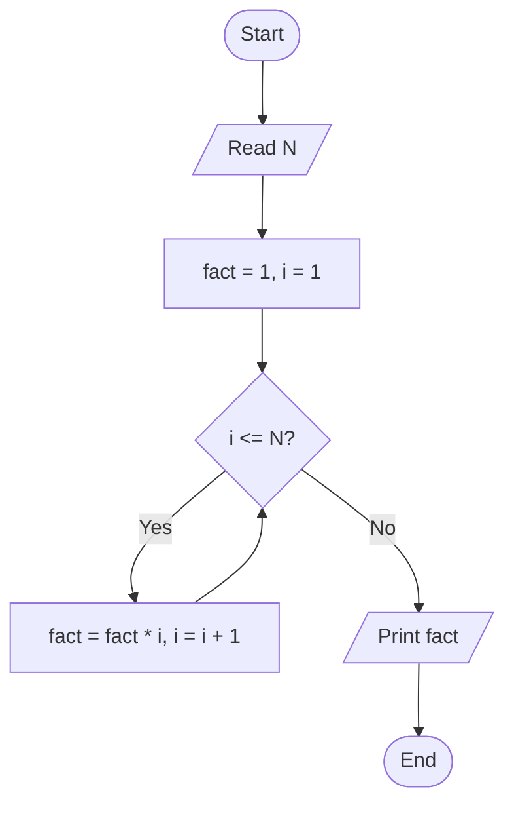

# Computer Fundamentals & C Programming — Answers

All C programs below were compiled and run with GCC to confirm they work as written, including the edge cases mentioned alongside them.

---

## Set 1 — Computer Fundamentals

### 1. Define computer. List the major hardware components of a computer. [4]

A computer is an electronic device that accepts data as input, processes it according to a stored set of instructions (a program), and produces meaningful output — while also being able to store data for later use. This is often summarized as the **IPO(S) cycle**: **I**nput → **P**rocessing → **O**utput, with **S**torage running alongside all three. Its defining traits are that it works automatically once given a program, processes data at very high speed, and does so with a high degree of accuracy.

Major hardware components:

- **Input devices** — keyboard, mouse, scanner — feed data and instructions into the computer.
- **Central Processing Unit (CPU)** — the "brain" of the computer; contains the **Control Unit (CU)**, which directs and coordinates the execution of instructions, and the **Arithmetic Logic Unit (ALU)**, which performs calculations and comparisons. A CPU's speed is commonly described by its clock speed (GHz) and number of cores.
- **Memory** — **primary memory** (RAM, which is volatile and holds data currently in use; ROM, which is non-volatile and holds firmware), and **secondary storage** (hard disk, SSD, pen drive), which holds data permanently even when the power is off.
- **Output devices** — monitor, printer, speakers — present the processed results to the user.
- **Motherboard/system bus** — the circuitry and pathways that connect all the above components and let them exchange data.

### 2. Differentiate between hardware and software. What are the types of software? [4]

**Hardware** refers to the physical, tangible parts of a computer — the CPU, monitor, keyboard, hard disk — components you can see and touch. **Software** is the set of programs and instructions that tell the hardware what to do; it's intangible and exists as code/logic rather than as a physical object.

| Aspect | Hardware | Software |
|---|---|---|
| Nature | Physical, tangible | Logical, intangible |
| Creation | Manufactured | Developed/coded |
| Wear | Can wear out physically over time | Doesn't degrade physically, but can become outdated or buggy |
| Dependency | Needs software to be useful | Needs hardware to run on |

Types of software:

- **System software** — manages the computer's own operation and provides a platform for other software to run on. Examples: the operating system, device drivers, and translators (compilers, interpreters, assemblers).
- **Application software** — helps the user perform specific tasks. Examples: word processors (MS Word), spreadsheets (Excel), web browsers, games.

Utility software (antivirus tools, disk cleanup tools, file compression tools) is sometimes treated as a third category, though it's often grouped under system software since it supports the machine's maintenance and performance rather than doing user-facing task work directly. **Firmware** — permanent software written into ROM (e.g. a device's BIOS) — is a useful edge case to know, since it blurs the line between hardware and software.

### 3. What is an operating system? Explain the major functions of an operating system. [6]

An **operating system (OS)** is system software that acts as an intermediary between the user and the computer hardware. It manages hardware resources and provides the services application programs need in order to run. Examples include Windows, Linux, and macOS.

Major functions:

- **Process management** — creates, schedules, and terminates processes, and decides which process gets CPU time and for how long. For example, when you have a browser, a music player, and a text editor all open, the OS is what rapidly switches the CPU between them so all three appear to run at once.
- **Memory management** — allocates and deallocates main memory to processes as they're created and destroyed, keeping track of which memory is in use so that two programs never overwrite each other's data.
- **File management** — organizes, stores, names, and retrieves files, and maintains the directory (folder) structure that makes files findable.
- **Device management** — controls input/output devices through device drivers, coordinating requests from multiple processes to shared hardware (e.g. queuing print jobs sent from different applications to the same printer).
- **Security and access control** — handles user authentication (login passwords, permissions) and ensures users and processes can only access what they're authorized to.
- **User interface** — provides a command-line interface (CLI) or graphical user interface (GUI) through which the user interacts with the system.
- **Error detection and handling** — monitors for hardware and software errors (e.g. a disk read failure) and takes corrective action or notifies the user.

---

## Set 2 — Translators, Algorithm and Flowchart

### 1. What are translators? Differentiate between compiler and interpreter. [4]

A **translator** is a piece of system software that converts a program written in a high-level (or assembly) language into machine language that the computer's hardware can directly execute. The three main types are:

- **Compiler** — translates the entire high-level source program into machine code in one go.
- **Interpreter** — translates and executes a high-level program statement by statement.
- **Assembler** — translates assembly language (a low-level, symbolic language closer to machine code) into machine code.

| | Compiler | Interpreter |
|---|---|---|
| Translation | Whole program at once, before execution | Line by line, during execution |
| Output | Produces a separate executable file | No standalone executable produced |
| Error reporting | All errors reported together, after full compilation | Stops at the first error encountered |
| Execution speed | Faster, since translation is done once in advance | Slower, since translation happens every run |
| Examples | C, C++ | Python, older BASIC |

### 2. Draw a flowchart to find the factorial of a given number. [4]



In words: start → read N → initialize `fact = 1` and `i = 1` → while `i <= N`, multiply `fact` by `i` and increment `i` → once `i` exceeds `N`, print `fact` → end.

For reference, this is the C code that implements exactly that flowchart:

```c
#include <stdio.h>

int main() {
    int n, i;
    long fact = 1;

    printf("Enter a number: ");
    scanf("%d", &n);

    for (i = 1; i <= n; i++) {
        fact = fact * i;
    }

    printf("Factorial of %d = %ld\n", n, fact);
    return 0;
}
```

Tested for `n = 5` → `120`, and the edge case `n = 0` → `1` (by mathematical convention, 0! = 1), which the loop handles correctly without any special-casing since it simply never executes when `n = 0`.

### 3. What is an algorithm? Mention the characteristics of a good algorithm. Write an algorithm to find the largest of three numbers. [6]

An **algorithm** is a finite, well-defined, step-by-step procedure for solving a problem — it takes some input, processes it through a clearly specified sequence of steps, and produces the desired output in a finite amount of time.

Characteristics of a good algorithm:

- **Input** — takes zero or more well-defined inputs.
- **Output** — produces at least one well-defined output.
- **Definiteness** — every step is precise and unambiguous.
- **Finiteness** — it terminates after a finite number of steps; it doesn't run forever.
- **Effectiveness** — each step is basic enough that it could, in principle, be carried out by a person with pencil and paper.

Algorithm to find the largest of three numbers:

```
Step 1: Start
Step 2: Read three numbers A, B, C
Step 3: If A > B then
            If A > C then
                Largest = A
            Else
                Largest = C
        Else
            If B > C then
                Largest = B
            Else
                Largest = C
Step 4: Print Largest
Step 5: Stop
```

**Dry run** with A = 5, B = 9, C = 3: Step 3 checks `A > B` → `5 > 9` is false, so control goes to the `Else` branch → checks `B > C` → `9 > 3` is true → `Largest = B = 9`. Step 4 prints `9`, which is indeed the largest of the three — confirming the logic is correct.

---

## Set 3 — History and Overview of C

### 1. Briefly describe the history and evolution of the C language. [4]

C was developed by **Dennis Ritchie** at Bell Labs between 1969 and 1973. It evolved from an earlier language called **B** (created by Ken Thompson), which itself was derived from **BCPL** (Basic Combined Programming Language). C was originally created to rewrite and develop the **UNIX** operating system. In 1978, Brian Kernighan and Dennis Ritchie published *The C Programming Language*, whose description of the language (informally called "K&R C") served as a de facto standard for years. The language was formally standardized by ANSI in 1989 (**ANSI C / C89**) and adopted by ISO in 1990 (**C90**). It has since gone through further revisions — **C99**, **C11**, **C17/C18**, and **C23** — each adding new features while preserving the core language.

### 2. State the importance and key features of the C programming language. [4]

**Importance:** C is often described as the foundation of modern programming languages — C++, Java, and C# all trace design influence back to it, and many system components (including parts of other language runtimes) are still implemented in C. It remains central to operating system development, embedded systems, and systems programming generally, and is commonly taught early in computer science education because it forces a solid understanding of memory and low-level behavior.

**Key features:**

- **Structured** — programs are organized into functions and blocks, making logic easier to follow and maintain.
- **Middle-level language** — combines low-level features (like direct memory access via pointers) with high-level constructs (like functions and control structures).
- **Portable** — C programs can be compiled and run on different machines and operating systems with little to no modification.
- **Fast and efficient** — compiles to compact, efficient machine code.
- **Rich operator and function set** — a wide range of built-in operators and standard library functions.
- **Pointer support** — allows direct manipulation of memory addresses.
- **Extensible** — functionality can be extended through libraries.
- **Supports recursion** — functions can call themselves, which is useful for naturally recursive problems (e.g. factorial, tree traversal).
- **Case-sensitive syntax** — a consistent, unambiguous rule that avoids naming clashes between, say, `Sum` and `sum`.

### 3. Explain the basic structure of a C program with a suitable example. [6]

A typical C program is organized as follows:

1. **Documentation/comments** (optional) — describes what the program does.
2. **Preprocessor directives** — e.g. `#include <stdio.h>`, processed before compilation.
3. **Global declarations** (optional) — global variables and function prototypes.
4. **`main()` function** — every C program must have exactly one `main()`, which is where execution begins; the OS looks specifically for `main()` to start running the program.
5. **Local declarations** — variables declared inside `main()` or other functions.
6. **Executable statements** — the actual instructions that run.
7. **User-defined functions** — additional functions, defined separately from `main()`.

```c
#include <stdio.h>          // preprocessor directive

int add(int, int);          // function prototype (global declaration)

int main() {                // main function - entry point
    int a = 5, b = 10, sum; // local declarations
    sum = add(a, b);        // executable statement
    printf("Sum = %d\n", sum);
    return 0;                // signals successful termination to the OS
}

int add(int x, int y) {     // user-defined function
    return x + y;
}
```

The `return 0;` at the end of `main()` isn't just a formality — it's the program's way of telling the operating system it finished successfully; a non-zero return value conventionally signals that something went wrong.

---

## Set 4 — Constants, Variables and Data Types

### 1. Write down the rules of naming a variable in C. Differentiate between constant and variable with suitable examples. [4]

Rules for naming a variable (identifier) in C:

- Must begin with a letter (A–Z, a–z) or an underscore (`_`) — it cannot start with a digit.
- After the first character, it can contain letters, digits, or underscores.
- No spaces or special characters (`@`, `#`, `-`, etc.) are allowed.
- It cannot be a C reserved keyword (e.g. `int`, `return`, `for`).
- C is case-sensitive, so `Sum` and `sum` are treated as different identifiers.
- (Good practice, not a strict rule) Names should be meaningful — `totalMarks` reads far better than `x`.

| | Constant | Variable |
|---|---|---|
| Value | Fixed — cannot change during execution | Can change during execution |
| Example | `10`, `3.14`, `'A'` | `int age = 20;` |
| Reassignment | Not allowed | Allowed |

```c
const float PI = 3.14159;   // constant — fixed value
int age = 20;                // variable — value can change
age = 25;                    // valid
// PI = 3.0;                 // invalid — can't reassign a constant
```

### 2. What are data types in C? List the different data types along with their sizes in bytes. [4]

A **data type** specifies the kind of data a variable can hold, which in turn determines how much memory is allocated for it, what range of values it can store, and what operations are valid on it.

| Data type | Typical size | Typical range |
|---|---|---|
| `char` | 1 byte | -128 to 127 |
| `short int` | 2 bytes | -32,768 to 32,767 |
| `int` | 4 bytes | -2,147,483,648 to 2,147,483,647 |
| `long int` | 4 or 8 bytes | at least -2,147,483,648 to 2,147,483,647 |
| `long long int` | 8 bytes | roughly ±9.2 × 10¹⁸ |
| `float` | 4 bytes | ~±3.4 × 10³⁸ (6–7 significant digits) |
| `double` | 8 bytes | ~±1.7 × 10³⁰⁸ (15–16 significant digits) |
| `long double` | 8, 12, or 16 bytes | extended precision beyond `double` |

These sizes (and ranges) can vary slightly between compilers and systems (32-bit vs. 64-bit), so the `sizeof()` operator is the reliable way to confirm them on a given machine — e.g. `printf("%zu", sizeof(int));`.

### 3. Explain integer, floating-point, and character constants in C with examples. Discuss how the const qualifier is used to declare symbolic constants. [6]

- **Integer constants** — whole numbers with no decimal point, positive or negative. Can be written in decimal (`25`), octal (prefixed with `0`, e.g. `017`, which equals decimal `15`), or hexadecimal (prefixed with `0x`, e.g. `0x1A`, which equals decimal `26`) — both conversions confirmed by compiling and printing them.
- **Floating-point constants** — numbers with a decimal point or an exponent, used to represent real numbers, e.g. `3.14`, `-0.001`, or `2.5e3` (which equals 2500).
- **Character constants** — a single character enclosed in single quotes, e.g. `'A'`, `'5'`, `'$'`; internally, it's stored as the character's ASCII value (`'A'` is 65). Escape sequences such as `'\n'` (newline) are also character constants.

The **`const` qualifier** declares a variable as read-only, making it a symbolic constant whose value cannot be changed after initialization:

```c
const int MAX = 100;
// MAX = 200;   // compile-time error
```

This is generally preferred over the older preprocessor approach, `#define MAX 100`, for two reasons: a `const` variable has a proper type and obeys normal scoping rules, so the compiler can catch type mismatches; a `#define` is just a blind textual substitution performed before compilation even starts, so the compiler never actually "sees" `MAX` as a variable — it just sees whatever value was substituted in, which makes certain classes of errors harder to catch and harder to debug.

---

## Set 5 — Operators and Expressions

### 1. What are operators in C? Write down the different types of operators. [4]

An **operator** is a symbol that tells the compiler to perform a specific mathematical, relational, or logical operation on one or more operands.

Types of operators:

- **Arithmetic** — `+ - * / %` — e.g. `7 % 2` gives `1`.
- **Relational** — `< > <= >= == !=` — e.g. `5 == 5` gives `1` (true).
- **Logical** — `&& || !` — e.g. `1 && 0` gives `0` (false).
- **Assignment** — `= += -= *= /= %=` — e.g. `x += 5;` is shorthand for `x = x + 5;`.
- **Increment/decrement** — `++ --` — e.g. `i++` adds 1 to `i`.
- **Bitwise** — `& | ^ ~ << >>` — e.g. `5 << 1` gives `10` (shifts bits left).
- **Conditional (ternary)** — `?:` — e.g. `(a > b) ? a : b` gives whichever is larger.
- **Special** — `sizeof`, the comma operator `,`, and the pointer operators `&` and `*`.

### 2. Define precedence and associativity of operators. Write the precedence and associativity list for logical and relational operators. [4]

**Precedence** determines which operator is evaluated first when an expression contains more than one type of operator — operators with higher precedence bind more tightly. **Associativity** determines the evaluation order when two operators of the *same* precedence appear together — i.e., whether evaluation proceeds left-to-right or right-to-left.

For logical and relational operators, from highest to lowest precedence:

| Operator | Meaning | Associativity |
|---|---|---|
| `!` | logical NOT | right to left (it's a unary operator, so it binds very tightly) |
| `< <= > >=` | relational (less/greater than) | left to right |
| `== !=` | equality | left to right |
| `&&` | logical AND | left to right |
| `\|\|` | logical OR | left to right |

Note that `!` sits with the unary operators near the *top* of the overall precedence table, while `&&` and `||` sit near the *bottom* — well below arithmetic and relational operators.

**Worked example:** in `5 > 3 && 2 == 2`, the two relational/equality comparisons run first because they outrank `&&`: `5 > 3` evaluates to `1`, and `2 == 2` evaluates to `1`. The expression then reduces to `1 && 1`, which evaluates to `1` (true) — confirmed by compiling and running exactly this expression.

### 3. Write a C program that reads three numbers and determines the largest among them using relational and logical operators. Explain the order of evaluation of the operators used in the program. [6]

```c
#include <stdio.h>

int main() {
    float a, b, c;

    printf("Enter three numbers: ");
    scanf("%f %f %f", &a, &b, &c);

    if (a >= b && a >= c)
        printf("The largest number is %.2f\n", a);
    else if (b >= a && b >= c)
        printf("The largest number is %.2f\n", b);
    else
        printf("The largest number is %.2f\n", c);

    return 0;
}
```

In the condition `a >= b && a >= c`, the relational operators (`>=`) are evaluated first, since relational operators have higher precedence than `&&`. Each comparison produces `0` (false) or `1` (true). The `&&` then combines the two results — and because C uses **short-circuit evaluation**, if `a >= b` is already false, `a >= c` is never evaluated at all, since the overall result is already determined. This left-to-right, short-circuit behaviour is what makes the condition both correct and efficient.

**Dry run** with inputs `45 12 99`: the first `if` checks `45 >= 12 && 45 >= 99` → true && false → false, so it's skipped. The `else if` checks `12 >= 45 && 12 >= 99` → false && (short-circuited, never checked) → false, also skipped. Control falls to the final `else`, correctly printing `99.00` as the largest — matching what the compiled program actually outputs for that input.

---

## Set 6 — Input/Output Operations, Branching and Looping

### 1. Differentiate between scanf() and printf() with examples. Explain the use of format specifiers in C. [4]

**`printf()`** displays formatted output to the console. **`scanf()`** reads formatted input from the keyboard into variables — and, unlike `printf()`, it needs the address-of operator (`&`) in front of most variables, since it needs to know *where* in memory to store the value read.

```c
int age;
printf("Enter your age: ");     // output prompt
scanf("%d", &age);              // input — note the &
printf("Your age is %d\n", age); // output using the value
```

**Format specifiers** are the `%`-prefixed codes that tell `printf`/`scanf` what data type is being formatted, so the value is interpreted correctly:

| Specifier | Data type | Example |
|---|---|---|
| `%d` | int | `42` |
| `%f` | float | `3.140000` |
| `%lf` | double (in `scanf`) | — |
| `%c` | char | `A` |
| `%s` | string | `Hello` |
| `%ld` | long int | — |
| `%u` | unsigned int | `42` |
| `%x` | hexadecimal | `ff` (for 255) |
| `%o` | octal | `377` (for 255) |

### 2. Explain the switch-case statement in C with a suitable example. How is it different from the if-else-if ladder? [4]

The **switch-case** statement evaluates an expression once and compares its value against a series of constant `case` labels, running the block for whichever case matches. `break` is used to stop execution from "falling through" into the next case, and `default` handles the case where nothing matches.

```c
int day = 3;
switch (day) {
    case 1: printf("Monday"); break;
    case 2: printf("Tuesday"); break;
    case 3: printf("Wednesday"); break;
    default: printf("Invalid day");
}
```

Worth knowing explicitly: if you omit `break`, execution "falls through" into the next case regardless of whether it matches. For example, with `day = 2` and every `break` removed, the program prints `Two Three Default` — because once `case 2` matches, execution just keeps running downward through every case after it. This is occasionally used deliberately (to group cases with the same behaviour), but is a common source of bugs when it's accidental.

The key difference from an **if-else-if ladder** is flexibility: `switch` can only test a single expression against constant values using equality, while `if-else-if` can test arbitrary conditions, including ranges and relational/logical expressions. In exchange, `switch` is often more readable when there are many discrete cases, and compilers can sometimes translate it into a more efficient jump table.

### 3. Write a C program to generate the first N terms of the Fibonacci series using appropriate loop constructs. [6]

```c
#include <stdio.h>

int main() {
    int n, i;
    long long t1 = 0, t2 = 1, nextTerm;

    printf("Enter the number of terms: ");
    scanf("%d", &n);

    if (n <= 0) {
        printf("Please enter a positive number of terms.\n");
        return 1;
    }

    printf("Fibonacci Series: ");
    for (i = 1; i <= n; i++) {
        printf("%lld ", t1);
        nextTerm = t1 + t2;
        t1 = t2;
        t2 = nextTerm;
    }
    printf("\n");
    return 0;
}
```

Tested for N = 8, this prints `0 1 1 2 3 5 8 13`; a negative N is now rejected with a message instead of silently printing nothing. The same series can also be generated recursively (a function that calls itself), but a loop is the more natural and efficient fit here since the question specifically asks for loop constructs, and the iterative version avoids the repeated recomputation that a naive recursive version would do.

---

## Set 7 — Arrays

### 1. What is an array? Explain the declaration and initialization of a one-dimensional array with an example. [4]

An **array** is a collection of elements of the *same* data type, stored in contiguous memory locations and accessed through a common name plus an index (subscript), where indexing starts at `0` and runs through `size - 1`.

**Declaration:** `data_type array_name[size];` — e.g. `int marks[5];` declares an array that can hold 5 integers, indexed `marks[0]` through `marks[4]`.

**Initialization** can happen at declaration:

```c
int marks[5] = {90, 85, 78, 92, 88};
printf("%d\n", marks[2]);   // accessing by index — prints 78
```

or element by element afterward: `marks[0] = 90;`, etc. If you provide fewer values than the declared size, the rest are set to `0`. The size can also be left out if you initialize directly — `int marks[] = {90, 85, 78, 92, 88};` — and the compiler infers it from the number of values given. Accessing an index outside `0` to `size - 1` (e.g. `marks[5]` on a 5-element array) is undefined behaviour in C — the compiler won't stop you, but the result is unreliable.

### 2. Write an algorithm to search for a given number in an array using linear search. [4]

```
Step 1: Start
Step 2: Read array size N and array elements A[0..N-1]
Step 3: Read the number to search, KEY
Step 4: Set i = 0, found = false
Step 5: Repeat while i < N and found = false
            If A[i] = KEY then
                found = true
                Print "Element found at position i"
            Else
                i = i + 1
Step 6: If found = false, Print "Element not found"
Step 7: Stop
```

**Time complexity:** in the worst case (the element is last, or absent entirely), linear search checks every element once, giving O(N) time. This is why, for large, *sorted* datasets, binary search (O(log N)) is generally preferred — but linear search has the advantage of working on unsorted data too, which binary search cannot do.

### 3. Write a C program to find the sum and average of the elements of an array. [6]

```c
#include <stdio.h>

int main() {
    int n, i, arr[100];
    float sum = 0, average;

    printf("Enter number of elements: ");
    scanf("%d", &n);

    if (n <= 0 || n > 100) {
        printf("Please enter a value between 1 and 100.\n");
        return 1;
    }

    printf("Enter %d elements:\n", n);
    for (i = 0; i < n; i++) {
        scanf("%d", &arr[i]);
        sum += arr[i];
    }

    average = sum / n;
    printf("Sum = %.2f\n", sum);
    printf("Average = %.2f\n", average);
    return 0;
}
```

Tested with 4 elements `{2, 4, 6, 8}` → `Sum = 20.00`, `Average = 5.00`; and with `n = 0`, which is now caught before it can cause a divide-by-zero on the average calculation.

---

## Set 8 — Character Arrays and Strings

### 1. What is a string in C? Explain how strings are declared and initialized. [4]

A **string** in C is an array of characters terminated by a special null character `'\0'`, which marks where the string ends. C has no separate built-in string type — strings are always represented as character arrays.

**Declaration:** `char name[20];` — a character array that can hold up to 19 characters plus the null terminator.

**Initialization:**

```c
char name[6] = {'H','e','l','l','o','\0'};  // explicit, char by char
char name[6] = "Hello";                      // string literal — '\0' added automatically
char name[] = "Hello";                        // size inferred as 6

printf("%s\n", name);        // prints Hello
scanf("%s", name);            // reads a word from input into name
```

### 2. Explain any three built-in string handling functions with examples. [4]

All from `<string.h>`:

- **`strlen(str)`** — returns the length of the string, not counting the null terminator.
  ```c
  printf("%lu\n", strlen("Hello"));   // prints 5
  ```
- **`strcpy(dest, src)`** — copies the string `src` into `dest`.
  ```c
  char dest[50];
  strcpy(dest, "Hello");
  printf("%s\n", dest);   // prints Hello
  ```
- **`strcat(dest, src)`** — appends `src` onto the end of `dest`.
  ```c
  strcat(dest, " World");
  printf("%s\n", dest);   // dest is now Hello World
  ```

Chained together, these three lines actually run and produce `Hello`, then `Hello World`, exactly as described.

### 3. Write a C program to check whether a given string is a palindrome or not. [6]

```c
#include <stdio.h>
#include <string.h>

int main() {
    char str[100];
    int i, len, isPalindrome = 1;

    printf("Enter a string: ");
    scanf("%s", str);

    len = strlen(str);

    for (i = 0; i < len / 2; i++) {
        if (str[i] != str[len - 1 - i]) {
            isPalindrome = 0;
            break;
        }
    }

    if (isPalindrome)
        printf("%s is a palindrome.\n", str);
    else
        printf("%s is not a palindrome.\n", str);

    return 0;
}
```

Tested against `madam` and `level` (correctly identified as palindromes) and `hello` (correctly identified as not). One limitation worth knowing: `scanf("%s", str)` stops reading at the first whitespace, so this checks single-word palindromes only. A multi-word phrase palindrome (like "A man a plan a canal Panama") would need `fgets()` plus extra logic to strip spaces and ignore letter case.

---

## Set 9 — Functions

### 1. What is a function in C? State the advantages of using functions. [4]

A **function** is a self-contained, reusable block of code that performs a specific task. It can be called from other parts of a program, optionally taking input (parameters) and optionally returning a value.

Advantages:

- **Reusability** — write the logic once, call it as many times as needed.
- **Modularity** — breaks a large program into smaller, manageable, logically distinct units, supporting a top-down design approach.
- **Easier debugging and maintenance** — problems can be isolated to a specific function rather than searched for across an entire program.
- **Readability** — well-named functions make a program's structure easier to follow.
- **Reduced redundancy** — avoids repeating the same code in multiple places.
- **Supports recursion** — a function calling itself is a natural, elegant way to solve certain problems (factorials, tree structures, etc.).
- **Flexible behaviour** — passing different arguments to the same function lets it produce different results without rewriting any code.

### 2. Explain the key components of a function in C — function prototype, function definition, and function call — with a suitable example. [4]

- **Function prototype (declaration)** — tells the compiler a function's name, return type, and parameter types *before* it's actually used, usually placed above `main()`. It has no body and always ends with a semicolon: `int add(int, int);`
- **Function definition** — the actual implementation, containing the code (the body, in `{ }`) that runs when the function is called. This is where the real work happens.
- **Function call** — the statement that invokes the function with actual argument values, e.g. `add(5, 3)`, causing control to jump into the function definition and, once it returns, jump back to where it was called from.

```c
#include <stdio.h>

int add(int, int);        // function prototype

int main() {
    int result = add(5, 3);   // function call
    printf("Sum = %d\n", result);
    return 0;
}

int add(int a, int b) {   // function definition
    return a + b;
}
```

### 3. Write a function that checks whether a given natural number is prime or not. Use this function to display all prime numbers between 1 and 100. [6]

```c
#include <stdio.h>

int isPrime(int n) {
    int i;
    if (n < 2)
        return 0;              // 0 and 1 are not prime
    for (i = 2; i * i <= n; i++) {
        if (n % i == 0)
            return 0;          // divisible => not prime
    }
    return 1;                  // prime
}

int main() {
    int num;

    printf("Prime numbers between 1 and 100:\n");
    for (num = 1; num <= 100; num++) {
        if (isPrime(num))
            printf("%d ", num);
    }
    printf("\n");

    return 0;
}
```

Tested — this correctly prints `2 3 5 7 11 13 17 19 23 29 31 37 41 43 47 53 59 61 67 71 73 79 83 89 97`, matching the full, known list of primes under 100.

The loop condition `i * i <= n` (rather than `i < n`) is a deliberate efficiency choice: if `n` has a factor larger than √n, it must also have a matching factor smaller than √n (since factors pair up to multiply back to `n`). So any number that has a factor at all will already have revealed it by the time `i` passes √n, meaning it's unnecessary — and wasteful for large `n` — to keep checking beyond that point.

---

## Set 10 — Pointers and File Management

### 1. What is a pointer in C? Explain how a pointer variable is declared and used with an example. [4]

A **pointer** is a variable that stores the memory address of another variable, rather than storing a value directly. Pointers allow direct memory manipulation, dynamic memory allocation, and efficient handling of arrays and strings.

**Declaration:** `data_type *pointer_name;` — e.g. `int *ptr;` declares `ptr` as a pointer to an `int`.

```c
int a = 10;
int *ptr;
ptr = &a;               // ptr now holds the address of a
printf("%d\n", *ptr);   // dereference — prints 10
printf("%p\n", ptr);    // prints the address itself
```

The `&` (address-of) operator gets a variable's address; the `*` (dereference) operator accesses the value stored at the address a pointer holds. A pointer that isn't pointing anywhere valid should be initialized to `NULL`, and dereferencing a `NULL` (or otherwise invalid) pointer is a common cause of program crashes. Interestingly, a pointer's own size (typically 4 bytes on a 32-bit system or 8 bytes on a 64-bit system) doesn't depend on the type it points to — an `int*` and a `double*` take up the same amount of space; it's the *data they point to* whose size varies.

### 2. Explain pointer arithmetic with suitable examples. [4]

Pointer arithmetic lets you perform a limited set of arithmetic operations on pointers, and the results are scaled automatically by the *size* of the data type being pointed to — not raw bytes — which is what makes pointers so natural for walking through arrays.

Valid operations:

- Adding/subtracting an integer to/from a pointer (`ptr + 1` moves forward by `sizeof(data_type)` bytes).
- Incrementing/decrementing a pointer (`ptr++`, `ptr--`).
- Subtracting one pointer from another of the same type, which gives the number of elements between them.
- Comparing two pointers.

Adding two pointers together, or multiplying/dividing a pointer, is **not** allowed.

```c
int arr[5] = {10, 20, 30, 40, 50};
int *ptr = arr;              // points to arr[0]

printf("%d\n", *ptr);        // 10
printf("%d\n", *(ptr + 1));  // 20 — moved forward by sizeof(int)
ptr++;                        // now points to arr[1]
printf("%d\n", *ptr);        // 20
```

This works because, in C, an array's name decays into a pointer to its first element whenever it's used in an expression — so `arr` is effectively equivalent to `&arr[0]`, which is exactly why `int *ptr = arr;` is valid without needing an explicit `&`.

### 3. What is a file in C? Explain the different file opening modes. Describe the use of fopen(), fclose(), fread(), and fwrite() with examples. [6]

A **file** in C is a collection of related data stored on secondary storage under a specific name. C programs create, read, write, and manipulate files using functions from `<stdio.h>`, which treats a file internally as a stream of bytes.

**File opening modes** (used with `fopen()`):

| Mode | Meaning |
|---|---|
| `"r"` | read (file must already exist) |
| `"w"` | write (creates a new file, or overwrites an existing one) |
| `"a"` | append (writes go to the end; creates the file if it doesn't exist) |
| `"r+"` | read and write (file must exist) |
| `"w+"` | read and write (creates new or overwrites) |
| `"a+"` | read and append |

Adding `b` (e.g. `"rb"`, `"wb"`) opens the file in binary mode instead of text mode.

- **`fopen()`** — opens a file and returns a `FILE` pointer used for all further operations on it. Returns `NULL` if the file couldn't be opened, which should always be checked.
- **`fclose()`** — closes an open file, flushing any buffered data to disk and releasing the resources tied to it.
- **`fwrite(ptr, size, count, fp)`** — writes `count` items, each `size` bytes, from memory location `ptr` into the file `fp`.
- **`fread(ptr, size, count, fp)`** — reads up to `count` items, each `size` bytes, from the file `fp` into memory location `ptr`.

```c
#include <stdio.h>

struct Student {
    char name[20];
    int roll;
};

int main() {
    struct Student s1 = {"Rahim", 101}, s2;
    FILE *fp;

    // Writing to a binary file
    fp = fopen("student.dat", "wb");
    if (fp == NULL) {
        printf("Error opening file!\n");
        return 1;
    }
    fwrite(&s1, sizeof(struct Student), 1, fp);
    fclose(fp);

    // Reading it back
    fp = fopen("student.dat", "rb");
    fread(&s2, sizeof(struct Student), 1, fp);
    fclose(fp);

    printf("Name: %s, Roll: %d\n", s2.name, s2.roll);

    return 0;
}
```

Tested — this writes one `Student` record to disk, reads it back, and prints `Name: Rahim, Roll: 101`, confirming the round trip works correctly. `fread()`/`fwrite()` are specifically for **binary** files; for **text** files, the equivalents are `fprintf()` and `fscanf()`, which read and write formatted, human-readable text rather than raw bytes. When reading a file in a loop, `feof(fp)` is commonly used to detect when the end of the file has been reached.